# 在搅拌机中挤压

> 原文：<https://www.educba.com/extrude-in-blender/>

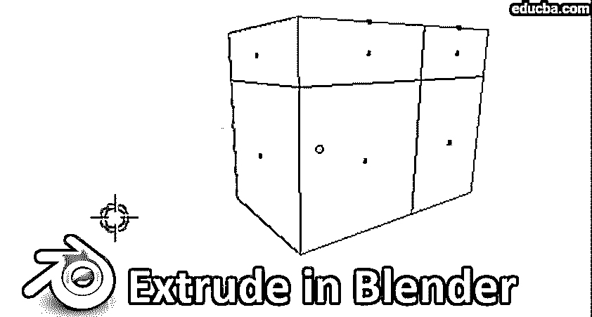

## 搅拌机挤出机简介

Blender 是一个使用计算机图形创建 3D 动画的神奇应用程序，具有所有属性，如 extrude，它允许用户在更短的时间内为平面图、布局和其他 3D 和 2D 设计创建复杂的形状和结构，使用该选项可以以更智能的方式工作，按计划及时获得所需的输出，是几家跨国公司、游戏工作室、VFX 工作室、动画艺术家等的首选。以 3D 形式传达他们的概念。

### 如何在搅拌机中挤出？

挤压是搅拌机建模阶段最基本和最常用的工具之一。挤出用于复制点、线和多边形等属性，也称为顶点、边和面。此选项有助于在建模时轻松地继续创建模型，而不是获取新形状并将其捕捉到现有模型。

<small>3D 动画、建模、仿真、游戏开发&其他</small>

几何图形将在挤出时连接到自身；我们需要将 blender 环境保持在编辑模式才能使用这个选项。下面是一些参考，以获得挤出启用。

**参考文献:**

*   **模式:**编辑模式
*   **面板:**工具栏- >工具- >网格工具- >添加:挤压区域
*   **菜单:**网格->->挤压区域
*   **快捷键:** E(来自键盘)

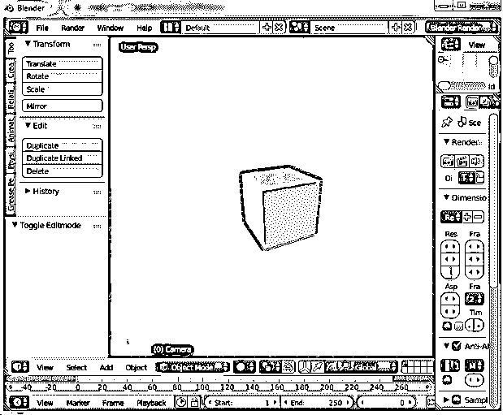

#### 步骤 1:编辑模式启用

打开 Blender，将视图设置为 3D，并将环境从对象模式更改为编辑模式以执行编辑。在同一个工具条上，我们在工作时也有顶点、边和面的单选按钮；我们可以根据创作需求在这些模式之间切换。

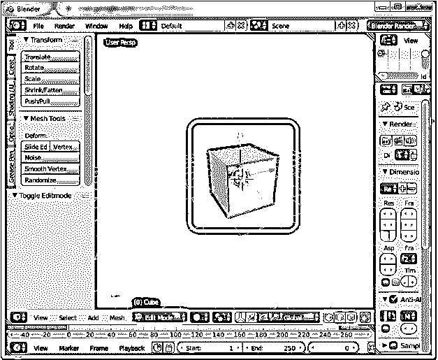

#### 步骤 2:挤压顶点

设置要编辑的模型，并从单选按钮中选择第一个选项；这样，我们可以开始编辑模型中的顶点。选择顶点，单击热键“E”挤出顶点，并使用光标箭头设置新顶点的位置。

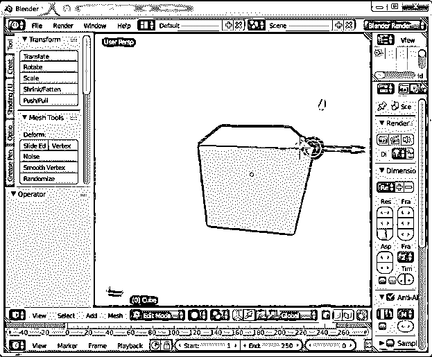

旧顶点和新顶点通过它们之间的边连接起来，如下图所示。可以使用光标放置新创建的顶点。

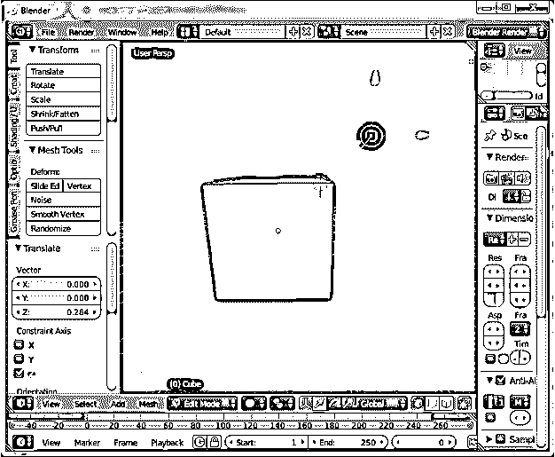

#### 第三步:挤压边缘

将单选按钮从顶点更改为边，然后我们可以开始编辑边。选择必须拉伸的边，点击键盘上的“E ”,新边将在现有边的基础上创建。使用光标移动新边。

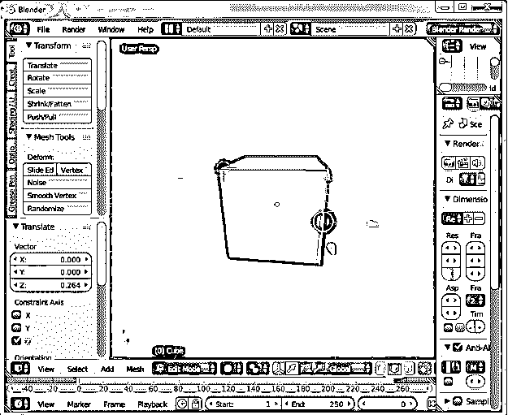

挤出边后，会创建一个新的面，该面将新旧边连接一次。我们可以使用翻转法向根据几何图形的可见性来改变面的方向。

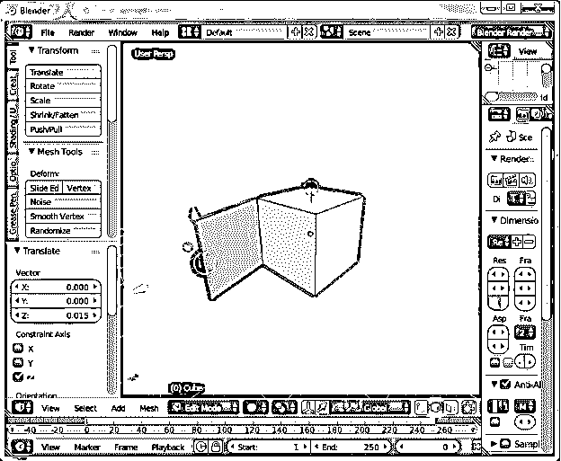

#### 第四步:挤压面部

将单选按钮改为 face，点击“E”进行挤压；使用鼠标指针，我们可以将新排除的面作为其所需的几何位置。

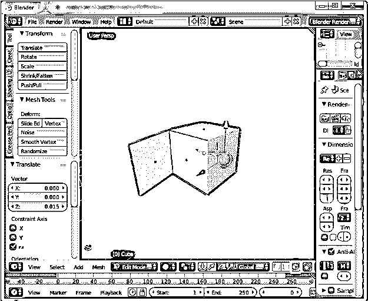

通过拉伸该面，连接的边也将创建从所有侧面与拉伸几何图形连接的面，如图所示。每侧周围的 4 个面(左、右、上、下)将随着新面的挤出而创建。

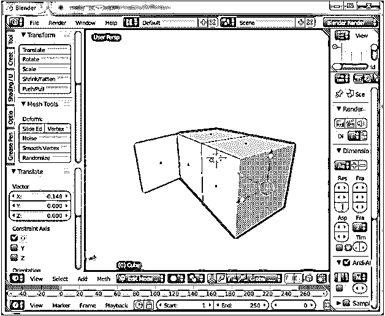

#### 步骤 5:顶点和边一起挤压

在顶点中，按住 alt 键选择一条边及其两侧的连接顶点，以同时挤出所有顶点。通过这种选择，我们可以挤出 2 个顶点和 1 条连接它们的边，并根据需要定位它们。

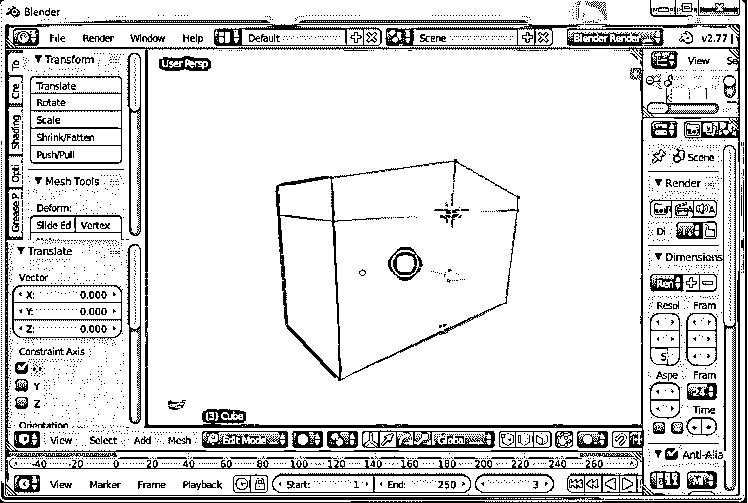

上面，我们已经选择了各自的边和顶点。点击“E”排除它们，并使用鼠标移动到如下图所示的位置。

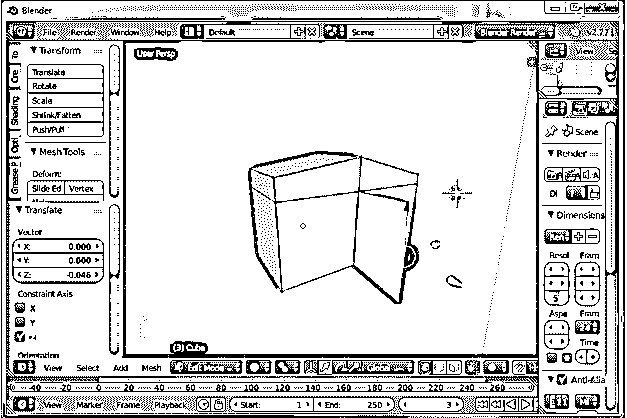

#### 第六步:单独挤压

我们可以选择单独的顶点或边或面来分别获得它们单独的投影。这需要时间，也取决于项目要求。

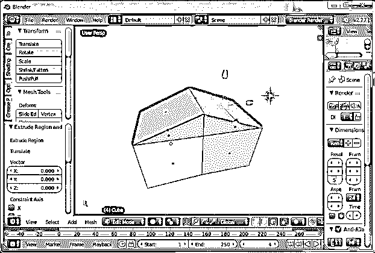

当我们选择挤出单个面时，它们之间可能会有间隙，因为它们都是挤出和投影的单个面，如图所示。

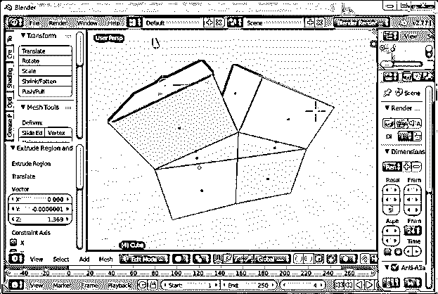

#### 第七步:一起挤压

我们可以选择多个顶点或边或面，并一次挤出它们来选择多个使用键盘上的 shift 键。这里，我们选择了挤出“E”的两个最上面的面。

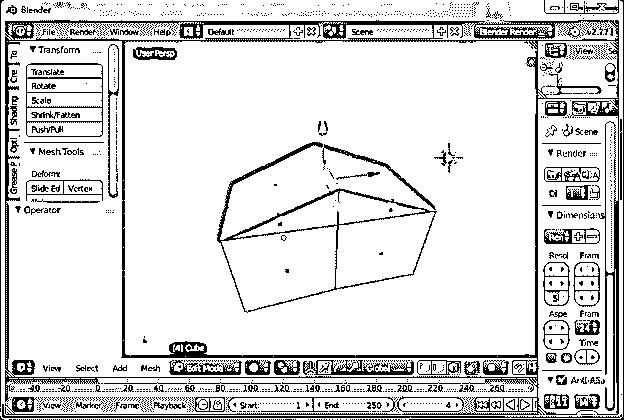

我们可以看到它们被挤压在一起，彼此之间没有任何间隙。我们可以应用多个顶点或边或面的均匀挤出。

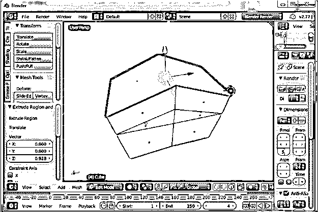

#### 第八步:挤压方向

可以在任何方向 x、y 和 Z 上进行拉伸。按 E 键激活和移动拉伸属性，方法是给出它们的位置，按 Z 键释放它们。按“2”根据设计或模型的计算高度手动更改新拉伸的高度。

Tab 键可用于将模式从编辑切换到对象。

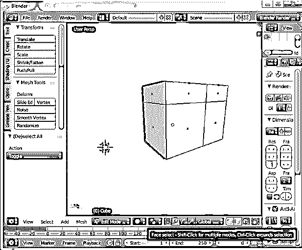

**Note:** Don’t click “E” twice as the select objects will be created at the same location twice, which can further create errors in design due to the very close location of vertices or edges of faces.

### 结论

挤出选项有助于在更短的时间内轻松建模复杂的形状。使用该选项可以创建平面图、布局和其他 [3D 和 2D 设计](https://www.educba.com/2d-and-3d-shapes/)。一次挤出多个对象，这种做法可以避免顶点、边和面之间的间隙。不断练习和创造模型有助于新生适应环境。通过在初始阶段选择容易和简单的模型，可以完成模型并通过 YouTube 和其他平台推广它们。我们可以为标题等创建一个简单的标志和动画。详图建模包含更多在挤出时创建的多边形。祝学习者一切顺利。

### 推荐文章

这是在搅拌机中挤出的指南。在这里，我们讨论的概念和一步一步的解释如何创建搅拌机挤压。您也可以浏览我们推荐的其他文章，了解更多信息——

1.  [搅拌机插件](https://www.educba.com/blender-plugins/)
2.  [搅拌机替代品](https://www.educba.com/blender-alternatives/)
3.  [搅拌机中的 3D 文本](https://www.educba.com/3d-text-in-blender/)
4.  [搅拌机快捷键](https://www.educba.com/blender-shortcuts-keys/)

