# 搅拌机中的纹理绘画

> 原文：<https://www.educba.com/texture-painting-in-blender/>

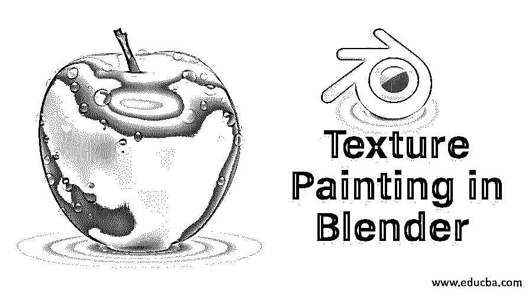

## Blender 中的纹理绘制介绍

Blender 是一款免费软件，可用于创建 3D 动画、运动图形和计算机图形工具设置和属性，可用于所有项目方面和要求。有许多归因和工作方法，今天我们将看到纹理绘画工作工具的细节，它的性能，它的性能和它的多种用途。纹理绘制工具有点类似于 ms paint 选项，并且创建的颜色将应用于已经具有默认 Lambert(模型的默认颜色是灰色)的模型。纹理绘画是 Blender 中可用的传统纹理方法。

### 如何在搅拌机中使用纹理绘画模式？

纹理绘制类似于 ms 绘制工具，其中该工具的使用略有不同，因为该工具与 Blender 动画软件集成在一起。我们可以直接使用纹理绘制来绘制模型选项，也可以使用 UV 窗口绘制选项，我们将在下面看到细节。在初始过程中，我们将[使 blender](https://www.educba.com/blender-plugins/) 软件在我们的设备上可用，然后打开它。

<small>3D 动画、建模、仿真、游戏开发&其他</small>

**第一步:**使用线、多边形、顶点和形状用 Blender 创建一个模型，在使用纹理绘制工具之前根据需要创建模型。创建一个应该使用它的模型。在这个演示中，我们将拍摄画框的肖像。我们将使用纹理绘制工具在肖像的正面绘制图片。

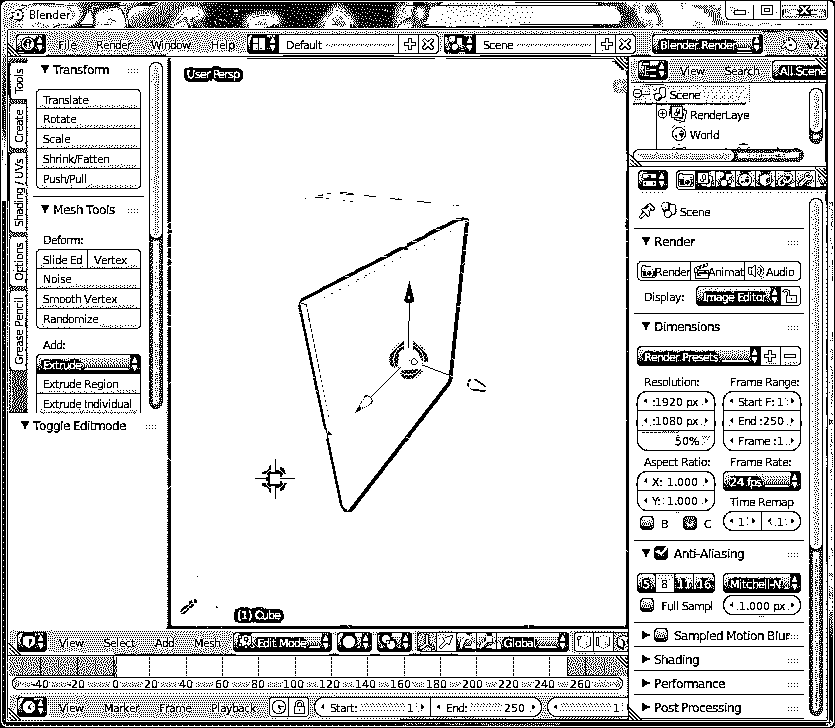

**第二步:**拖动工作屏幕的边角，新建 2 个屏幕窗口。所以现在，总共，我们将有 3 个模型的前景同时查看。1 st 保持模型模式，2 nd 保持 UV 模式，3 rd 保持节点编辑模式，如下图所示。

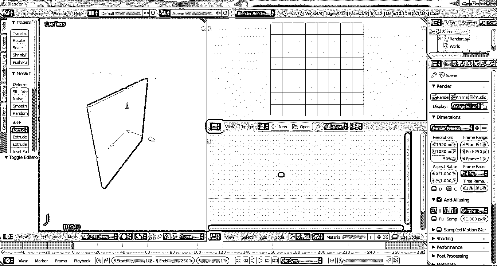

**第三步:**将默认为 Blender 渲染的渲染引擎改为 Cycles 渲染。为了更快地执行动态，UV 中应用的颜色将会反映在模型上，如果我们在模型上应用颜色，它会很快反映在 UV 纹理贴图上。速度也代表了系统配置，所以使用性能良好的系统。为了更好的体验，让事物看起来更棒，看起来更真实。

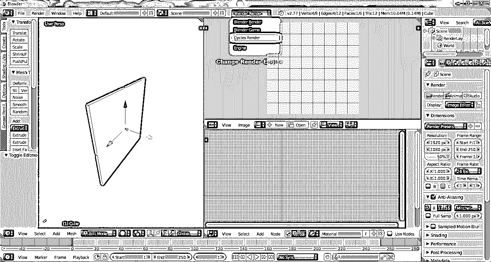

**步骤 4:** 启用左下角基于节点的编辑工具中的**使用节点**选项。这在模型和 UV 纹理贴图之间创建了一个基本的纹理汇。无论何时涂上颜色，它都会在两个地方的水槽里。我们可以使用基于节点的编辑器进行更多的编辑；我们将在下面的对话中看到它们。

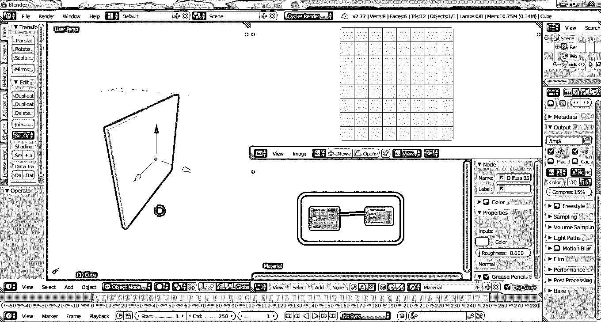

**第五步:**除了默认的纹理 Lambert(文件)，我们可以创建自己的纹理文件，以基本的背景色作为背景。使用应用程序右侧的材质选项，如下图所示，并通过单击材质类型上的+按钮创建一个新文件。新材质创建为“Material1 ”,使用鼠标选择完全重命名，并输入所需的纹理名称。

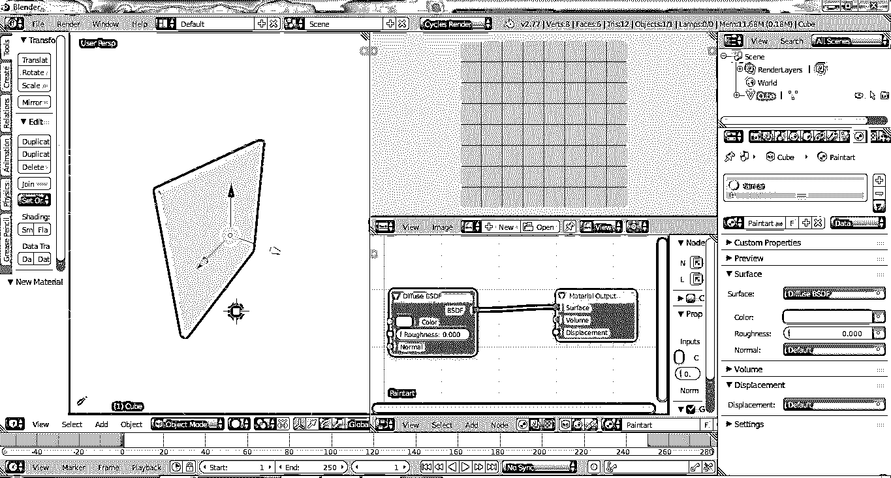

**步骤 6:** 我们将使用 UV 智能项目选项展开模型。为此，我们将前往模型窗口。将编辑模式更改为对象。每当我们打开模型，我们需要改变模式对象的完整对象展开。然而，如果我们在编辑模式下展开，只有选定的面会展开，而剩余的面必须再次展开，这可能会导致重叠，或者每次展开都需要时间，这不是展开的最佳做法。

将模式设置为对象，然后从右边的面板中选择阴影和 UV。点击 UV 贴图下拉菜单，选择“智能 UV 项目”，这有助于平滑地展开面部，只需很少的基本设置。

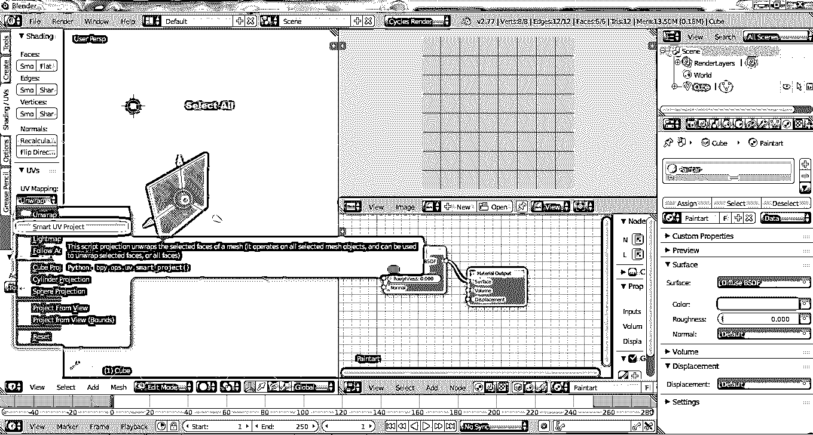

点击智能 UV 项目后，我们看到这个窗口弹出，在这里我们可以改变一些设置，如角度限制，岛屿边缘，面积重量等。现在我们将讨论岛边缘，这有助于在展开时保持 UV 中每个面之间的边缘距离。

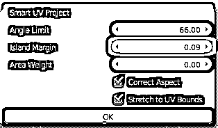

点击“确定”后，我们可以看到 UV 贴图窗口中的所有面都按照计划展开了。

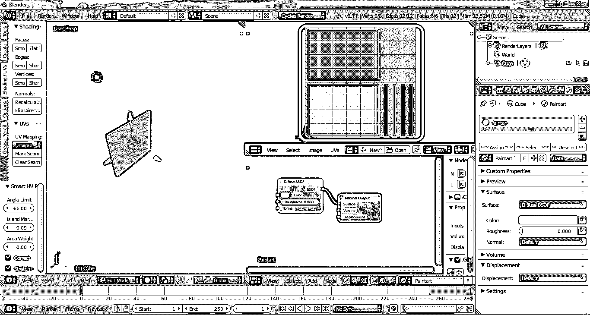

步骤 7: 现在，我们将在 UV 贴图面板上工作。点击**+新建**按钮创建一个新的默认纹理。如果我们已经有一个纹理，我们可以使用它旁边的打开选项来添加它。单击+New 后，将打开一个新窗口，显示以下详细信息。为纹理创建一个名称；根据需要设置宽度和高度；如果我们想给纯色背景，可以选择颜色；我们可以选择黑色来搭配它。然后单击“确定”将其反映在 UV 贴图中。

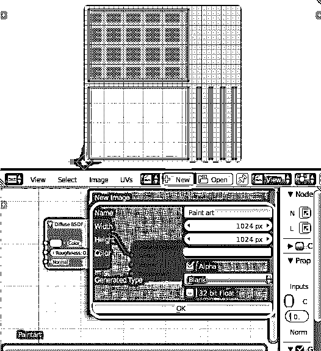

**步骤 8:** 正如我们已经看到的，创建的新纹理被应用到 UV，现在我们应该将纹理保存在我们 PC 的本地驱动器空间中，以便将来直接加载，避免文件丢失。点击图像，选择**另存为图像，**，保存浏览器窗口打开，根据需要保存文件，并便于访问加载。

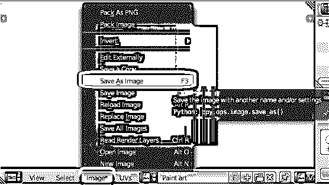

**第九步:**我们可以使用纹理绘制工具，通过将对象模式改为**纹理绘制**模式，直接在模型上绘制，如下图所示。

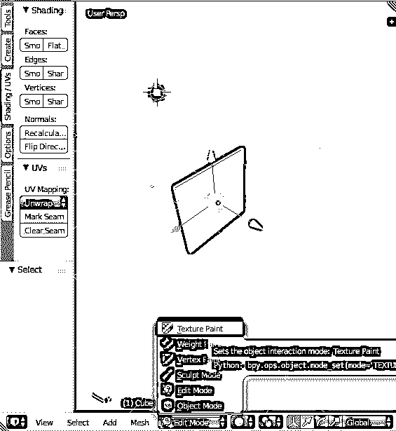

步骤 10: 我们可以看到完整的模型变成了洋红色，因为没有分配纹理，所以它是透明的。添加先前保存的纹理。进入节点窗口，点击添加，点击纹理，选择图像纹理。“节点”窗格中将加载一个新的图像纹理窗口。

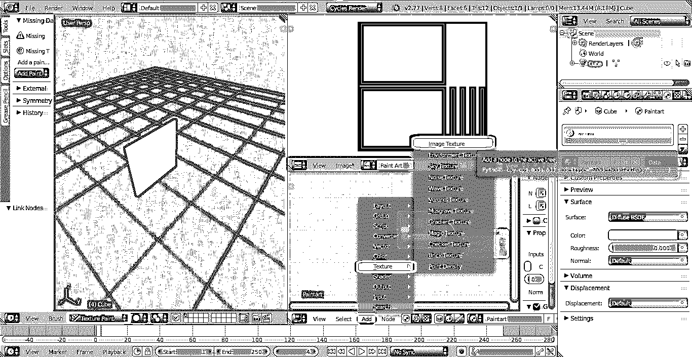

**步骤 11:** 点击打开，将纹理加载到节点中，通过连接它们来同步。

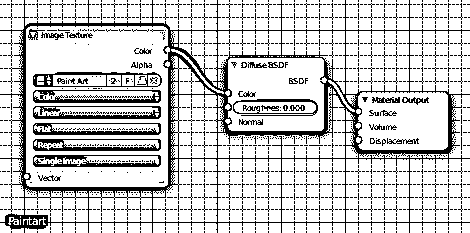

**步骤 12:** 设置 UV 贴图也从左下角开始绘制模式，如图所示。我们可以通过 UV 贴图纹理区域进行绘制，也可以直接在水槽中的模型上绘制，因为我们使用节点来绘制这些模型。使用多种颜色和多种选择的笔触，画笔的半径等。，让你的质感疼痛和模特更有魅力。

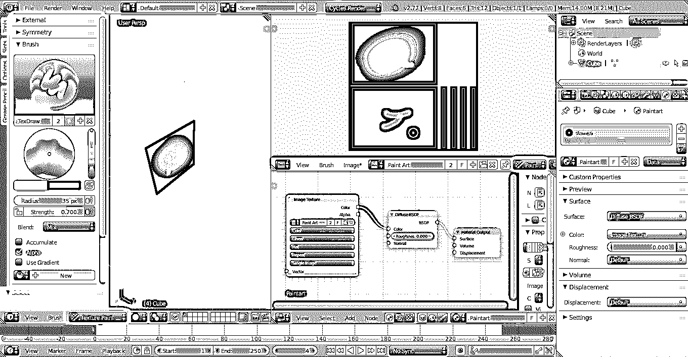

我们甚至可以根据我们已经完成的演示绘画的习惯和实践来旋转 UV。

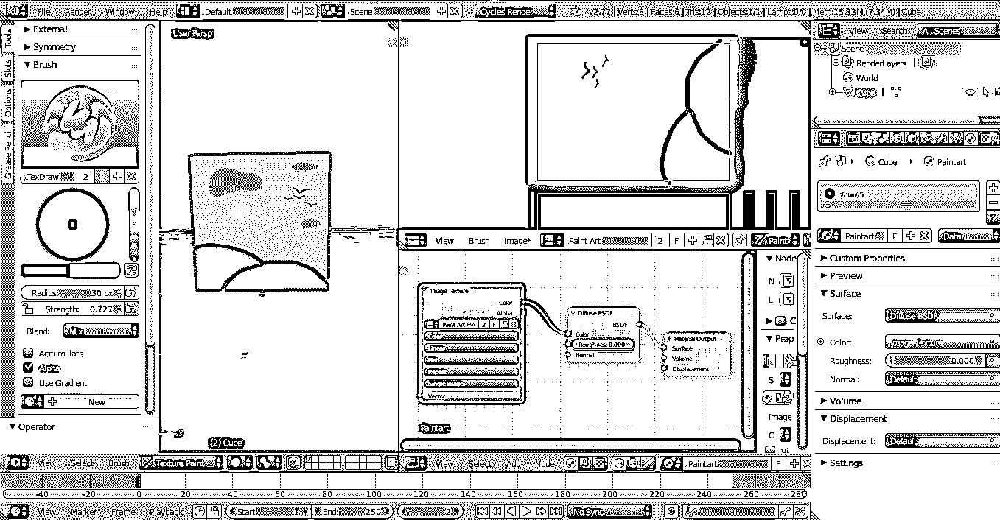

### 结论——搅拌机中的纹理绘画

这有助于让我们自己有创意的东西在简历中吸引和展示，从而在面试中抓住机会。这种手法更多的用在创作游戏、小教育培训动画视频、讲故事等方面。，因为它们看起来更像手工制作，更能吸引顾客，我们可以打破常规，通过实践增加创意。

### 推荐文章

这是一个搅拌机纹理绘画指南。在这里，我们讨论的介绍和如何使用纹理绘制模式在搅拌机，随着它的步骤。你也可以看看下面的文章来了解更多-

1.  [在 3Ds Max 中应用纹理的步骤](https://www.educba.com/texture-in-3ds-max/)
2.  [3ds Max 中排名前 9 的插件](https://www.educba.com/3ds-max-plugins/)
3.  [8 种 Adobe Illustrator 工具](https://www.educba.com/adobe-illustrator-tool/)
4.  [搅拌机工具(类型和功能)](https://www.educba.com/blender-tools/)
5.  [土坯类型完整指南](https://www.educba.com/types-of-adobe/)
6.  [如何在 Illustrator 中添加纹理？](https://www.educba.com/how-to-add-texture-in-illustrator/)

