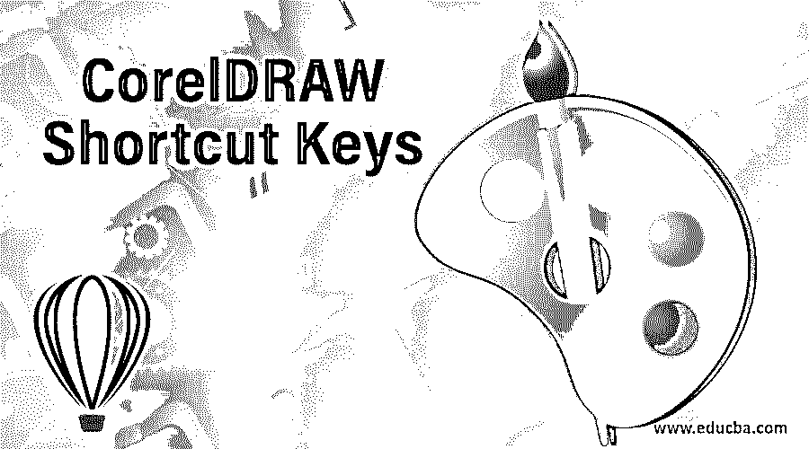

# CorelDRAW 快捷键

> 原文：<https://www.educba.com/coreldraw-shortcut-keys/>

## CorelDRAW 快捷键介绍

后面的CorelDraw**快捷键**提供了 CorelDraw 中最常用功能的概要。 这样的 **快捷键有上百个，不可能提供一套完整的快捷键。** CorelDRAW 可以定义为一种基于矢量的软件，用于图形设计任务，如创建徽标、品牌等。在这个软件的帮助下，你可以控制图像，制作一些设计和许多其他图片建模任务。CorelDRAW 是在台式电脑上提供彩色矢量图形编辑功能的首批工具之一。矢量图形可以被认为是作为直线、曲线和点之间的关系而产生的插图。因为它是一个矢量图形软件，当它被重新调整大小时，图像的质量不会丢失。使用软件时最重要的事情之一是知道快捷键，因为它可以节省你的时间，提高你的速度和效率。

让我们讨论一下 CorelDRAW 中最常用的快捷键。

<small>3D 动画、建模、仿真、游戏开发&其他</small>

### 常用的 CorelDRAW 快捷键

以下是使用 CorelDRAW 时可以使用的不同快捷键:

#### 1.排列

顶部对齐: T

它允许您将选定的对象顶部对齐。

**底部对齐:** B

它允许您将选定的对象底部对齐。

**右对齐:** R

它允许您将选定的对象向右对齐。

**左对齐:** L

它允许您将选定的对象靠左对齐。

**垂直居中对齐:** C

您可以垂直对齐所选对象的中心。

**水平对齐中心:** E

您可以水平对齐所选对象的中心。

**与基线对齐:** Alt + F12

它允许您将文本与基线对齐。

#### 2.在 CorelDRAW 中显示文档快捷键

**窗口刷新:** Ctrl + W

您可以使用此快捷方式刷新窗口。

**显示非打印字符:** Ctrl + Shift + C

可以显示非打印字符

**显示切换:** Shift + F9

可以显示切换。

**全屏预览:** F9

可以全屏预览。

#### 3.CorelDRAW 中的常规快捷键

**复制:** Ctrl + C，Ctrl + Insert

您可以将一个或多个对象复制并移动到剪贴板

**剪切:** Ctrl + X，Ctrl + Delete

您可以剪切一个或多个对象并将其移动到剪贴板。

**删除:**删除(按钮)

使用此按钮可以删除选定的对象。

**粘贴:** Ctrl + V

您可以将内容放在文档中。

重复: Ctrl + R

最后的操作可以重复。

**重做:** Ctrl + Shift + Z

可以使用“恢复”重新应用上次撤消的操作。

**重复:** Ctrl + D

可以复制选定的对象。

**撤销:** Ctrl + Z，Ctrl +退格

可以使用“撤消”来取消上一个操作。

#### 4.文件相关快捷键(格式)

**保存:** Ctrl + S

可以保存活动的文档。

**另存为:** Ctrl + Shift + S

活动文档可以用新名称保存。

**打开:** Ctrl + O

您可以通过搜索文档所在的文件夹来打开现有的文档。

**新建:** Ctrl + N

您可以创建新文档。

**Import:** Ctrl + I

它允许您将文件导入到活动文档中。

**导出:** Ctrl + E

文档的副本可以保存为不同的文件格式

**打印:** Ctrl + P

可以选择打印选项，然后打印活动文档。

**退出:** Alt + F4

它让您退出 CorelDRAW，您将获得一个弹出窗口来保存活动文档。

#### 5.CorelDRAW 中的 Docker 窗口快捷键

**轮廓:** Ctrl + F9

轮廓停靠窗口可以通过此快捷方式打开。

**位置:** Alt + F7

可以通过此快捷方式打开位置停靠窗口。

**Rotate:** Alt + F8

旋转 docker 窗口可以通过这个快捷方式打开。

**信封:** Ctrl + F7

信封 docker 窗口可以通过这个快捷方式打开。

**镜头:** Alt + F3

镜头 docker 窗口可以通过这个快捷键打开。

**图文样式:** Ctrl + F5

一个图形和文本风格的 docker 窗口可以通过这个快捷方式打开。

**线性尺寸:** Alt + F2

线性尺寸 docker 窗口可以通过此快捷方式打开。

**您的** Alt + F10

可以通过此快捷方式打开大小 docker 窗口。

**缩放和镜像:** Alt + F9

缩放和镜像 docker 窗口可以通过此快捷方式打开。

#### 6.对话框快捷键

**强度/亮度:** Ctrl + B

你可以用这个快捷键调节亮度。

**色彩平衡:** Ctrl + Shift + B

您可以使用此快捷方式调整色彩平衡。

**饱和度/色调:** Ctrl + Shift + U

可以使用此快捷方式控制饱和度。

**均匀填充:** Shift + F11

它通过使用调色板、颜色调和、颜色查看器或颜色混合来帮助您选择硬填充颜色。

**喷泉注水:** F11

使用渐变的阴影或颜色，可以填充对象。

#### 7.字体快捷键(格式)

**字号:** Ctrl + Shift + P

你可以用这个调整字体大小。

**增加字体大小:** Ctrl + Numpad 8

可以用这个增加字体大小。

**减小字体大小:** Ctrl + Numpad 2

这样可以减小字体大小。

**粗体:** Ctrl + B

您可以将文本加粗。

**斜体:** Ctrl + I

你可以用斜体显示文本。

#### 8.轮廓笔

**轮廓颜色对话框:** Shift + F12

使用此快捷方式可以打开轮廓颜色对话框。

**轮廓笔对话框:** F12

使用此快捷方式可以打开轮廓笔对话框。

#### 9.工具箱

**手:** H

您可以选择手形工具。

艺术媒体:我

随着写意笔画的使用，您可以添加艺术喷雾，画笔和一些书法效果。

**椭圆工具:** F7

您可以选择椭圆工具。

**橡皮工具:** X

您可以选择橡皮擦工具。

**徒手工具:** F5

可以选择手绘工具。

**网格工具:** M

可以选择网格工具。

**矩形工具:** F6

可以选择矩形工具。

**多边形工具:** Y

可以选择多边形工具。

**螺旋工具:** A

可以选择螺旋工具。

**文本工具:** F8

可以选择文本工具。

#### 10.嗡嗡声

**缩小:** F3

你可以缩小。

**缩放:** F2

你可以放大一个镜头。

**放大所有物体:** F4

您可以放大整个对象。

### 结论

当你需要加快你的工作，同时保持专业性时，CorelDRAW 快捷键绝对有用。即使 CorelDRAW 已经分配了大量的快捷键，您也可以根据手头的任务定制和更改这些快捷键，并提高布局工作的速度。因此，CorelDRAW 为您提供了预定义快捷方式和自定义快捷方式的灵活性。

### 推荐文章

这是一个 CorelDRAW 快捷键指南。这里我们讨论了 CorelDRAW 中不同类型的快捷键。您也可以浏览我们推荐的其他文章，了解更多信息——

1.  [CorelDraw 替代品](https://www.educba.com/coreldraw-alternatives/)
2.  [CorelDRAW 工具](https://www.educba.com/coreldraw-tools/)
3.  [安装 CorelDraw](https://www.educba.com/install-coreldraw/)
4.  [CorelDRAW 版本](https://www.educba.com/coreldraw-versions/)

