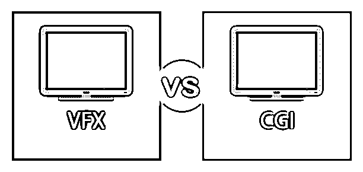
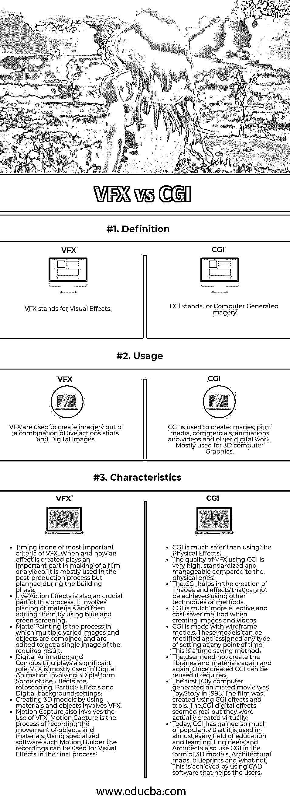

# VFX vs CGI

> 原文：<https://www.educba.com/vfx-vs-cgi/>

## VFX 和 CGI 的区别

VFX 通常被称为视觉效果。视觉效果是通过操作计算机生成的图像和现场拍摄的点击来制作电影和动画的过程。执行此过程是为了获得期望的结果并满足所需的需求。这些视觉效果是不可能在一部电影上创造出来的；因此，它们实际上是用计算机图形制作的。否则，这个过程的创建是非常昂贵的，有风险的，并且在现实中几乎不可能实现。目前，可以使用动画和合成软件来创建视觉效果。简单来说，任何在现实中要求得到的东西，都可以通过视觉效果来实现。在这个主题中，我们将学习 VFX 和 CGI 的区别。CGI 是计算机生成图像的简称。简单来说，任何在计算机平台上以数字方式创作的东西都被称为 CGI。创作可以是艺术或印刷媒体中的图像、电影、游戏、视频、动画或任何简短的广告。CGI 是一个更复杂的术语，用于 3D 计算机图形。但是，CGI 也可以用于 2D 图像，并且本质上是静态和动态的。在电影制作领域，CGI 已经成为电影人将其创作理念搬上银幕的重要工具。

### VFX 和 CGI 的直接对比(信息图)

以下是 VFX 与 CGI 的顶级对比:

<small>3D 动画、建模、仿真、游戏开发&其他</small>

### VFX 和 CGI 的主要区别

以下是主要区别:

*   CGI 是 VFX 的一部分。VFX 是用来在电影的最后过程中创造影像的；这些图像可能包括模型、艺术品或在电脑上用电脑生成的元素。虽然，这是可能的创造 CGI 和 VFX 没有对方和独立的。
*   VFX 是使用不同的专门设计的软件创建的，并且是特定需要的。另一方面，CGI 是在数字平台上创建的计算机生成的图像，但它不需要任何高级软件。
*   时机在视觉效果的过程中起着非常重要的作用。视觉效果在流程的初始阶段进行规划和绘制，在后期制作阶段完成。一个特殊的视觉效果导演被任命来管理这个过程。而当单独使用 CGI 时，用户不需要注意任何时间，也不需要为此指定任何专门的管理员。
*   一些提供视觉效果专业化的常见公司有 Weta Digital、Moving Picture Company、Framestore 和 Digital Domain。虽然今天几乎每个公司都在使用 CGI 程序。
*   电脑动画也是 CGI 的一部分。动画部分本质上是动态的，而风景本质上是静态的。为了创建动画，以这样一种方式放置图像，即在具有时域和错觉运动的每个连续图像中存在微小差异。另一方面，VFX 是添加到已经创建的图像中的特殊特征，并且那些不能物理地生成。
*   视觉效果包括任何不是直接在摄像机中拍摄的效果，而是在后期制作过程中虚拟创建的效果。CGI 包括在一个数字平台上对 3D 物体进行建模，并渲染出这些物体的图像。
*   在 VFX 使用的材料包括现场拍摄的真人图像，用相机拍摄的独立的实际元素，如爆炸或火灾，用计算机生成的模型或元素。所以，CGI 是视觉效果过程的一部分。

### VFX 与 CGI 对比表

下面是最上面的比较:

| **比较的基础** | **VFX** | **CGI** |
| **定义** | VFX 代表视觉效果。 | CGI 代表计算机生成图像。 |
| **用途** | VFX 被用来将实景拍摄和数字图像结合起来创造图像。 | CGI 用于创建图像、印刷媒体、广告、动画和视频以及其他数字作品。主要用于 3D 计算机图形。 |
| **特性** | 时机是 VFX 最重要的标准之一。在电影或视频的制作中，何时以及如何产生效果起着重要的作用。它主要在后期制作过程中使用，但在构建阶段进行规划。真人特效也是这一过程的重要组成部分。它包括放置材料，然后通过使用蓝色和绿色筛选来编辑它们。
哑光绘画是将多个不同的图像和物体组合并编辑以获得所需结果的单个图像的过程。
数字动画和合成扮演着重要的角色。VFX 主要用于涉及 3D 平台的数字动画。一些效果是旋转观测，粒子效果和数字背景设置。使用材料和物体创建 3D 模型涉及到 VFX。
动作捕捉也涉及到 VFX 的使用。动作捕捉是记录物体和材料运动的过程。使用 Motion Builder 等专业软件，这些记录可用于最终流程中的视觉效果。 | CGI 比使用物理效果要安全得多。与实物相比，使用 CGI 的 VFX 质量非常高、标准化且易于管理。
CGI 有助于创建其他技术或方法无法实现的图像和效果。
在制作图像和视频时，CGI 是一种更加有效和节约成本的方法。
CGI 是用线框模型制作的。这些模型可以在任何时间点修改并分配给任何类型的设置。这是一种节省时间的方法。
用户无需反复创建库和素材。一旦创建，如果需要，CGI 可以重用。第一部完全由电脑制作的动画电影是 1995 年的《玩具总动员》。这部电影是用 CGI 特效和工具制作的。CGI 数字效果看似真实，但实际上是虚拟的。今天，CGI 已经非常受欢迎，几乎被应用于教育和学习的每一个领域。工程师和建筑师也以 3D 模型、建筑地图、蓝图等形式使用 CGI。这是通过使用帮助用户的 CAD 软件实现的。 |

### 结论

VFX 和 CGI 密切相关，但彼此并不相似。当 VFX 被用于一部电影时，CGI 就成了这个过程的一部分。然而，CGI 和 VFX 都可以独立创建。借助微缩模型或玻璃哑光画，不使用 CGI 也能创作出 VFX。这取决于用户的要求和项目的性质。

### 推荐文章

这是 VFX 和 CGI 之间最大差异的指南。在这里，我们还将讨论信息图和比较表的主要区别。您也可以看看以下文章，了解更多信息–

1.  [4D 电影院 vs 玛雅](https://www.educba.com/cinema-4d-vs-maya/)
2.  [After Effect Vs 4D 电影院](https://www.educba.com/adobe-after-effect-vs-cinema-4d/)
3.  [玛雅 vs ZBrush](https://www.educba.com/maya-vs-zbrush/)
4.  [Adobe Premiere vs Final Cut Pro](https://www.educba.com/adobe-premiere-vs-final-cut-pro/)

