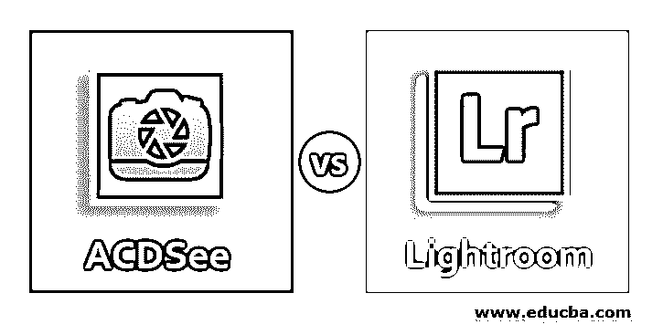

# ACDSee vs Lightroom

> 原文：<https://www.educba.com/acdsee-vs-lightroom/>

## ACDSee 和 Lightroom 的区别

在本文中，我们将了解 ACDSee 和 Lightroom 之间的区别。

ACDSee 是由 ACD Systems International Inc .开发的一款快速、功能齐全的图像浏览器、数据库、浏览器、文件管理和图像处理软件，集所有功能于一身，最初于 1994 年发布。它支持超过 40 种公认的图像文件格式和 LZH 和 ZIP 存档，扫描仪，照片共享服务，数码相机等。它有附加插件模块的潜力。您可以利用 ACDSee 的屏幕幻灯片放映功能来显示图像。ACDSee 附带了各种工具来处理您的图片，无论是在编辑模式下还是在快速查看模式下。您可以选择、调整曝光，并通过曲线或色阶操作直方图。

<small>3D 动画、建模、仿真、游戏开发&其他</small>

Lightroom 是一个一流的图像数据库管理系统和图像处理器，由 Adobe Systems 于 2007 年设计并集成在一个软件中。它不是一个孤立的、难以驾驭的软件；相反，它应该被看作是一系列软件模块，当它们组合在一起时，可以为数码摄影师产生一个绝对的工作流程。Lightroom 旨在消除这些问题，并提供障碍可懂度。Lightroom 中可用的工具旨在简化[图像编辑](https://www.educba.com/best-editing-software/)和管理操作，并尽可能轻松流畅地构建用户体验。我们的目标是为摄影师提供他们最需要的工具，并消除他们对复杂解决方案的需求。

### ACDSee 和 Lightroom 的面对面比较(信息图)

以下是 ACDSee 与 Lightroom 之间的主要比较:

### ACDSee 和 Lightroom 的主要区别

让我们讨论一下 ACDSee 和 Lightroom 之间的一些主要区别:

*   ACDSee 是 Lightroom 的重要替代品；毕竟，它为 Lightroom 导入、修改和导出文件的过程生成了一个替代工作流。Lightroom 作为一个个性化的目录运行，而 ACDSee 直接从磁盘到磁盘进行现场表演。
*   软件的编辑模式是一个解决方案中的一切生效的地方。Lightroom 允许您导入一批图像，调整每个图像，然后导出它们以在 Photoshop 中使用。没有必要用 ACDSee 退出一个程序，可以进行复杂的非破坏性返工。
*   Lightroom 在内存(随机存取内存)上一直磨得很辛苦；另一方面，ACDSee 使用了大约三分之一的内存。
*   Lightroom 和 ACDSee 的一个非常显著的区别是，在 ACDSee 中，不需要导入含义；ACDSee 直接从磁盘检查您的驱动器，并跳过将文件导入目录的过程。ACDSee 仍然带有导入功能，但这只是将文件从读卡器复制到本地硬盘，而不是将文件副本保存在自己的数据库中。
*   ACDSee 提供了一个更好的价值，它附带了一个终身许可证密钥，经过评估，可以补充 Lightroom 的独立价格 149.99 美元。它可以购买一次，想用多久就用多久，或者通过注册 69 美元起的年度订阅，获得免费升级、网络访问、一套相关软件和 10gb 的云存储空间，这大约是类似的 Adobe Creative Cloud 摄影计划会员价格的一半。
*   Lightroom 提供了一些属性，如在 Lightroom 中单击图片的系留捕捉，并允许 Photoshop 管理任何重要的像素级编辑，而 ACDSee 则绕过了单击部分，并将 Photoshop 风格的图片编辑作为其工作流程的最后一步。
*   Adobe 专注于用户体验和界面的细微差异，而 ACDSee 则特别关注制作绝对独立的软件。
*   Lightroom 是需求较大的 RAW 图像处理器之一，尽管它没有集成 ACDSee 提供的相同级别的基于像素的编辑工具。
*   Lightroom 中的工具非常有条理，但不像 ACDSee 出色的管理模块那样广泛。
*   虽然 ACDSee 的用户界面有点过时，但与 Lightroom 相比，它提供了一个非常可定制的用户界面，可以在任何工作流程中进行调整。消费者可以分离、移动、堆叠或停靠窗格和工具栏，将它们放在任何他们想放的地方。有一个已知的选择工具，未分离的原始编辑和非破坏性的图像处理的完整伴奏，所以你总是有特权测试。
*   ACDSee 利用被称为 Light EQ 的授权技术，与 Lightroom 相比，只需单击一下鼠标即可识别完美的图像主题。
*   ACDSee 协助已经作为编辑模式工作流程的一部分存在的 Photoshop 插件，甚至允许您生成自己的滤镜并与现有的顶级编辑工具结合使用。

### ACDSee 和 Lightroom 在编辑过程中的区别

以下几点解释了 ACDSee 和 Lightroom 之间编辑过程的不同形式:

#### Lightroom 编辑流程

*   启动 Lightroom。
*   从系统中选择用于导入的文件。
*   将图像导入 Lightroom。
*   选择要修改的文件。
*   点击开发按钮。
*   修改图像。
*   导出图像。

#### ACDSee 编辑过程

*   启动 ACDSee 照片工作室。
*   选择您要在系统上修改的文件。
*   点击开发按钮或编辑按钮。
*   保存你的形象。

### ACDSee 与 Lightroom 的对比表

让我们来看看 ACDSee 和 Lightroom 之间的顶级比较。看完这张表后，你会对这个软件的特性有更多的了解。

| **比较的基础** | **ACDSee** | **灯箱** |
| **支持的设备** | Windows，Mac，iPhone/IPad，基于网络。 | Windows，Mac，Linux，Android，基于网络。 |
| **定价** | 

*   Starting price–$64.95
*   Positive price-$159.98

 | 

*   Starting price-$119.88
*   Regular price-$119.88 per year.

 |
| **排名** | 22 日 | 第六届 |
| **磁盘空间** | 小的 | 大的 |
| **文档支持** | 礼物 | 不存在 |
| **性能/速度** | 最快的 | 快速的 |
| **图层和调整图层** | 有空的 | 无法使用 |
| **多层** | 可能的选择 | 无法选择 |
| **编辑源文件** | 直接编辑 | 必须进口 |
| **GUI 定制** | 可定制的 | 不可定制 |
| **皮肤调** | 礼物 | 不存在 |
| **代码库** | C++ | C++，Lua |
| **用户界面布局** | 大量的命令 | 非常少的命令 |
| **免费试用** | 有空的 | 无法使用 |

### **结论**

ACDSee 是一个出色的 RAW 工作流图像处理和管理应用程序，与 Lightroom 相比，它的价格非常经济。与 Lightroom 相比，一些用户界面组件非常特殊和模糊，一些不相关的组织和审查模块可以合并，以进一步平滑工作流程。文件的管理和这些文件的演示，与 ACDSee 执行的惊人速度相结合，增加了它的价值。与 Lightroom 相比，当您处理大量图像时，这可能是一个显著的差异。

### 推荐文章

这是 ACDSee vs Lightroom 的指南。这里我们讨论信息图和比较表的主要区别。您也可以浏览我们的其他相关文章，了解更多信息——

1.  [Camera Raw 与 Lightroom |主要差异](https://www.educba.com/camera-raw-vs-lightroom/)
2.  [Capture One vs Lightroom |最佳照片编辑软件](https://www.educba.com/capture-one-vs-lightroom/)
3.  [Photoshop vs Lightroom |最好用的程序](https://www.educba.com/photoshop-vs-lightroom/)
4.  【Lightroom 的五大备选软件
5.  [暗台 vs Lightroom |最大差异](https://www.educba.com/darktable-vs-lightroom/)
6.  [亲和力与 Lightroom |主要差异](https://www.educba.com/affinity-vs-lightroom/)

