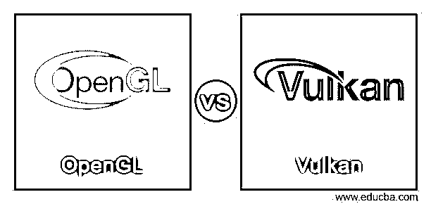

# OpenGL vs 瓦肯

> 原文：<https://www.educba.com/opengl-vs-vulkan/>

## OpenGL 和 Vulkan 的区别

以下文章提供了 OpenGL vs Vulkan 的概要。OpenGL 是一个跨平台的 API，其中 API 指的是应用程序编程接口，并专注于渲染 2D 以及具有有效结果的 3D 矢量图形。为了加速硬件渲染，它与图形处理单元(GPU)进行交互。这一点的好处是它是一个开源和免费的 API。Vulkan 也是一款跨平台软件，它不仅可以作为 3d 图形和计算软件使用，还可以处理视频游戏和多媒体元素的编程。这两个软件也有几乎相同的工作，即使他们彼此不同。今天在这篇文章中，我们将找出是什么使这两个软件彼此不同，尽管他们的开发者是相同的。

### OpenGL 与 Vulkan 的直接对比(信息图)

以下是 OpenGL 和 Vulkan 之间的 6 大区别:

<small>3D 动画、建模、仿真、游戏开发&其他</small>

### OpenGL 和 Vulkan 的主要区别

让我们讨论一下 OpenGL 和 Vulkan 之间的一些主要区别:

*   OpenGL 和 Vulkan 都是开源的跨平台 API，这意味着它们都可以免费使用，并且有很多好的特性，你不需要担心任何订阅和计划来使用它们中的任何一个。由同一开发人员开发 API 和 Vulkan 都是由 Khronos group 在 GDC 于 2015 年推出的非盈利 API，最初被称为“下一代 OpenGL 计划”或“OpenGL next ”,但后来它被更改为 Vulkan。
*   Vulkan 提供了许多优势，因为它提供了对 GPU 的强大直接控制，降低了 CPU 的使用以及 it 的开销压力。简而言之，它的整体概念和功能与 Mantle 相似，后者也被微软 Windows 的 Direct3D 12 和苹果的 Metal 所采用。OpenGL 为多个线程生成命令缓冲区，并同时处理到一个命令管道中，由于这个原因，开发人员不需要为框架的维护工作，或者如果他们想做，那么他们可以通过很少的努力来完成。
*   OpenGL 为 GLSL 创建了自己的编译器，这是一种高级语言，该语言编写着色器，迫使 OpenGL 驱动程序实现自己的编译器，并执行应用程序运行时，将程序的着色器转换为 GPU 的机器代码。而 Vulkan 的着色器已经转化为中间二进制格式，它被称为 SPIR-V(标准可移植中间表示)。
*   与 OpenGL 相比，Vulkan 具有更好的工具集成，因为您可以独立地启用层的验证和诊断。因为这两个软件的移动和 PC 版本之间没有硬 API 差异，所以在这些跨平台之间移植游戏是容易的。
*   在将来，新的扩展将被添加到 OpenGL 中，与 Vulkan 相同，这个扩展是 NV_command_list，与 Vulkan 的“GPU feeding paradigm”相同，它将增强 OpenGL 的游戏能力。Vulkan 作为 OpenGL 的下一代 API 推出，因此您将拥有更多的功能以及改进的技术来完成与其领域相关的不同类型的任务，从而在您的项目工作中获得最佳结果。因此，您可以轻松地通过 OpenGL 探索 Vulkan 函数。

### OpenGL 与 Vulkan 对比表

我们来讨论一下 OpenGL 和 Vulkan 的顶级对比:

|  | **OpenGL** | Vulkan |
| **定义** | 它是一个开源的跨平台 API，用于渲染 2D 和 3D 矢量图形。 | 正是这种跨平台 API 为视频游戏编程以及 3D 图形工作，以便在相关任务中获得许多好结果。 |
| **开发者** | Silicon Graphics Inc .于 1991 年开始开发该 API，并于 1992 年 6 月 30 日发布，但其开发者是 Khronos group，其前身为 ARB。 | 该 API 的开发者是 AMD、DICE 和 Khronos group，最初于 2016 年 2 月发布。 |
| **操作系统** | 您可以在 Linux、Microsoft Windows、Mac OS 操作系统上运行此 API，有关操作系统的其他相关信息，您可以访问 OpenGL 的官方网站。 | Vulkan 可以在不同的操作系统上运行，包括 Linux、Android、Unix、Microsoft Windows、Nintendo、BSD、Mac OS、iOS 和许多其他兼容的操作系统。 |
| **最新版本** | 2017 年 7 月 31 日，其最新版本发布并命名为 4.6，具有许多良好的功能，并在以前版本的拖袋中进行了改进。 | 它的最新版本是 2021 年 3 月 1 日发布的 1.2.171，更新了很多，使它的工作更加流畅。 |
| **可用性** | 你可以通过访问 OpenGL 的官方网站[www.opengl.org](https://www.opengl.org/)开始使用 OpenGL。你也可以从这个网站获得与这个 API 相关的其他重要信息。 | 你可以上[www.khronos.org/vulkan](https://www.vulkan.org/)下载它，也可以获得其他信息，如基本要求、必需品等等。 |
| **支持的语言** | C 或 C++是计算机语言，OpenGL 是用它们编写的，并且很容易操作。 | c 是这个软件的基本语言，这意味着它是用这种计算机语言编写的。 |

我们上面看到的几点是最重要的，因为它给出了两个软件的基本要求、功能、需求和工作能力，并帮助我们决定哪一个对我们有利。

### 结论

OpenGL 和 Vulkan 对你来说是熟悉词汇，你可以很容易地理解它们来探索你在这个软件相关领域的想法。我建议你，如果你开始在这个领域使用这些 API，那么你必须一个接一个地尝试它们，这样你就能发现这些软件本身的优缺点。

### 推荐文章

这是 OpenGL vs Vulkan 的指南。这里我们分别用信息图和比较表来讨论 OpenGL 和 Vulkan 的主要区别。您也可以看看以下文章，了解更多信息–

1.  [WebGL vs OpenGL](https://www.educba.com/webgl-vs-opengl/)
2.  [DirectX vs Vulkan](https://www.educba.com/directx-vs-vulkan/)
3.  [AutoCAD vs SolidWorks](https://www.educba.com/autocad-vs-solidworks/)
4.  [AutoCAD vs FreeCAD](https://www.educba.com/autocad-vs-freecad/)

