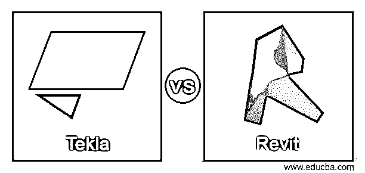

# 单个与 Revit

> 原文：<https://www.educba.com/tekla-vs-revit/>

## Tekla 与 Revit 的区别

Tekla structures vs Revit 一直是建筑信息建模软件爱好者感兴趣的话题，如果我告诉你 Tekla，那么它就是 BIM(建筑建模软件)软件，可以用于不同的建筑材料，如钢铁、混凝土、玻璃和木材。有了 Tekla，工程师和绘图员可以拥有建筑结构的不同组件和元素的 2D 图纸和 3D 模型。如果我让你注意 Revit，那么它也是一个流行的建筑建模软件，但也可以处理其他工程分支，如电气，机械以及管道。让我们今天在这篇文章中告诉你这两个软件的其他主要事实，以便你可以在你的头脑中建立一个关于它们的概念。

在这篇文章中，我们将通过一个比较表和关键差异来继续关注这两个软件，这些将是我们的副标题。

<small>3D 动画、建模、仿真、游戏开发&其他</small>

### Tekla 与 Revit 的直接对比(信息图)

以下是 Tekla 与 Revit 之间的 8 大区别:

### Tekla 与 Revit 的主要区别

我们上面已经讨论过，这两个软件是由不同的组织开发的，所以两者都有其特殊的功能和关键的区别，我将通过一些要点告诉你这些功能。

*   这两个软件的第一个也是最主要的区别是 Tekla 是专门为定义钢或混凝土的结构而设计的，它可以精确地给出复杂横截面的细节。因此，它是需要横截面细节效率的公司的吸引中心，而 Revit 是一个具有广泛工作领域的软件，换句话说，它为结构工程师、建筑师、MEP 工程师等工作。
*   泰克拉可以创造。rvt 文件(来自其 2019 年版本)和其他格式，如三维 DWG、三维 DGN 等，但在 Revit 中，不保证在 Revit 的未来版本中能够使用。rvt 文件。英寸 rvt 文件它包括 PDF 文件形式的项目银行，但不包括该软件的图纸、视图和明细表。
*   现在，如果我们谈论 Tekla 的定价，那么您会发现它与其他 BIM 软件相似，其主要计划每年花费 7500 美元，您可以通过该软件包获得许多良好的功能，为设计工作提供许多有效的元素，而 Revit 是多学科 BIM 软件，每年花费 2，425 美元，具有高质量的性能和有效的设计功能。
*   我们可以用 tekla 探索混凝土和钢的细节，也可以用它进行预制和现场浇铸。Tekla 的这些功能允许用户在钢和混凝土的 3D 结构模型上工作，并给他们关于最终制造的输出的想法。在 Revit 中，我们可以探索机械工程、电气工程以及管道工程的构件和元素，并且通过最新版本的新功能，您可以在其中创建倾斜的墙，而无需使用体量或模型命令，这是该软件最受期待的功能。您可以在 Revit 2021 版的中找到此功能。

为了更好地了解这两种软件的重要方面，应该讨论这些重要的事实。

### Tekla 与 Revit 对比表

在比较表中，我们将通过软件的特性来说明这两种软件在各自领域中的要点，这些要点如下表所示。

| **基础** | **泰克拉** | **Revit** |
| 定义 | Tekla 是一款软件，可以用于钢铁、混凝土、玻璃和木材材料，并以流畅的工作方式为其创建 2d 图纸和 3d 模型。 | Revit 还用于建筑材料和结构的 2D 和三维建模，但您也可以在其他工程领域中使用它来创建这些分支的构件和图元。 |
| 操作系统 | Tekla 兼容微软 Windows 操作系统，是 CAD & BIM 软件。 | Revit 还与 Microsoft Windows 操作系统兼容。 |
| 开发者 | 它由 tekla 开发，用于执行钢或混凝土的详细结构设计，以前称为 Xsteel。 | 它是由 Charles River 于 1997 年开发的，并于 2000 年发布供公众使用，具有多学科的特点。 |
| 最新版本 | Tekla 的最新版本是 Tekla Structures 20.1 SR2，于 2020 年 3 月推出。此版本需要 Tekla License server 2017 或更高版本。 | 2020 年 4 月，其最新版本发布，并以 Autodesk Revit 2021 命名。你可以在其官方网站上找到它的试用版，以便了解新功能。 |
| 有效性 | 如果你想和它一起工作，那么你可以浏览它的官方网站，网址是[www.tekla.com](https://www.tekla.com/)，下载它，了解它的工作原理。 | 继续[www.autodesk.com](https://www.autodesk.com/)为你的设计工作拥有这个软件。 |
| 支持的文件 | Tekla 支持的文件有。dxf，dwg，。igs，还有很多。 | Revit 支持 DWG、DGN、DXF、SKP、IFC 和 SAT 支持的不同 CAD 文件格式。 |
| 支持的图像格式 | BMP，Jpg，Jpeg 图像文件格式可以很容易地被这个软件支持，你可以在使用它的过程中使用它们。 | Revit 支持的图像文件格式为 BMP、PNG、JPEG 和 TIF，在大多数设计工作中，这些格式可能是您工作的一部分。 |
| 本地格式 | 它在中可用。tekla 格式，也支持。融合，。ply，。其他建模软件的 obj，. 3ds 文件格式。 | 它有 RTE、RFA、RFT 和 RVT 文件格式。 |

现在，看完这张表后，你对两个软件的系统需求、功能和其他方面有了清晰的了解。现在，我将带您了解本文的下一部分，这是关键的区别。因此，让我们找到他们，以获得更多关于这两种软件的信息。

### 结论

现在，看完这篇文章后，Tekla 和 Revit 对您来说将不再是一个新词，您将对所有功能、系统要求以及理解任何软件所需的其他重要内容有一个清晰的了解。现在试着一个接一个地使用这两个软件，以便正确理解它们。

### 推荐文章

这是 Tekla vs Revit 的指南。在这里，我们还讨论了 Tekla 与 Revit 的主要差异，并提供了信息图表和比较表。您也可以看看以下文章，了解更多信息–

1.  [哈斯克尔 vs 二郎](https://www.educba.com/haskell-vs-erlang/)
2.  [Alexa vs Siri](https://www.educba.com/alexa-vs-siri/)
3.  [Arduino Nano vs Mini](https://www.educba.com/arduino-nano-vs-mini/)
4.  [Krita vs Clip Studio](https://www.educba.com/krita-vs-clip-studio/)

