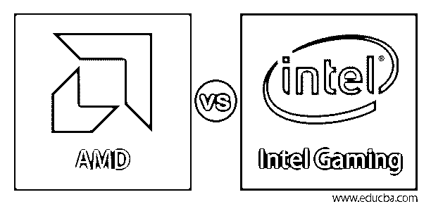

# AMD vs 英特尔游戏

> 原文：<https://www.educba.com/amd-vs-intel-gaming/>

## AMD 与英特尔游戏的区别

Advanced Micro Devices 是一家生产个人电脑芯片的制造商，这些芯片配有为游戏和日常工作开发的兼容微处理器。AMD 有更多的内核来管理其他竞争对手公司提供的性能。价格、动力和性能是与其他产品进行的比较，它们与这些产品兼容。英特尔擅长内核更少、性能更高的游戏。核心价格更高，是为专业游戏应用开发的。根据游戏的不同，性能不同，内核数量也不同。英特尔 i5 或 i3 配置适合专用于游戏性能的内核。

### AMD 与英特尔游戏的直接对比(信息图)

以下是 AMD 与英特尔游戏之间的主要对比:

<small>3D 动画、建模、仿真、游戏开发&其他</small>

### AMD 与英特尔游戏的主要区别

让我们讨论一下 AMD 和 Intel 游戏之间的一些主要区别:

*   对比两者，英特尔在游戏方面表现出色。在 AMD，最好的游戏 CPU 有 6 个内核，12 个线程，3.6 GHz，构建在 14 纳米晶体管上。3 个 GPU 可以运行 24 个 PCle 3.0 通道，性能不会受到影响。英特尔的游戏处理器是 i9 7900x，它有 10 个内核，20 个线程和 3.3 GHz 时钟，构建在 14 纳米晶体管上。带有 3.0 通道的 44 PCle 支持 5 个 GPU 和 128 GB RAM。
*   AMD 和 Intel 最好的游戏 CPU 对比时，AMD 比 Intel 慢 25%。如果必须提高性能，这会降低性能并增加内核数量。此外，AMD 的价格更少，与英特尔相同的工作设置。如果用户对性能感兴趣，最好选择英特尔，但对于中端操作，AMD 更好。
*   AMD 和英特尔游戏中的最低端产品被认为是 4 核 4 线程的英特尔 3.6ghz i3 8100 和 3.5ghz 英特尔 ryzen 3 1300x。锐龙的超频高达 4 GHz，两者的 CPU 相似。英特尔不能在 i3 中超频，两者的性能相似。
*   如果用户没有用于游戏的专用 GPU，最好使用 AMD，因为英特尔不提供用于游戏的 GPU。GPU 方面，AMD 最好的是锐龙 Vega 显卡，4 核 8 线程，3.6 GHz，功率 gt 1030。在没有 GPU 的情况下，英特尔必须使用专用显卡。将要使用的系统是 i3 8100 或 i5 8600，但与 AMD 相比，它要慢 75%。
*   AMD 的所有系统都不提供集成显卡，而 Intel 的所有系统都提供集成显卡。配备 3 2200g 和 5 2400g 的 AMD 锐龙系统具有集成显卡，因此它们可以在系统中没有 GPU 的情况下工作。性能将与其他 amd 相同，只是主频为 GHz 的时间略有不同。
*   英特尔一次只运行一个程序，并不致力于多处理。这使得用户以更高的时间投入专注于一个系统的性能。它没有利用多核渲染，并且系统被设计为一次执行一个进程。而 AMD 可以一次专注于不同的进程，多个内核专用于微处理器中的进程。

### AMD 游戏与英特尔游戏的对比表

让我们来看看 AMD 与英特尔游戏之间的主要对比。

| **AMD 游戏** | **英特尔游戏** |
| 与英特尔相比，性能较差。内核的数量与一次执行的进程数量相对应，这使得系统可以专注于多个进程。 | 系统专注于所有内核上的进程，可提供更高的性能。多个过程不会同时进行，并且该过程以更高的专注度和性能进行。 |
| AMD 的散热更少，这使得系统中的超频处理器使游戏变得更加艰难。 | 英特尔的散热技术很好，当使用超频处理器时，散热技术让游戏变得简单。 |
| 与其他处理器相比，AMD 处理器的价格更低，对于喜欢 AMD 的游戏玩家来说，这笔钱可以很容易地用于冷却处理器。 | 英特尔在系统内核和处理器方面有点贵。这使得所有系统的高端处理器和游戏线程都集中在一个程序上。 |
| 锐龙线程 ripper 1920x 更适合 AMD 系列的极限工作站，因为它在系统中提供了 2 个额外的内核和 0.2 GHz 的额外性能。作为一个额外的优势，它不会很快变热。 | 英特尔 i9 7900x 在英特尔系统中用作 3.3GHz 的极限工作站，可以提升到 4.3GHz。它很快就会发热，必须时刻小心。 |
| AMD 用于不同的项目，但不是单一流程的大师。这使得用户重新思考 AMD 在他们的过程中所提供的服务。它可以用于动画或视频编辑或流。 | 项目中使用了英特尔 i7，因为它专用于项目中的单个进程。该处理器完全专用于游戏应用，不做任何视频编辑或动画项目。 |
| 锐龙被用作中端游戏应用程序，擅长通过其他几个进程传输应用程序。可以优化处理器，并且可以提高性能。超线程在锐龙是可能的。 | 英特尔 i5 在游戏方面表现出色，领先于 AMD 中端产品锐龙。但是超线程在 i5 中是不可能的，而且 i5 中的 fps 比锐龙中的多。 |
| AMD 有一个可扩展的互连来连接应用程序中的不同进程，如 Infinity fabric。 | 英特尔没有可扩展的互连，因此很难了解应用中的其他进程。 |

虽然英特尔已经统治了游戏世界，许多人更喜欢英特尔而不是 AMD，但 AMD 正在进步，并成为游戏开发者的最爱。英特尔要想在这个行业生存下去，就必须摆脱束缚，了解市场。

### 推荐文章

这是一个 AMD 与英特尔游戏指南。这里我们讨论信息图和比较表的主要区别。您也可以浏览我们的其他相关文章，了解更多信息——

1.  [Mudbox Vs Zbrush](https://www.educba.com/mudbox-vs-zbrush/)
2.  [Photoshop Vs 亲和照](https://www.educba.com/photoshop-vs-affinity-photo/)
3.  [ON1 Vs Lightroom](https://www.educba.com/on1-vs-lightroom/)
4.  [ACDSee Vs Lightroom](https://www.educba.com/acdsee-vs-lightroom/)

