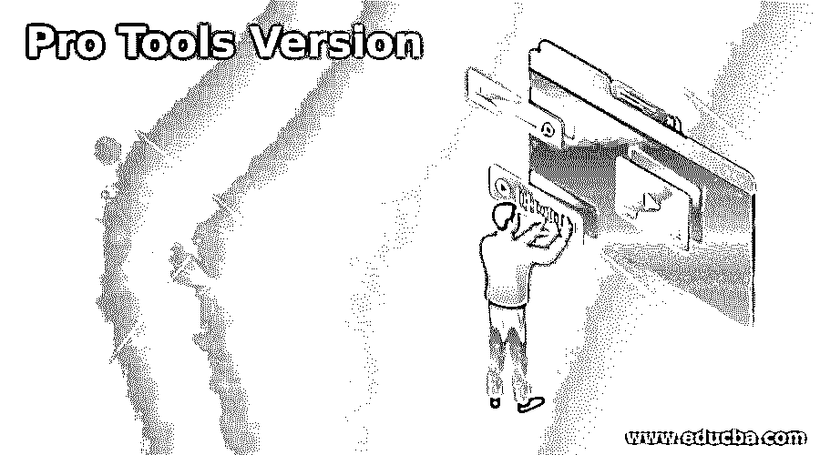

# 专业工具版本

> 原文：<https://www.educba.com/pro-tools-version/>

## 专业工具简介

以下文章提供了 Pro Tools 版本的概述。Pro Tools 是一款同时支持数字和音频片段的工作站，最初由 Avid Technology 为 MacOS 和 Microsoft Windows 开发和发布。它主要用于制作、音乐创作，主要用于编辑和修改具有良好视频质量的声音。Pro tools 既可以作为带有一系列模数转换器的独立软件，也可以作为带有板载数字信号处理(DSP)的 PCIes 卡。DSP 用于为主机提供一些处理能力，为任何执行提供实时环境。

### Pro 工具版本列表

Pro Tools 版本从最初发布到现在有了很大的变化，每个版本都增加了许多功能、变化和许多即兴创作:

<small>3D 动画、建模、仿真、游戏开发&其他</small>

#### 1\. 1983-1985

Evan Brooks 开发了 pro tools 的这个开始阶段，他将这个开始阶段称为 Digidrum，他和他的一个同伴 Peter Gotcher 一起获得了电气工程专业的学位。凭借这一点，他发明了 5 款带有 digidrum 名称和标签的芯片。

#### 2\. 1985-1989

1984 年，当苹果公司的第一台 machintosh 电脑发布时，两人想到了利用良好的图形用户界面来制作和设计解决方案。发明和开发了 E-Mu，一个基于 Mac 的可视化样本编辑系统，名为 Digidesign Sound Designer。

#### 3\. 1989-1990

这个软件发布版本被称为 Digidesign 声音工具和 sound designer II 软件，它由称为声音工具的硬件和软件组合而成。当时它被称为“第一个无磁带工作室”这个文件版本最初得到支持，并成为数字音频交换的标准，直到 WAV 文件格式。

#### 4\. 1990-1994

这个版本的软件被命名为 Deck、Pro Tools、Sound Tools II 和 Pro-tools II。它包含一个核心引擎，带有基于 Deck 的第一个迭代工具的用户界面，于 1990 年发布。第一个 pro tools 系统发布于 1991 年 6 月 5 日，基于 Deck 的改编版本和 Digidesign 的新编辑系统。在接下来的版本中，即兴创作是关键因素。

#### 5\. 1994

这个版本的软件发布于 1994 年，被称为 Pro Tools II TDM: 16 轨道和实时插件，以时分复用技术发布和开发，允许 DSP 卡和 NuBus 卡之间的多个数字音频流。

#### 6\. 1995-1997

该软件版本于 1995 年发布，被称为 Pro Tools III，由 48 个音轨、DSP Farm 卡和切换到 PCI 卡组成。随着架构的变化，允许基于英特尔的变化。

#### 7\. 1997- 2002

该软件版本于 1997 年作为 Pro Tools | 24 发布，digidesign 引入了新的 24 位接口和新的 PCI 卡，该卡完全依赖于摩托罗拉 56301 处理器，为 24 位音频的 24 个音轨提供了更高的处理能力。Pro-tools 5 见证了两个具有扩展 MIDI 功能的增量软件版本。

#### 8\. 2002-2011

在此时间段内发布的版本经历了重大变化，并集成了如下功能实现:

*   2001 年推出 Mac OS X 操作系统后，digidesign 决定对 Pro Tools 的软件和硬件进行重大重新设计。
*   Pro Tools HD 于 2002 年推出，取代了 Pro tools | 24 系统，后者依赖于一系列 DSP 卡，并集成了运行频率高达 192 KHz 的新接口。
*   两个 HD 连接现在可以链接在一起，以增加输入/输出专有连接。
*   目前的 HD core 和处理器卡都安装在 9 个摩托罗拉 56361 芯片上，运行速度为 100 MHz，为系统提供了 25%的处理能力。
*   当苹果改变插槽架构并从 MAC G5 扩展到 PCI Express 时，Digidesign 推出了一系列 PCIe DSP 卡，这些卡采用了新的卡插槽格式并改变了芯片组合。
*   HD 进程卡被 HD Accel 取代，有 56321 个芯片运行在 200 MHz。
*   Pro Tools 还为录音和混音提供了一个坚实可靠的替代品，这在十年后成为了专业录音室的标准。
*   其他软件在后台任务处理时也得到了增强，在播放和部署音频时实时插入 TDM 插件。
*   ADC(自动插入延迟补偿)是其中的一部分，然后在音频和视频的播放和处理过程中，还可以通过插件实时插入 TDM。
*   2006 年，Pro tools 7 发明了 VCA 和音量微调功能，并引入了对十轨道插入、MIDI 编辑器和 MIDI 乐谱的支持。
*   上述工具在 2009 年发布的 Pro Tools 8 中发布。

### 专业工具| HDX (2011 年至今)

*   2011 年，Avid 发布了一系列 Pro Tools 10，并引入了名为 HDX 的 DSP PCIe 卡。
*   每个卡具有由德州仪器制造的 18 个 DSP 处理器。
*   它允许在动态性能范围内提高计算精度。
*   一种新的第二系列 PCIe 卡称为 HD Native，用于通过单个 FCGA 提供低延迟，但没有安装到 DSP 上。
*   为了保持性能和一致性，HDX 产品发布时指定了固定数量的声音。
*   每张 HDX 卡都支持 256 种同步声音，并带有一些用于制造和处理的 Pro 工具的标准版本。
*   作为 Pro tools 10 的一部分，有一些很好的功能，它有一个新的插件，用于本地和 HDX 系统，名为 AAX(avid audio extension 的缩写)。
*   AAX 本地用特定的格式替换了 RTAS 插件和 AAX DSP，以便在 HDX 系统上运行。

### 结论

专业工具真的有助于使音频和视频流，编辑和修改更容易。每个版本都增加了新功能，即兴增强帮助专业工具发展至今。每个版本的 Pro tools 都让一个或另一个软件发挥了突出的作用。

### 推荐文章

这是一个专业工具版本的指南。在这里，我们讨论了简介、pro tools 列表和 pro tools | HDX (2011 年至今)。您也可以看看以下文章，了解更多信息–

1.  [AutoCAD 中的块](https://www.educba.com/block-in-autocad/)
2.  [AutoCAD 中的极坐标阵列](https://www.educba.com/polar-array-in-autocad/)
3.  [Polyline in AutoCAD](https://www.educba.com/polyline-in-autocad/)
4.  [AutoCAD 备选方案](https://www.educba.com/autocad-alternatives/)

