# InDesign 垂直居中文本

> 原文：<https://www.educba.com/indesign-center-text-vertically/>

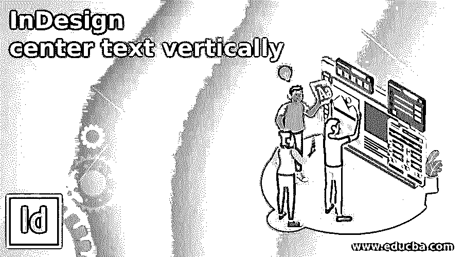

## InDesign 垂直居中文本简介

InDesign 垂直居中文本是该软件的功能之一，通过它我们可以将文本垂直对齐到文本内容所在的文本框架。我们需要在布局设计过程中以不同的方式对齐文本，这样我们就可以向读者有效地展示我们的元素和设计，并且它应该是可读的格式。在这里，为了垂直居中对齐文本，我们必须使用对象菜单的文本框架选项，在这个选项中，我们有一些参数，通过设置它们，我们可以以不同的方式将文本对齐到文本框架。

### 如何在 InDesign 中将文本垂直居中？

我们将文本对齐到文本框架的中心，用于不同类型的目的，为此，您需要了解该软件的文本框架选项面板的一些参数。因此，让我们了解这个面板的参数，以便更好地理解这个主题。

<small>3D 动画、建模、仿真、游戏开发&其他</small>

首先，我将单击该软件欢迎屏幕的“新建”按钮。

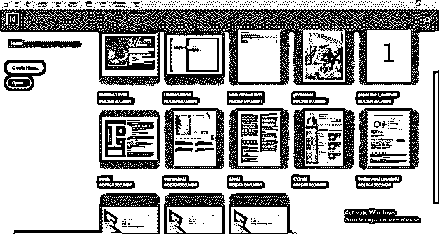

一旦我们点击它，一个新的文档对话框将会打开，它将首先转到打印选项卡，然后从它的预置中取出信纸大小的文档页面。我将保留该文档页面的其他设置。

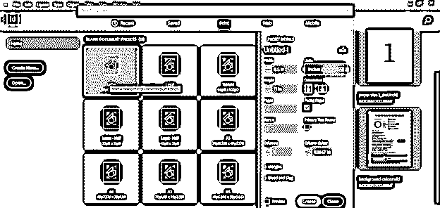

现在我将从工具面板中选择文字工具，画一个这样的文本框。

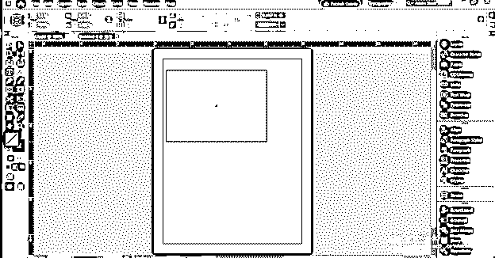

我将把这些文本内容放在这里，就像这样。

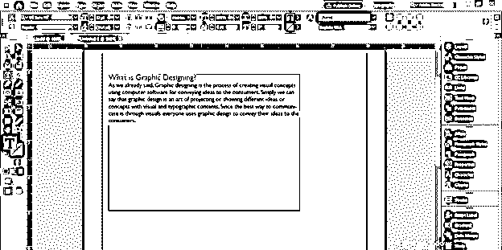

现在，我想在这个文本内容旁边放一个图像，为此，我们必须转到工作屏幕顶部菜单栏的文件菜单。一旦我们点击它，一个下拉列表将被打开。在这里，在下拉列表中，我将选择放置选项，或者您可以按 Ctrl + D 作为其快捷命令。

单击此选项后，将会打开一个位置对话框，我将转到保存我的图像的位置。选择我的图像后，我将单击“打开”按钮。

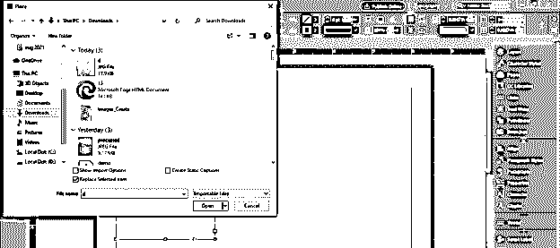

现在，我将把这张图片放在这个文本内容框架的旁边，就像这样。

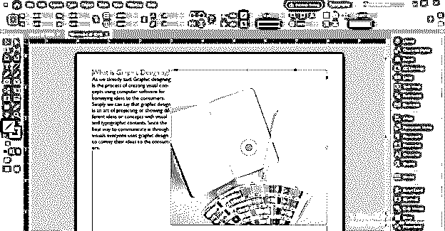

如果你放置的图像质量模糊或像素化，那么你可以右击它。一旦你点击右键，一个滚动列表将被打开。转到“显示性能”选项，然后单击该选项的新下拉列表中的“高质量显示”选项。

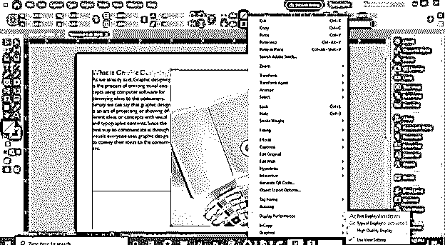

现在让我告诉你如果你从段落格式面板选项中对齐文本会发生什么。您可以在工作屏幕的顶部找到这个段落格式面板。

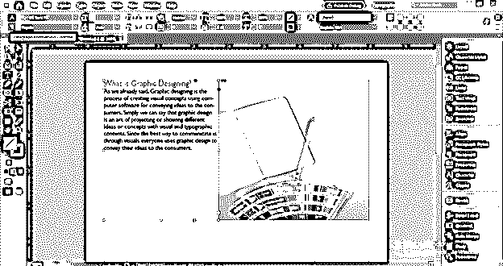

如果没有这样的面板，那么你可以进入菜单栏的窗口菜单并点击它。在它的向下滚动列表中，你可以找到控制面板，或者你可以按 Ctrl + Alt + 6 键作为它的快捷命令。

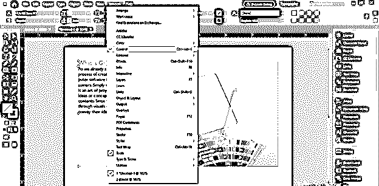

在这个面板中，我们有“居中对齐”选项。所以选择文本，进入段落格式控制面板，点击这个选项。

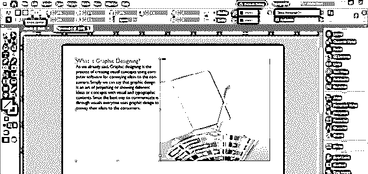

然后它会像这样对齐，但它在相同的位置对齐文本，这意味着它对齐框架的中心，但文本内容的垂直位置是相同的，即文本框架的顶部。

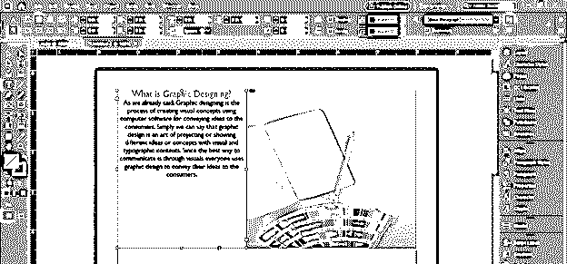

现在让我告诉你如何将这个文本垂直对齐到这个文本框架的中心。为此，选择文本并转到菜单栏的对象菜单，然后点击它。在这个菜单的向下滚动列表中，我们有“文本框选项”,所以点击它或者你可以按 Ctrl + B 作为它的快捷命令。

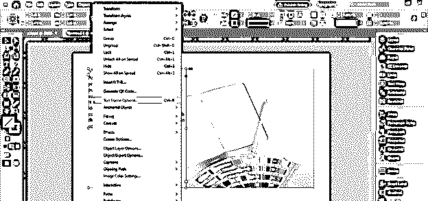

一旦我们点击这个选项，一个文本框选项的对话框就会像这样打开。

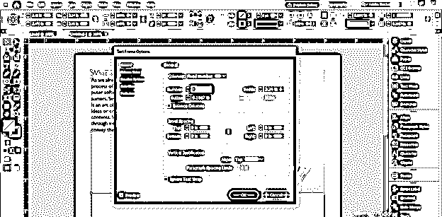

您也可以从该软件的属性面板访问该面板。因此，我将单击工作屏幕右侧的属性面板。

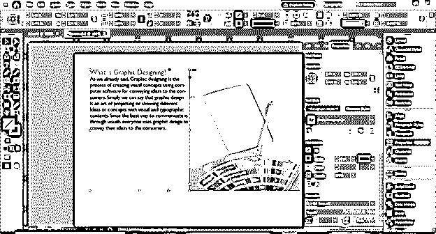

如果您的工作屏幕中没有这样的面板，那么您可以转到菜单栏的窗口菜单，并单击该菜单的向下滚动列表的属性选项。

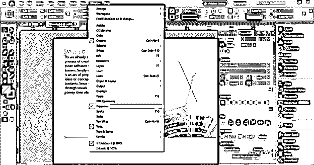

在这个面板的底部，我们有文本框选项，所以你也可以点击它来打开这个选项的对话框。

在这个面板中，我们有许多不同的参数。在此对话框的底部，我们有垂直对齐部分。在这一部分，我们有对齐选项，因此单击该选项的下拉按钮，一旦我们单击它，将会打开一个下拉列表。在这个列表中，我们有四个选项:顶部、居中、底部和两端对齐。所有四个选项都用于将文本内容与文本所在的文本框架对齐。

目前，文本与框架顶部对齐，因为我们在此对话框的对齐选项中选择了顶部选项。

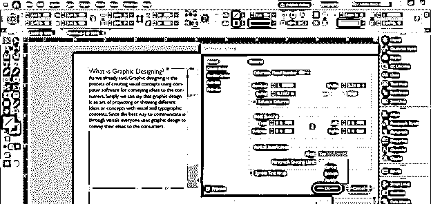

现在，如果我们选择居中选项，那么文本内容将与文本框架的中心垂直对齐。请确保在此面板中启用了预览按钮，以便查看实时更改。

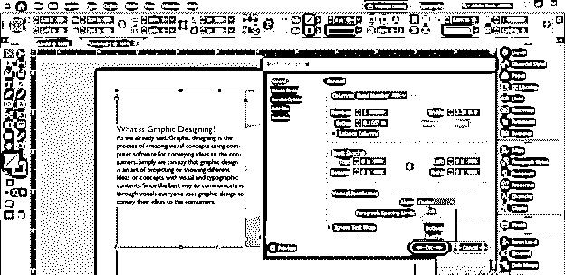

将文本对齐到框架的中心后，我们可以调整其他参数，以便对文本框架中的文本进行良好的调整。例如，我将更改“插入间距”的值，以便文本与文本框边缘之间有一定的距离。

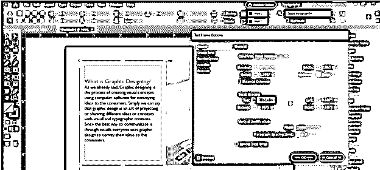

这样，我们可以调整我们的文本，以有效地表达它。

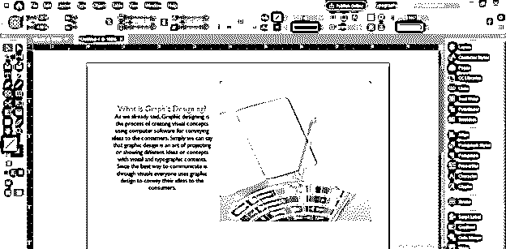

### 结论

我告诉过你如何将文本垂直对齐到文本框架的中心，从同一个“文本框架选项”中，你可以将文本从底部、顶部对齐，或者与文本框架对齐。因此，您可以使用这种对齐方式在文本内容中实现不同的变化。

### 推荐文章

这是 InDesign 垂直居中文本的指南。在这里，我们将逐步详细讨论如何在 InDesign 中将文本垂直居中。您也可以看看以下文章，了解更多信息–

1.  [Indesign 版本](https://www.educba.com/indesign-version/)
2.  [什么是 Adobe InDesign](https://www.educba.com/what-is-adobe-indesign/)
3.  [InDesign 网格](https://www.educba.com/indesign-grid/)
4.  [Indesign 的替代方案](https://www.educba.com/alternative-to-indesign/)

