# ADOBE FLASH CS6

> 原文：<https://www.educba.com/adobe-flash-cs6/>

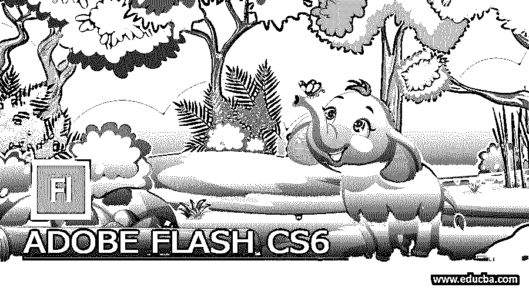

## ADOBE FLASH CS6 简介

Adobe Flash CS6 是图形和多媒体软件，用于创建 2D 动画、移动和 web 视频游戏、GIF 文件和动态图形动画。该计划可以创建多媒体内容使用光栅和矢量图像。Adobe Flash Professional CS6 现在通常也称为 Adobe Animate，它也用于以 HTML5 语言发布文件。Adobe Flash CS6 是一个可以用于多种用途的专业程序，主要由软件开发人员、网站设计人员和 2D 动画师使用。

### Adobe Flash Cs6 专业版概述

要了解 Adobe Flash CS6 Professional 的概述，用户必须理解该程序用户界面的基础。在下图中，我们看到了程序的工作空间和界面。

<small>3D 动画、建模、仿真、游戏开发&其他</small>

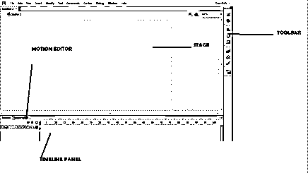

在工作区中，我们有不同的面板，分别用于时间轴、工具、属性面板、运动编辑器和库。用户可以根据自己的要求改变工作空间，如下所示。

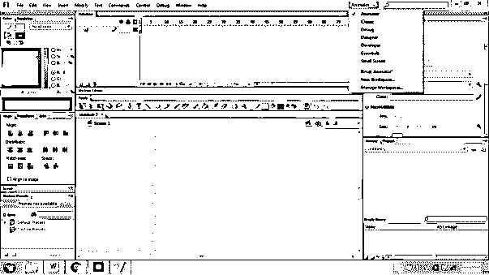

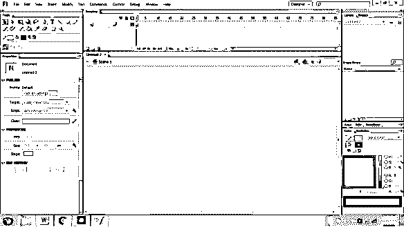

在“工具”面板中，我们有选择、平滑、自由变换、渐变变换、3D 过渡工具、文本工具、钢笔工具和画笔工具。要创建正确的动画序列，最重要的面板是时间轴面板。这里，我们在层、帧、组件和播放头按钮的帮助下创建动画序列。

在这个程序的帮助下，用户可以创建角色以及运动图形动画。与其他动画程序相比，Adobe Flash CS6 具有一些显著的优势；比如说-

*   该计划有一个内置的设备模拟，帮助许多移动和网络开发人员根据特定的媒体编译和创建内容。
*   软件开发者经常更新软件。
*   新的和更新版本的 CS6 闪存有一个自动保存选项，有助于在软件意外崩溃和崩溃的情况下自动保存数据和文件。

### 其他功能

Adobe Flash CS6 Professional 的一些非常重要和显著的属性如下-

1.  大多数 2D 游戏都是在 Adobe Flash 上创建的。在早期版本的 Adobe Flash 中，用户手动创建了几个精灵，以便在 Flash 上创建合适的动画游戏。但是，随着 Adobe Flash CS6 Professional 的推出，用户只需单击一下就可以生成 Sprite 工作表。符号和序列可以很容易地使用精灵表导出，以增强在软件上创建游戏的整体体验和工作流程。
2.  借助 AIR 与 Flash CS6 的集成，使用此版本程序的用户可以在任何设备上轻松访问他们的文件。比如说；用户可以使用 Adobe AIR 程序在移动设备或平板电脑上使用和查看 flash 文件，并且可以随时访问。
3.  用户还可以将 flash 文件中的数据导出到 HTML 和 JavaScript，这将有助于用户创建独立的内容，而不管程序的来源
4.  用户还可以创建他们自己的首选语言代码和扩展，这些代码和扩展不受 Adobe AIR 的帮助，以缩小 flash 文件和其他程序之间的差距
5.  带有 Adobe Flash CS6 的 Adobe AIR intervention 帮助用户解决了许多有关 AIR Debug Launcher 的调试问题。这有助于在任何设备上查看数据和文件，甚至无需安装 AIR 程序。

### 如何在 Adobe Flash Cs6 中制作动画？

要在 Adobe Flash CS6 上创建简单的动画序列，我们需要学习动画的基础知识，如时间轴工具、工具面板、创建帧和元件以及使用图层面板。有五种动画制作方法可用于制作任何图像或艺术品的动画。

*   逐帧动画
*   经典补间动画
*   形状补间
*   逆运动学过程
*   补间动画

用户必须了解每个动画过程的方法，并使用后续程序来创建动画序列。

在下面的例子中，我们将学习创建和应用经典补间和运动补间的简单方法。

1.  启动 Adobe Flash 程序

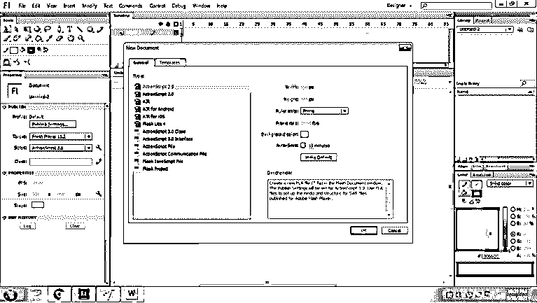

2.  创建一个新文档，如下所示

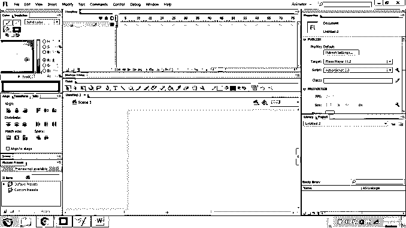

3.  在时间轴中，面板创建一个新层，如下所示

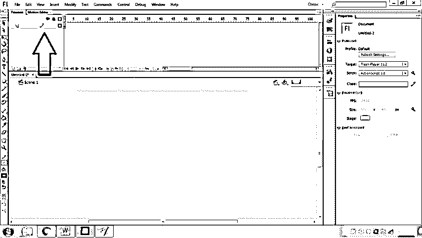

4.  现在，将这层命名为月亮

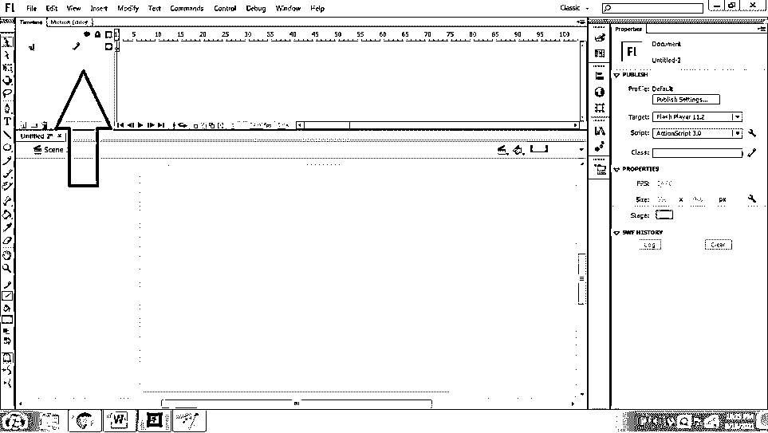

5.  创建一个月亮的符号和工具的帮助下，如下所示在这一层

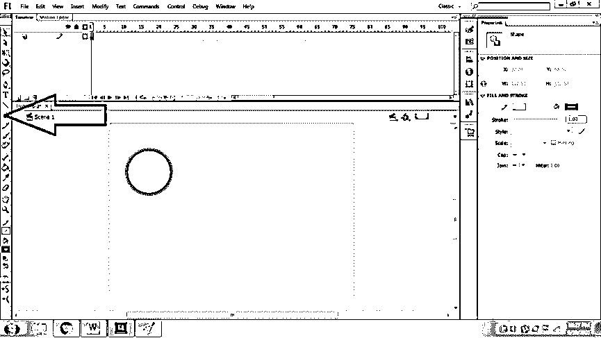

6.  在该层的时间轴上创建一个关键帧。

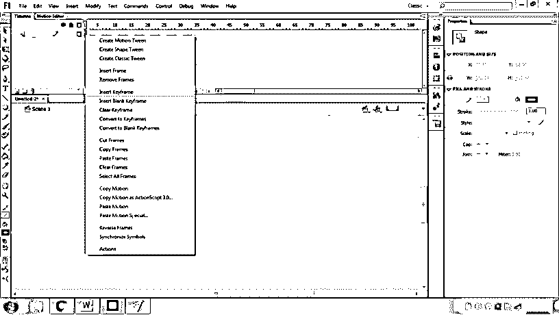

7.  接下来，几秒钟后移动月亮，再次创建一个关键帧。

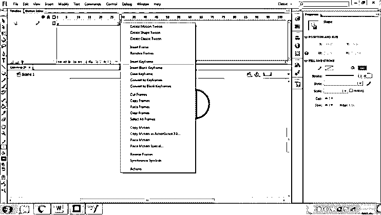

8.  如下图所示，改变最后一帧中月亮的位置

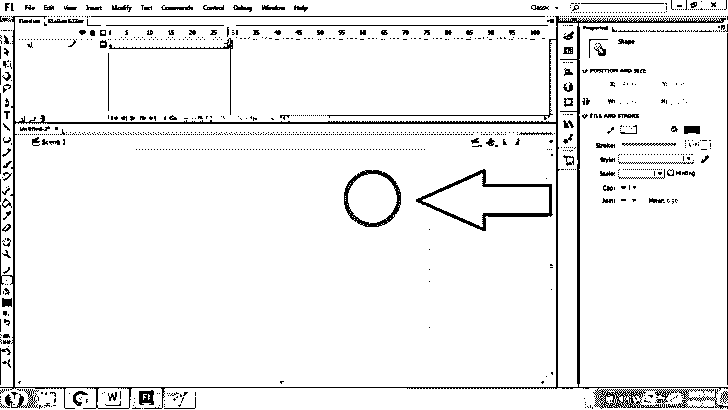

9.  现在右击时间轴，选择经典补间选项，如下所示

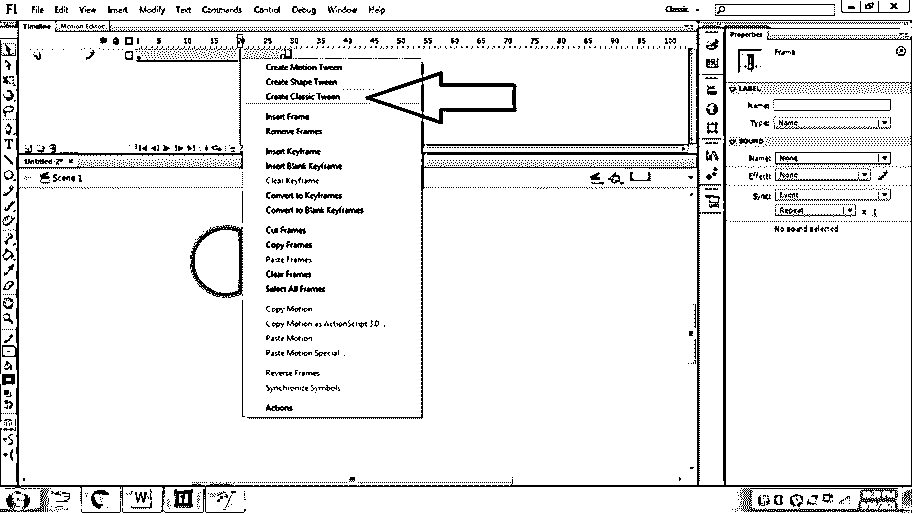

10.  这将创建一个月球的动画。

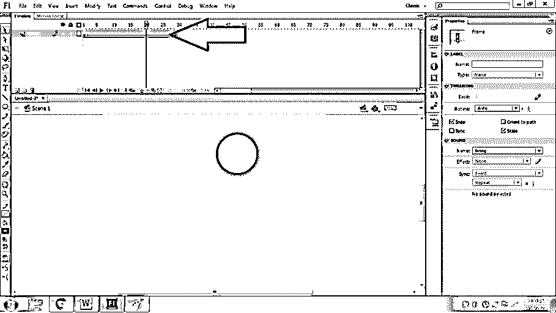

11.  同样，我们可以使用形状和补间动画创建简单的动画。

逐帧动画用于角色动画序列。在这种方法中，我们一个接一个地创建和编辑每一帧，同时在序列中向前移动角色。我们使用洋葱皮技术来创建前面的每一帧。

此功能有助于查看作为源点的最后一个设计框架的草图。这种类型的动画是复杂的，但非常准确和精确。此外，用户应该了解 FPS(每秒帧数)这一术语。这个术语是一秒钟内播放帧数的度量或速率。任何文档中的默认 FPS 都是 24fps。

### 结论

在上面的文章中，我们详细研究了 Adobe Flash CS6 professionals 的核心功能。我们还学习了创建一个合适的动画序列的基本原理和基础。这篇文章将帮助很多 2D 动画和多媒体领域的初学者。对节目有一个很好的理解对于创作一个常规的合适的动画剪辑是非常重要的。

### 推荐文章

这是 ADOBE FLASH CS6 的指南。在这里，我们讨论了 2D 动画和多媒体领域的许多初学者和新生的帮助。您也可以看看以下文章，了解更多信息–

1.  [Adobe Flash 版本](https://www.educba.com/adobe-flash-versions/)
2.  [土坯的种类](https://www.educba.com/types-of-adobe/)
3.  [Adobe 特快专递](https://www.educba.com/adobe-speedgrade/)
4.  [Adobe Flash 设置](https://www.educba.com/adobe-flash-settings/)

