# XMP 灯塔

> 原文：<https://www.educba.com/lightroom-xmp/>

## XMP Lightroom 简介

Lightroom XMP 可以理解为一个文本文件，其中包含元数据或我们对原始照片文件所做的任何更改，以便对它们进行不同的操作。Lightroom 本身将数据存储在目录中，但它仅对 Lightroom 可读，并且只作为一个整体存在于我们的目录中，但 XMP 文件为我们提供了最好的功能，可以将我们编辑的图像更改保存在一个单独的文件中，以便于检索和使用它们。所以今天，我将告诉你 XMP 的所有重要方面，并告诉你如何保存它们，以便你也可以使用其他编辑软件的 Lightroom 文件。

### 如何保存 XMP 文件？

在您进行以下设置之前，Lightroom 不会自动保存 xmp 文件。这只是两步 0 设置，让我告诉你这一点。首先，转到菜单栏的编辑菜单，您可以在用户屏幕的顶部找到它，并从它的下拉列表中选择目录设置选项，或者您可以按 Ctrl + Alt +来快速访问该选项。

<small>3D 动画、建模、仿真、游戏开发&其他</small>

将打开一个目录设置对话框。这里转到元数据选项卡。在此选项卡中，您会看到“自动将更改写入 XMP”选项被禁用，这意味着 Lightroom 不会自动保存。xmp 文件，您将看不到其他应用程序中的更改。

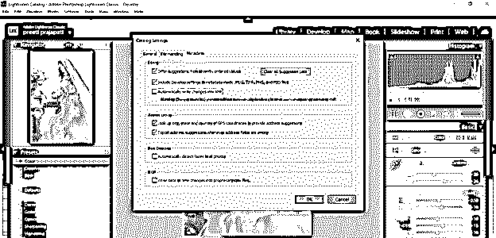

因此，通过勾选复选框，然后点击对话框中的“确定”按钮来启用此选项。这样，我们可以节省。xmp 文件。

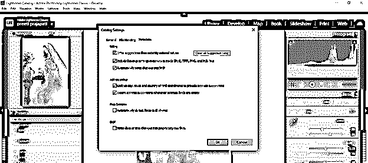

现在让我们来看看 xmp 预设，这样你就可以知道它是如何处理我们的照片的。

### Lightroom xmp 预设

当在这个软件中处理图像和组织过程时，我们总是使用预置来使我们的工作变得容易。只需几个步骤，我们就能得到想要的结果。在这个软件中，我们几乎有 XMP 格式的每个预置，这意味着预置文件有用于创建预置的参数设置的所有元数据细节。

让我们使用此图像，并将其更改为开发模式，在此用户屏幕的左侧，您会发现预设选项卡。您可以看到有许多预设文件夹。

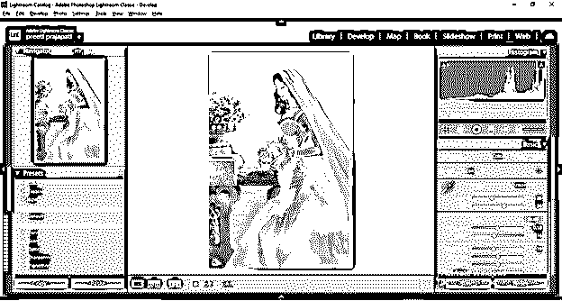

我可以打开任何一个文件夹，使用任何预设来改变这个图像的不同参数。

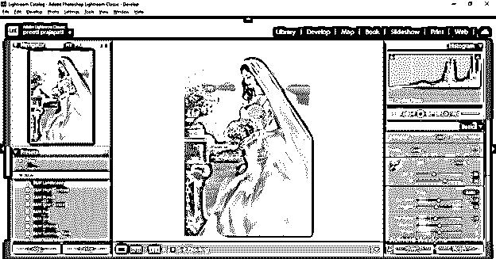

所有这些预设都是 XMP 文件格式。让我给你看这个。前往电脑系统中 Lightroom classic 的预设文件夹。

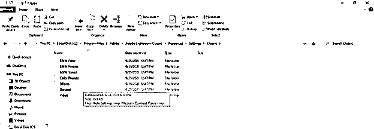

当您打开其中一个文件夹时，可以看到文件扩展名是. xmp。该软件预装了所有这些 xmp 预设，因此我们可以将它们理解为内部 xmp 预设。

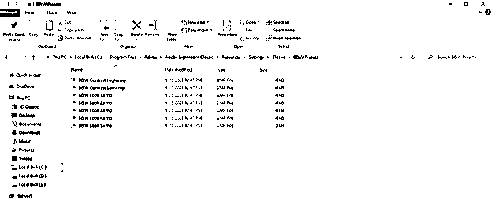

假设您在 Lightroom 文件夹中导入了任何 xam 预设文件。在这种情况下，您可以在 lightroom 的 CamerRaw 文件夹的 Imported Settings 文件夹中找到导入的 xmp 预设，这是一个外部 xmp 文件。

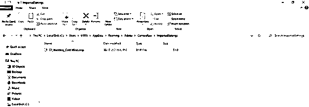

安装的 xmp 预设或创建的 xmp 预设，也称为外部 xmp 预设。这两个预设是我创建的，我保存在 Lightroom 软件的用户预设文件夹中。但是，当然，你也可以这样做。

现在，我们将讨论如何在 lightroom 中导入 xmp 预设，以便在我们的图像处理过程中使用它们。

### 在 Lightroom 中导入 XMP 预设

在 Lightroom 中导入 xmp 预设并不是什么大不了的事情；我们只需要遵循这些步骤。首先，选择要使用导入的 xmp 预设的图像，并切换到“开发”模式。

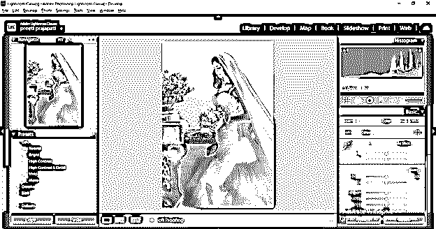

在 lightroom 软件的左侧部分，您可以找到“预设”选项卡，在该选项卡中，我们在右侧有一个加号图标，因此单击它。一旦你点击它，你会在弹出列表中有导入预置选项，所以点击它。

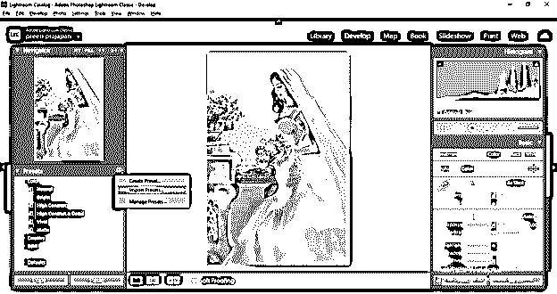

一旦我们点击它，一个对话框将打开选择我们的 xmp 文件的预置，所以去保存 xmp 预置的位置并选择它。您可以从外部来源下载这些预设。我这里只有一张，是从网上下载的。

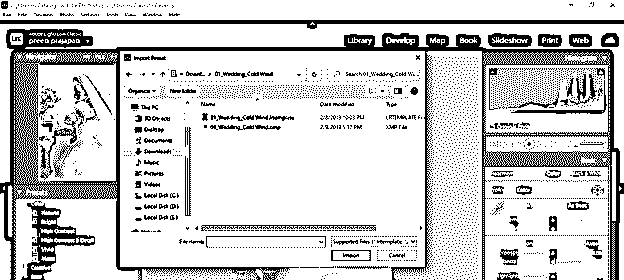

您可以在这个列表中看到支持的文件格式，xmp 就是其中之一。

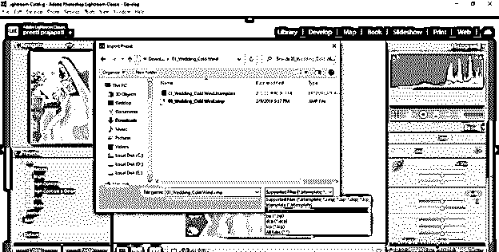

我将选择这一个；您可以一次选择多个预设文件，然后单击此对话框的导入按钮。

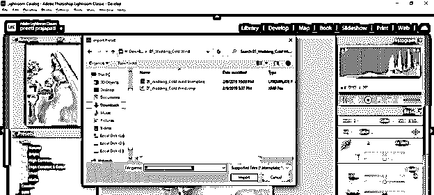

它将进入预设选项卡部分。您可以通过向下滚动预设列表来找到它。它通常位于“用户预置”文件夹中。

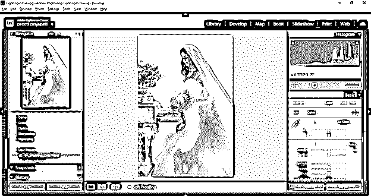

### 如何安装新的？Lightroom 中的 xmp 预设？

接下来你想知道的是如何安装新的。Lightroom 中的 xmp 预设。为此，请转到菜单栏的编辑菜单，从下拉列表中选择首选项选项，或者您可以按 Ctrl +按钮作为快捷键。

一旦你点击它，你会看到这个对话框。在这里单击“预设”选项卡，在该选项卡中，我们有“显示 Lightroom 开发预设”选项。点击此处进行安装。xmp 预设。

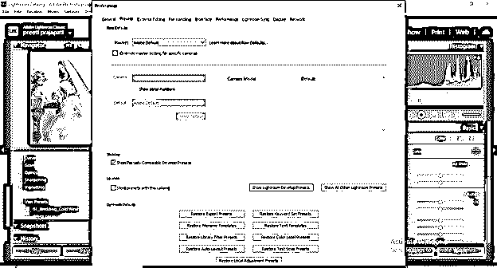

一旦你点击这个选项，它会直接带你到 Lightroom 的设置文件夹。所以打开这个文件夹。

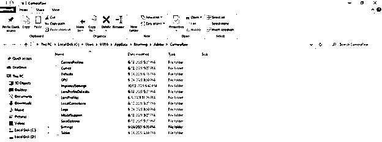

在这里，你可以通过复制文件下载 xmp 预置文件。您可以为新预置创建一个新文件夹，或者通过打开它将它们粘贴到“用户预置”文件夹中。完成此过程后，您必须重新启动 Lightroom，才能在 Lightroom 的“预设”选项卡中安装预设。

s

### 结论

这些是 xmp 文件及其预设的一些重要方面，我们在 Lightroom 中使用它们对我们的照片进行一些操作。现在，您可以为您的照片尝试不同的 xmp 预设，以便您可以进行不同的实验并从中获得最佳输出，为此，您可以创建自己的 xmp 预设或使用外部安装的预设。

### 推荐文章

这是 XMP 灯塔指南。这里我们讨论如何安装新的。Lightroom 中的 xmp 预设以及导入的 XMP。您也可以看看以下文章，了解更多信息–

1.  [灯箱的替代方案](https://www.educba.com/alternative-for-lightroom/)
2.  [什么是 Adobe Lightroom？](https://www.educba.com/what-is-adobe-lightroom/)
3.  [免费 Adobe Lightroom】](https://www.educba.com/adobe-lightroom-for-free/)
4.  [如何在 Photoshop 中高亮显示文字？](https://www.educba.com/how-to-highlight-text-in-photoshop/)

