# Lightroom 编辑

> 原文：<https://www.educba.com/lightroom-editing/>

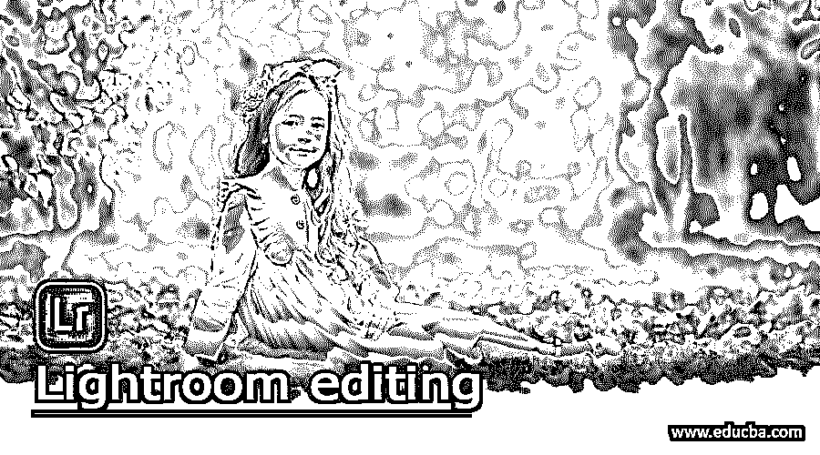

## Lightroom 编辑简介

Lightroom 编辑可以理解为一个过程，通过这个过程，我们可以在这个软件中操纵我们的原始照片，最棒的是，它是一个非破坏性的过程。在 lightroom 的整个编辑过程中，我们可以进行许多调整，如颜色控制、增强细节和许多其他参数设置。编辑包括改变图像或照片的整个区域的参数，但它可以通过使用该软件的一些好功能来处理我们照片的特定部分。因此，让我们了解编辑的不同方面，以便更好地掌握编辑过程。

### 如何使用 Lightroom 编辑？

要理解 lightroom 中的编辑，还需要了解更多的东西，但今天我将为您提供一个概述，以便您能够对它有基本的了解。

<small>3D 动画、建模、仿真、游戏开发&其他</small>

要开始编辑照片，只需点击 lightroom 用户界面左下角的导入按钮。

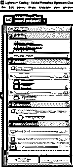

现在你进入你电脑中保存照片的文件夹，选择所有照片，或者选择其中任何一张，点击右下角的导入按钮。

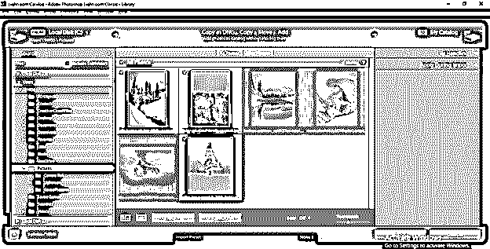

要开始编辑，你必须点击开发标签模式，这是在顶部栏。

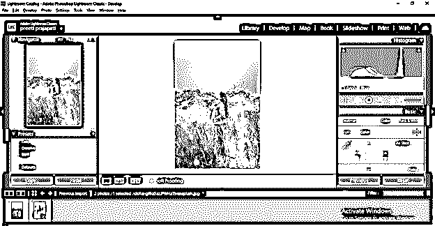

在左侧，我们有不同的参数，我们可以改变我们的照片有不同的参数变化。

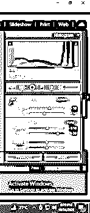

在顶部，我们有一个直方图，显示照片的不同部分，如黑色，阴影，曝光，白色等。当我们更改参数时，您可以在直方图中看到值的变化。

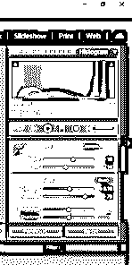

一些工具帮助我们以更精确的方式进行编辑。当你开始使用这个软件时，你会慢慢了解它们的。

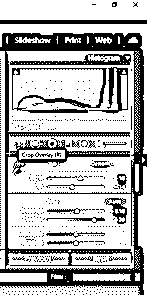

在左侧部分，我们有预置栏，在它下面你可以找到许多预置，你可以在你的照片中选择不同的设置。

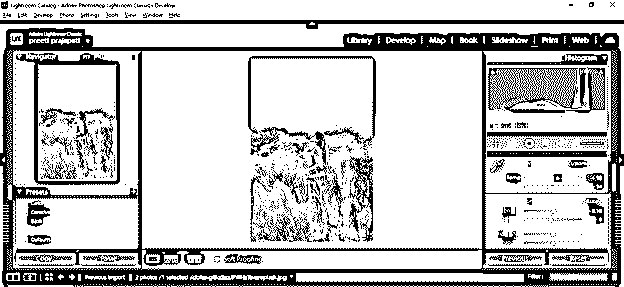

例如，如果您转到颜色预设组的亮度预设，您可以在这些照片上自动看到它应用的亮度调整值。

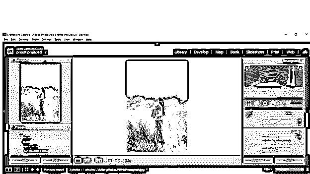

您可以拍摄任何设定参数的快照，以便以后在处理其他参数时查看。为此，您必须单击快照栏的“创建快照”按钮。

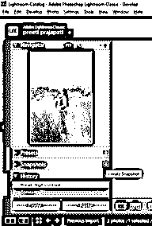

在编辑过程中，如果你想切换到以前的设置，你可以去历史栏，在这里你可以看到所有改变的参数，并再次前往。

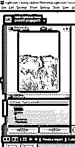

### Lightroom 编辑提示和技巧

在这里，我想告诉你一些在编辑照片的过程中对你有很大帮助的技巧和诀窍。

*   **局部调整**

我想告诉你的第一件事是，当我们对照片的任何参数进行更改时，它会应用到照片的整个区域，但我会建议你，而不是应用到整个区域，将该区域局部化，然后更改参数以获得不同的变化。所以让我们举个例子来理解一下。

这是一个图像。

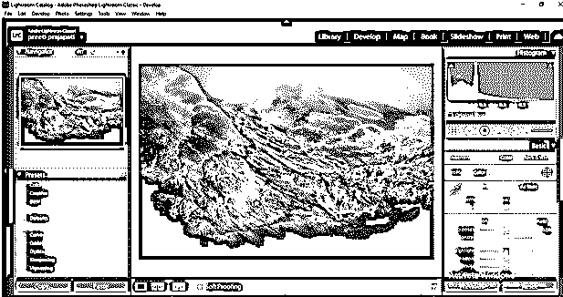

你可以看到我做的改变。相反，它影响整个图像。

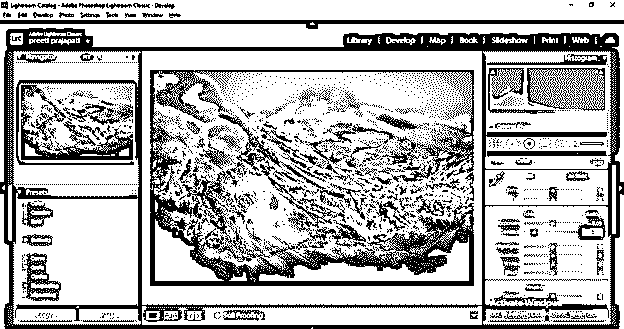

我不想这样做，所以我将采取径向过滤器工具，并选择区域，我想作出改变。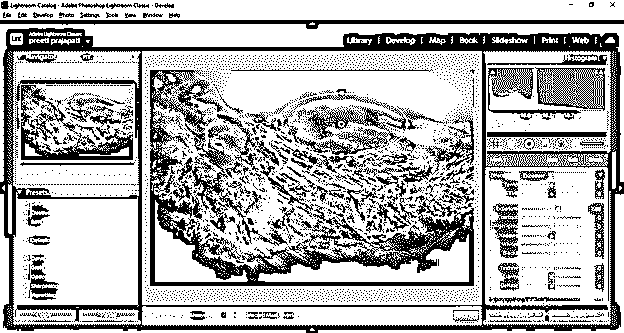

我将反转选区，以便在标记区域内工作。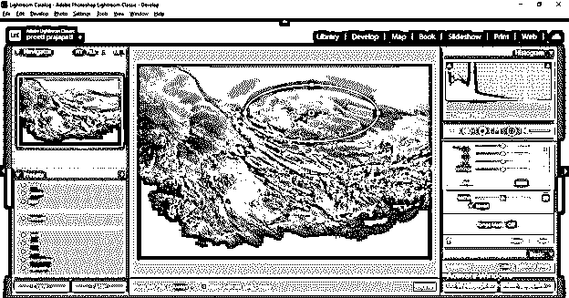

现在我做了一些改变，在这个山区这里有一点曝光，你可以看到图像的其他区域没有受到影响。

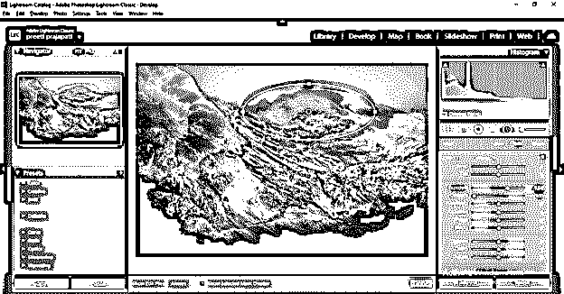

*   **处理细节:**

在一些照片中，我们需要增强细节，为此，我们使用透明度参数。

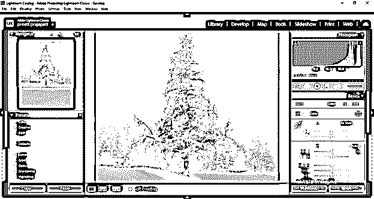

你可以看到，如果我增加它的清晰度，那么它看起来就不那么自然了。

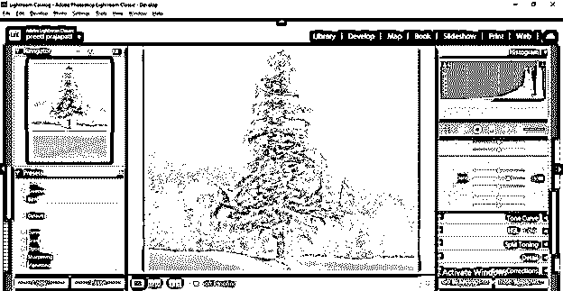

而减少会让它模糊一点点。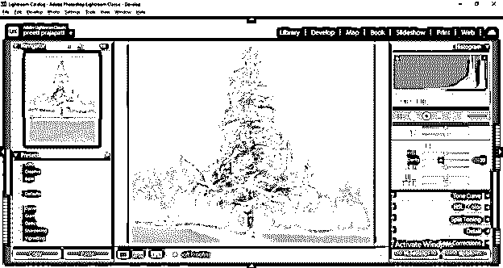

所以不只是玩清晰度值；您应该调整其他值。例如，我将透明度值降低到-7。

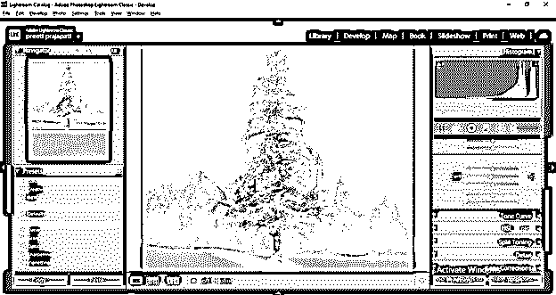

然后稍微调整一下去雾值。

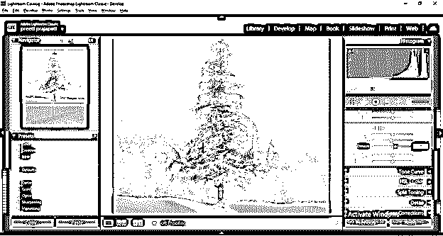

之后，我还将调整这张图片的黑色值，现在你可以看到我们已经很好地描绘了这棵树的叶子和雪。

### 编辑单个元素

正如我们所讨论的，我们可以有一个想法，lightroom 是一个非常强大的照片编辑软件，编辑我们照片的任何单个元素是它的有效功能之一。所以让我告诉你怎么做。我会为此拍摄这张原始照片。

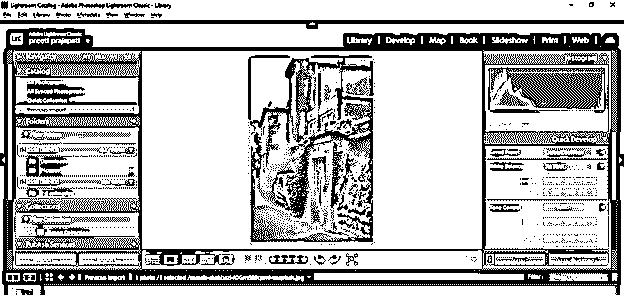

切换到开发模式，这里我们有调整刷。所以点击它。

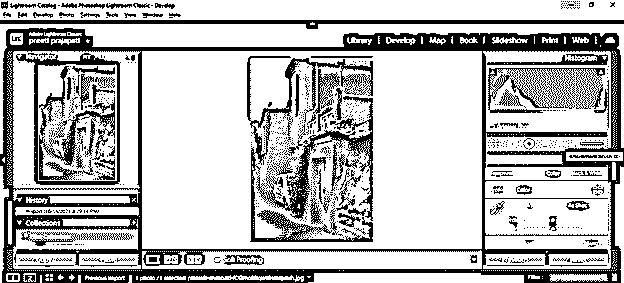

你会得到它的所有参数。

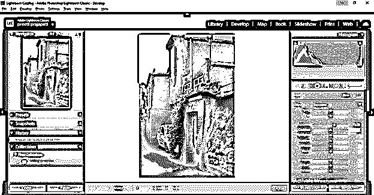

为了使用这个笔刷，我们必须调整它的大小，羽化(它可以理解你想要在选择的区域应用效果的平滑程度)，接下来是流动(你可以理解为笔刷的强度)。

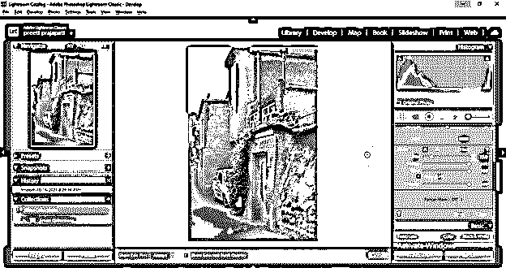

让“笔刷设置”调整要应用到图像所选区域的参数值后。我将曝光值调整为 1.06。

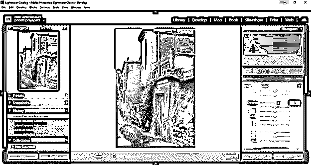

并开始应用在这个前墙区域，你可以看到它只突出这个墙区域。

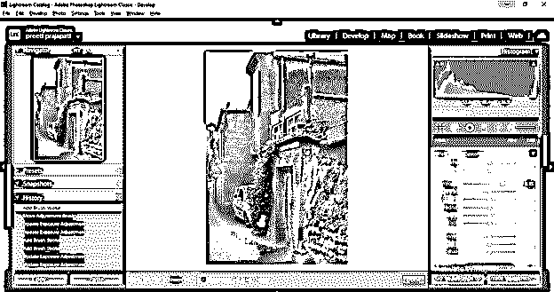

如果你想调整其他参数，你需要一个新的笔刷，点击新建按钮，你可以用这个笔刷为新区域设置其他参数。

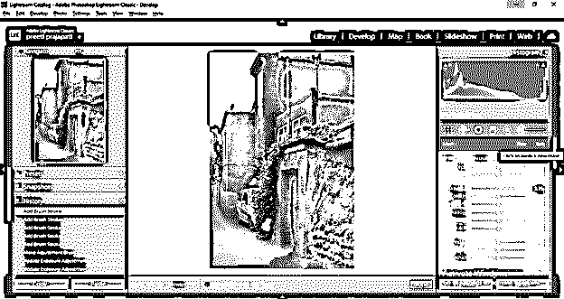

你可以看到我在不同的参数上做了一些改变，并在屋顶墙上创造了一个阳光效果。同样，您可以将图像中的单个元素作为目标并操纵它们。

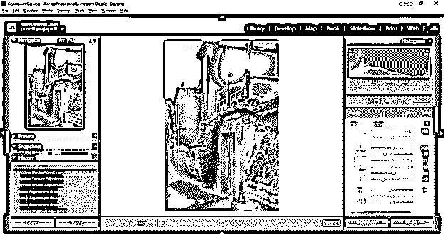

这些是 Lightroom 编辑的一些重要方面。

### 结论

现在，您已经了解了如何在 lightroom 中编辑照片。我相信你已经发现它非常有趣，并且你将在你的原始照片中有一个不同类型的改进的编辑过程中工作。你也可以在这个软件中组织你的照片，以便更好地处理它们。

### 推荐文章

这是 Lightroom 编辑指南。这里我们讨论编辑的不同方面，以便很好地掌握编辑过程。您也可以看看以下文章，了解更多信息–

1.  [什么是 Adobe Lightroom？](https://www.educba.com/what-is-adobe-lightroom/)
2.  [灯箱的替代方案](https://www.educba.com/alternative-for-lightroom/)
3.  [免费 Adobe Lightroom】](https://www.educba.com/adobe-lightroom-for-free/)
4.  [像素效果 Photoshop](https://www.educba.com/pixel-effect-photoshop/)

