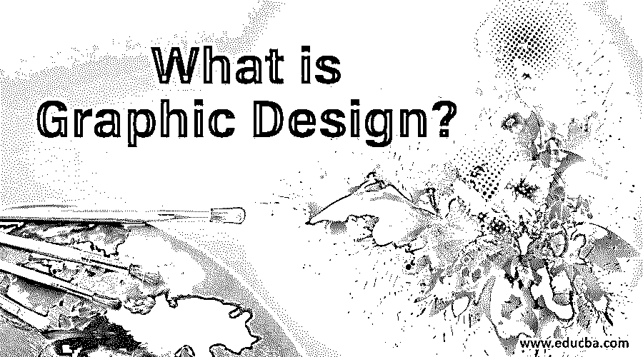

# 什么是平面设计？

> 原文：<https://www.educba.com/what-is-graphic-design/>

## 平面设计导论

以下文章提供了什么是平面设计的大纲？图形设计是一门艺术，旨在开发吸引观众的图片或图像。这是一种与第二个人交流我们艺术技巧的技巧。它现在被用于工程的每一个领域。这是一种利用插图和图像解决问题的方法。这是一种视觉互动，它融合了图像、文字和想法，向观众传达信息，创造出一种特殊的效果。

### 平面设计史

*   图形设计这个术语是由 Williamson Addison Dwiggins 在 1992 年首次提出的。但实际上，图形设计在人类诞生的时候就已经开始了。这可以从古代的纪念碑和艺术品建筑中得到说明。埃及人使用象形文字，其中他们使用图片符号进行交流。
*   当本杰明·富兰克林用他的报纸《宾夕法尼亚公报》在大众中推销他的书时，美国的图形设计被发现了。美国人最初不喜欢本杰明推广的广告方法，因为印刷不当，字母被打乱了。后来富兰克林以更好的方式组织了它。他是第一个在他的插图中使用“标志”的人。他还告诉人们在组织广告时需要注意的细节。
*   在唐代，人们将木刻印刷在纺织品上，以制作佛教文本。在 19 世纪的欧洲，第一份印刷设计正式发行。这标志着平面设计从美术中分离出来的时代。亨利·克勒是第一个通过他的杂志《设计和制造商》告诉英国政府设计重要性的人。1922 年，图形设计首次出现在 1922 年的一篇文章《新型印刷呼唤新设计》中。

### 我们为什么要用平面设计？

图形设计是销售产品的重要工具。它应用于产品、包装，以增加其外观和感觉，并增加其未来的需求。在任何介绍其需求的市场。在任何演示中，图形都扮演着重要的角色，让观众更容易理解。报纸、杂志、小说都用图形来说明它们的内容。随着互联网的发展，拥有图形工具经验的设计师使信息更具吸引力。

<small>3D 动画、建模、仿真、游戏开发&其他</small>

图形设计师的主要任务是借助想象技巧提供一些时尚的内容。无论是传统形式还是数字形式，主题都会变得更有吸引力。设计师在他的作品中添加了一些美丽的图像，使其看起来更有趣。

### 平面设计的目的

图形设计主要用于以下应用:

*   **排版:**在这个设计中，字符被修改以增加其外观和感觉。增加字符之间的空间提供了尖锐点；改变行与行之间的间距可以让任何内容看起来更有创意。通过修改字符创建了多种字体，图形设计师使用这些字体来设计他们的艺术。
*   **页面布局:**页面布局是指页面中所有需要的元素的布局，比如图像、文本、样式等的布局。图形设计师改变页面中所有元素的位置和样式，并设计他们的作品。
*   **印刷制作**:这是将艺术品印刷在纸上，并改变其颜色和纹理，使之与众不同、美观的过程。设计师应该运用他或她的分析和逻辑思维，通过修改颜色和纹理来设计任何印刷品。
*   策略:图形设计师在开始任何设计任务之前，都应该制定一个合适的策略。这样会让他的问题看起来更简单。任何平面设计师的工作都是最困难的工作之一，因为他必须以最符合逻辑的方式设计工作，同时使其看起来具有美感。
*   **策划**:他的工作是了解他的客户和将会看到他设计作品的人。因此，在开始任何设计之前规划他的工作变得非常重要。
*   创意设计:有很多工具可以用来创造任何设计。在传统方式中，人们使用他们的钢笔、颜料、剪刀等。，来框定他们的作品。但是现在市场上有各种各样的软件来创造他们的设计。这个软件彻底改变了创作任何艺术品的传统方式。如今，起草任何设计都变得非常容易。它允许人们快速探索更多的想法并创造他们的技能。
*   数字方式:创意设计师使用传统和数字方式来设计他们的作品。他们通过使用钢笔和铅笔来展示他们的潜力，开始他们的工作，当他们准备好手工作品时，他们在市场上可用的各种软件的帮助下将其编译成数字形式。
*   **各种工具**:市场上有各种软件可以创建任何可行的设计。Adobe 提供了像 Adobe Illustrator、Adobe Photoshop 等精彩的工具。，来设计任何艺术品。这个软件以矢量和光栅两种方式构建任何设计。在矢量形式中，我们可以在不影响图像质量的情况下放大图像。但是在光栅形式中，当我们放大图像时，图像质量会下降。

### 图形设计的优势

下面是提到的优点:

*   随着图形的出现，人们可以更多地说明他们的产品，增加他们的市场份额。
*   设计师可以通过使用该软件创建其产品的精彩渲染图像。所有的电影都是用这个软件来装帧和设计的。他们完全改变了人们必须表演电影每个片段的传统方式。
*   使用该软件制作的视频看起来很逼真。很难区分实际设计和数字设计之间的差异。设计师提供适当的纹理、颜色和光线，使任何图像看起来真实。

### 结论

在开始任何设计项目之前，设计师应该考虑他的目标受众。客户将从他的设计工作中得到什么。他还需要清楚地了解客户的确切要求。目标人群将如何与他的设计作品互动。在更好的内容和图形的帮助下提供足够的信息有助于很容易地获得任何合同。设计师也应该从他的观众那里得到适当的反馈来提高他的设计技巧。

### 推荐文章

这是一个什么是平面设计的指南？在这里，我们讨论了平面设计的历史，目的和优势的介绍。您也可以浏览我们的其他相关文章，了解更多信息——

1.  [什么是电脑平面设计？](https://www.educba.com/what-is-computer-graphic-design/)
2.  [计算机图形学的应用](https://www.educba.com/application-of-computer-graphics/)
3.  [最佳平面设计软件](https://www.educba.com/best-graphic-design-software/)
4.  [Illustrator 中的图形样式](https://www.educba.com/graphic-styles-in-illustrator/)

