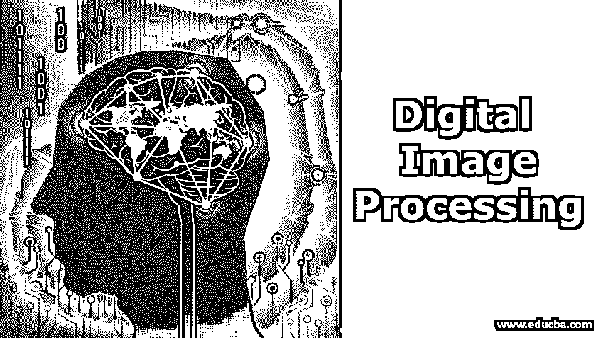
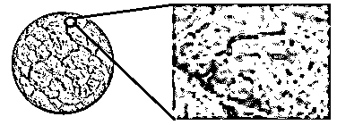
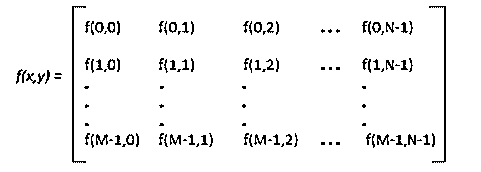
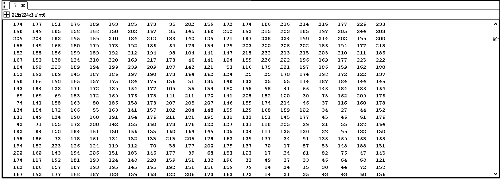
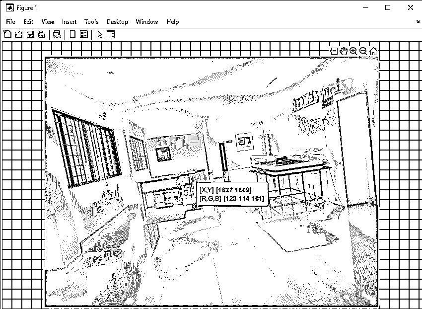

# 数字图象处理

> 原文：<https://www.educba.com/digital-image-processing/>

## 数字图像处理导论

数字图像处理是对数字图像执行图像处理算法的过程。数字图像处理包含对图像的处理，例如读取、分析和操纵图像，以及执行任何种类的操作，例如改善图像的信息表示，处理图像数据以进行存储、传输和表示。数字图像处理用于处理分类、特征提取、[模式识别](https://www.educba.com/pattern-recognition/)等项目。数字图像处理中使用的技术有图像编辑、图像恢复、线性滤波、像素化、点特征匹配、主成分分析、独立成分分析等。

### 什么是图像？

图像被表示为二维函数 F(a，b ),其中 a 和 b 是空间或平面坐标。‘F’在(a，b)任一点的范围称为该点图像的强度。如果 a，b 和 f 的值是有限的，则称该图像为数字图像。数字图像由具有特定位置和值的像素组成。像素值的范围从 0 到 255。

<small>3D 动画、建模、仿真、游戏开发&其他</small>

**举例:**

下图显示了一个点的图像和相应的像素

图像及其像素

### 解释图像处理

图像处理被定义为增强使用各种视觉传感器捕获的原始图像的技术，用于各种应用，例如医学成像、电影工业、智能交通等。要应用图像处理技术，第一步是将图片数字化为图像文件。此外，必须应用这些方法来重新排列图像部分，增强颜色分离，并提高质量。

**示例:**医学应用使用图像处理技术进行图像增强、断层扫描和模拟操作。断层摄影是一种用于 X 射线摄影的方法。

### 图像类型

*   仅包含 1 和 0 两个像素元素的图像称为二进制图像或单色图像，其中 1 表示白色，0 表示黑色。
*   仅由黑白颜色组成的图像被称为黑白图像。
*   有一种“8 位彩色格式图像”，有 256 种不同的颜色深浅，通常称为灰度图像。其中，0 代表黑色，127 代表灰色，255 代表白色。
*   另一种是“16 位颜色格式”，其中有 65，536 种不同的颜色。在这种格式中，颜色的分布不同于灰度图像。

16 位格式进一步分为三种格式:红色、绿色和蓝色，缩写为 RGB 格式。

### 图像的表示

图像被表示为按行和列排列的正方形像素的阵列或矩阵。Matlab 是一个非常好的检索、读取和处理图像的平台。它还有一个图像处理工具箱。众所周知，图像显示为如下所示的列和行:

这个等式是数字图像的数组表示，其中每个元素称为一个像素。

**例子:**要读取一幅图像，我们必须在 MatLab 中使用以下命令

`i=imread('F:\image.jpg');`

执行此命令后，图像将以三维数组或矩阵的形式保存到变量 I 中，如下图所示。该阵列的大小为 225X224X3。它有不同的像素值，范围从 0 到 255。

图像的数组表示

使用以下命令显示图像后:

`show(i)`

我们还可以看到特定点的像素值，如下图所示。它将指向像素的位置显示为(X，Y)和 RGB 值，RGB 值是红色、绿色和蓝色的颜色细节。

像素位置和 RGB 值

在 MatLab 中，可以对图像执行各种功能，例如读取、显示、调整大小、旋转、锐化、添加噪声、去除噪声、过滤、边缘检测、角点检测、映射等等。

### 图像处理的阶段

1.  **采集:**图像采集定义为使用任何类型的视觉传感器检索或获取图像。主要工作包括缩放和颜色转换，即 RGB 到灰度或灰度到 RGB。
2.  **图像增强:**图像增强是通过锐化或增亮图像来提高图像质量。这样做是为了容易识别其特征。
3.  **图像复原:**图像复原处理从图像中去除噪声或模糊效果，以提高其可读性。
4.  **多分辨率和小波处理:**使用这些技术，图像可以用几种程度来表示。
5.  **图像压缩:**图像压缩处理图像大小或分辨率。它被应用于图像以减少存储和传输的成本。
6.  **物体检测与识别:**通过检测图像的特征来检测和识别图像并赋予其实际标签。

### 数字图像处理的应用

*   图像处理最著名和最有用的应用是深度神经网络。深度神经网络是可以使用图像数据针对各种目的进行训练和测试的网络。在这种情况下，原始图像通常是可用的。图像数据必须首先进行预处理，然后才能用于训练目的。英语字母表中第十六个字母
*   图像的重新处理包括减少噪声、去除模糊效应、使用 FFT 的强度均衡等等。必须提取图像数据的更多特征，并且可以使用这些特征来训练网络。这个网络可以被训练来分类任何种类的数据，例如交通、人脸、场景等。
*   网络的结果取决于用于训练的图像数据的类型和质量。网上有很多网络，如 AleNet、GoogleNet、VGG 等。已经在各种类型的图像上进行了训练。

### 结论

在此，仅讨论了图像处理的介绍部分。在今天的场景中，图像处理是非常庞大的。例如，有多种滤镜可以应用于图像。有许多技术可以应用于图像，用于各种目的，如对象检测和分类、场景定位、人脸识别、[模式识别](https://www.educba.com/pattern-recognition-applications/)等。

### 推荐文章

这是一本数字图像处理指南。在这里，我们讨论介绍，什么是图像，图像的类型，以及数字图像处理的应用。您也可以浏览我们的其他相关文章，了解更多信息——

1.  [机器学习库](https://www.educba.com/machine-learning-libraries/)
2.  [数字签名软件](https://www.educba.com/digital-signature-softwares/)
3.  [什么是数据处理？](https://www.educba.com/what-is-data-processing/)
4.  [MATLAB 版本](https://www.educba.com/matlab-version/)

