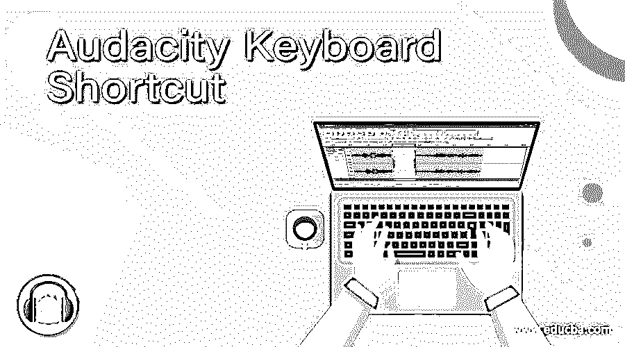

# Audacity 键盘快捷键

> 原文：<https://www.educba.com/audacity-keyboard-shortcut/>

## Audacity 键盘快捷键介绍

Audacity 键盘快捷方式使我们在该软件中的工作变得简单，使用这些快捷方式，您可以非常快速地完成任何工作，不仅是预定义的快捷方式，而且 audacity 还提供了自定义的键盘快捷方式，这意味着您可以删除在该软件中执行任何任务的任何预先分配的特定命令的快捷方式，然后将您自己的键盘键分配给该命令。您可以从键盘首选项选项中获得该软件的键盘快捷键的完整列表，并可以在该选项的对话框中根据您的需要进行更改。

今天，我们将带您了解该软件不同命令的一些重要快捷方式，我们在项目工作中经常使用这些快捷方式。我们还将告诉你一件关于这个软件的快捷键的事情，快捷键通常不被使用，不在键盘首选项的快捷键列表中，但是你可以通过启用显示额外菜单选项从界面首选项中访问它们。

<small>3D 动画、建模、仿真、游戏开发&其他</small>

还有一点我们要和大家讨论的是，Mac 用户应该用键盘的 Command 键代替 Windows 键盘的 Ctrl 键，对于 Windows 的 Alt 键，Mac 用户用 Option 键。您将有一些命令，其括号中的“未分配”一词在键盘偏好设置选项中，这意味着您可以为它们分配一个键。

**文件菜单快捷键**

按键盘上的 Ctrl + N 键(mac 用户按 Command 键)将创建一个新的清空项目窗口，用于开始我们的新工作或开始导入轨道的工作。当您按下 Ctrl + O 键时，您可以选择您想要的音频文件、Audacity 项目文件，或者从“打开”对话框中选择一系列文件，以便在该软件中打开它们。

有一个打开最近使用的文件的选项，例如 12 个最近打开的文件、保存的文件或经常使用的音频文件的列表，这是一个未分配的快捷方式，这意味着您可以为该选项选择自己的键。键盘上的 Ctrl + W 按钮可用于关闭该软件的当前项目标签，一旦您按下这些键，它会要求您确认是否要真正关闭当前标签(如果您已保存您的项目，则不会显示此类消息)。

如果您在退出软件或退出 Audacity 软件时在该软件中打开了许多窗口，您可以按 Ctrl + Q 关闭所有项目窗口。

键盘上的 Ctrl + S 键可用于保存当前项目选项卡。AUP 文件扩展名，这是它的本地文件格式。要以任何其他支持的文件格式导出任何音频文件，您可以按键盘上的 Ctrl + Shift + E 键。

键盘的 Ctrl + Shift + I 键可用于导入现有项目中的任何音频文件或轨道，这意味着您选择的文件将在当前标签中打开，而不是在单独的标签中打开。

**编辑菜单快捷键:**

撤销用于在本软件的任何编辑工作中从最近完成的步骤返回，为此按下键盘的 Ctrl + Z 键。通过反复按下该命令的快捷键，您可以使用任意次数的快捷键。

如果您错误地对任何步骤使用了撤销命令，那么您可以再次返回到由于使用撤销命令而被删除的最后一个步骤，并为此按下键盘上的 Ctrl + Y 键来执行重做命令。

按下键盘上的 Ctrl + X 键，剪切任何选定的音频区域数据，它会将其保存在该软件的剪贴板中，如果需要，您可以在其他地方按下 Ctrl + V 按钮进行粘贴。“粘贴”命令也可以用于放置复制的元素。

键盘上的 Ctrl + K 组合键将删除选定的数据，并且不会保存在剪贴板中以备将来使用。

Ctrl + C 组合键将有助于制作选定音频数据的副本，而不会干扰最初选定的数据。

Ctrl+ D 组合键将创建一个新的轨迹，该轨迹将使用当前选择作为新的剪辑。

按键盘上的 Ctrl + P 键来浏览首选项选项，通过这个选项，您可以根据自己的选择对 Audacity 的行为和界面进行不同类型的更改。

分割切割用于从轨道中切割数据，但选择右侧的数据不会移动，其快捷键是键盘上的 Ctrl + Alt + X 键。

拆分删除也像我们上面讨论的删除命令一样工作，但是位于选择右侧的数据不会移动，所以它的快捷键是键盘上的 Ctrl + Alt + K 键。

要用绝对静音替换当前选择的音频，您可以按键盘上的 Ctrl + L 键。

您可以按下键盘上的 Ctrl + B 按钮，在鼠标的光标位置或轨道或音频的选定区域创建新标签或空标签。

在音轨或音频的当前播放或录制位置，按下键盘上的 Ctrl + M 键以获得新的或空的标签。

Alt + Ctrl + X 类似于“分割剪切”命令，但它将在带标签的音频片段上操作。

Alt + Ctrl + X 类似于“拆分删除”命令，但它将对带标签的音频片段起作用。

这些是 Audacity 的一些重要的键盘快捷键，我们在使用这个软件时通常会用到，还有一些命令是未分配的，如果需要，你可以给它们都分配快捷键。

### 结论

现在，我们建议您开始使用该软件，在使用该软件的过程中，几乎所有的命令和选项都使用快捷键。开始时你可能会遇到困难，因为你没有记住这些快捷方式，但后来你会自动习惯它们。

### 推荐文章

这是 Audacity 键盘快捷键指南。这里我们讨论简介，文件菜单快捷方式，编辑菜单快捷方式。你也可以看看下面的文章来了解更多——编辑菜单快捷方式

1.  [安卓键盘应用](https://www.educba.com/keyboard-apps-for-android/)
2.  [电脑键盘的种类](https://www.educba.com/types-of-computer-keyboard/)
3.  【Premiere Pro 的键盘快捷键
4.  [Linux 键盘快捷键](https://www.educba.com/linux-keyboard-shortcuts/)

