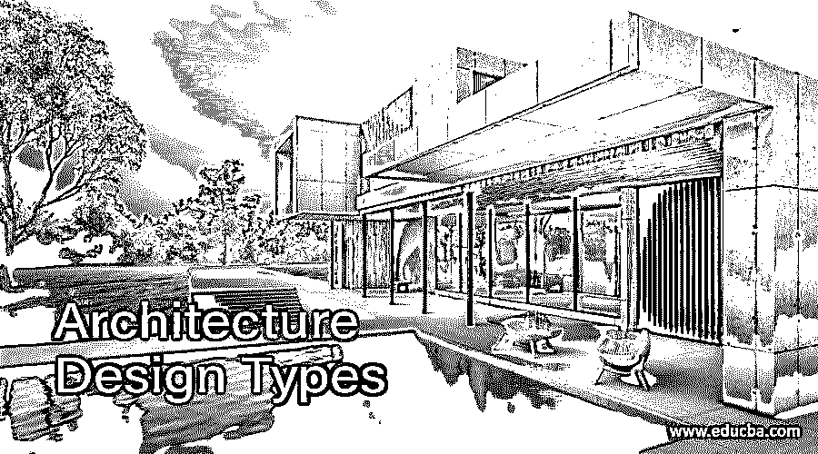

# 建筑设计类型

> 原文：<https://www.educba.com/architecture-design-types/>

## 建筑设计类型介绍

建筑设计类型可以理解任何设计的结构模式，因为我们有不同类型的建筑设计，这些建筑设计的结构代表了很多东西来表达它自己。这些东西可能是他们设计的时代，或者是他们所属的文化和社区，用于设计的材料，以及其他更多的东西，都可以用来定义建筑设计的类型。我们可以找到一个建筑设计类型的列表，今天在这篇文章中我们将讨论从古代到现代的建筑类型。你对此感到兴奋吗？然后和我们一起从头到尾看一遍这篇文章。

### 建筑设计类型

建筑设计的类型是我们历史以来时代变迁的结果。在此期间，一些风格得到了改善，一些风格与其他风格融合，所以让我们看看这些类型的顺序是什么。

<small>3D 动画、建模、仿真、游戏开发&其他</small>

我们讨论的第一种建筑设计是经典的。

#### 经典:

这种建筑设计在公元前 7 世纪至公元前 4 世纪至公元前 4 世纪的古希腊时期被用于建筑。它以设计寺庙等宗教建筑而闻名，当时石头被用作基本材料。这种类型最重要的一点是几何、对称以及透视在这个设计中占有重要的位置。公元 5 世纪时，帕台农神庙建在雅典卫城，是这类建筑设计中最伟大的作品。

现在转到下一种类型的建筑设计，这是哥特式的，并获得相关知识。

#### 哥特式:

Gothic 是一个法语单词，意为“法国作品”,在中世纪晚期，也就是公元 900 年到 1300 年间出现在法语中。在那个时候，哥特式建筑设计给人一种雄伟建筑的感觉，所以它通常用于建造大教堂和教堂。你可以把它理解为当时一种独特的设计类型，因为基于这种建筑设计的巴黎圣母院和兰斯大教堂现在被联合国教科文组织列为世界遗产。

下一个建筑设计类型是罗马式。

#### 罗马式:

你可以在 6 世纪到 9 世纪的欧洲找到这种类型的建筑设计，它清楚地传达了它与历史方面的关系。这种设计是一个欧洲国家在战争期间需要保护同胞的结果，它是这样设计的，以使进入的开口最小，并有厚重和不稳定的墙。如果你想看这种类型的例子，你可以去西班牙的圣地亚哥德孔波斯特拉大教堂，它是最好的例子。

现在让我们转向另一种建筑设计，即巴洛克建筑。所以让我们来发现这个设计的特别之处。

#### 巴洛克风格:

这是在 16 世纪早期引入欧洲君主主义社会的。你可以在这种类型的建筑中找到装饰性的作品，而且明暗对比也很好。如果你谈论这种类型的例子，那么我们肯定会去罗马的苏格教堂。

接下来，我们列表的建筑设计类型是新古典主义。所以让我们来看看。

#### 新古典主义:

新古典主义建筑设计展示了古典希腊和罗马建筑的混合结构，这使它们再次被使用。这个建筑的目的清楚地解释了当时的社会和经济思想。这两种类型的结合是在这种类型的接触中产生的，因为学生们在世界各地旅行，并在古代作品中有所接触。这种建筑加速了欧洲文化的复兴，并传播到各个国家，直到 19 世纪开始。

让我们看看清单上的下一个项目。美术学院是我们的下一个目标。

#### 美丽的艺术:

它在 19 世纪 30 年代中期被引入巴黎的美术学校。你还会发现一些其他时期的风格，比如新古典主义风格，哥特式风格，还有一种是文艺复兴风格，它在设计中使用了一些材料，比如玻璃和铁。虽然它建立在法国，但你可以看到它对美国建筑设计的影响。你可以在巴黎的大皇宫和美国纽约的中央车站看到它的伟大作品。

现在让我们来分析下一种建筑设计类型，即新艺术。

#### 新艺术:

这种类型的工作是一种不同类型的艺术导向的工作，如绘画，家具设计，和其他一些指南。你可以在这个设计中看到一些有机的形状，这些有机形状的想法来自于自然的元素，如植物、树木、动物等。这种类型的第一个设计是由比利时建筑师维克多·霍塔设计的。

转到我们的下一个建筑类型，我们会在我们的列表中找到装饰艺术。

#### 装饰艺术:

它也在新艺术运动的某个时候出现，时间就在第一次世界大战之前。它对艺术和设计的几乎所有领域都产生了影响。设计中使用了奢华的材料，除了奢华的材料，你还可以看到手工制作的部件。它对当时的技术进步产生了全面的影响。这种类型的第一个设计是由放弃钢筋混凝土模型设计师奥古斯特·贝瑞设计的装饰艺术结构。

这些是我们上面讨论的一些重要的架构设计类型。

### 结论

毫无疑问，你对建筑设计类型有很好的了解，因为有很多重要的事实。在本文中通过名称识别这些设计类型后，您可以探索更多关于它们的东西。您还可以通过这些设计类型获得项目设计的想法。

### 推荐文章

这是一个架构设计类型的指南。这里我们讨论介绍和架构设计类型。您也可以看看以下文章，了解更多信息–

1.  [软件系统架构](https://www.educba.com/software-system-architecture/)
2.  [逻辑架构](https://www.educba.com/logical-architecture/)
3.  [雪花架构](https://www.educba.com/snowflake-architecture/)
4.  [模型驱动架构](https://www.educba.com/model-driven-architecture/)

