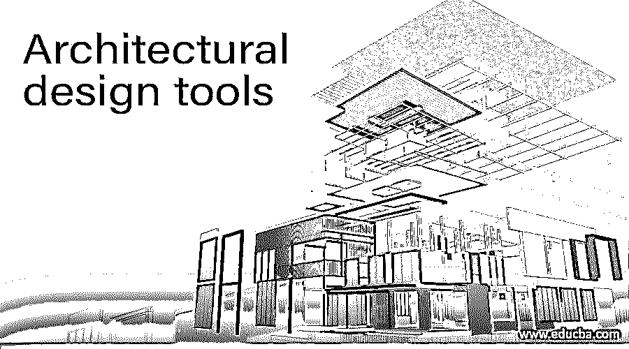
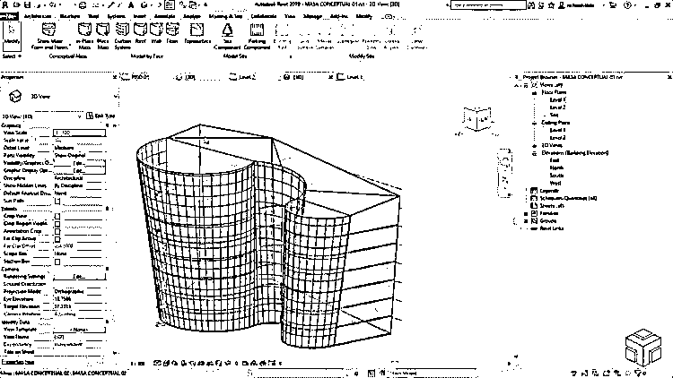
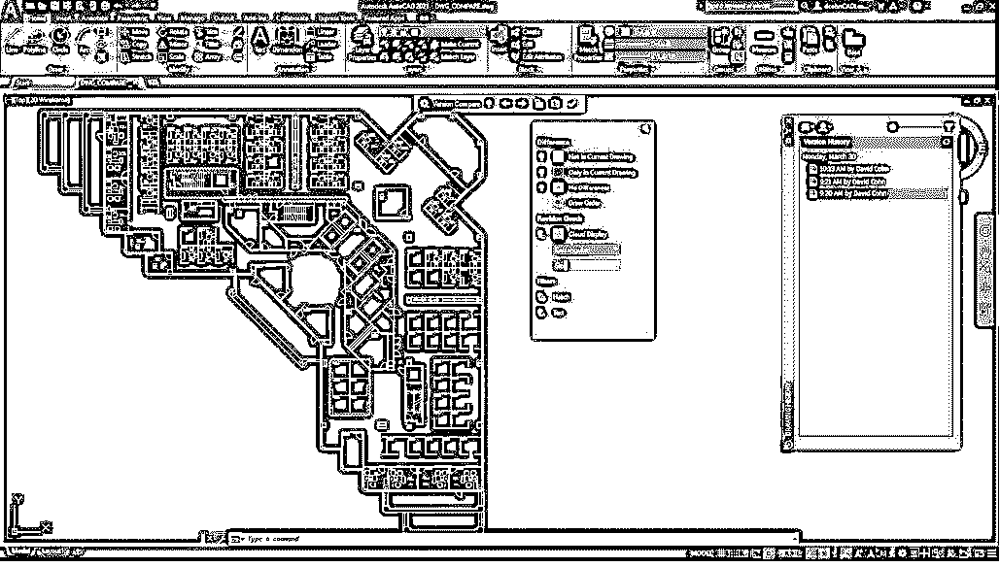
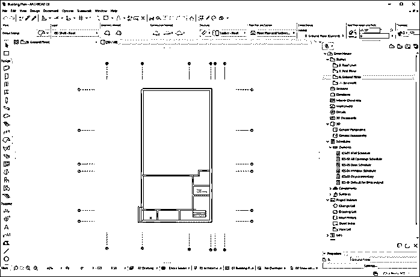
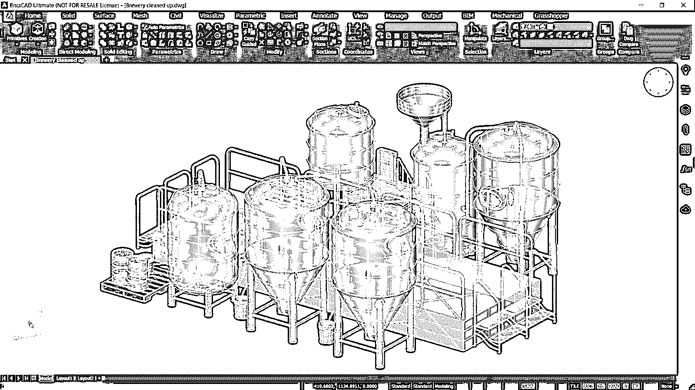
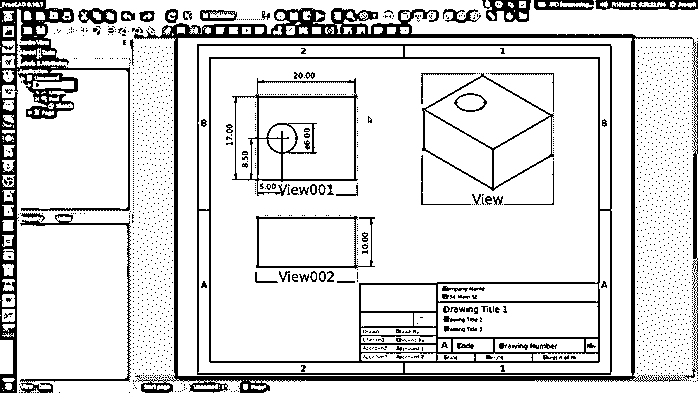
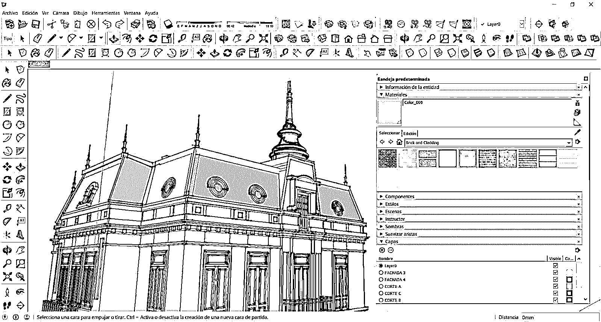
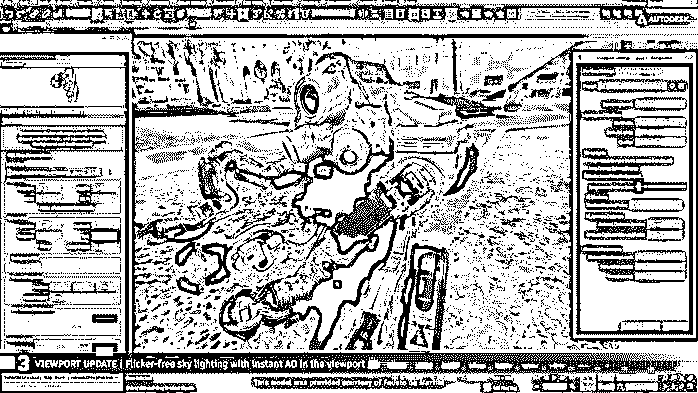
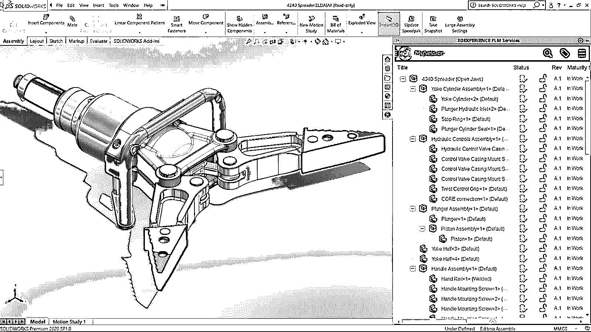

# 建筑设计工具

> 原文：<https://www.educba.com/architectural-design-tools/>

## 建筑设计工具介绍

在这篇文章中，我们将学习什么是架构设计工具。架构师使用的主要工具是绘图，但是正如我们从这篇文章中所了解到的，这些绘图是如何制作的已经发生了变化，并且还在不断变化。各种建筑设计软件的使用取决于情况的需要和要求，因为你现在会发现所有的要求你需要一个软件，由于缺乏功能或兼容性或成本因素。你对设计工具的选择也取决于你愿意花在绘图过程上的时间，因为一些软件有一个陡峭的学习曲线，如果你打算长时间使用它，你需要投入时间。

### 建筑设计工具列表

这是一份从你的项目开始到完成所使用的软件清单。

<small>3D 动画、建模、仿真、游戏开发&其他</small>

#### 1.Revit

Autodesk Revit 是一种 BIM(建筑信息建模),被从建筑师到结构工程师的各种学科所使用。除此之外，它在机械和电气工程领域也有它的用途。使用 Revit，可以创建结构构件，并在三维空间中对其进行可视化。

它提供了一个完整的包，从最初的概念化到最终的建设以及维护任务。Revit 可用于创建整个建筑以及装配。也可以单独创建 3D 形状。

建模可以通过内置资产来完成，或者您可以导入自己的几何资产。Revit 的一个缺点是它不能操纵单个多边形，因为它缺乏 NURBS 建模功能。

#### 2.Autodesk 公司的计算机辅助设计软件

AutoCAD 是计算机辅助设计和绘图应用程序。与 Revit 类似，建筑师和项目经理以及城市规划者也使用它。

AutoCAD 与 Revit 的主要区别在于，它用于创建精确的 2D 和三维草图，而 Revit 适用于大规模应用。AutoCAD 也有其变种，专门从事各种学科，如电气，测绘，结构细节。

AutoCAD 也有移动和网络解决方案，可以随时随地工作。还有一个学生版，对学生和教育工作者都是免费的。

AutoCAD Architecture 是一个专用于建筑目的的应用程序，用于绘制 3D 对象，包括门、墙和窗，并且许多智能数据也与之相关联。因此，通过创建 2D 图纸，我们可以创建立面图和剖面图。同样，civil design、civil design 3D 和 pro 版本支持有助于工程计算和表达的数据对象。端口是为 windows 和 mac 版本创建的，具有完整的功能。

#### 3.ArchiCAD 系统

ArchiCAD 是由 Graphisoft 开发的软件，提供 BIM 和 CAD 的功能。ArchiCAD 的主要特点是它与参数化对象或智能对象一起工作，这些对象是数据增强的对象，因为它用于创建更引人注目的虚拟建筑，如墙、板、门、窗、屋顶和家具等结构。内置了许多预先设计和定制的对象。

协作是通过远程访问完成的。还使用 API(应用程序编程接口)和 ODBC 连接为第三方开发人员开发的附加组件提供 API 和脚本。

与 AutoCAD 等其他商用软件的数据交换选项。除了设计之外，还有可视化和渲染工具，可以创建照片级的图片和文档管理。他们有自己的服务器，这为备份和恢复创建了版本控制，以防出现故障。

#### 4.BricsCAD BIM

BricsCAD 是另一种 CAD，它被 AEC 行业以及汽车和制造行业使用。它还拥有人工智能工具，可以增加工作流程并节省时间，从而增强 2D 和 3D 模型。BricsCAD 形状用于建模 3D 资产，这很容易访问。

你还可以访问免费的 3D 组件库，比如树、人类交通工具。然后，BricsCAD 的 BIM 对应部分使用人工智能来对模型进行 BIM 化。

BricsCAD Mechanical 用于创建机器零件和组件，并生成各种视图(等轴测视图、正交视图、截面视图)，而物料清单则根据设计变更进行视图更新。

#### 5.FreeCAD

FreeCAD 是用于建模和 BIM 的开源软件。虽然它主要集中在机械工程设计，它也可以应用于建筑和电气。

由于本质上是开源的，FreeCAD 的功能可以使用 Python 编程语言进行扩展。唯一的问题是不支持像 DWG 这样的专有文件格式。它包括许多类似于用于 BIM 的 CATIA、Inventor、Revit 的功能和工具。

#### 6.草图

Sketchup 也是免费提供的 CAD 软件。它易于使用绘图工具，也可用于室内设计、土木、机械和视频游戏设计。还有一个亲，店，使版本可用。您也可以在 SketchUp 中制作 3D 打印就绪的模型。

#### 7.3D Studio Max

虽然 3D studio max 是一个 3D 计算机图形程序，但它可以创建建筑模型和工作流程，因为它有一些优秀的模型制作和渲染工具。除此之外，您还可以利用动画功能将您的模型变得栩栩如生。

Autodesk Raytracer 渲染器是用于基于物理的渲染器的软件，对于建筑、工业和产品渲染以及 2017 版中默认集成的动画非常有用。

#### 8.SolidWorks

Solidworks 是另一个三维建模软件；虽然您不能创建复杂的建筑结构和可视化，但如果您了解 Solidworks 的各种功能并对其进行概述，因为它使用了基于参数化特征的方法，所以创建快速设计仍然非常方便。

### 结论

在本文中，我们了解了什么是建筑设计工具，以及每种工具如何为我们提供基本相同的设计理念，但根据需求提供不同的功能，以及我们愿意如何调整和优先考虑如何以一种省时高效的方式使用这些工具。

### 推荐文章

这是一个建筑设计工具指南。在这里，我们将讨论从项目开始到完成所使用的软件清单。您也可以看看以下文章，了解更多信息–

1.  [UI 设计工具](https://www.educba.com/ui-design-tools/)
2.  [软件设计原理](https://www.educba.com/software-design-principles/)
3.  [面向功能的设计](https://www.educba.com/function-oriented-design/)
4.  [3ds Max 室内设计](https://www.educba.com/3ds-max-interior-design/)

