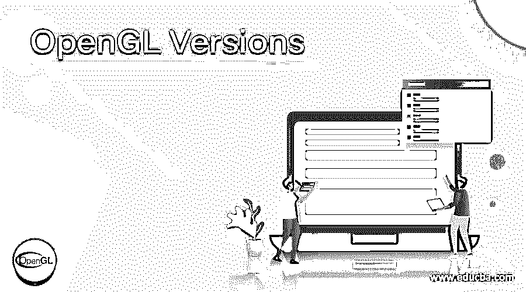

# OpenGL 版本

> 原文：<https://www.educba.com/opengl-versions/>

## OpenGL 版本介绍

OpenGL 版本可以理解为以前的 OpenGL API 的修改和更新形式，并不时发布以有效地提高其工作能力，并且这种改进在特定任务中给出最佳结果。在 OpenGL 版本中，我们可以找到新的功能以及对任何特定任务的先前障碍的改进，这些功能可能是更新的用户界面、更新的工具及其功能，以及您可以在 OpenGL 版本的每个版本中找到的许多其他东西。自从开发以来，OpenGL 有许多更新了特性的版本，你将会有不同名字的这些版本。

因此，让我们讨论一下 Open GL 的一些版本，这样我们就可以了解不同版本的特性和新功能，这些特性和新功能是为了获得最佳输出而添加的。其版本命名为 OpenGL 1.0、OpenGL 1.1、OpenGL 1.2、OpenGL 1.2.1、OpenGL 1.3、OpenGL 1.4、OpenGL 1.5、OpenGL 2.0、OpenGL 2.1、OpenGL 3.0、OpenGL 3.1、OpenGL 3.2、OpenGL 3.3、OpenGL 4.0、OpenGL 4.1、OpenGL 4.2、OpenGL 4.3、OpenGL 4.4、OpenGL 4.4、OpenGL 4.5、OpenGL 4.6 我将从它的最新版本 OpenGL 4.6 开始，所以让我们先讨论它。

<small>3D 动画、建模、仿真、游戏开发&其他</small>

### 不同版本的 Open GL

让我们讨论一下 Open GL 的版本。

#### OpenGL 4.6

此版本的 Open GL 在 2017 年进行了大量更新和改进，并具有 SPIR-V 语言，用于在其中定义着色器，并通过渲染命令顶点着色器获得绘制 ID 和基本顶点/实例值的值。有一个间接渲染命令是多重绘制命令，它可以从缓冲区中提取多个绘制。您还可以在统计和转换方式中找到反馈溢出查询。在这个版本中可以创建无错误的 Open GL 上下文，并且原子计数器可以用于更多的操作。不仅如此，如果需要的话，还可以避免不同的着色器调用。

现在转到 OpenGL 4.6 版本之前发布的下一个版本。

#### OpenGL 4.5

它在 2014 年 4.6 之前发布，为当时的 API 的不同问题提供了解决方案，在其中，剪辑控制模式可以用作配置窗口空间中剪辑空间映射的附加功能。添加了一个类似于 gl_ClipDistance 的剔除，它的名称是 GLSL gl-CullDistance 着色器输出，但它用于整个图元剔除。还增加了一个新的模式，通过它反转条件来决定是否绘制，它是 glBeignConditionRender。它还允许在不绑定对象的情况下查询和修改对象状态。纹理图像的子区域在这个版本中也增加了新的功能，ARB_robustness 功能也升级到符合 ES 3.1 标准。这个版本有内置的 GLSL 函数，允许着色器查询纹理中的样本数。它还最大限度地减少了对当前绑定纹理渲染的限制，并提供了一种避免写后读危险的机制。

现在让我告诉你下一个版本，这也是一个重要的版本，因为它有许多新功能。

#### OpenGL 4.4

这是在 2013 年作为 OpenGL 的稳定版本发布的，其中包含一些新功能，即在缓冲区处于映射形式时使用缓冲区的能力，它可以作为缓冲区对象的不可变存储。在这个版本中，纹理图像可以直接清除，并且还为输入/输出变量提供紧密封装。不仅是紧密封装，还有一个选项可以设置输入/输出接口块上的位置，以便进行封装。在一次调用中，可以完成索引绑定的同一类型顺序范围内的对象数组的绑定。通过特殊的夹紧模式特征，每个维度上的纹理尺寸可以加倍，并且镜像也可以在纹理的精确负坐标方向上找到。对于纹理，它还提供仅模板图像格式，并且需要 8 位模板格式。对于顶点属性，它提供了一个打包的三分量格式，即 11F/11F/10F。

现在我将告诉你另一个版本的 OpenGL，它也有一些你应该知道的重要更新。

#### OpenGL 4.3

它于 2012 年发布，具有调试消息传递和多维 GLSL 数组的选项。缓冲对象可以清除特定的值和内存集。增加的另外两个特性是任意计算分片和任意图像复制，用于改进使用着色器和图像的方法。它与 OpenGL ES 3.0 兼容，还可以在着色器中指定统一的位置，不仅可以定位，而且片段着色器提供了层和视口索引。Framebuffer 对象也可以渲染，最棒的是这种渲染可以不带附件。也可以查询图像格式的相关信息。通过一个单一的绘制命令，它可以发出渲染命令，为多个渲染间接。它有一个改进形式的 API，可以获得关于程序对象接口的信息。这个版本可以从 GLSL 获取图像的大小，它还可以从深度/模板纹理中获取模板的值。缓冲区的纹理现在可以与一个缓冲区对象的范围绑定，而不是与整个对象绑定。检测采样器/图像的小中见大贴图金字塔可以由 GLSL 完成，多样本纹理的不可变存储从这个版本开始。它能够创建具有新的内部格式的新纹理，并且可以被现有的纹理存储引用。如果你想把顶点格式从缓冲对象中分离出来，你也可以在这个版本中这样做。

这些是 OpenGL 的一些版本，我向你们简要介绍了从最新版本到之前发布的版本。

### 结论

在这篇文章中，我对 OpenGL 及其版本进行了很好的分析，现在你知道每个版本都增加了哪些功能和更新，使它们变得越来越用户友好，能够完成不同的任务。

### 推荐文章

这是 OpenGL 版本的指南。这里我们分别讨论 Open GL 的简介、特性和不同版本。您也可以看看以下文章，了解更多信息–

1.  [Groovy 版本](https://www.educba.com/groovy-version/)
2.  [Gradle 版本](https://www.educba.com/gradle-version/)
3.  [颤振版本](https://www.educba.com/flutter-version/)
4.  [Swift 版本](https://www.educba.com/swift-version/)

