# Krita 动画

> 原文：<https://www.educba.com/krita-animation/>

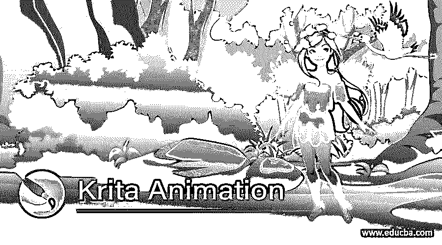

## Krita 动画简介

Kirta Animation 可以理解为通过管理时间轴面板的参数来为 Krita 软件的作品提供运动。在这里，我们可以制作这个软件中设计的角色动画，或者画笔艺术，或者任何其他数字绘画作品。它一帧一帧的动画对象，我们可以根据自己的需要添加，删除和复制关键帧。在这个软件的时间线中有洋葱皮功能，通过它我们可以看到当前帧的前一帧和下一帧设计，这是一个非常好的功能。有了洋葱屏幕，在这个软件中制作动画变得非常容易。所以让我们来讨论一下用 Krita 制作动画的步骤。

### 如何用 Krita 做动画？

这是 Krita 软件的欢迎界面，我将为我的作品制作一个动画文档。要获取新文档，请单击该屏幕开始标签的“新建文件”选项。

<small>3D 动画、建模、仿真、游戏开发&其他</small>

现在“创建新文档”框将会打开。您可以在这里设置文档的大小和其他相关参数。我将我的文档的尺寸设为 1920 x 1080 像素，然后点击这个对话框的创建按钮。

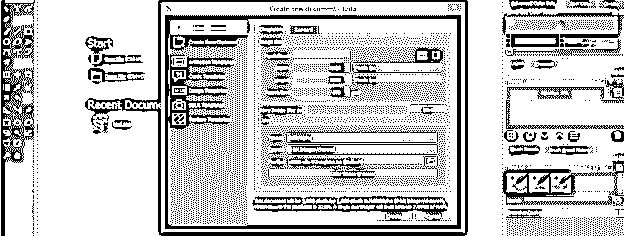

现在让动画面板进入菜单栏的设置菜单，然后进入下拉列表的 do Dockers 选项，然后通过点击复选框启用动画面板。

这里我们在工作屏幕的按钮上有一个动画面板。

在此框中，您可以给出帧速率值或查看帧速率。

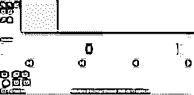

开始和结束框将显示动画的开始和结束帧。

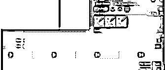

一旦你完成了你的动画，你可以点击这个播放按钮来播放你的动画，或者再次点击它来停止播放动画。

此按钮将带您到上一帧或按键盘的左箭头键。

与上一帧相反，您也可以通过点击此按钮或按键盘的右箭头键进入下一帧。

还有另外一个按钮，你可以一个一个地学习。您也可以在创建动画期间在时间轴中添加空白关键帧，这意味着空白关键帧将没有动画。

要复制任何一帧或一组帧，您可以在选择所需的帧后单击此按钮，或者通过按住键盘的 Alt 键选择该帧并将其拖动到时间轴中所需的帧。

这是洋葱皮图标，它将帮助你同时看到动画的所有帧，并作为你创建下一帧的指南。

一旦你点击这个洋葱皮图标，一个洋葱皮对话框将出现在工作屏幕的右侧。这里你可以看到有一个数字，显示从 0 帧到现在有多少个动画帧。通过减少此对话框的蓝色框的蓝线，可以减少每个框架的不透明度。

您可以将此面板移动到工作屏幕上的任何位置，并将其放置在您想要的位置。

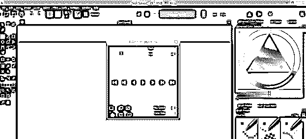

现在我将在笔刷工具的帮助下给你展示一个简单的动画，从工具面板中选择笔刷工具或者按键盘上的 B 键。

开始之前，我们的动画让我们有一个时间线面板，时间线面板再次进入设置菜单的 Dockers 选项，并启用时间线选项。

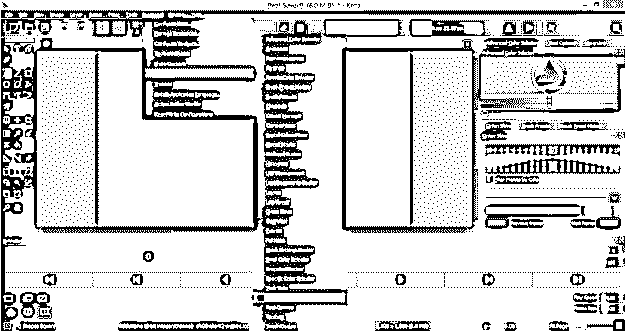

这里我们在动画面板的右侧有一个时间线面板，我们可以通过用鼠标拖动它的框来设置时间线面板的长度。

启用自动帧模式，这样当我们开始动画时，帧会自动添加。

你可以在设计好作品后制作动画，但你必须复制每一部分，并根据你想要制作的动画，将其粘贴到每一帧中。

我将首先通过点击这个按钮添加一个空白框架。

现在按下键盘的右箭头键进入下一帧。

现在我在笔刷工具的帮助下为这个框架画一个弯曲的形状。

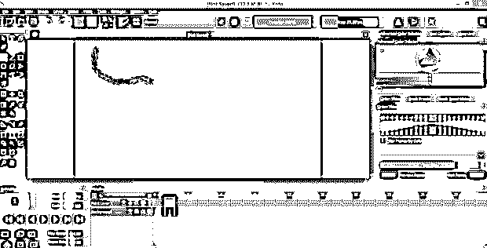

再次移动到下一帧，画出你的下一步。我将通过相应地移动到下一帧来逐一绘制这两条线。

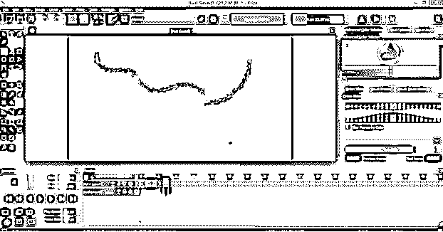

现在，如果你想选择整个帧，那么只需点击你想选择的起始帧，按住键盘上的 Shift 键，然后点击你选择的最后一帧。你也可以随机选择帧，只要按住键盘上的 Ctrl 键，一个接一个地点击你想要选择的帧。

我们可以通过将选定的帧拖动到我们想要的时间轴帧来复制它们。我们只需要在拖动选定的帧时按住键盘的 Alt 键。

在鼠标点击的帮助下移动播放头，将它放置在开始帧处，通过播放它，您可以看到您的作品的动画。

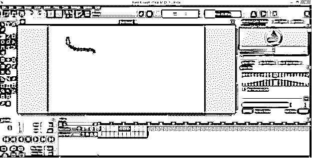

如果我启用洋葱皮选项，那么你可以看到它也显示了我的下一个画框。

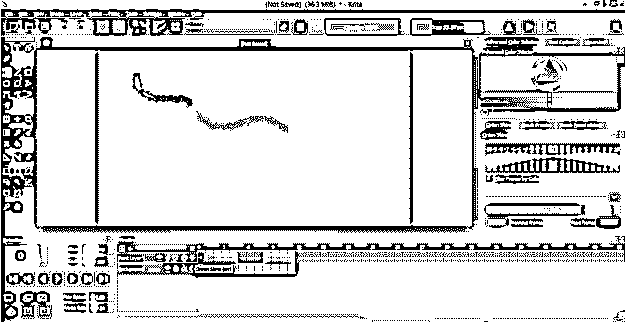

随着每一个领先的框架，你将能够看到下一个框架，由于洋葱皮功能。

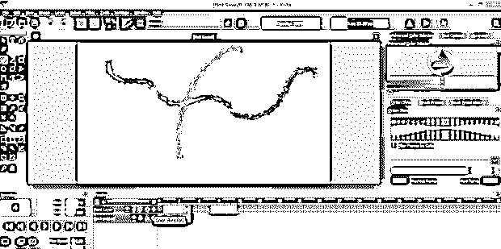

通过按下时间轴的可见(开/关)按钮，我们可以隐藏或取消隐藏该层的动画。

您还可以将音频添加到动画中。只需点击音频图标的下拉箭头键，然后点击打开音频选项。然后为此选择您想要音频文件。

在这里，我们在音频按钮中有一些其他选项，例如我们可以将导入的音频静音，删除它，增加或减少音轨的音量。

我在 Krita 中告诉了你动画的基础，通过理解它们，你可以在这个软件中非常有效地创建动画。

### 结论

很高兴告诉你如何在 Krita 软件中制作动画？我想你已经在 Krita 中学习了很多关于动画的东西，并且可以通过处理动画面板和时间轴面板的参数来开始你的作品的动画。

### 推荐文章

这是一个克里塔动画指南。这里我们讨论一个介绍，你如何在 Krita 软件中做动画？分别是。您也可以看看以下文章，了解更多信息–

1.  [粉笔 vs Photoshop](https://www.educba.com/krita-vs-photoshop/)
2.  [Krita vs Clip Studio](https://www.educba.com/krita-vs-clip-studio/)
3.  [Adobe Flash 中的动画](https://www.educba.com/animation-in-adobe-flash/)
4.  [玛雅动画](https://www.educba.com/maya-animation/)

