# 墨迹背景色

> 原文：<https://www.educba.com/inkscape-background-color/>

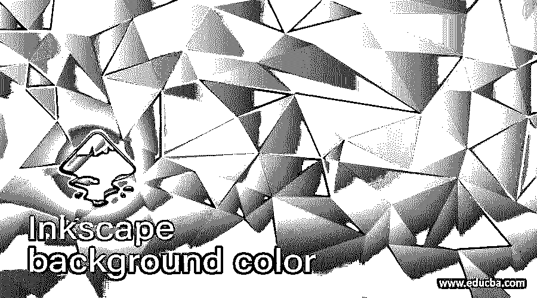

## Inkscape 背景色简介

Inkscape 背景颜色可以理解为 Inkscape 软件的显示窗口区域的背景颜色，在该软件中，您可以通过管理首选项选项以及菜单栏的文件菜单的文档设置选项的一些功能和参数来调整背景颜色。你可以选择任何颜色作为背景色，今天我们将讨论在你自己的 Inkscape 桌面软件中设置这些颜色的神奇步骤。所以让我们一步一步地开始我们的讨论，这对你会有帮助。

### 如何在 Inkscape 中设置背景色？

在旧版本中，我们将白色作为默认用户界面，但是你可以从菜单栏的首选项菜单中将其更改为深色主题。我们将使用白色用户界面，因为今天我们关注的是如何设置用户界面的背景颜色。因此，首先你必须去菜单栏的文件菜单，这是在这个用户界面的顶部，并点击它。

<small>3D 动画、建模、仿真、游戏开发&其他</small>

将会打开一个下拉列表。现在点击这个列表的文档属性选项，或者你可以按 Shift + Ctrl + D 作为文件菜单这个选项的快捷键。

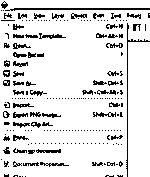

一旦你点击这个选项，你将会看到一个像这样的“文档属性”对话框。

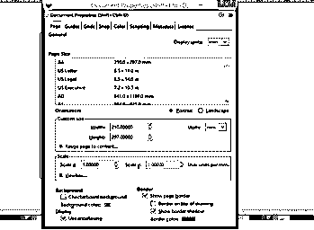

在这个对话框的底部，我们有改变工作窗口区域背景颜色的选项，所以点击这个背景颜色选项的小方框。

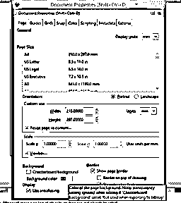

一旦你点击一个新的对话框将被打开，这是'背景颜色'对话框。在这里，如果你想要灰色的背景，然后点击这个框的 HSL 标签，这是色调，饱和度和亮度。

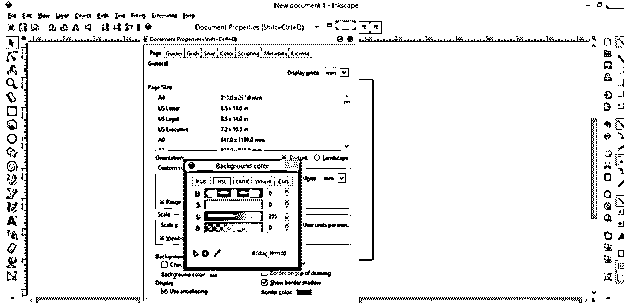

当您移动 L 选项的亮度标尺滑块时，用户界面的背景颜色将会改变。将滑块点设置为滑块刻度上所需的灰度颜色，并在设置后关闭两个对话框。

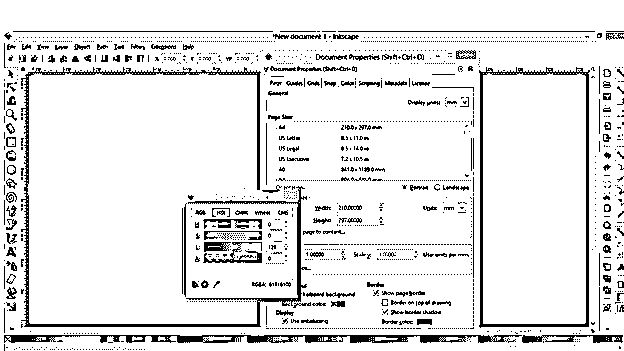

你的背景将准备好你选择的颜色，就像这样。

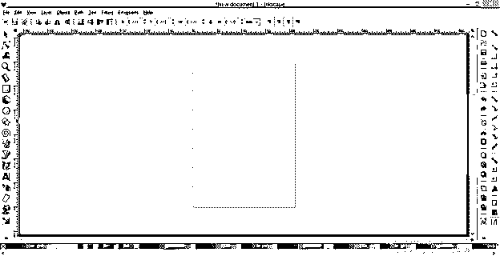

您也可以从“背景颜色”对话框的“RGB”选项卡中选择任何颜色。点击 RGB 选项卡，只需设置该选项卡的红色、绿色、蓝色滑块，并选择您想要的颜色。我将选择这种颜色，然后当我对选择的颜色满意时关闭所有对话框。

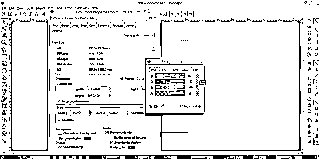

但是你可以看到画板也是和背景一样的颜色。您可以将其颜色改为白色，这是用户友好的艺术板颜色。因此，从工具面板中选择矩形或方形工具，或者按 F4 快捷键。

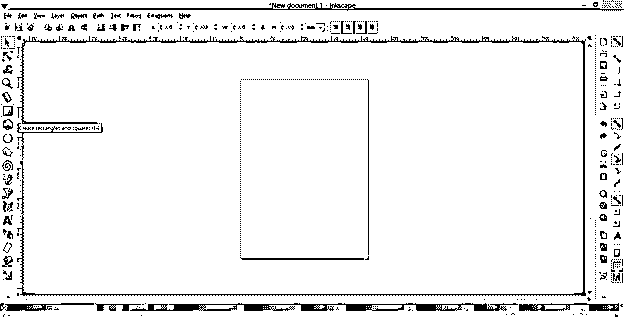

现在画一个像这样的矩形。

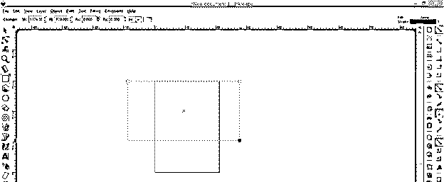

现在为你的画板选择尺寸，为此用工具面板的选择工具选择这个矩形，并根据你的要求改变单位。我会在 px 换。

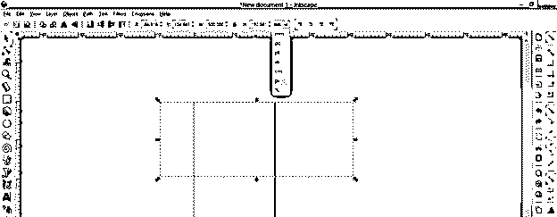

现在从这个矩形的属性栏设置这个矩形的宽度和高度。我将把它的尺寸定为 1280 x 1280 像素，这将是我们艺术板的尺寸。

现在，通过点击位于该用户界面底部的白色框，从调色板中将白色填充到该矩形中。

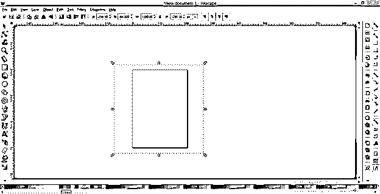

再次从菜单栏的“文件”菜单中打开“文档属性”对话框，并单击其中的“根据绘图或选择调整页面大小”选项。它将调整我们的艺术板的大小，这将与这个矩形的大小相同，这意味着我们有 1280 x 1280 大小的艺术板。

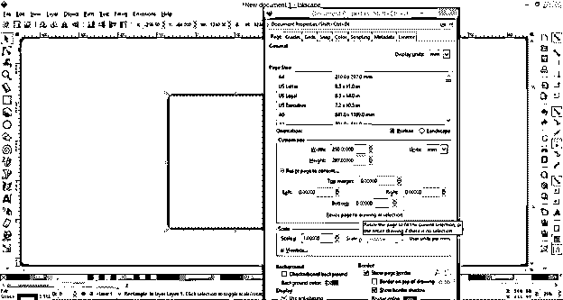

启用“显示边框阴影”选项，这样文档就没有阴影，并关闭此对话框。

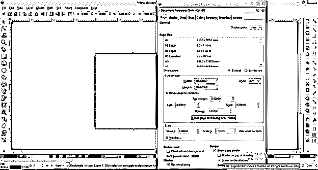

你可以随时在用户窗口周围移动这个矩形，但是这会在我们工作的时候产生问题。

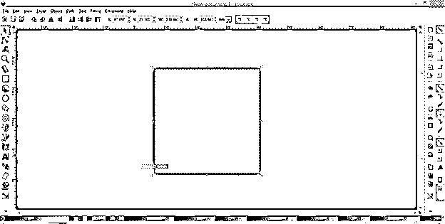

因此，要解决这个问题，去图层面板，你可以从菜单栏的图层菜单打开它，或者你可以按键盘上的 Shift + Ctrl + L 作为快捷键。

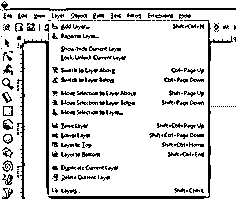

默认情况下，图层面板将在用户界面的右侧打开，在图层面板中，将该图层命名为背景图层。为它命名，双击这层，然后在这里输入你想要的名字。

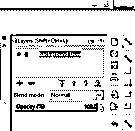

并通过点击该层锁定图标来锁定它。

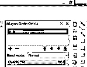

现在这一层将作为不可移动的背景层。

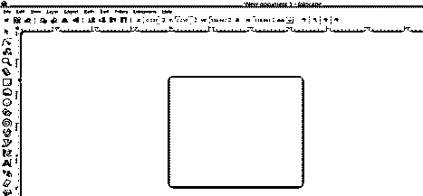

现在点击创建新层按钮创建一个新层。当你点击这个按钮时，你会看到这个对话框。在这里命名这个层为你将要工作的项目层，然后点击这个对话框的添加按钮。

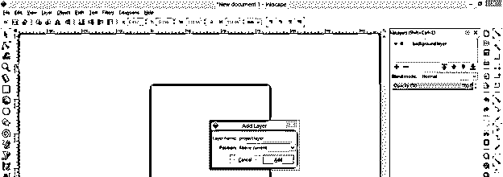

现在你可以在这一层工作。从工具面板中选择椭圆工具，像这样画一个椭圆。

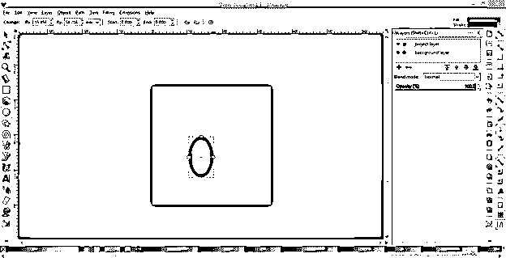

现在，我们手动制作的白色背景的问题是，如果您将这个椭圆保存为 PNG 文件，那么粘合框的区域也会随之保存，因为 Inkscape 将这个白色背景视为白色对象，但我们也有解决方案。

现在转到菜单栏的文件菜单下拉列表的导出 PNG 图像选项。

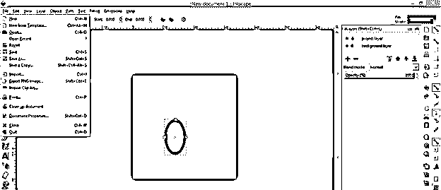

并启用此“隐藏除了选定的所有”选项，以便它将只导出此椭圆而不是边界框的区域。

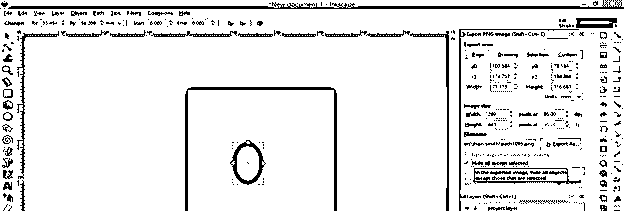

您可以随时更改此背景的颜色。只需打开它的图层，从调色板中填充你想要的颜色。

我们为您提供了一个很好的方法，让您了解 Inkscape 中的背景色是什么，以及您如何根据自己的需要管理它的颜色。

### 结论

现在你对这个软件的背景颜色有了很好的了解，你可以很容易地使用这个特性的参数来按照你的选择操作它。您可以将您创建的模板设置为最新版本中的默认模板，并在工作中享受您最喜欢的用户界面背景。

### 推荐文章

这是一个关于 Inkscape 背景色的指南。这里我们讨论如何在 Inkscape 中设置背景颜色以及该特性的参数。您也可以看看以下文章，了解更多信息–

1.  什么是 Inkscape？
2.  [喷墨替代](https://www.educba.com/inkscape-alternative/)
3.  [矢量图形编辑器](https://www.educba.com/vector-graphics-editor/)
4.  [插画替代方案](https://www.educba.com/illustrator-alternatives/)

