# Figma fonts

> 原文：<https://www.educba.com/figma-fonts/>

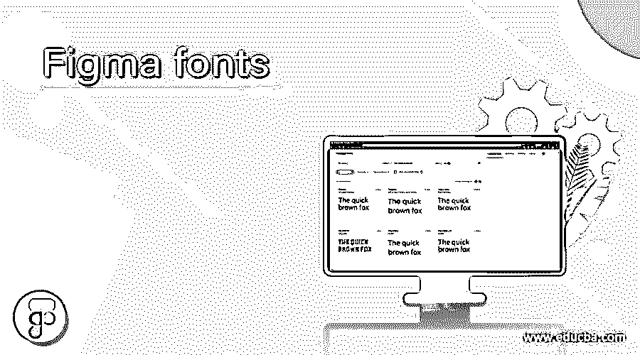

## Figma 字体介绍

在这篇文章中，我们将学习如何在 Figma 中使用字体。现在使用字体的第一步是知道如何安装字体，为此你应该知道在哪里可以找到它们。因此，首先我们将看看各种网站，在那里我们可以下载字体，然后如何在 Windows 中安装，这将在 Figma 中使用。Figma 有一套强大的工具，可用于根据输出格式进行适当的类型设置，这些输出格式与效果和定制选项一起出现在流行的文本编辑程序中。

### Figma 字体的步骤

以下是下面要提到的步骤

<small>3D 动画、建模、仿真、游戏开发&其他</small>

第一步:让我们从下载字体开始。有许多免费和付费的字体网站，你可以从那里下载字体。一些免费网站有谷歌字体、dafont、urbanfonts、fontspace 等。我们将看到如何从谷歌字体网站下载如图所示。首先，我们将改变过滤器显示无衬线和显示，这将减少搜索结果。我们不想要衬线，它会在字母的顶部产生闪光。此外，我们不希望手写，这将更像草书，而不是编码字体的等宽。

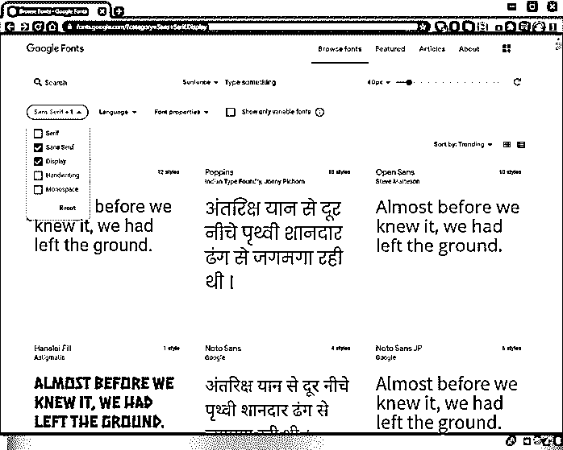

第二步:然后，我们可以根据需要定制文本，或者从下拉列表中选择句子、字母、段落或数字。

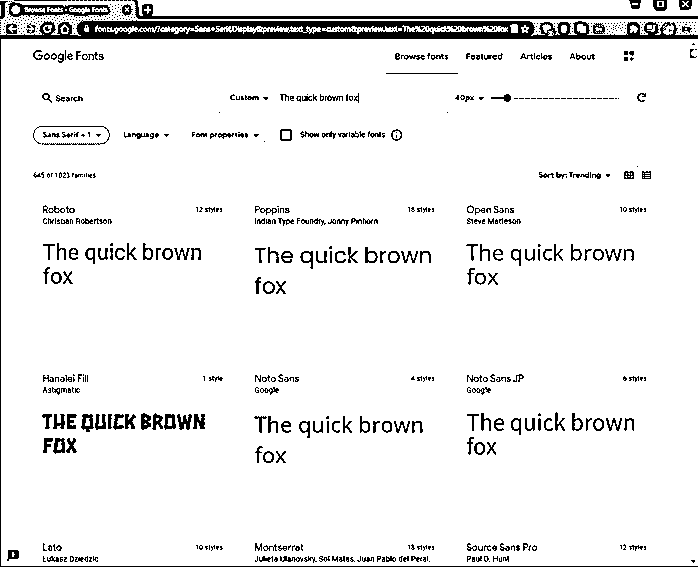

第三步:接下来，我们可以使用滑块来改变字体的大小

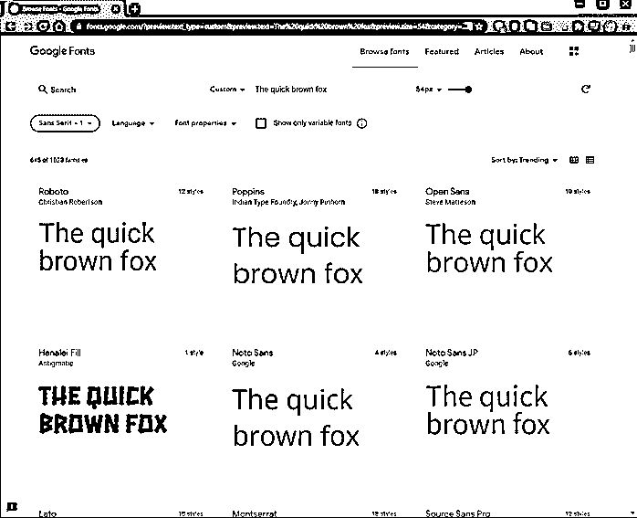

第四步:然后我们选择了一个名为 Ubuntu 的字体，我们可以看到有多个选项或样式可用。如果您正在查找非标准字符，您还可以看到该字体的字形类型。在“关于”部分，你可以了解字体的历史和作者或设计者的信息。此外，如果你正在寻找用于商业目的的字体，还有一个许可选项，最后一个选项是配对，这是谷歌建议的，如果你想要另一种字体与这种字体相结合。

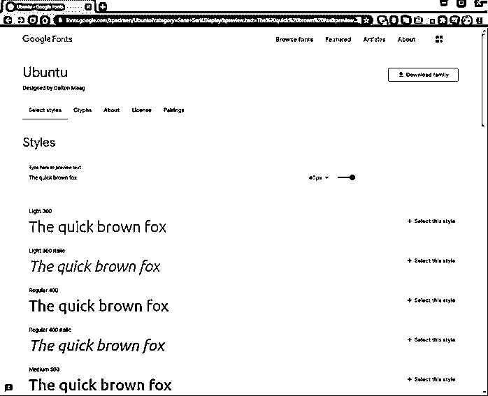

**第五步:**现在我们已经选择了常规风格。在这里，我们可以选择查看我们选择的字体，如果您在网站上使用，或者为了我们的目的，如果我们想与 Figma 一起使用，我们可以选择“下载全部”。此外，如果您想下载这种特定字体的所有字体样式，可以选择下载系列。

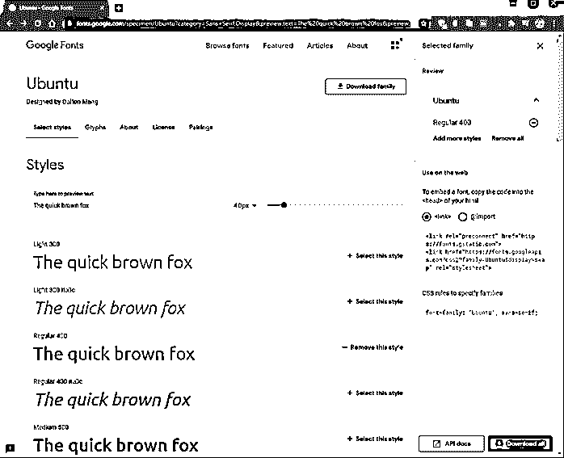

**步骤 6:** 一个 zip 文件将被下载到您的计算机上，右键单击该文件可以将其解压缩，所有字体都将位于解压缩后的文件夹中。此过程将在 windows 上运行。

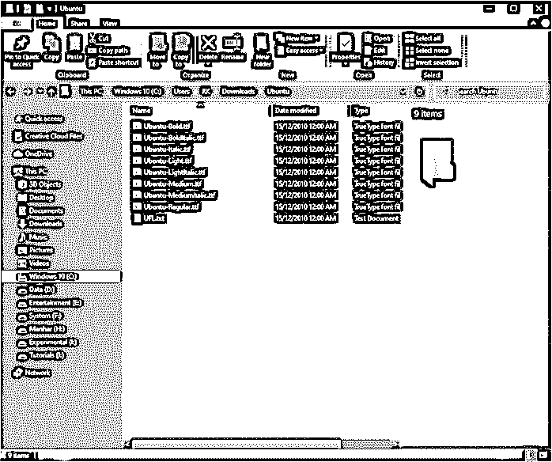

**步骤 7:** 接下来，我们将右键单击所有字体，并选择为所有用户安装。

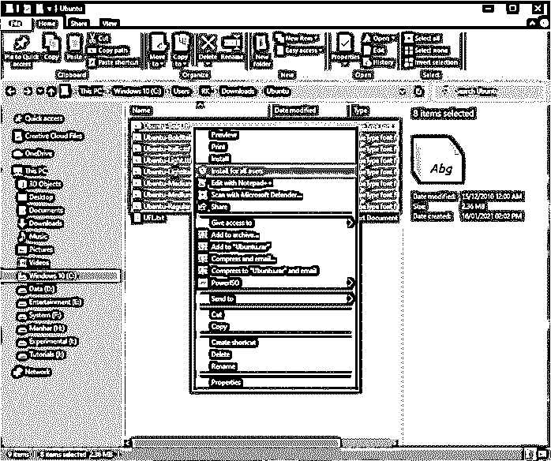

**步骤 8:** 然后打开 Figma，从预置的空白画布开始。

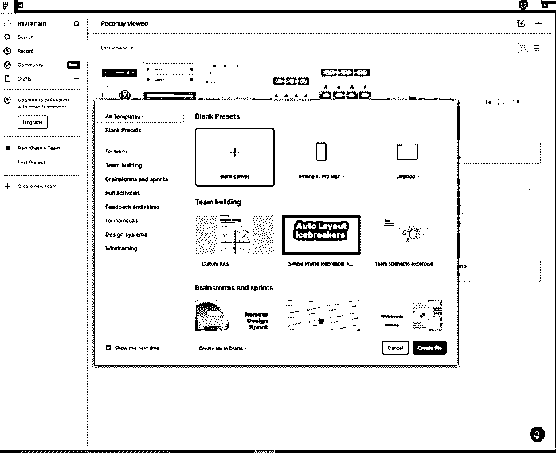

第九步:你可以从工具栏的中间重命名你的文档

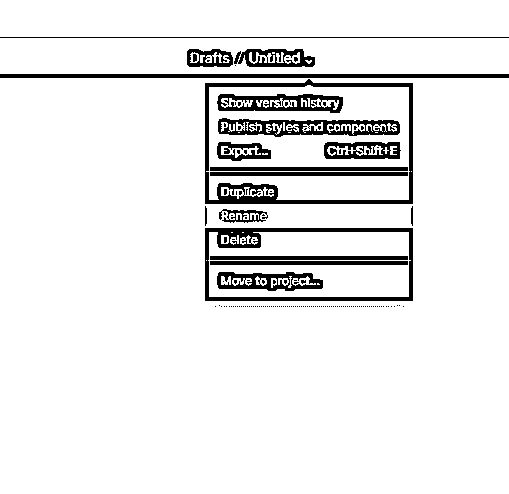

**第十步:**先来一个边框或者按 F，选择 iPhone 11 Pro 的设计。

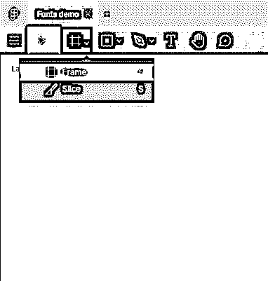

**步骤 11:** 然后使用矩形工具或者按 R，做出如图所示的矩形。

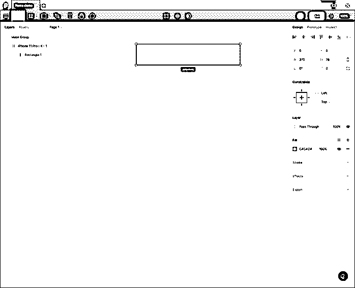

**步骤 12:** 你可以在设计面板中更改填充颜色。

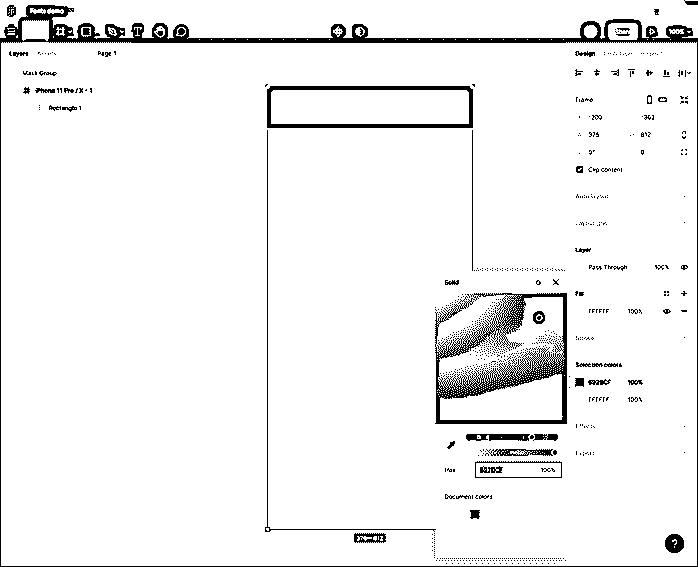

步骤 13: 现在使用文字工具或按 T 键点击矩形，这将创建一个文本框，然后添加文字，改变字体填充颜色为白色，大小为 32，字体样式为我们刚刚安装的 Ubuntu。

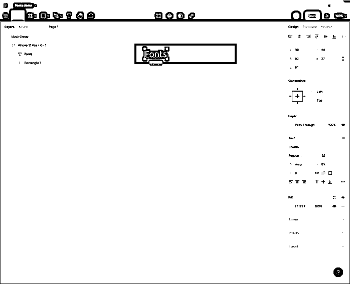

**步骤 14:** 再次使用文本工具将大小设置为 20，其他选项应与最后一个文本相同，除了填充是黑色的，单击一次并键入这个创建文本框，自动调整属性为宽度，允许文本框的宽度随着文本增长。

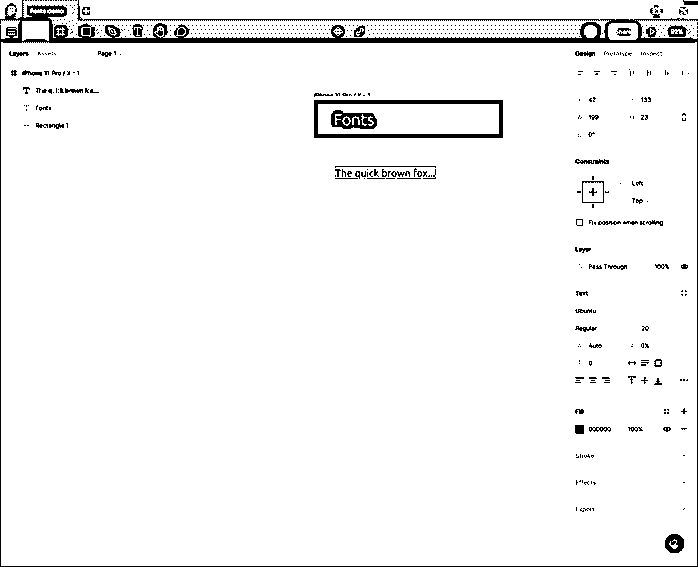

**步骤 15:** 接下来，我们单击并拖动一个文本框，创建一个固定大小的文本框，自动调整大小是固定的，一旦文本到达文本框的末尾，该框将不会垂直调整大小。

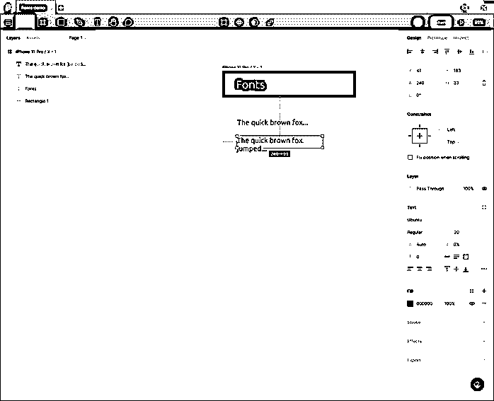

**步骤 16:** 因此，在文本部分的设计面板中，我们可以为该文本框设置自动高度，现在我们可以键入更多内容，高度将根据文本进行调整。

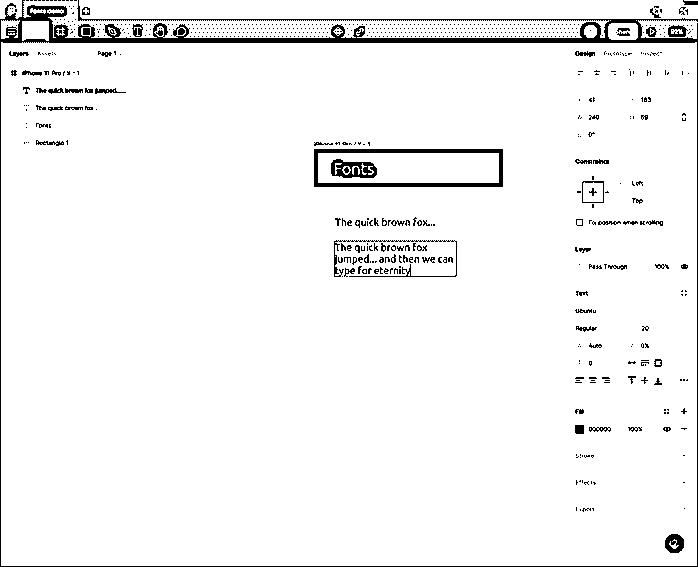

步骤 17: 接下来，我们创建三个文本字段，使用 Ctrl + B 演示粗体，使用 Ctrl + I 演示斜体，使用 Ctrl + U 演示下划线

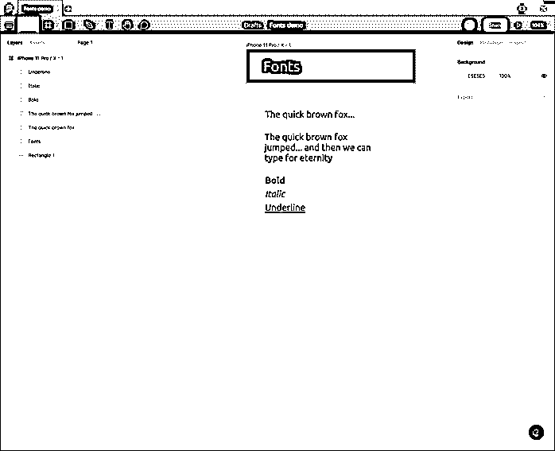

**第 18 步:**然后我们调整行高为 140%，默认为 100%，它改变了行间距。因此，通过按住 shift 键并点击向上箭头键，我们可以以 10%的增量增加行高，并将字母间距设置为 2px(默认情况下为百分比),它会改变字符之间的间距。

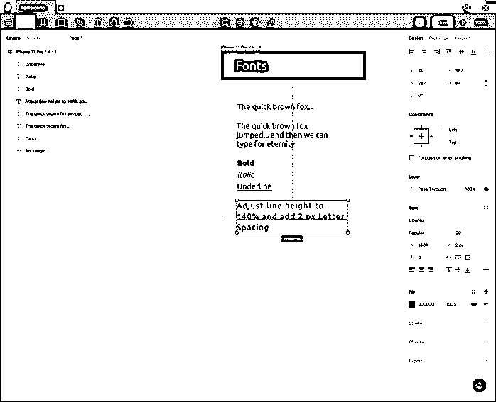

**步骤 19:** 创建另一个框架或通过复制粘贴复制现有框架，并保留标题。然后通过拖动创建一个文本框，并放入一些随机文本。通过在句子末尾按回车键来创建段落。

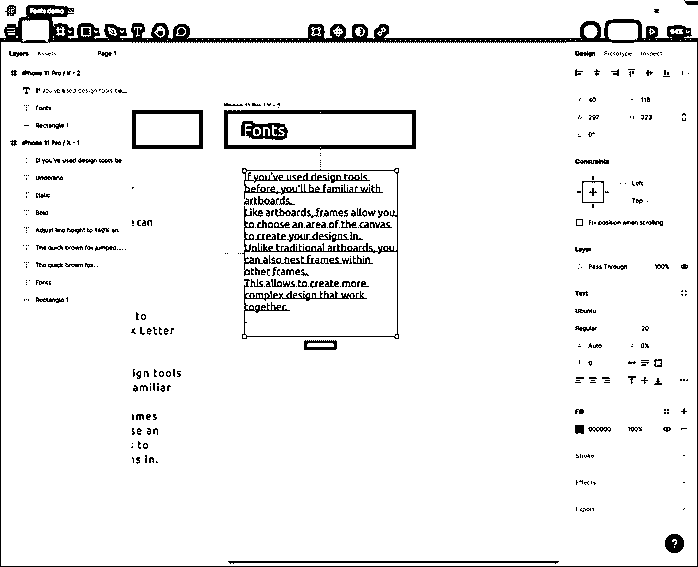

步骤 20: 现在我们将段落间距设置为 10，段落缩进设置为 20，这样每个段落的开头都有一些空间。

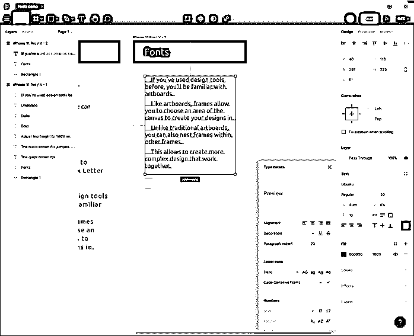

步骤 21: 现在我们已经创建了另外两个段落，首先我们可以将水平文本对齐方式改为左对齐、居中或右对齐。在第二个较大的文本框中，我们可以将垂直文本对齐方式更改为顶部、中间和底部。

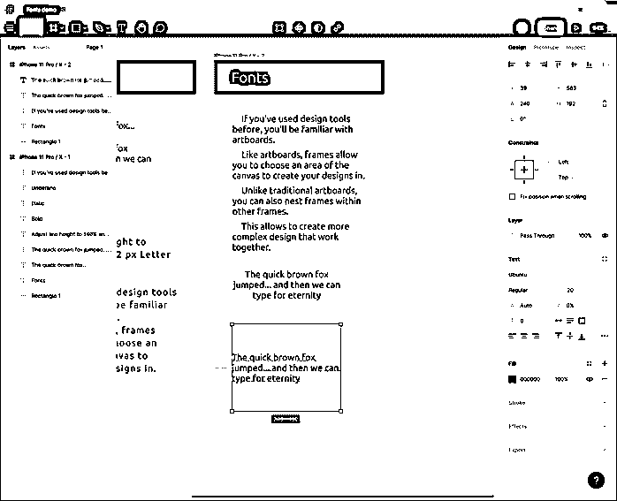

接下来我们将看看一些文字效果。首先，我们可以将文本的填充改为红色，如图所示。

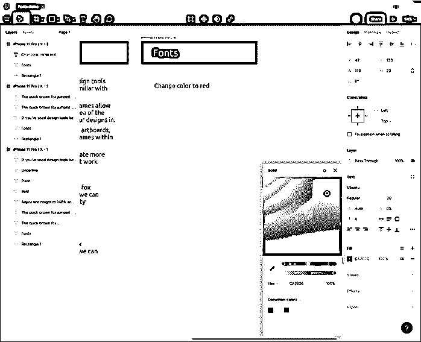

第 23 步:接下来我们添加一些文字，填充为灰色。然后我们使用 stroke 属性在外侧添加一个 1pt 的笔画。

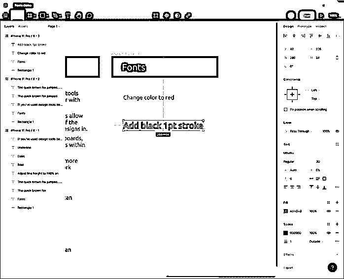

最后，我们可以添加阴影效果。我们可以叠加多个阴影来突出效果。

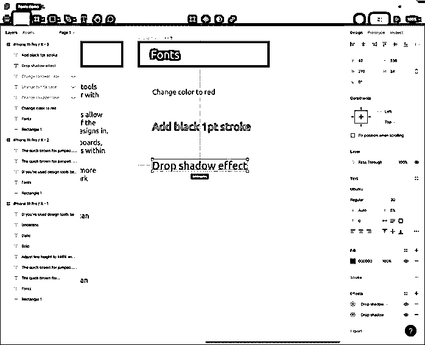

### 结论

在本文中，我们已经看到了如何在 Figma 中使用字体。首先，我们已经看到了如何从 google fonts 下载字体，并根据我们的需要进行定制。然后我们已经看到了如何在窗口中安装它。然后，我们已经看到了利用我们下载的字体的文本工具的基础。

### 推荐文章

这是 Figma 字体指南。在这里，我们讨论如何从谷歌字体下载字体，并根据我们的需要进行定制，以及如何将它们安装在窗口中。您也可以看看以下文章，了解更多信息–

1.  [Figma 备选方案](https://www.educba.com/figma-alternatives/)
2.  [HTML 字体样式](https://www.educba.com/html-fonts-styles/)
3.  [GIMP 字体](https://www.educba.com/gimp-fonts/)
4.  密密秘

