# Figma 网格

> 原文：<https://www.educba.com/figma-grid/>

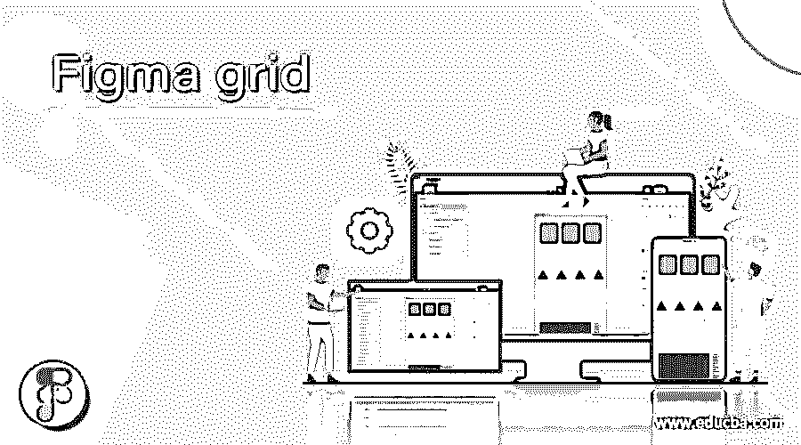

## Figma 网格简介

在本文中，我们将学习 Figma 中的网格。使用网格可以改善结构和可读性。它还消除了猜测，并为布局提供了一个结构。由于内容是为一个屏幕创建的，因此可以在许多不同尺寸和分辨率的屏幕上观看，以确保设计能够响应并适应显示器尺寸是至关重要的。为了实现这个目标，我们将 Figma 中的网格与约束结合使用，以达到预期的效果。因此，我们将在设计中对一个或多个框架应用网格。

### Figma 网格的步骤

下面是下面提到的步骤

<small>3D 动画、建模、仿真、游戏开发&其他</small>

第一步:我们可以在网上使用 Figma，也可以下载应用程序。在这篇文章中，我们正在做一个应用。首先，我们将开始创建一个框架或按 F 键，然后从设计选项卡中选择 iPad mini 布局。

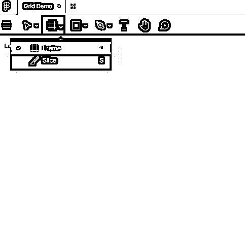

**第二步:**添加一个新框架，尺寸为 768 x 1024

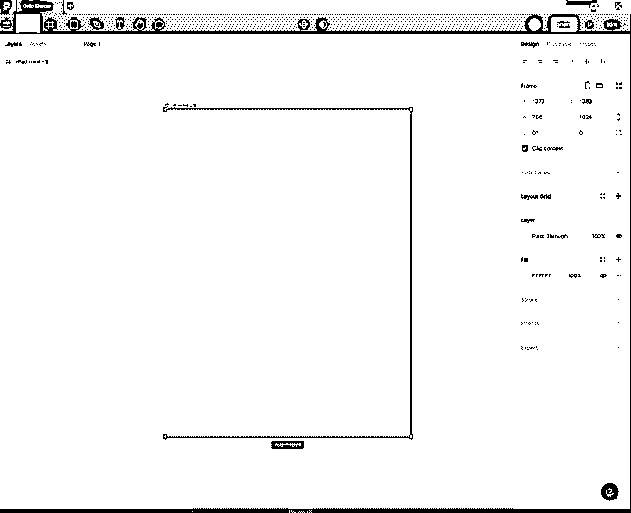

**第三步:**现在添加一个布局网格；默认情况下，它是一个网格布局，所以将其更改为列布局。将“计数”设置为 6，将“边距”设置为 30，将内容从两侧隔开，将“装订线”设置为 20，将内容在列之间隔开。

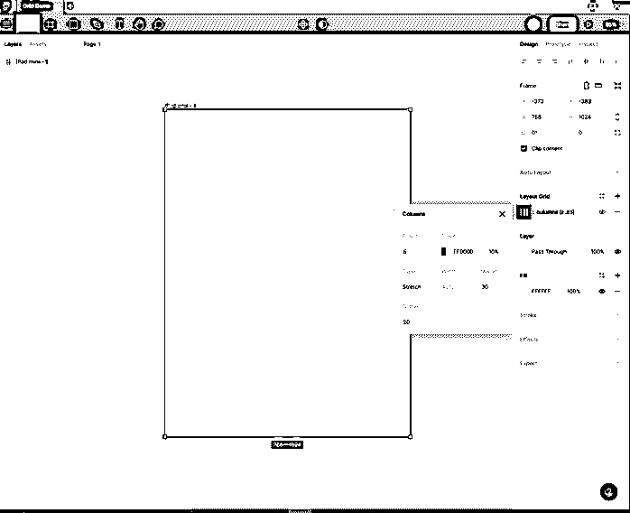

**步骤 4:** 现在从工具面板中选择矩形，或者按 R 键

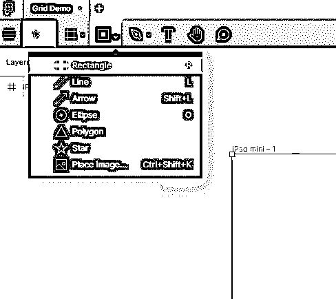

第五步:然后拖动横跨前两列的矩形，改变填充颜色，给它一些圆角半径，比如 20

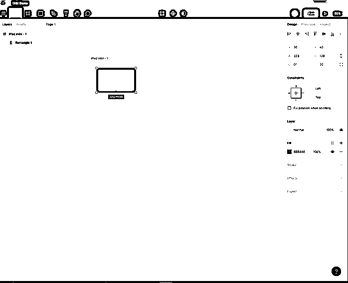

**步骤 6:** 按住 Alt 键，再拖动矩形两次，固定网格，如图所示。

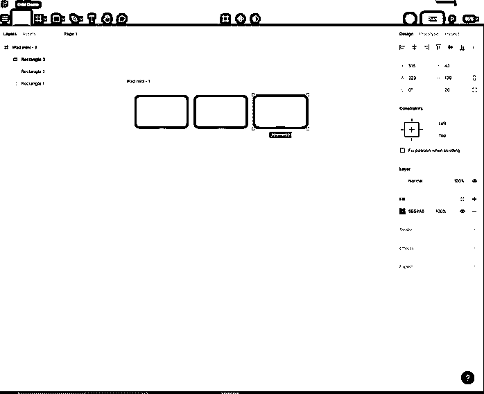

**第七步:**现在，我们将在我们的框架中间创建一个不同的布局；为此，我们需要更改布局网格，以便在设计面板中隐藏当前网格和布局网格。然后添加一个 4 列版式，边距为 30，装订线为 20

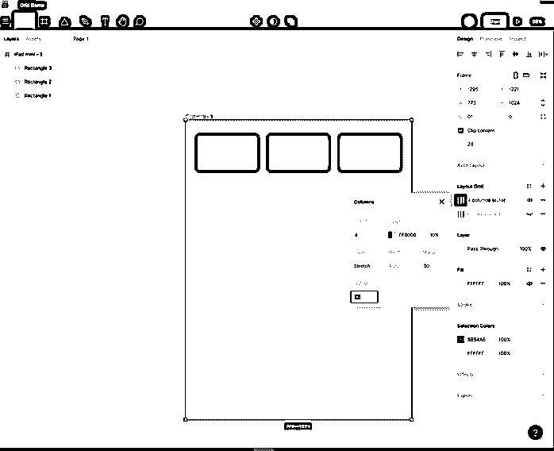

步骤 8: 然后添加一个矩形，并将填充改为黄色

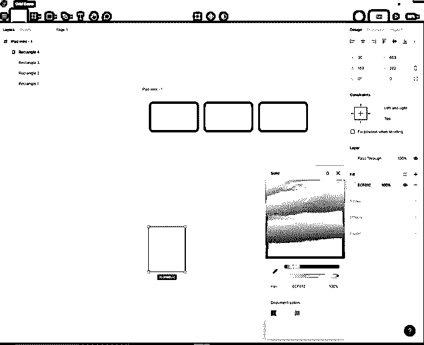

步骤 9: 现在使用多边形工具添加另外两个矩形和一个三角形。确保小方块从顶部、底部或左侧、右侧向内 10 px。一个技巧是使用“设计面板”中的“左对齐”或“右对齐”,这将把它们放在角落里，然后按 shift 和箭头键移动，如图所示。

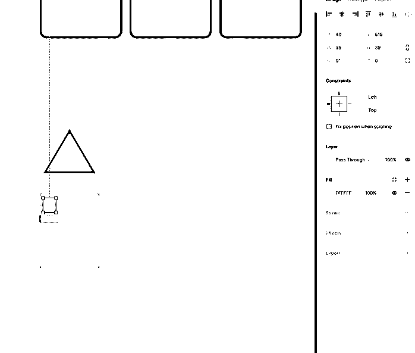

第十步:然后，我们用 alt 键和拖动在所有四个网格上复制矩形和三角形。

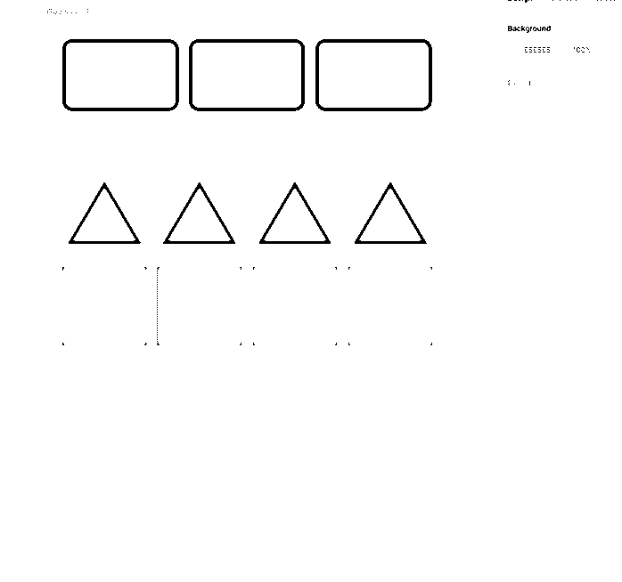

**步骤 11:** 现在调整主机的大小，我们看到顶部的矩形跟随网格位置并均匀收缩，但是中间的部分没有，因为尽管我们指定了 4 列，但是仍然应用了 6 列网格

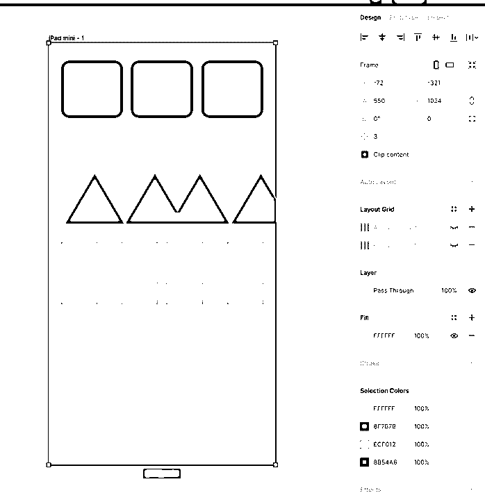

**步骤 12:** 为了解决这个问题，我们首先选择中间部分的所有矩形和三角形。您可以单击并拖动区域以全选，然后通过在“图层”面板中单击鼠标右键并组合选区或按 Ctrl + G 来组合选区。

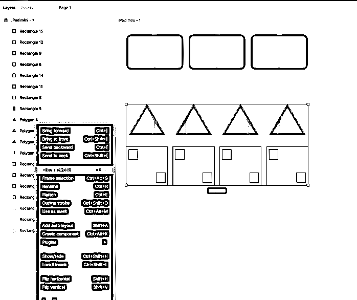

**步骤 13:** 然后，在设计面板中，从下拉列表中选择一个框架，而不是组，这只是一个带有组尺寸的自定义框架。

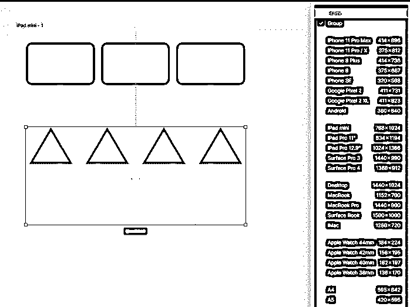

**第 14 步:**现在我们要做的是使用设计面板从主机中删除 4 列布局网格，并单击布局网格部分，这将只保留 6 列布局。然后，在框架中添加一个 4 列的布局网格，我们刚刚创建的框架的边距为 0 像素，装订线为 20 像素。

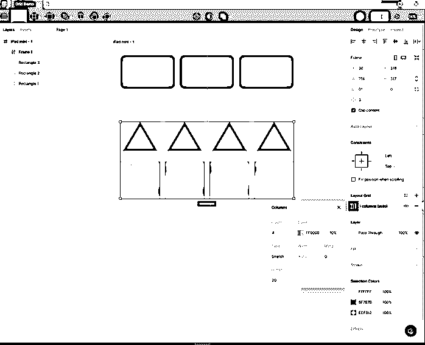

第 15 步:现在，我们可以独立于主机调整这个框架，并拖动它横跨整个主机，两边没有边距。然后，通过单击 alt 并拖动边从中心开始缩放来调整三角形的大小，同时按住 shift 以确保纵横比不会改变或扭曲。此外，删除那些额外的小矩形，并安排他们如图所示。

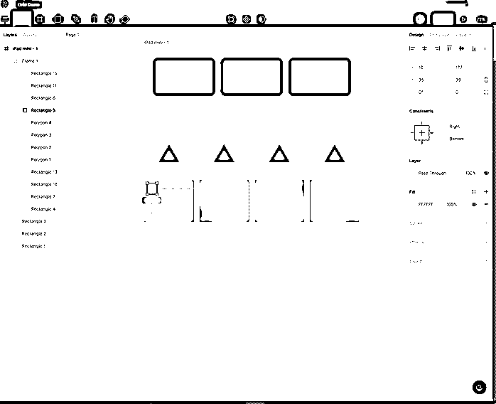

**步骤 16:** 三角形的约束是中心、顶部

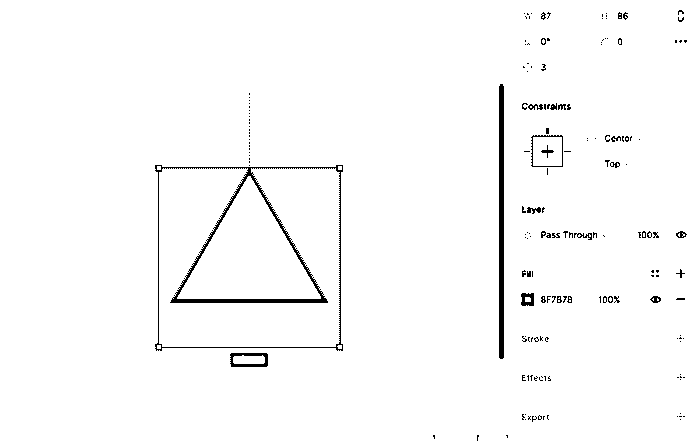

第 17 步:前两个小矩形的约束保留在左边，因为不管是什么样的布局，我们都希望它们保持在左边。

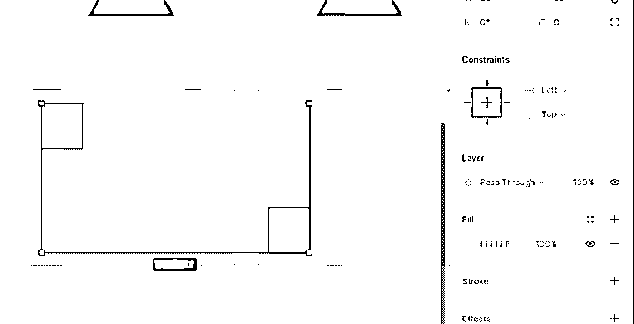

第 18 步:最后两个小矩形的约束是正确的，因为不管是什么样的布局，我们都希望它们保持正确。

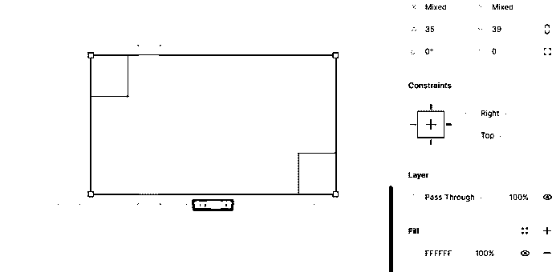

**步骤 19:** 接下来，我们创建另一个跨越 3 个网格的矩形，如左上约束所示。

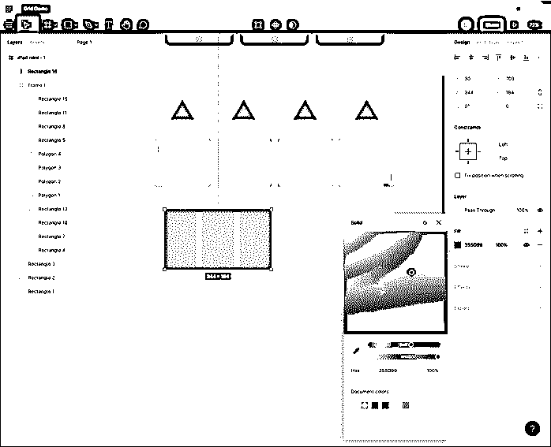

第 20 步:然后选择文本工具或按 T 键创建一个跨越 3 列的文本框，带有左、右、顶部约束，并在其中粘贴一些虚拟的 lorem ipsum 文本。

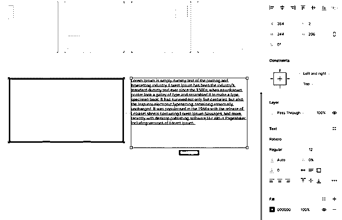

步骤 21: 现在，当我们改变布局时，文本被矩形弄乱了，因为它们仍然试图遵循 6 布局网格结构

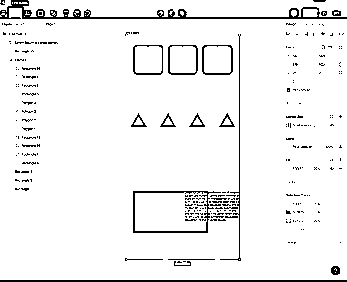

**第 22 步:**所以按 Ctrl + Z 改为默认的主机尺寸，然后同时选择矩形和文本，然后右键组合选择或按 Ctrl + G

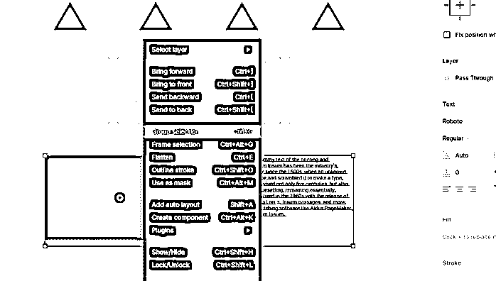

步骤 23: 现在，再次将组更改为框架

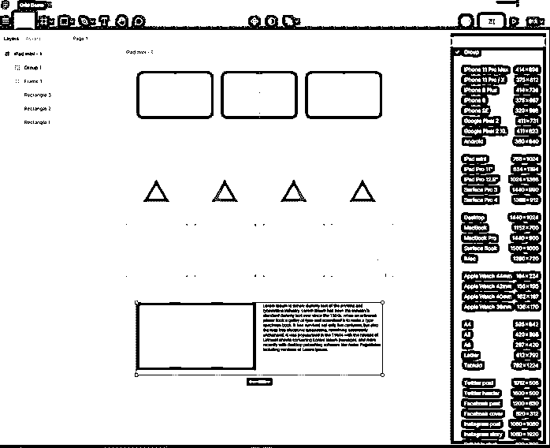

步骤 24: 现在，在这个框架中，我们不想要任何布局网格，但是我们想要的是将框架的约束设置为左、右、上。

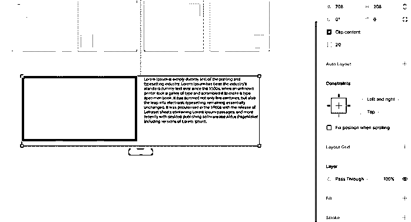

**第 25 步:**现在，如果我们调整主机的大小，那么矩形就在适当的位置，文本也应该重排。

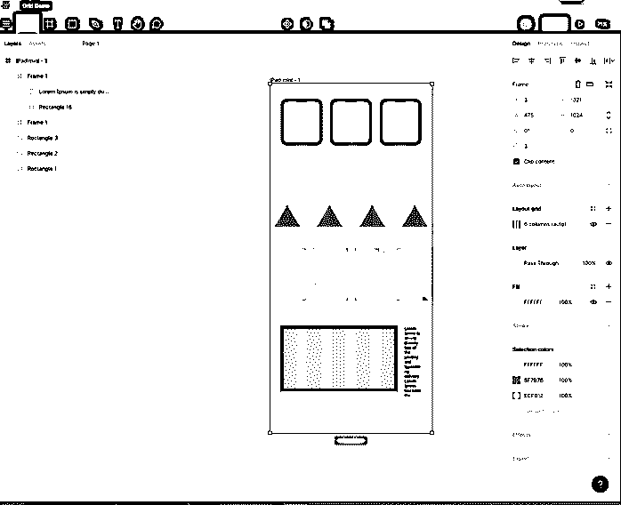

**步骤 26:** 现在，为了在多个设备上快速测试我们的原型，我们只需添加创建一个新框架，并将布局网格设置为与第一个相同。

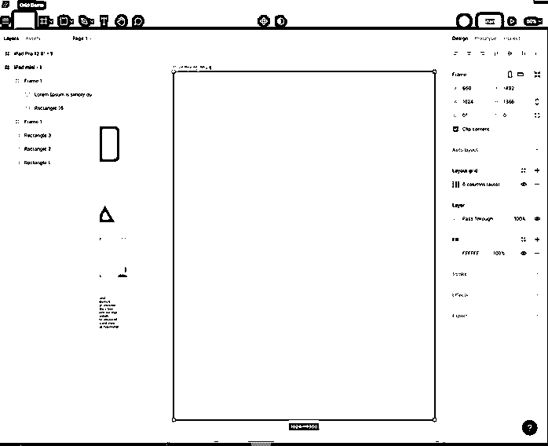

第 27 步:然后将第一个框架粘贴到第二个框架上，然后拖动以适应这个布局。我可能需要调整一些形状来适应网格。

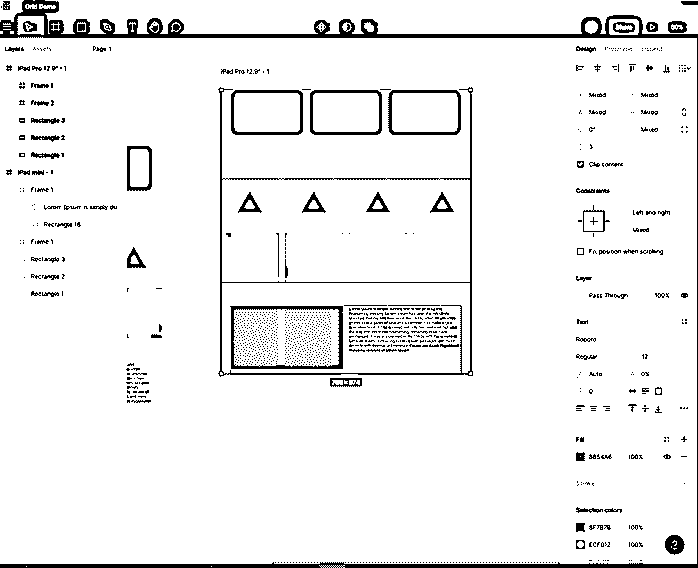

**第 28 步:**我们可以看到，我们的设计完全符合要求，并采用了这种新的外形。

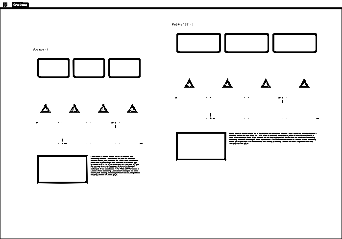

### 结论

在本文中，我们学习了如何在 Figma 中使用网格。首先，我们从一个简单的框架开始，然后我们创建了一个网格，并使用多个网格布局和框架添加了所有的对象和形状，以创建一个有凝聚力的设计，它考虑了屏幕的不同长宽比。

### 推荐文章

这是 Figma 网格的指南。这里我们讨论如何在 Figma 中使用网格，然后我们创建了一个网格并添加了所有的对象和形状。您也可以看看以下文章，了解更多信息–

1.  [Figma 备选方案](https://www.educba.com/figma-alternatives/)
2.  [UI 设计工具](https://www.educba.com/ui-design-tools/)
3.  [Illustrator 网格工具](https://www.educba.com/illustrator-grid-tool/)
4.  [3ds Max 室内设计](https://www.educba.com/3ds-max-interior-design/)

