# SketchUp 景观设计

> 原文：<https://www.educba.com/sketchup-landscape-design/>

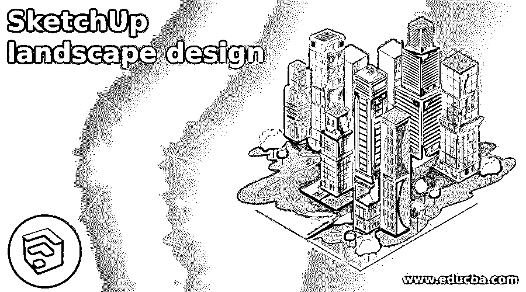

## SketchUp 景观设计简介

SketchUp 景观设计是该软件中 3d 建模的一部分，通过它，我们用不同的结构覆盖 3d 模型的内部或外部部分，例如包括公园、花园、绿地、运动场地等。在这个设计中，我们通过不同的规划和设计来管理开放空间，从而为城市和乡村地区创造一个良好的环境。您可以为此景观设计创建任何环境对象或结构，并且该设计应该针对周围的模型。因此，让我们来分析一下这个话题，以便更好地理解这一点。

### 如何在 SketchUp 中进行景观设计创作？

景观设计取决于模型的目的，你可以据此创建一个景观设计；它可能是一个公园、花园、树木或水池等等。那么让我们来看看我们如何创造它？

<small>3D 动画、建模、仿真、游戏开发&其他</small>

这个模型已经从这个软件的一个在线库中下载了，这个库就是 3D 仓库，我们会借助这个模型给你讲解景观设计。例如，在这里，你可以看到这个模型周围的一些树木和绿色区域，这是景观设计的一部分，这个模型的设计师将它包括在模型中。

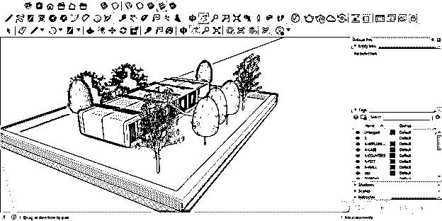

毫无疑问，在这种模式的景观设计中，绿色物体达到了完美的平衡，但让我们来看看我们能为这种模式的景观设计做些什么。我们将从模型中隐藏这些树，并将为景观设计重新开始。这是这个模型的前视图。

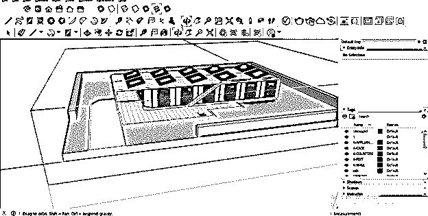

我们想在这条路附近添加一个植物盆作为景观设计，这样我们就可以从 3D 仓库库中获得一个树盆模型。可以从菜单栏的 Windows 菜单中找到 3D Warehouse 库。我们将点击它。

并在 3D Warehouse 对话框的搜索框中搜索我想要的组件。

我们将选择这个花盆作为我的景观设计的一部分，这样我们就可以点击下载按钮，直接在我的模型上使用它。为此，您可以使用自己设计的其他 3D 软件组件。我们只是把它作为一个例子。

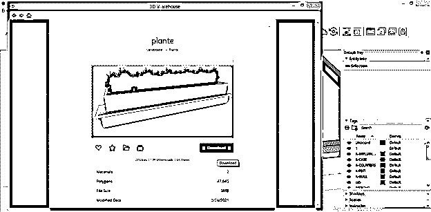

首先，我们将通过单击地面区域将其放置在模型站点的任何位置。

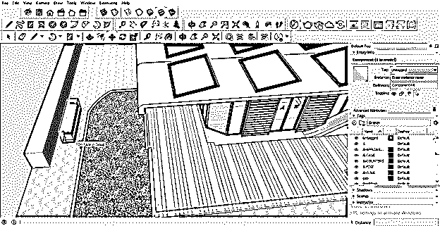

我们想把这个花盆放在屋顶阴影的下面，所以我首先用工具面板的旋转工具把它旋转到和屋顶阴影相同的方向。

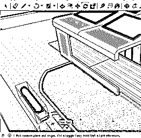

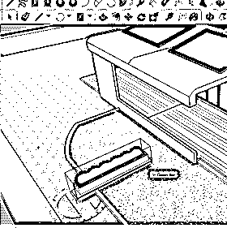

把它移到样板房墙的旁边。

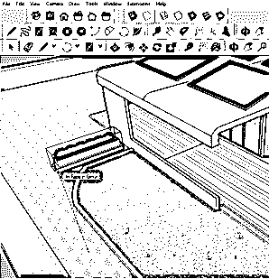

你可以看到它是如何美丽地覆盖这片空白区域的。如果您愿意，您可以缩放它或更改它的材质，以与此房屋模型材质相匹配。要在导入的组件中对材料或纹理进行任何更改，您必须双击它，因为它已被分组，并且是一个组件对象。

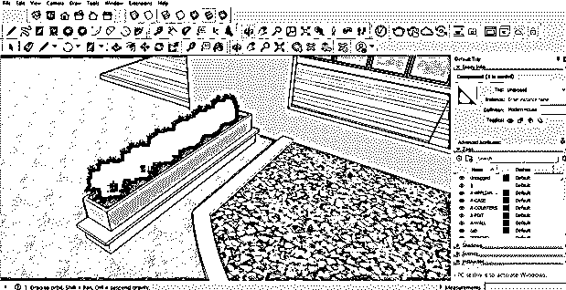

我们将从 3D 仓库中再拿一个不同风格的植物模型。

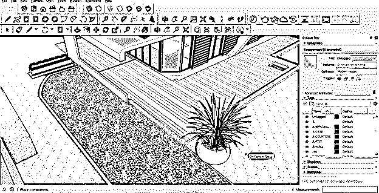

您可以根据您的景观设计要求缩放任何进口模型。根据这个模型，这个植物模型稍微大一点，所以我们将借助工具面板的缩放工具缩小它。

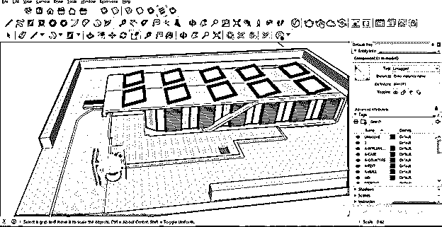

我们会像这样放置这个植物盆，并制作多个副本，放在不同的地方，覆盖空地区域。这也将是我景观设计的一部分。

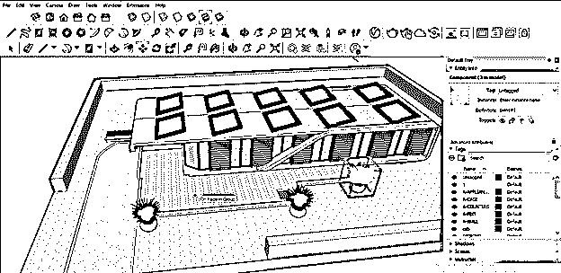

现在让我们移动到这个房子模型的后面部分，我们想在这里做一个圆形的水池来覆盖这个开放的区域，从工具面板中选择圆形工具。

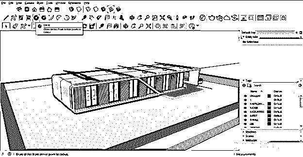

像这样画一个圆。我们不考虑任何维度。我们徒手画它只是为了向你解释景观设计。

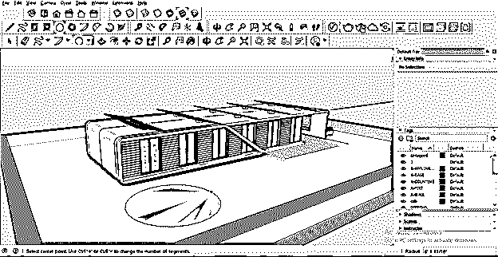

现在，它将创建一个边界，通过使用这个软件的偏移工具。因此，只需选择这个圆的边缘，并在偏移工具的帮助下向外拖动它。

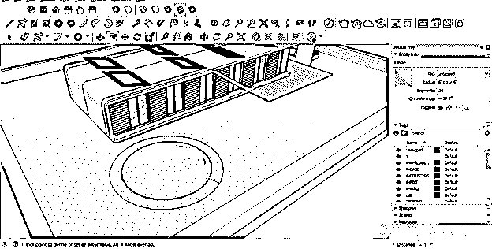

我们将使用推/拉工具给这个边界增加一些高度。

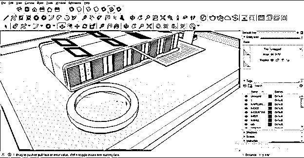

同样，用同样的工具在这个边界的中心区域添加一些基础高度。

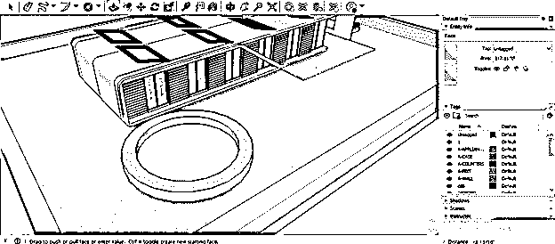

让我们把材料填充到这个池子里，使这个结构完整，并给它一个真实的外观。为此，请转到“材质”面板。如果您的工作屏幕上没有材质面板，那么您可以在窗口菜单的默认托盘选项的下拉列表中找到它。

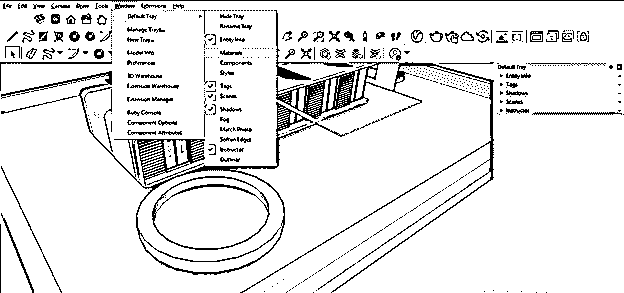

首先，我们将为该结构的中心选择池水材质，因此将首先选择该区域，然后在材质列表中选择水纹理。

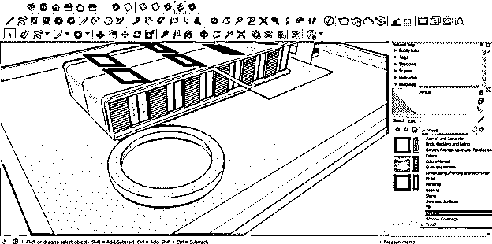

我们将从水的纹理列表中选择水池纹理。

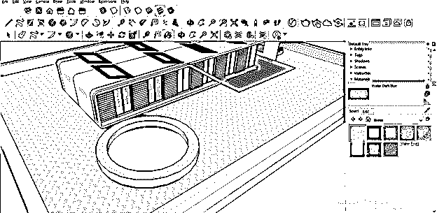

然后在这个区域点击它。

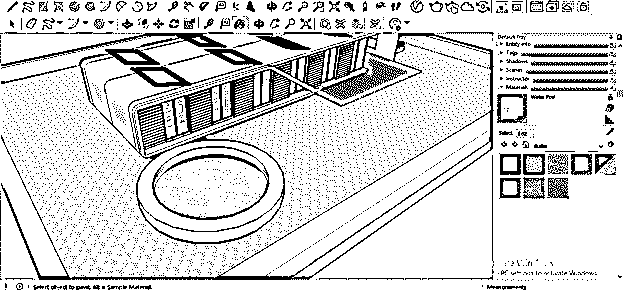

现在，我们将使用选择工具选择边界的侧壁，并从砖材质列表中选择砖材质。

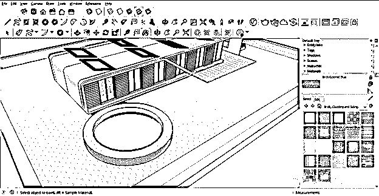

在将材质应用到这个边界的所有表面后，我们将选择整个对象并使其成为一个组。选择它们进行分组后，右键单击它，然后单击下拉列表中的“Make group”选项。

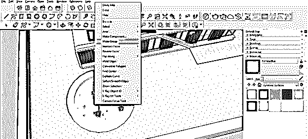

现在，我们将在移动工具的帮助下，将它移动到这个模型中我想要的位置，它将覆盖好的开放空间，并为这个模型提供拥有它的目的。

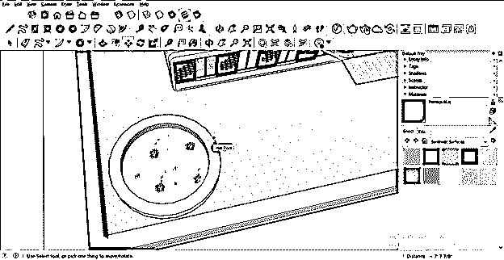

我们只是给了你一个关于景观设计的想法，但你可以做更多的工作。你应该首先找到在模型的一个开放区域中使用任何东西的目的。

### 结论

景观设计将不再需要你不认识的文字，你可以根据你的模特的要求来创作。您自己创建此设计，并从 3D Warehouse 中为其创建不同类型的组件。您还可以根据您的设计要求，在导入的对象中进行不同类型的参数更改。

### 推荐文章

这是一个 SketchUp 景观设计指南。这里我们详细讨论如何在 SketchUp 中创建景观设计，以便更好的理解。您也可以阅读以下文章，了解更多信息——

1.  [SketchUp 替代方案](https://www.educba.com/sketchup-alternative/)
2.  [SketchUp 旋转](https://www.educba.com/sketchup-rotate/)
3.  [SketchUp AutoCAD](https://www.educba.com/sketchup-autocad/)
4.  [CorelDRAW 标志设计](https://www.educba.com/coreldraw-logo-design/)

