# GIMP 矢量图形

> 原文：<https://www.educba.com/gimp-vector-graphics/>

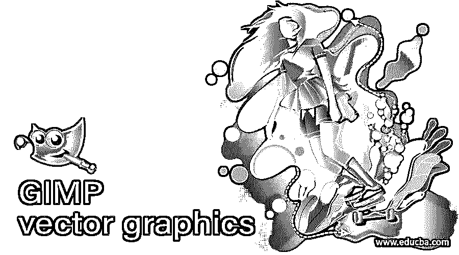

## GIMP 矢量图形介绍

在这篇文章中，我们将学习如何在 GIMP 中使用矢量图形。虽然 GIMP 是一个图形编辑程序，但是您可以提取路径并创建 svg 格式的图像，这些图像可以用于您选择的矢量图形应用程序。除此之外，您还可以从 png 或 jpg 图像创建矢量形状。我们也可以在 GIMP 中使用路径工具创建我们自己的矢量艺术，通过产生平滑和美丽的曲线，但是如果你想要一个更几何的形状，那么就不要拉路径的手柄，你会得到一个完美的角形。矢量图形用于创建徽标、绘图、横幅、t 恤设计、文具、小册子等等。

### GIMP 矢量图形的步骤

不同步骤如下所述:

<small>3D 动画、建模、仿真、游戏开发&其他</small>

**第一步:**首先，我们将从使用一个 png 图像开始。转到以下 url 并从 pngtree 下载所需的图像，或者您可以随意使用自己的资源-https://png tree . com/free png/human-character-with-green-tree-logo _ 3732560 . html。

**第二步:**让我们从进入文件菜单打开一张图片开始，然后打开或按 Ctrl + O。

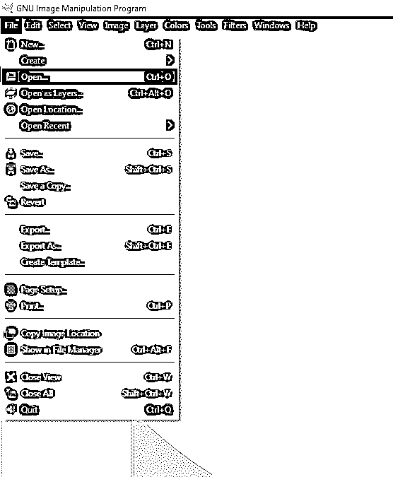

**步骤 3:** 然后导航到下载的图像并在 GIMP 中打开它

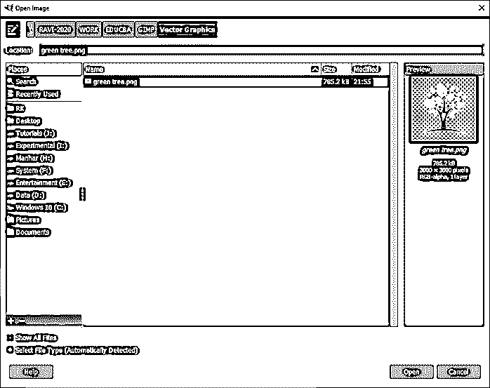

步骤 4: 现在，我们已经将这个 png 转换成 svg，这样任何矢量图形应用程序都可以使用它。

**第五步:**然后使用模糊选择工具或者按 U 键，然后点击任意空白区域将选择路径，类似于 photoshop 的魔棒工具。如果你想选择一个特定的项目，然后点击它，如果你想选择多个项目，然后按住 shift 键并选择。

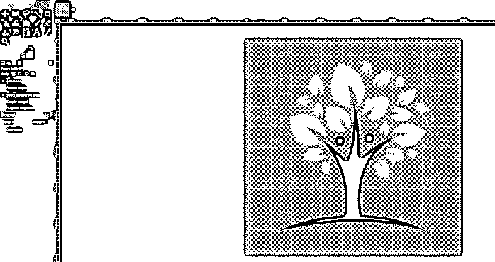

**步骤 6:** 现在，要从这个选择创建一个路径，导航到 Select - > To Path

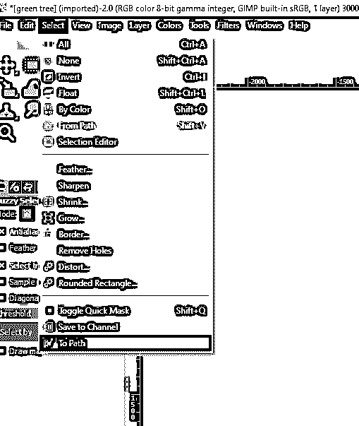

**第七步:**路径面板在右下角图层面板旁边可见，如果不可见，那么选择窗口- >可停靠对话框- >路径，然后停靠在图层面板旁边。

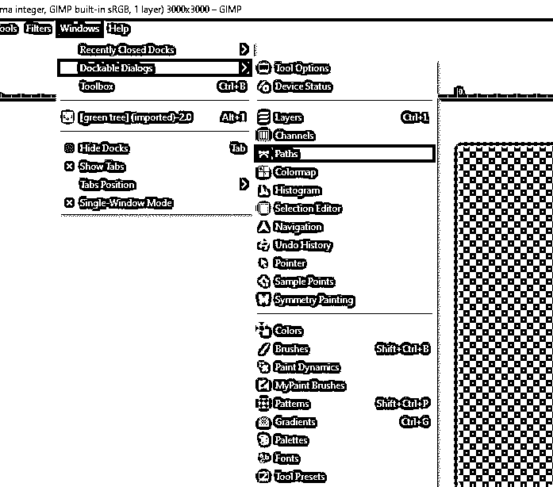

**步骤 8:** 然后双击路径面板中的选区，查看选区。在这里你可以调整路径，并确保你有一个很好的清晰，干净的边缘。查看任何不必要的点，并通过单击和拖动进行调整。这与使用路径工具是一样的，使用路径工具的所有技术都可以应用于获得完美的选择。

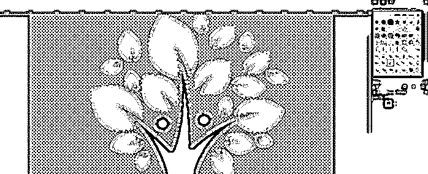

**第九步:**调整完成后，右击选择，然后点击导出路径，将导出一个 svg 文件

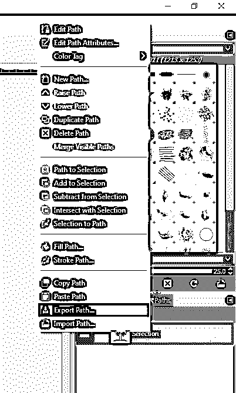

**步骤 10:** 用。svg 扩展，可以导入任何矢量图形应用程序，并进一步工作。

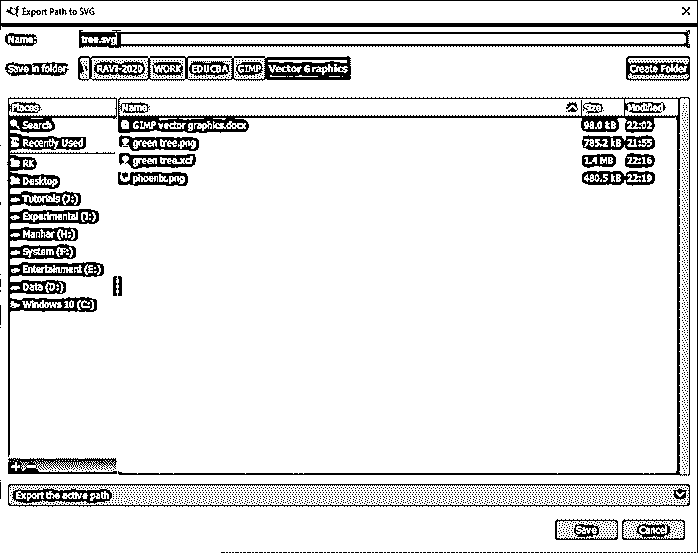

**第十一步:**这是可以在任何浏览器中预览的结果。

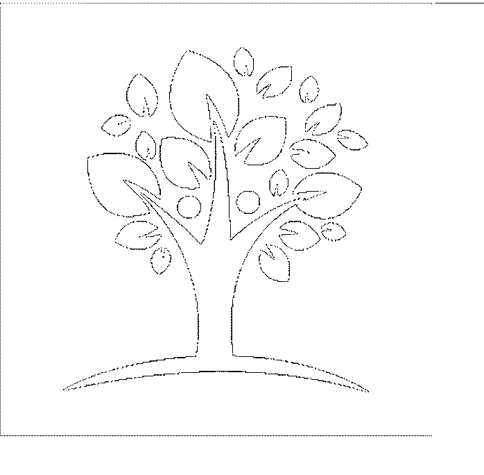

**步骤 12:** 您可以使用矩形选择工具更改选择，并增加和减少选择区域。

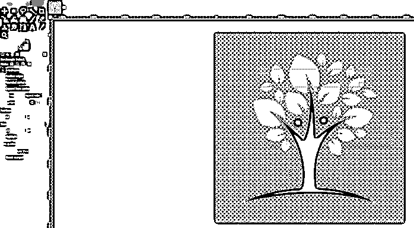

**步骤 13:** 然后，我们将把选择转换成选择菜单中的路径。选择- >到路径

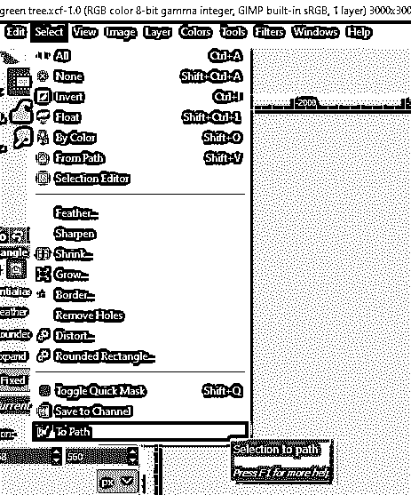

**步骤 14:** 然后双击选择路径，我们在右下角的路径面板中得到更新后的路径。

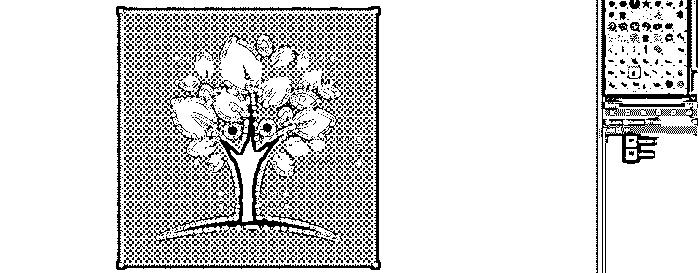

步骤 15: 我们已经用一个简单的没有渐变的图像工作到现在；让我们看看，如果图像中有渐变，我们如何选择路径。

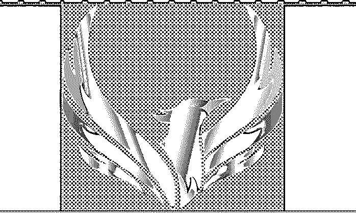

**步骤 16:** 再次使用模糊选择工具，尝试选择凤凰的部分，但是现在由于渐变的原因，无法做出合适的选择。为了解决这个问题，我们把阈值改为 150，目前是 15。这完全取决于图像的类型。在您的图像中可能会有所不同，但 150 在此图像中很好。

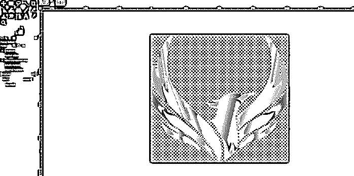

**步骤 17:** 使用 shift 键，选择凤凰的所有部分

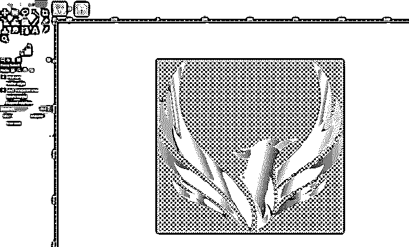

**步骤 18:** 有些情况下，即使我们改变阈值，也无法做出恰当的选择；在这种情况下，我们可以从图像菜单中将模式更改为索引。

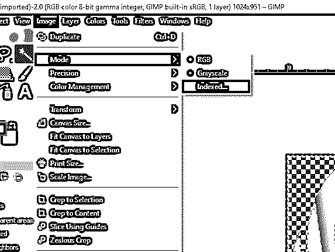

第 19 步:你可能想对你的特定图像进行实验，但是我们可以生成一个最大颜色数为 2 的最佳调色板，并为该图像单击“转换”。

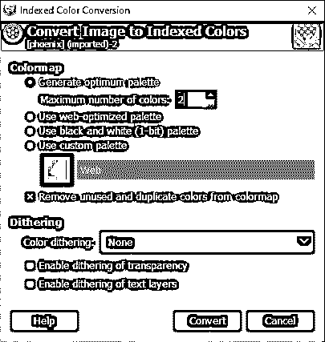

**步骤 20:** 我们可以看到，图片转换为 2 色，去除渐变，使得使用模糊选择工具更加简单。

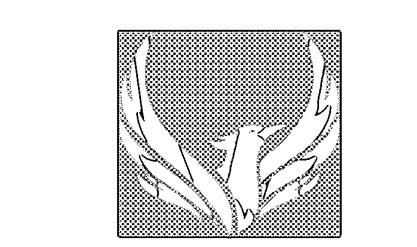

**步骤 21:** 制作图像的路径，转到选择和到路径。

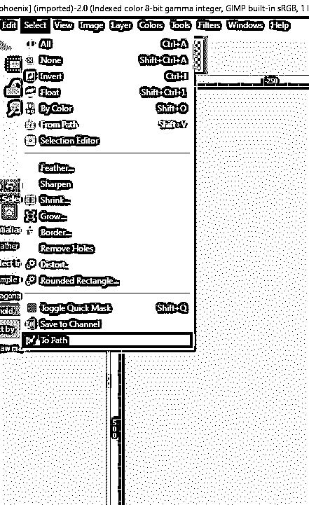

**第 22 步:**这是导出的结果，需要记住的几个技巧是，保持路径简单和对许多路径使用 svg 可能具有挑战性。在这种情况下，纯色比渐变效果更好。不要重叠顶点，这会使事情复杂化。

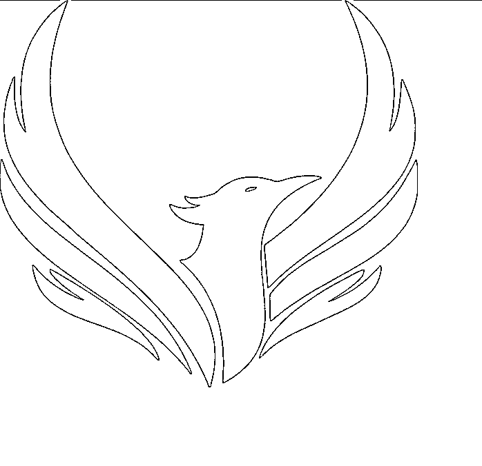

**步骤 23:** 接下来，我们将在 gimp 中创建一个简单的矢量图形；为此，首先，我们使用椭圆选择工具或按 E 键，创建一个圆，并填充黄色。

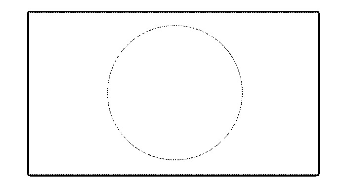

**步骤 24:** 然后使用路径工具或者按 B 键，创建一个简单的形状，如图所示。

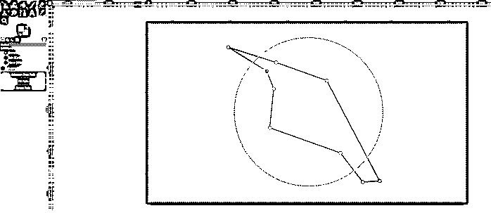

**步骤 25:** 使用路径工具，添加一些点，做出一个鸟的形状。您也可以通过拖动来创建曲线。

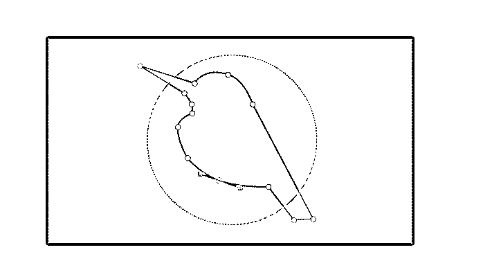

步骤 26: 使用桶填充工具从路径中创建选区来填充前景

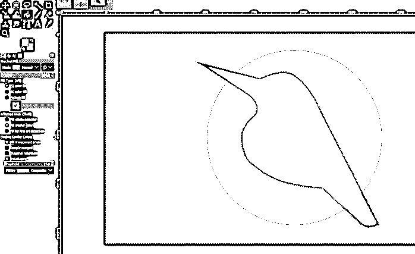

**步骤 27:** 同样，继续使用路径工具创建路径，然后填充。

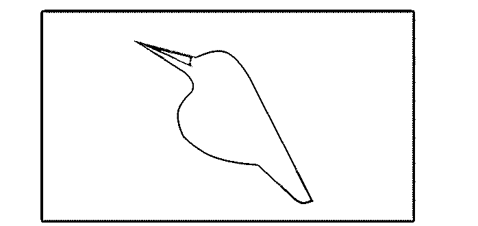

**步骤 28:** 你也可以用椭圆工具做一个选区，然后用黑色或者白色填充。

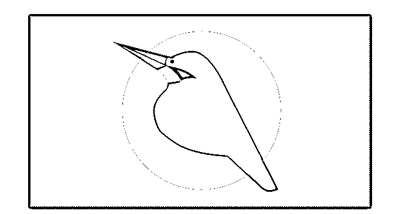

第 29 步:你可以继续创建一个路径并填充它。您也可以使用渐变填充，您可以创建自己的渐变或选择一个预置的渐变。因此，我们已经成功地在 GIMP 中创建了一个矢量图形，并使用图像来获得 svg 形状。

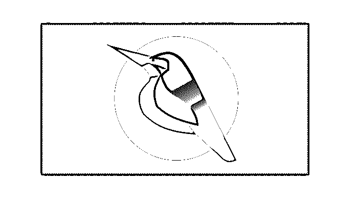

### 结论

在本文中，我们看到了如何在 GIMP 中创建矢量图形。首先，我们已经看到了如何从任何 png 文件中提取 svg 文件，我们可以在任何矢量应用程序中进一步使用它。然后，我们已经看到了复杂的图像和如何处理梯度简化，如果使用指数模式。然后我们使用路径工具从头开始创建了一个矢量图形。如果艺术将用于印刷目的，质量因素是重要的。

### 推荐文章

这是 GIMP 矢量图形指南。这里我们讨论如何在 GIMP 中处理矢量图形，以及如何从任何 png 文件中提取 svg 文件。您也可以看看以下文章，了解更多信息–

1.  [GIMP 替代方案](https://www.educba.com/gimp-alternatives/)
2.  [最佳平面设计软件](https://www.educba.com/best-graphic-design-software/)
3.  [UI 设计工具](https://www.educba.com/ui-design-tools/)
4.  [CorelDRAW 标志设计](https://www.educba.com/coreldraw-logo-design/)

