# Illustrator 中的图层

> 原文：<https://www.educba.com/layers-in-illustrator/>

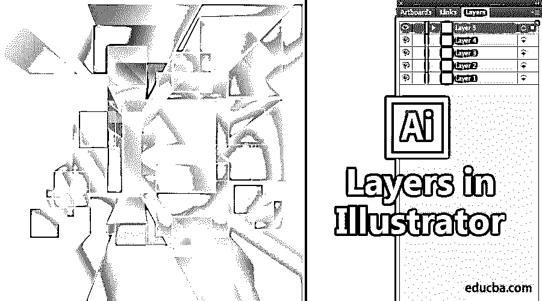

## Illustrator 中的图层介绍

Illustrator 中的图层是包含文本、图像和作品的透明文件夹。这些层可以根据用户的需要在任何时间点从文档中隐藏或显示。这些层包含关于该层中存在的对象或艺术品的所有必要信息。用户可以更改该特定层的不透明度，并锁定该层以在不接触该层的情况下处理其他对象。Illustrator 中的图层对于学习和理解非常重要，因为大多数工作都是在图层及其功能的帮助下完成的。

### 在 Illustrator 中创建图层

在第一部分，我们将讨论如何创建一个层。

<small>3D 动画、建模、仿真、游戏开发&其他</small>

**第一步:**开始使用图层，从窗口打开并选择**图层**选项。

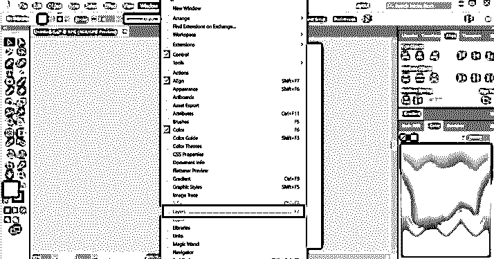

现在你会在右下角看到一个图层面板。您可以开始使用“层”选项来列出、管理和控制作品中的项目。建议在文档中始终保持图层面板处于激活状态，以便于访问。

第二步:现在，进入图层面板，按下下面的图标，如图所示。这将创建一个**新层**。默认情况下，该层被命名为**层 1** 。您可以通过双击要重命名的层来重命名它。

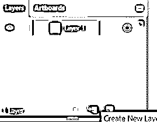

第三步:同样，新图层也将使用默认颜色。您可以通过双击图层并使用图层选项来更改其颜色。见下图。

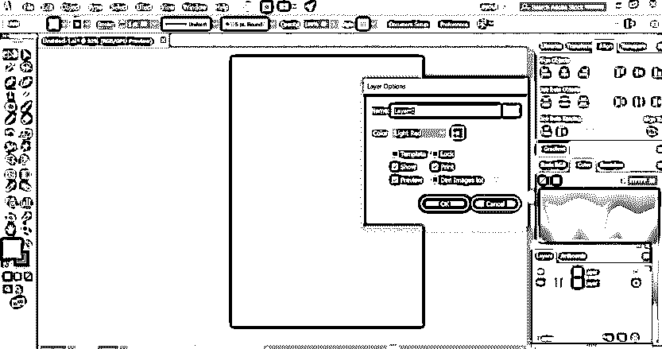

**第四步:**你会发现 adobe illustrator 图层与创建的图层相邻。它用于隐藏或显示层中的内容。

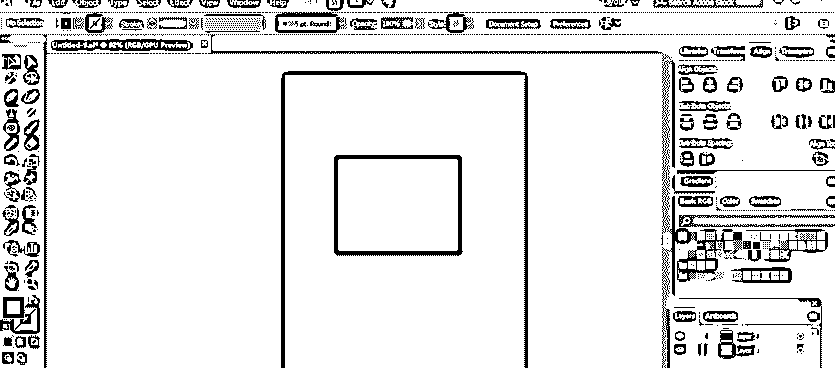

**第五步:**按下，眼睛图标消失，使里面的所有物品看不见。如果您需要再次查看该层，您只需再次按下眼睛图标区域。

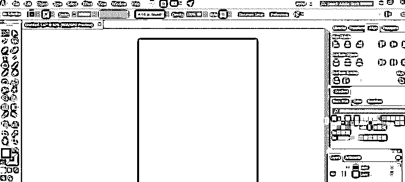

**第六步:**眼睛图标旁边是**锁定你的图层**的区域。单击此处，会出现一个挂锁图标。这意味着您的层被锁定，您不能从层内的项目中移动或选择任何内容。同样，如果您需要这些项目，请单击锁图标，现在您可以再次在该层上工作。

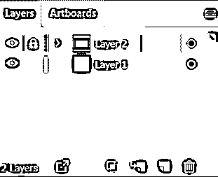

#### 设置图层和子图层选项

Illustrator 允许用户进一步创建对象并将它们与父层链接。它被称为子层，其中的项目将从原始层分支。遵循以下说明。

1.  从“图层”面板中双击对象。
2.  在“图层”面板中，选择项目后选择选项。
3.  最后，从“图层”面板菜单中选择“新建图层”或“新建子图层”

#### 将对象移动到不同的层

通常，在 Illustrator 中，一旦创建了一个对象，您可能需要将其移动到不同的层。在一个层中创建对象后，您仍然可以按照以下说明将它们移动到不同的层:

1.  选择您需要移动的项目。
2.  选择要将项目移动到的图层。
3.  现在转到对象>排列>发送到当前层。
4.  一个更简单的方法是将对象直接拖动到所需的层。只是要小心，你是移动对象到正确的层。

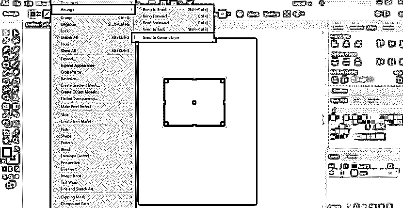

#### 合并层和组

您可以选择将不同的层或对象融合成一个。如果您需要将图层合并或拼合为一个图层。合并允许将所选项目合并到一个层中，而拼合会将所有项目合并到一个层中。使用这两个选项，堆叠顺序保持不变；但是，所有图层级别的元素都将丢失。

*   要合并项目，如果您使用的是 Windows，请按住**控制键**，如果您使用的是 Mac，请按住**命令键**。您也可以使用 shift 键在图层中选择一些对象。之后，使用图层面板菜单，选择**合并选中的**选项。结果将是一个基于您最后选择的图层的合并图层。

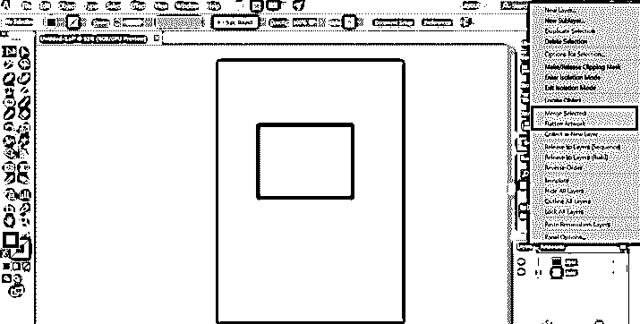

*   如果要展平图层，请选择要展平的图层。之后，使用“图层”面板菜单，选择“拼合图稿”选项。

#### 在“图层”面板中找到一个项目

在处理文档时，可能会出现丢失图稿中对象的情况。Illustrator 中有一个非常简单的方法可以跟踪这些丢失的元素。

*   在文档窗口中选择一个对象。如果选择多个对象，将会找到堆叠顺序中最前面的对象。这种顺序对于在复杂图层中查找东西特别有用。
*   从选项中选择定位对象，如果仅显示层被选中，选项变为定位层。

#### 更改“图层”面板的显示

你可以决定如何展示你的图层面板。你可以把它变得简单或复杂，这取决于你的需要。作为一个标准，所有的项目将被安置在父层之下。使用图层面板，您可以进一步自定义外观、颜色和其他属性，如锁定、隐藏等。

**步骤 1:** 从图层面板菜单中，选择**面板选项**。

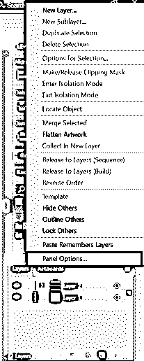

**第二步:**为了隐藏路径和棒状物体，从面板选项中选择**只显示图层**。

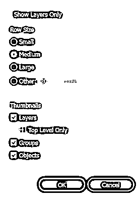

**第三步:**现在，对于行大小，选择一个适合你需要的。通常，您可以填充 12 到 100 之间的值。在 Illustrator 的较新版本中，提供了三个选项-小、中、大。

### 结论–Illustrator 中的图层

创建详细而复杂的艺术品通常很困难，因为你必须管理许多元素，包括形状、路径和对象。Illustrator 的图层面板选项为控制图层和对象提供了许多分类，使事情变得简单。这也使得快速找到微小的东西变得更加简单。尝试在 Adobe Illustrator 中使用图层并优化您的工作流程。

### 推荐文章

这是 Illustrator 中的图层指南。在这里，我们讨论了在 Illustrator 中创建图层的步骤，并讨论了不同的子图层选项、合并图层和组。您也可以查看我们的其他相关文章，了解更多信息——

1.  [Illustrator 中的形状](https://www.educba.com/shapes-in-illustrator/)
2.  [Illustrator 中的文本效果](https://www.educba.com/text-effects-in-illustrator/)
3.  [Illustrator 中的 3D 效果](https://www.educba.com/3d-effects-in-illustrator/)
4.  [后期效果中的 3D 效果](https://www.educba.com/3d-effects-in-after-effects/)

