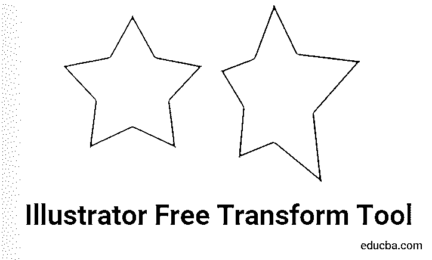
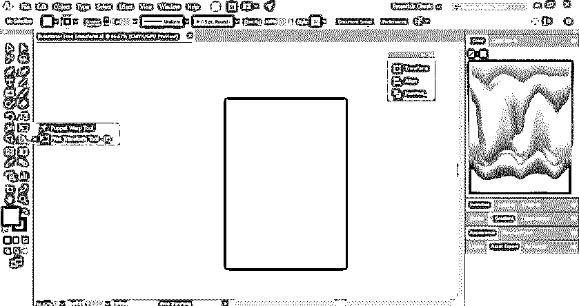
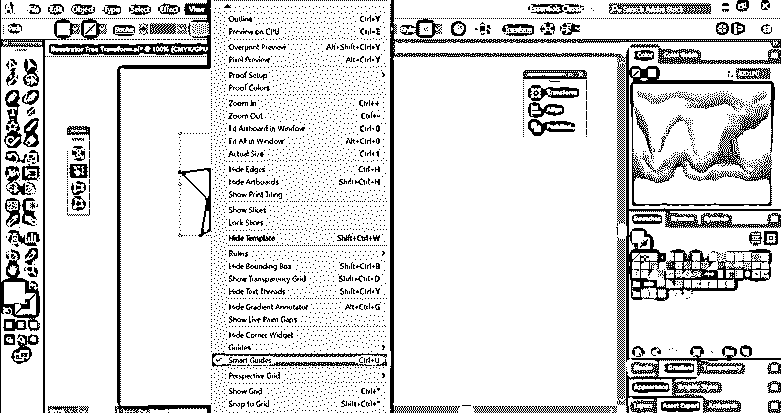
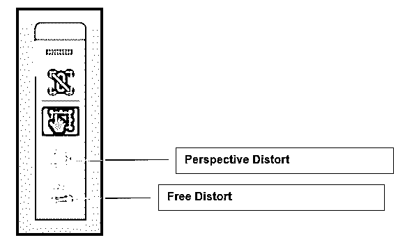
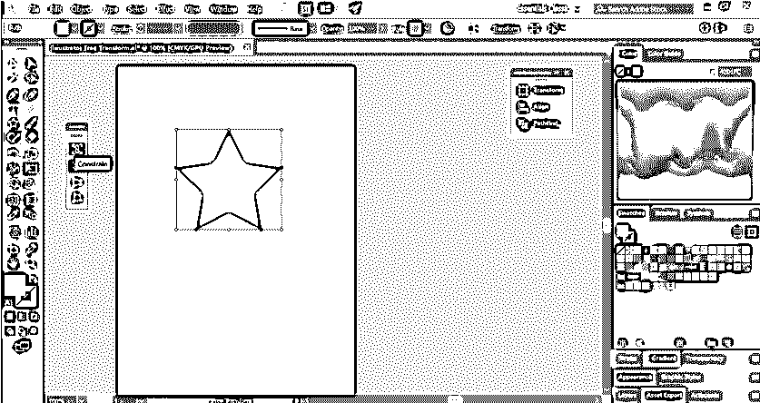
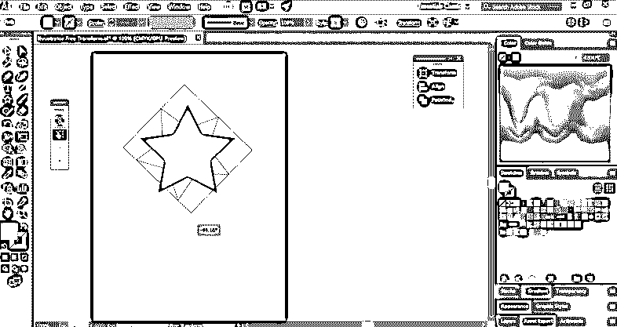
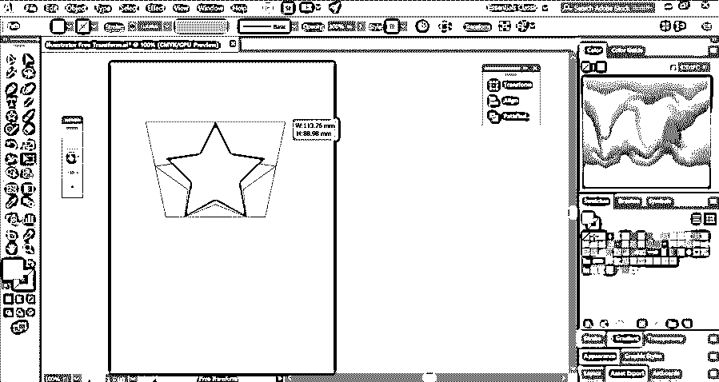
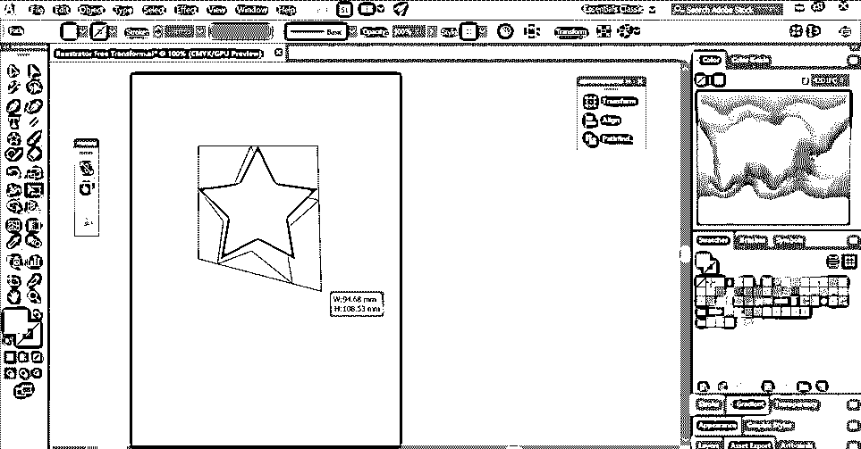

# Illustrator 自由变换工具

> 原文：<https://www.educba.com/illustrator-free-transform-tool/>

## Illustrator 自由变换工具概述

自由变换工具是一种有用且有效的工具，可用于旋转、调整大小、镜像和弯曲图稿。此外，还有添加扭曲和透视效果的选项。选择自由变换工具后，会出现一个新的小部件。它包含各种选项的按钮。用户也可以使用键盘按键控制工具。最好是将智能参考线与自由变换工具结合使用，以实现对齐控制。Illustrator 中新的[更新支持触摸支持。因此，您可以使用触摸屏设备操作这些工具。通读这篇文章，学习在你的项目中使用自由变换工具。](https://www.educba.com/illustrator-shortcut-keys/)

### 使用 Illustrator 自由变换工具的步骤

以下是了解如何使用自由变换工具的步骤。

<small>3D 动画、建模、仿真、游戏开发&其他</small>

**第一步:**首先，您必须从工具面板中选择您创建的作品。为此，去选择工具，并选择它。您也可以使用快捷键(V)来快速选择对象。

**第二步:**选择图稿中需要变换的对象。

**步骤 3:** 在工具面板中选择可用的自由变换工具。它隐藏在木偶扭曲工具下面。如下图所示，按住木偶扭曲工具，下面会出现自由变换工具。

**第 4 步:**使用带有变换功能的智能参考线对您的工作很有帮助。按照下面的方法来做。转到菜单顶部的查看选项。从下拉列表中，选择智能参考线。这将显示智能指南。

现在，当您在画板中移动所选对象时，您会注意到可以用来对齐图稿的智能参考线。

**步骤 5:** 使用透视扭曲或自由扭曲的变换工具:为了修改一个对象，选择透视扭曲或自由扭曲选项。

As shown in the above image, toggle between perspective and distort based on your needs.

**第六步:**如果你需要自由变换一个对象，选择自由变换按钮。之后，执行以下操作:

*   **缩放:**你可以通过拖动角来改变大小，沿两个轴调整手柄的大小。您也可以只选择一个手柄在一个轴上缩放。

对于统一缩放，打开小部件上的约束按钮，会出现一个锁图标。接下来，要缩放，请使用 shift 键拖动对象。您也可以根据系统通过按住 Alt 键或 Opt 键从中心缩放图稿。

*   **反射**:全程拖动滑动手柄，可以反射一个物体。
*   **旋转**:将鼠标移离角柄一点点(指针形状变成双箭头)，然后循环旋转物体。您可以使用 shift 键将对象旋转 45 度角。如果您需要将对象旋转 180 度，只需对角拖动手柄，直到您想要为止。

*   **剪切:**只需从侧面拖动手柄，按下 Ctrl 键，继续该步骤。使用 shift 键来限制移动。若要离开慢跑，请按住 Alt 或 Option 键。

1.  选择需要剪切的艺术品或对象
2.  选择自由变换工具

**遵循以下说明:**

**Instruction: **To shear in a vertical axis, all you have to do is to start dragging the side handles either in the left or the right. After that, press the Ctrl + Alt key or the Opt + Cmd button as you pull. If you want to proportionally drag the object, hold the shift key. Now, if you need to horizontally shear an object, repeat the above dragging method by dragging the top or the bottom handles.

*   **透视:**拉动侧边手柄，按 Ctrl + Alt + Shift 组合键。在 Mac 中，拖移时使用 Cmd + Option + Shift。

*   **扭曲:**按住 Ctrl 键或 CMD 键，拖动边角手柄。

1.  选择要扭曲的对象
2.  接下来，激活自由变换工具

现在，您可以开始拖动对象的角手柄，并遵循以下方法:

1.  如果您使用的是 Windows，请按 Ctrl 键；如果您使用的是 Mac OS，请按 Cmd 键。看失真是否准确，结束流程。
2.  要在透视模式下扭曲，在 Windows 中使用 Shift + Alt + Ctrl，在 Mac 中使用 Shift + Option + Command。

你需要知道使用透视和扭曲需要一些额外的小心，否则你的工作可能会受到影响。

使用边界框缩放对象

1.  选择需要缩放的图稿。
2.  激活自由变换工具或选择工具。
3.  接下来，拉动边界框手柄，直到您发现对象已经达到所需的大小。

您可以通过以下方式进一步操纵缩放控件:

*   按住 shift 键均匀变换项目。
*   按 Alt 键或 option 键从慢跑开始缩放。

在 Adobe illustrator 中，默认情况下不转换笔画和效果。为此，你不需要改变一些设置。转到编辑选项，并从下拉列表中选择首选项。接下来，选择常规选项，并选择缩放笔画和效果。您也可以使用“变换”面板来根据项目缩放对象。现在，您可以通过指向该点并拖动它来更改参考点。要重置参考点，双击即可。

### 结论

通过阅读本文，您可能已经理解了自由转换工具给表格带来的好处。这是一个真正的时间节省，并带来了你的作品轻松预期的结果。如果您不熟悉该工具，请练习应用它，并在 Illustrator 中发现一种新的做事方法。

### 推荐文章

这是一个关于 Illustrator 自由变换工具的指南。这里我们讨论在 illustrator 中使用自由变换工具的步骤。您也可以阅读以下文章，了解更多信息——

1.  [3ds Max 工具的特性](https://www.educba.com/3ds-max-tools/)
2.  [Adobe Photoshop 工具](https://www.educba.com/adobe-photoshop-tools/)
3.  [Illustrator 中的混合工具](https://www.educba.com/blend-tool-in-illustrator/)
4.  [Illustrator 中的效果概述](https://www.educba.com/effects-in-illustrator/)

