# 水彩画笔插画师

> 原文：<https://www.educba.com/watercolor-brushes-illustrator/>

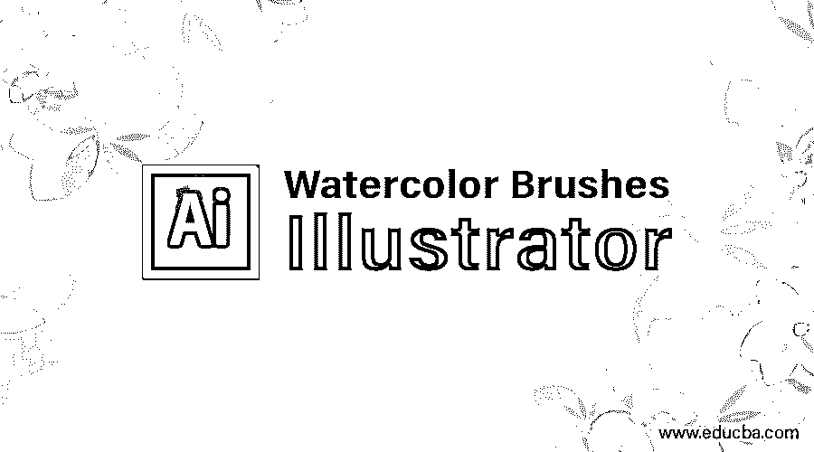

## 水彩画笔插画简介

下面的文章提供了一个水彩画笔插画大纲。可以使用 illustrator 中的任何形状或对象来创建画笔。用户可以创建许多类型的画笔，例如艺术、刚毛、图案和艺术画笔。水彩笔是程序中使用的最大的工具之一，它帮助用户在程序中创建令人惊叹的设计和艺术品。一旦用户在对象的帮助下创建了画笔，他就可以在文档中的任何时间点使用该画笔，并且该画笔被存储在软件中以备将来使用。

在“画笔”面板中可以找到的不同类型的画笔有:

<small>3D 动画、建模、仿真、游戏开发&其他</small>

*   **艺术画笔:**帮助沿着路径的范围拉伸对象。
*   **鬃毛画笔:**帮助生成带有鬃毛和毛发的有机画笔的笔触。
*   **书法画笔:**帮助注册看起来像用书法笔勾画的笔画。
*   **分散笔刷:**帮助沿着路径分散对象的副本。
*   **图案画笔:**帮助沿着路径重复一个图案。

### 如何在 Illustrator 中创建水彩画笔？

默认情况下，Illustrator 提供了自己的水彩画笔包，可以在“画笔”面板中使用。

*   导航到窗口菜单下的画笔面板，点击左下角的画笔库菜单，然后点击艺术>艺术 _ 水彩。

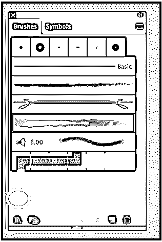

**画笔面板和画笔库菜单**

您可以创建、编辑和删除画笔库。

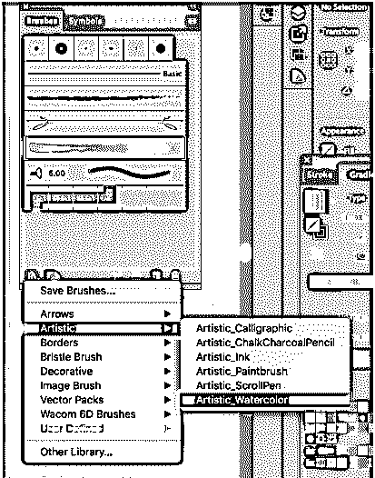

**艺术水彩**

下图展示了艺术水彩的不同效果。

**艺术水彩面板**

艺术水彩面板为您提供了从 12 个不同的辅助画笔中进行选择的选项。

*   要使用任何一种水彩笔，只要选择它，然后点击画笔工具，像平常一样画草图。您可以从“工具”面板中获得画笔工具。

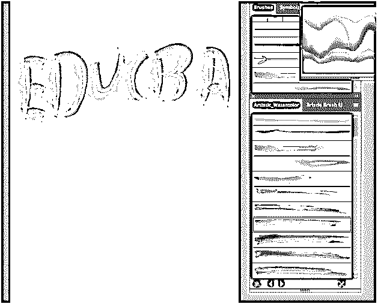

*   通过调整笔刷的笔画值，您可以轻松地修改笔刷的颜色，就像处理任何其他形状一样。

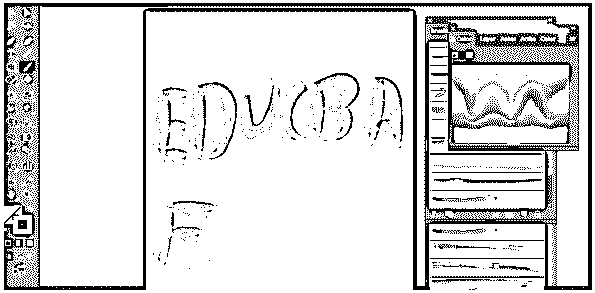

*   您还可以根据您尝试执行的操作，通过增加或减少笔触粗细来调整颜色和修改笔触或画笔的粗细。

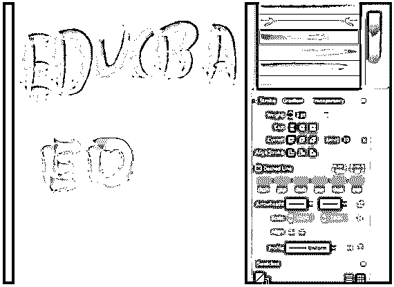

### 笔画调整和自定水彩画笔

Illustrator 中包含的笔刷有点简单。您可以创建自己的更有吸引力的画笔。我们将看看利用硬毛刷制作定制水彩笔的过程。

*   按照 Adobe 的说法，硬毛刷可以让你产生有机的、流畅的笔触，模仿用真实的刷子和水彩等媒介上色的效果。
*   默认情况下，Illustrator 提供了自己的硬毛画笔集合，您可以通过导航到“画笔”面板，然后按“画笔库”菜单来轻松使用它。
*   你将得到一个新的下拉列表，提供给你八个预定的笔刷组，列表中的第四个是硬毛刷。

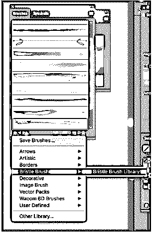

**鬃刷**

一旦你点击硬毛刷库，一个新的窗口将会打开，为你提供总共 14 个不同的刷子供你选择，所有的刷子都创造了一个完全不同的结果。

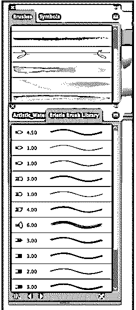

**鬃刷库**

要创建您自己的定制硬毛刷，请遵循以下步骤:

**步骤 1:** 再次导航到笔刷面板，然后点击右下角的新建笔刷按钮，如下所示。

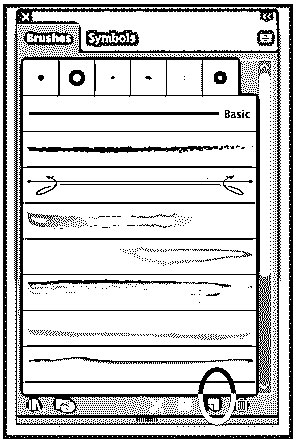

第二步:你会看到一个新窗口，询问你想要生产的刷子类型。确保您选择了硬毛刷，然后按确定。

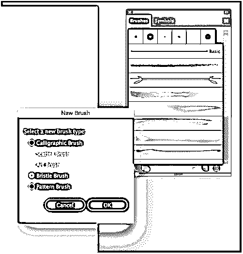

**第三步:**点击 OK 后，Illustrator 会打开猪鬃笔刷选项窗口，在这里你可以给你的笔刷命名，然后平衡它的不同设置。

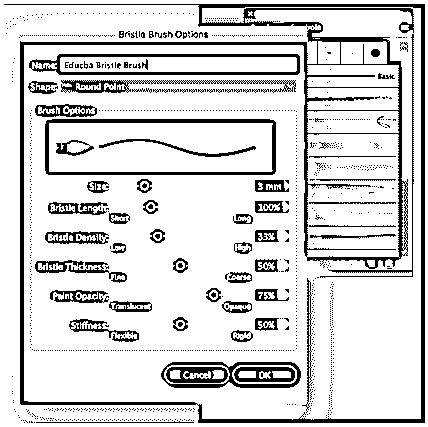

**第四步:**接下来，您可以看到一个名为 shape 的替代选项，它允许您从十种不同的刷头类型中进行选择，为我们提供了一个快速预览，这样我们就知道会发生什么。

对于本例，我们将选择圆形钝头。

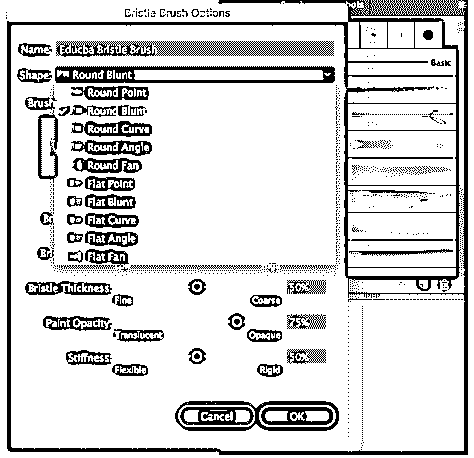

第五步:下一个选项是尺寸，顾名思义，它允许我们控制画笔的直径或宽度。我们将它设置为 5 mm，这将使我们更容易了解其他替代方案的作用。

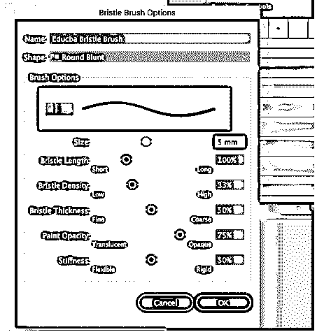

**第六步:**下一个选项是鬃毛长度，它允许我们修改鬃毛末端和它碰到手柄的点之间的范围。

作为一个定义，鬃毛是来自特定动物的细小、坚硬、粗糙的纤维毛发；通常是猪，用来制作刷子。因此，任何标签中包含术语“刚毛”的设置通常都会管理笔刷头发部分的特征。

当改变刷毛的长度时，你需要意识到长度越长，刷子就会变得越重越宽。将默认值设置为 130%，这将给出一个有点大的长度。

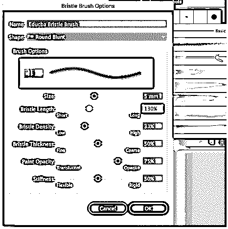

**第 7 步:**接下来是刷毛密度，它管理刷子尖端的刷毛数量，并根据刷毛长度和刷子尺寸进行计算。设置 30%的值，这将提供微妙的，清晰的重叠，水彩颜料被认为是。

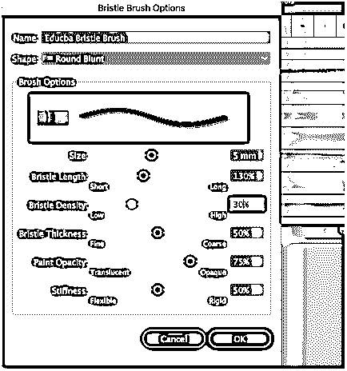

第八步:接下来是刷毛的厚度，顾名思义，它决定了刷子的刷毛厚度。对于本例，我们将厚度设置为 30%。第五个选项是绘画不透明度，它管理绘画的不透明度级别，可以从半透明到完全模糊。将默认值减少到 65%。

最终，硬度决定了刷毛的坚硬程度。当您使用较低的值时，刷毛将变得更加灵活，这将影响所绘制的油漆的最终外观。将该值设置为 25%。

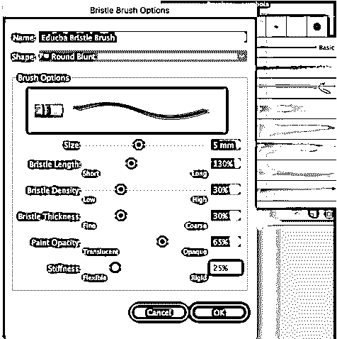

现在我们将使用我们在一个例子中创建的自定义水彩画笔。

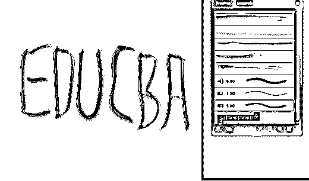

### 结论

这样，您可以使用鬃毛画笔、书法画笔、图案画笔、扫描图像等创建自己的自定义[水彩画笔。您还可以使用一系列在线矢量水彩画笔来扩展您的画笔库，如水彩矢量艺术画笔、水彩设计工具包、水彩画笔、纹理等。](https://www.educba.com/watercolor-brushes-in-photoshop/)

### 推荐文章

这是一个指南水彩画笔插画。这里我们讨论一下 Illustrator 中的入门以及如何创建水彩画笔？您也可以看看以下文章，了解更多信息–

1.  [学习 Illustrator 的顶级插件](https://www.educba.com/illustrator-plugins/)
2.  [如何在 Illustrator 中裁剪？](https://www.educba.com/crop-in-illustrator/)
3.  [在 Illustrator 中栅格化对象](https://www.educba.com/rasterize-in-illustrator/)
4.  [Illustrator 中的模糊](https://www.educba.com/blur-in-illustrator/)

