# Illustrator 中的模糊

> 原文：<https://www.educba.com/blur-in-illustrator/>

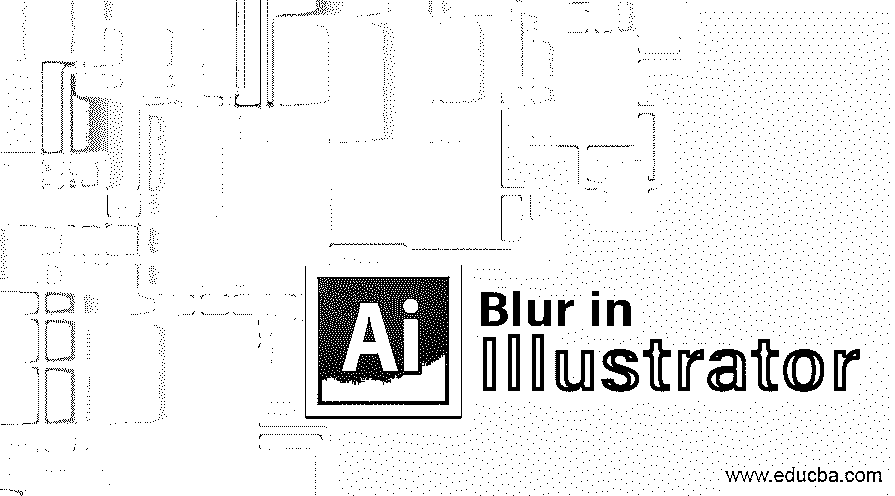

## Adobe Illustrator 中的模糊是什么？

Adobe Illustrator 中的 Blur 是一个矢量编辑软件，允许用户创建矢量艺术品。它最初于 1987 年 3 月 19 日发行。它支持 Windows 和 Mac OS。最新的 Illustrator 版本是 Adobe CC 2019。用户可以在 Illustrator 中为对象和图像添加各种效果和属性。它可以选择在图像中添加模糊效果。你可以通过一个简单的方法做到这一点。学会使用模糊后，你可以用它来给你的图像赋予创造性的模糊效果。在本文中，您将学习在 Illustrator 中应用各种模糊效果。

### Adobe Illustrator 中的各种模糊效果

以下是在 illustrator 中显示模糊效果的步骤:

<small>3D 动画、建模、仿真、游戏开发&其他</small>

**第一步:**打开 Adobe Illustrator，创建文档工作。

*   下面，我用了一个图像。同样的，你也可以用一个。你唯一需要注意的是图像应该是高分辨率的。通过将图像直接拖到画布中或使用“文件和放置”将图像添加到文档中。

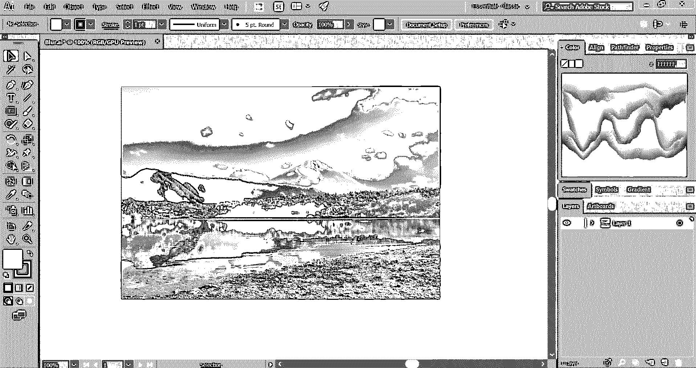

**第二步:**首先，使用选择工具选择对象。您也可以使用快捷键(V)来选择工具。

**步骤 3:** 选择文档中要应用模糊效果的图像或对象。选择图像后，会出现一个带有锚点的蓝色框。这意味着对象已被选中，可以编辑了。

**第四步:**接下来，你要从窗口顶部滚动到“效果”选项，如下图。

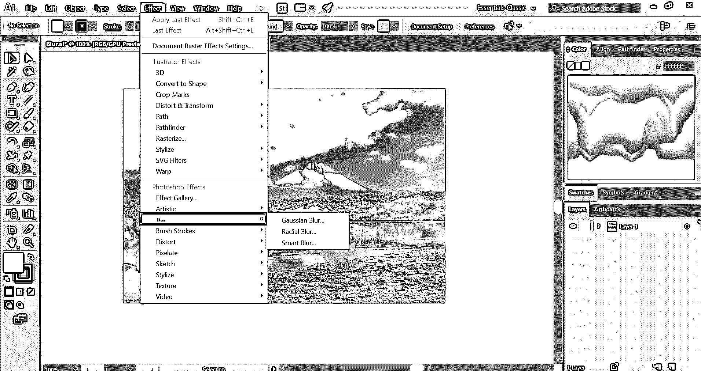

**第五步:**在 Photoshop 部分下，将鼠标光标悬停在“模糊”上

第六步:现在，一个菜单将显示你可以选择应用到图像的各种模糊效果。你会发现模糊选项像高斯模糊，径向模糊，智能模糊等等。

**第七步:**首先我会选择高斯模糊。现在，会弹出一个小对话框。您可以单击该框，并将其拖到文档中合适的位置。

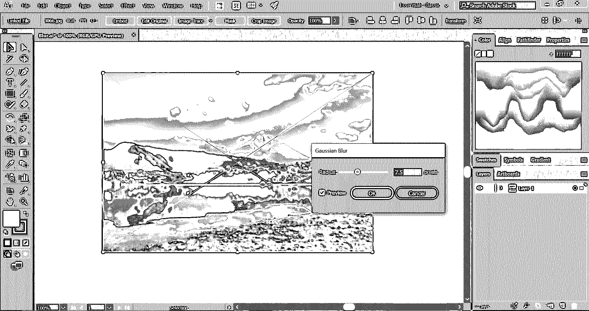

**第八步:**可以在 0.1–250 的半径范围内设置模糊。为此，您可以向左或向右移动滑块，或者键入一个手动数字。因此，模糊的强度可以改变。

**第九步:**勾选左下角的预览框。

**第十步:**在你觉得有了需要的效果后，按“确定”确认模糊值。您可以使用“高斯模糊”为您的图像添加普通模糊效果或薄雾效果。

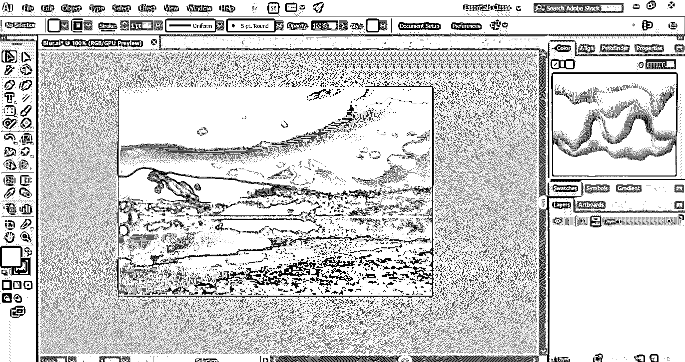

**步骤 11:** 接下来，我们来看看“径向模糊”是如何工作的。为此，我们将通过按 Ctrl + Z 来反转之前的模糊效果。

**步骤 12:** 重复前面的步骤。选择图像并转到效果选项。

**第十三步:**点击模糊，选择“径向模糊”

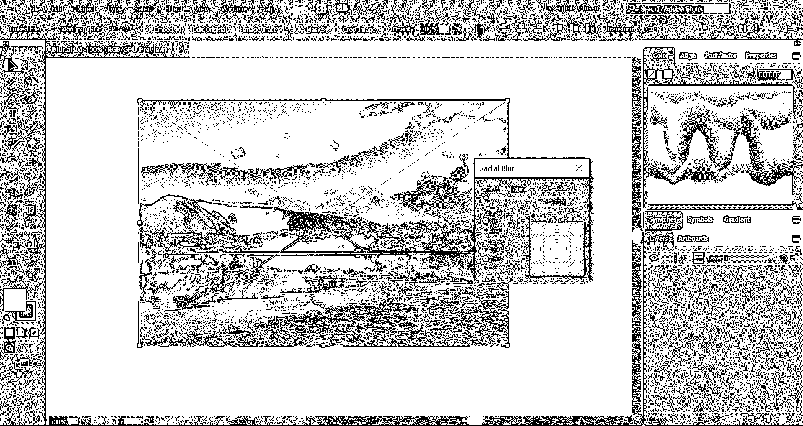

**第十四步:**再次弹出对话框。这种模糊以基于中心点的半径应用效果。您可以查看描绘模糊形状的预览框。

**第 15 步:**您可以在 1–100 的范围内输入模糊量。根据需要，您可以拖动滑块来更改值。

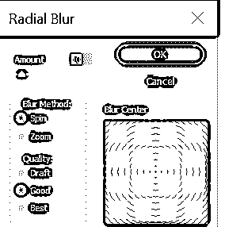

第十六步:你可以选择两种模糊方法:旋转和缩放。基于您的部分，您的图像将有一个旋转或缩放的模糊效果。

**第十七步:**最后可以从草稿、好、最好中选择质量。

**步骤 18:** 如果选择 Draft，会输出较低的质量，但由于尺寸较小，会很快。“好”将产生不错的输出，而“最好”将给出最高质量的输出，但会根据您的系统而有点耗时。

**第 19 步:**点击确定应用设置。

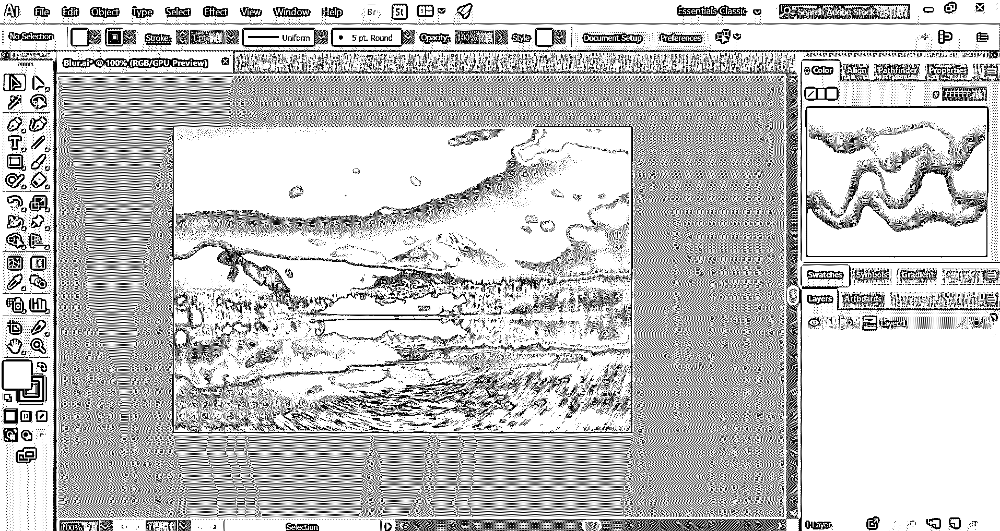

**步骤 20:** 按 Ctrl + Z，重复前面的步骤。选择图像并转到效果选项。

**第 21 步:**点击模糊，选择“智能模糊”

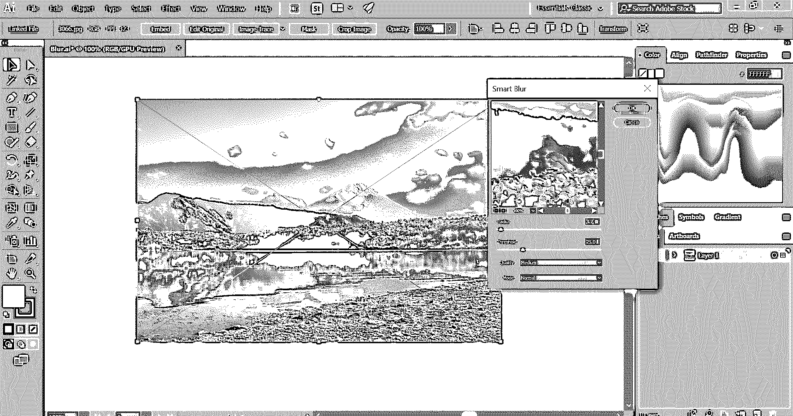

步骤 22: 会出现一个新的弹出窗口。那里会显示一个预览框。您可以通过按+和–按钮或从下拉列表中选择来放大或缩小预览框。为了更好的理解，请参考下图。

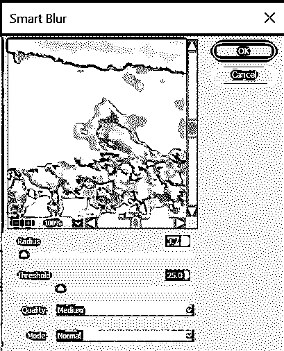

**步骤 23:** 同样，你有一个介于 0.1-100 之间的半径滑块。在那下面，你有另一个滑块来给出阈值。

**第 24 步:**接下来，点击质量菜单。这里你会发现三个标准选项:低，中，高。

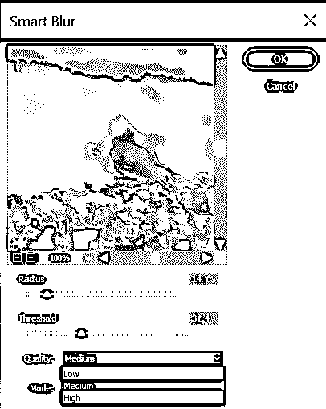

**第 25 步:**之后，在底部，选择模式。您可以在正常、仅边缘和覆盖边缘之间进行选择。

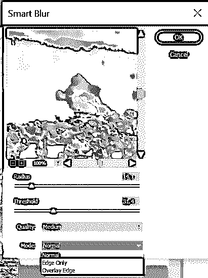

您可以尝试应用每种模式，并通过单击“确定”进行确认。

### 结论–Illustrator 中的模糊

在上面的文章中，我们已经详细解释了 Adobe Illustrator 中可用的各种模糊选项。你可以试着把它们运用到你的创造性工作中，提升你的作品。继续，通过在图像或物体中尝试这个方法来开始练习这些步骤。同样，我们已经提到了 Illustrator 中可用的其他效果和选项。浏览它们，掌握创造惊人作品的软件。

### 推荐文章

这是一个在 Illustrator 中模糊的指南。这里我们讨论 Adobe Illustrator 中可用的各种模糊选项。您也可以浏览我们的其他相关文章，了解更多信息——

1.  [在 Illustrator 中插入图像](https://www.educba.com/insert-image-in-illustrator/)
2.  [Illustrator 中的切片工具](https://www.educba.com/slice-tool-in-illustrator/)
3.  [后期效果中的色彩校正](https://www.educba.com/color-correction-in-after-effects/)
4.  [在 Illustrator 中裁剪](https://www.educba.com/crop-in-illustrator/)
5.  [业内四大最佳视频编辑软件](https://www.educba.com/best-editing-software/)
6.  [Adobe 编辑软件](https://www.educba.com/adobe-editing-softwares/)
7.  [Illustrator 中的平滑工具指南](https://www.educba.com/smooth-tool-in-illustrator/)
8.  [Illustrator 中的霓虹灯效果|创建形状和文本效果](https://www.educba.com/neon-effect-in-illustrator/)

