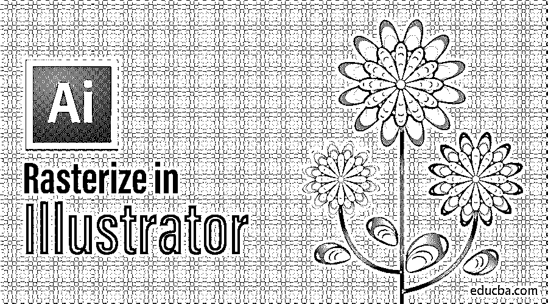
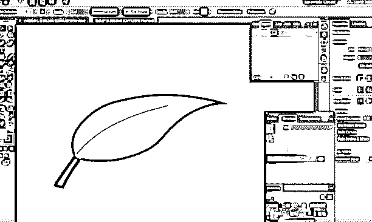
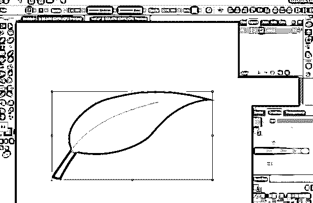
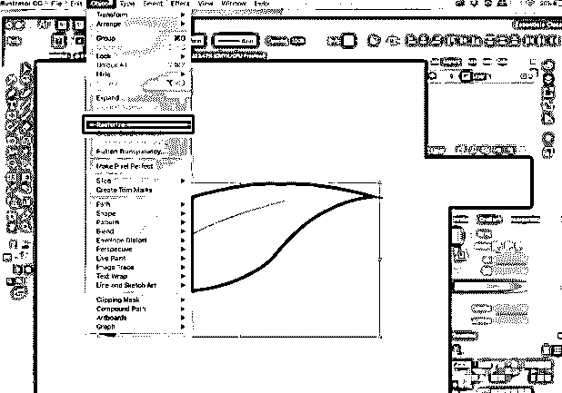
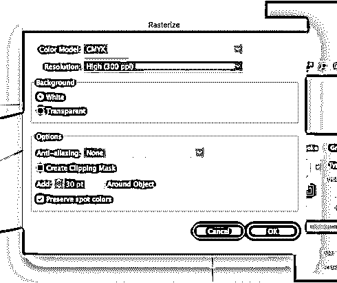
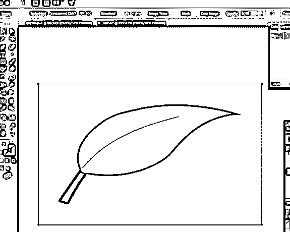
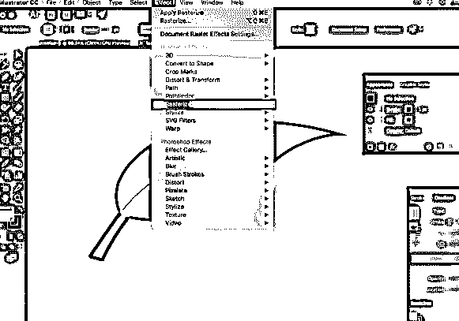
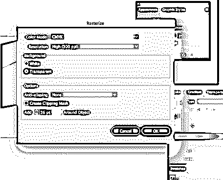
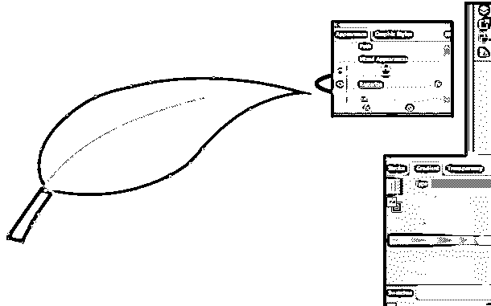

# 在 Illustrator 中栅格化

> 原文：<https://www.educba.com/rasterize-in-illustrator/>

## Illustrator 中的栅格化简介

在 Illustrator 中栅格化意味着丢失其原始数据，并将其转换为本质上更具体的东西。同样，在 Illustrator 中，对象和艺术品是以矢量格式绘制的，当导出到其他图形软件时会失去其独创性。例如，如果我们以特定字体书写文本，而该字体对于其他用户不可用，那么该文本对于该用户将是不可见的。因此，在这种情况下，我们在 Illustrator 中使用栅格化，将对象的矢量质量更改为光栅或位图图像，而不会失去其原始质量。

### 如何在 Illustrator 中栅格化对象？

Illustrator 的“对象”菜单中有一个“栅格化”命令，使您能够栅格化 Illustrator 中的任何对象。光栅化命令将矢量对象转换为位图图像。

<small>3D 动画、建模、仿真、游戏开发&其他</small>

以下步骤将告诉您如何在 Illustrator 中栅格化。

**第一步:**启动 **Adobe Illustrator** 软件。

**第二步:**选择一个已有的项目；在我们的例子中，我们使用了一个**叶子的例子。**选择一个已经包含您想要栅格化的矢量图像的文档。

**第三步:**借助选择工具选择你想要栅格化的对象。该对象现在将有一个细长的蓝色框架，其角表示该对象已被选中，可以编辑。如果您想要栅格化多个对象，点击您想要选择的对象，点击**控制/命令(Windows/Mac)** 按钮。

第四步:你必须做出决定，选择是永久栅格化对象，还是生成基于像素的图片。后者可以定义为光栅效应。我们将使用两种不同的方法来实现这些选择。首先，我们将浏览对象菜单中的栅格化选项。

**第五步:**一旦你点击栅格化，你会得到一个弹出窗口。

选择您希望使用的颜色模型。你有三个选项 CMYK，灰度和位图。您可以根据图像、显示器或打印机偏好选择任何选项。这取决于您的显示倾向或打印机。这定义了将被反射的辐射的波长。默认选择是 CMYK。青色、洋红色、黄色和黑色油墨通常用于数字绘画和艺术。如果您想要打印报告，但不确定打印机支持的颜色模式，最好在栅格化文档或图像之前进行检查。

**第六步:**接下来是选择分辨率。分辨率决定了每英寸的像素数。有五个选项可供选择:

1.  屏幕(72 PPI ),最适合在网上发布图片。
2.  中等(150 PPI)。
3.  高(300 PPI)，最适合打印。
4.  使用文档光栅效果分辨率。
5.  其他用于用户设置的是高级级别。

**第七步:**接下来是背景。有两种选择**白色或者透明**。如果希望 Illustrator 为对象填充背景，请选择白色背景。如果不希望背景有任何矢量图像，请选择透明。然后是抗锯齿选项，通过取消选择它，您可以在栅格化对象时防止对象模糊，并保留对象的清晰线条。

*   最后还有一个选项，您可以使用 add 选项添加或删除对象周围的空间。
*   您可以手动添加该值，也可以使用上下箭头。
*   点击确定，让你的矢量对象永久栅格化。

**第八步:**物体的栅格化，将其从矢量图像转化为像素图像。确保你的照片是高分辨率的，这样你就不会在以后的阶段偶然失去质量。您可以在保持质量不变的情况下放大矢量图像，而如果原始图像比大图像小，像素图像将会分裂并扭曲。

一旦你点击确定，你不会看到太大的区别，但你的矢量对象现在被转换成一个像素对象。

第九步:使用选择工具选择对象[。](https://www.educba.com/selection-tool-in-illustrator/)

**步骤 10:** 在**菜单栏**的效果菜单中，Illustrator 效果下有栅格化选项，如下图所示

**步骤 11:** 点击栅格化，你会得到和对象菜单一样的**弹出**。

**步骤 12:** 一旦你点击**确定**，你的物体将被栅格化。在外观面板中，如下所示，您可以更改或移除效果。您可以在此面板中找到“栅格化”选项。通过双击它，您可以对栅格化设置进行更改，与之前的“对象”菜单下的“栅格化”选项相比，对象将被永久栅格化。

这样，您可以用两种方式栅格化对象，具体取决于您是要永久栅格化对象还是要临时栅格化对象。

### 结论

光栅化的图像可以被认为是一个盒子，其中对象区域已经被转换成位图。这样做可能是为了将图像光栅化到三维表面上，或者降低综合插图的难度。如果对象被栅格化，您会将它永久保存为像素。你不能再把它看作一个等式，而是一束彩色方块，它不会保留曾经是一颗星、一个圆等的记忆。这就是为什么栅格化可以被认为是某种承诺。你需要确保当你栅格化任何对象时；你重新访问原来的，可变的，向量对象。如果你想改变你的对象，最好保持线条。原因是一旦你的对象被栅格化，它将受到每平方英寸点数/像素数的限制。

### 推荐文章

这是一个在 Illustrator 中栅格化的指南。这里我们讨论了在 illustrator 中栅格化对象的介绍和步骤。您也可以浏览我们的其他相关文章，了解更多信息——

1.  [安装 Adobe Illustrator](https://www.educba.com/install-adobe-illustrator/)
2.  [Illustrator 中的 3D 效果](https://www.educba.com/3d-effects-in-illustrator/)
3.  [适用于 Windows 8 的 Adobe Illustrator】](https://www.educba.com/adobe-illustrator-for-windows-8/)
4.  [Illustrator 中的模糊](https://www.educba.com/blur-in-illustrator/)

