# Illustrator 中的金属效果

> 原文：<https://www.educba.com/metal-effect-in-illustrator/>

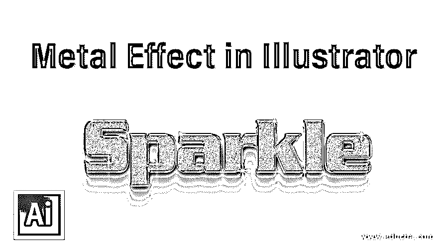

## Illustrator 中的金属效果介绍

Adobe Illustrator 是图形专业人员用于其专业工作的矢量图形设计软件。在这个软件中，我们可以对物体应用不同类型的效果。金属效果是这个软件的有效特征之一。在本文中，我们将讨论“什么是金属效果？”并了解“如何将这种效果应用于任何对象”？您可以在项目的任何对象上使用此效果，使对象对观众来说更真实。

金属效果用于给任何对象赋予金属外观，当你给任何对象赋予金属外观时，它将使你的对象与真实世界兼容。现在让我们开始学习“如何在我们的项目中应用金属效果？”我们将通过一个制作金色和铁金属效果的“窗户”的例子来理解它。你可以用这些金属效果按照你的想法制作任何物体。

<small>3D 动画、建模、仿真、游戏开发&其他</small>

### 如何在 Illustrator 中应用金属效果？

在 adobe Illustrator 软件中，在任何对象上应用金属效果并不是一项很大的任务。我们将通过一种非常简单的学习方式逐步理解这一点:

**第一步:**取一个新文档。要获取新文档，请点击该软件顶部菜单栏中的“文件菜单”。将会打开一个下拉列表。单击此列表的“新建”选项。

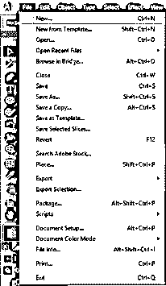

**第二步:**一个“新文档”对话框将会打开。根据您的项目要求设置此框的参数，然后单击此框的“创建选项卡”将这些设置应用到您的文档中。

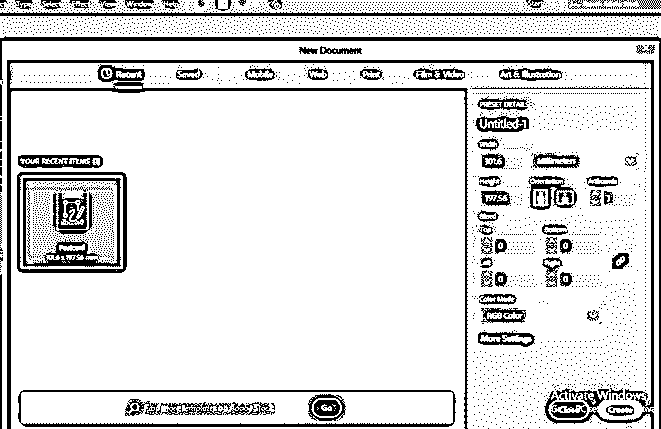

**第三步:**现在，在工作屏幕的左侧，从该软件的工具面板中取出矩形工具。像我画的那样，用这个矩形工具画一个棒状结构。

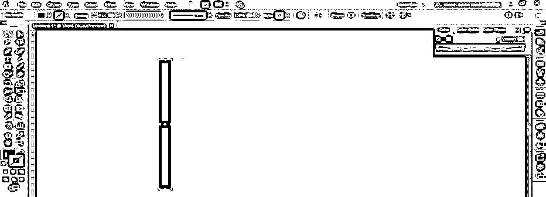

**步骤 4:** 现在从工作屏幕的右侧面板打开一个渐变框。

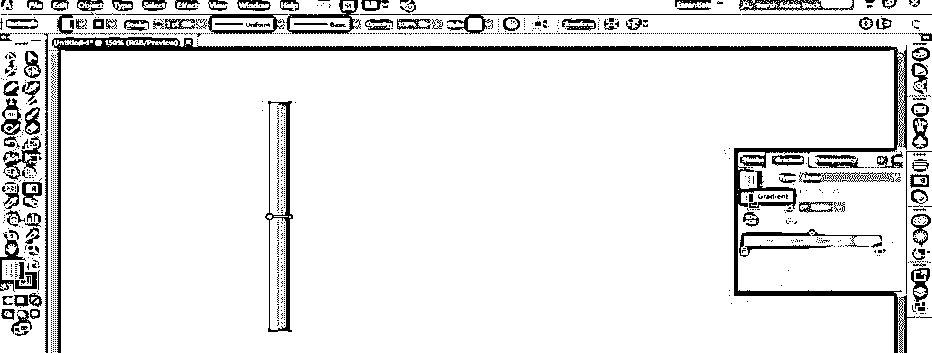

**第五步:**如果这个列表中没有渐变选项。然后转到工作屏幕顶部菜单栏的窗口菜单。将会打开一个下拉列表。点击这个列表的渐变选项来激活这个框。

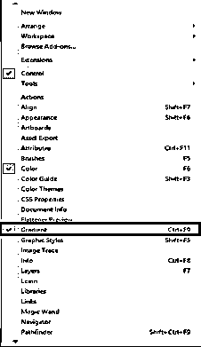

**第六步:**现在，从同一个面板打开彩盒。

**步骤 7:** 如果该颜色框不在列表中，再次进入菜单栏的窗口菜单，点击颜色选项将其激活。

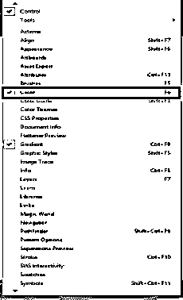

**第八步:**现在选择第一个渐变头。要选择这个头，用鼠标点击它，并从颜色面板中选择浅黄色。再次选择渐变框的渐变头，从颜色面板中选择橙色。使头的颜色这样组合，使它看起来是金色的。

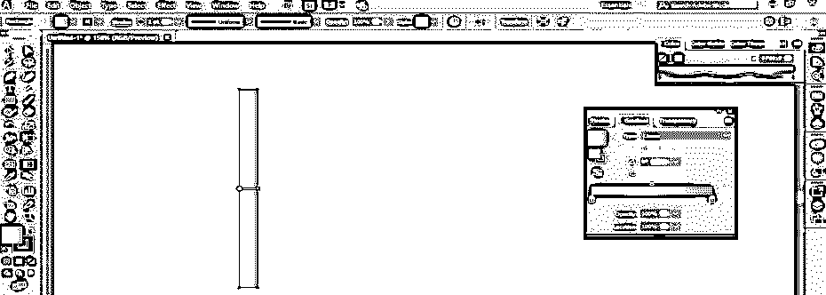

步骤 9: 现在在渐变面板中再添加一个色头。要在渐变刻度中添加更多的渐变头，只需点击渐变刻度下方。

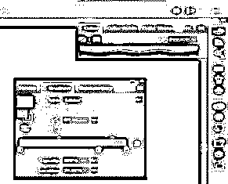

**步骤 10:** 选择这个新的渐变头，从颜色面板中选择一个浅黄色的颜色组合，让它看起来更像金色。

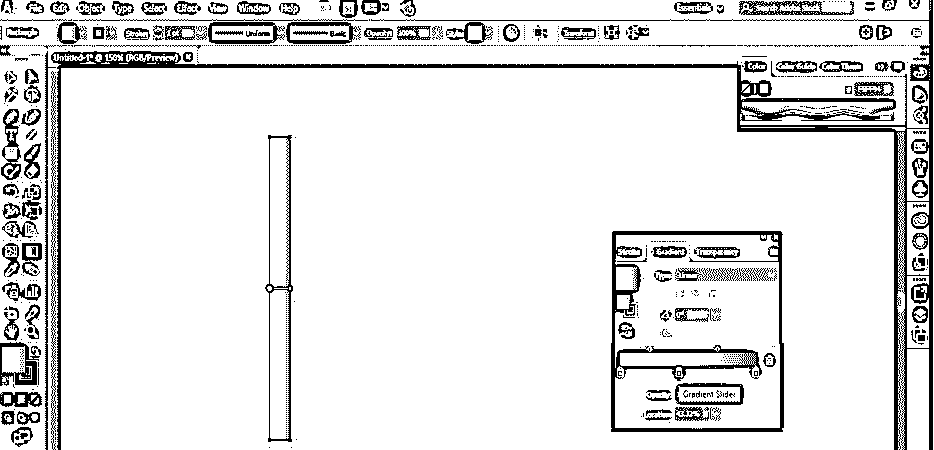

**第 11 步:**现在，按住键盘上的 Alt 键，向另一个方向拖移此标尺以进行复制。

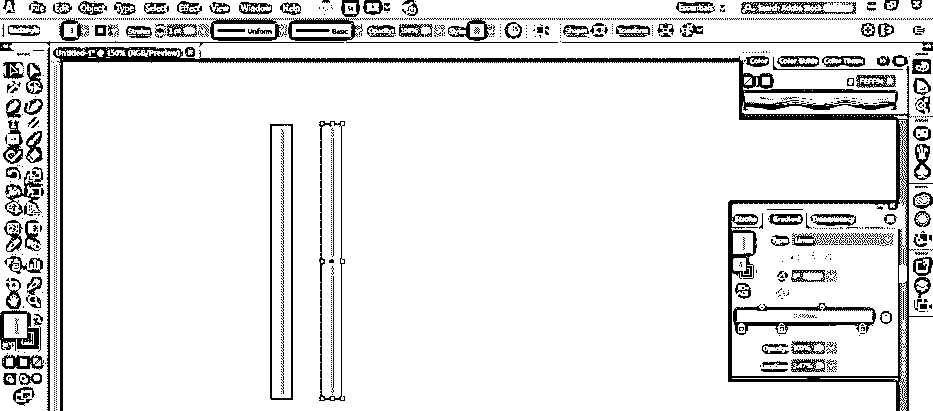

**步骤 12:** 现在按下键盘上的 Ctrl+ D 键来粘贴更多的杆。

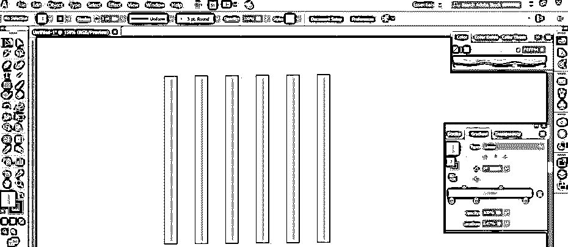

**步骤 13:** 现在再次从工具面板中取出一个矩形工具，制作这个窗口状结构的上栏。一旦你制作了一个条，按照我们为窗口的一个条所做的同样的过程为这个条选择渐变颜色。

步骤 14: 我将在渐变的渐变头中选择蓝色和浅蓝色的组合，给它一个金属的外观。

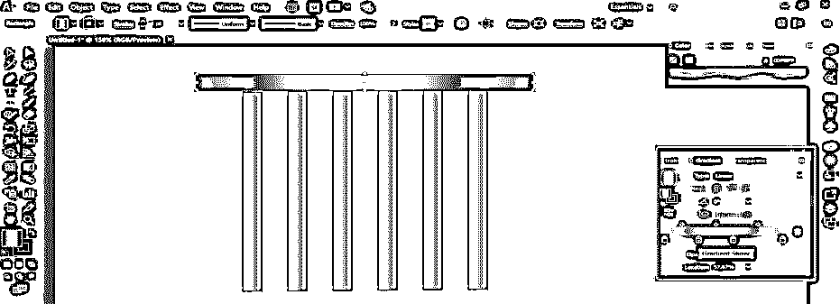

**第十五步:**你可以在渐变标尺上添加很多渐变头。我将在这个栏的渐变中再添加两个头，并添加深蓝和浅蓝的颜色，来制作一个更真实的金属效果。

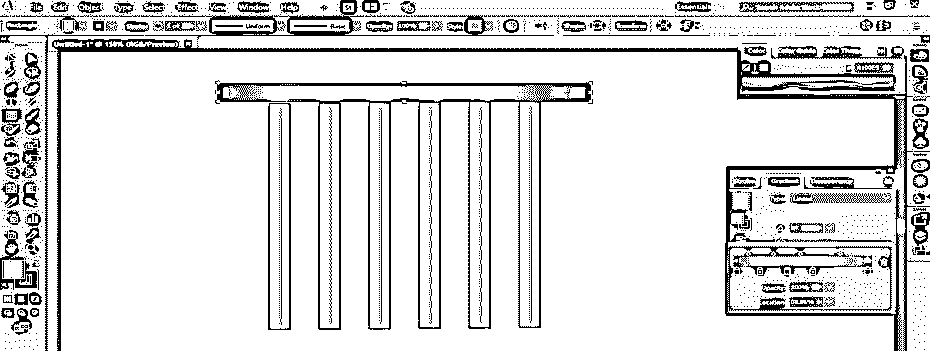

步骤 16: 现在在杆的按钮处复制这个条。要复制它，只需选择这个条，然后按住键盘的 Alt 键并在杆的按钮端拖动它。

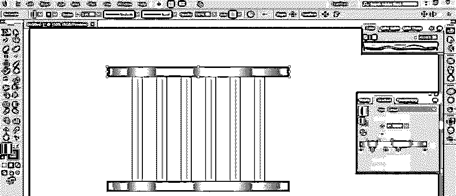

步骤 17: 现在选择所有的对象，在工具面板部分的颜色面板上画一笔，这样金属效果可以更有效的可视化。

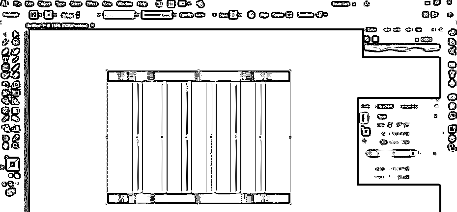

**第 18 步:**一旦你的笔画动了，窗口就会变成这个样子。

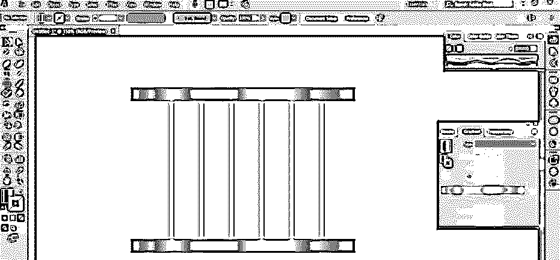

**步骤 19:** 现在，让我们从工具面板中选择一个椭圆命令，并拖动一个圆。现在也使用工具面板中的渐变工具在其中应用渐变。我将应用一个对角线渐变来给这个圆一个球形的效果。

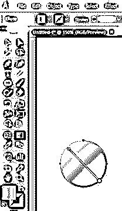

**步骤 20:** 现在，用这个软件的工具面板的椭圆命令，在这个球上做一个小圆。

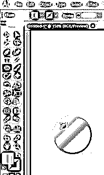

**步骤 21:** 取白色填充这个小圆，从这个圆的颜色框中划掉一笔。

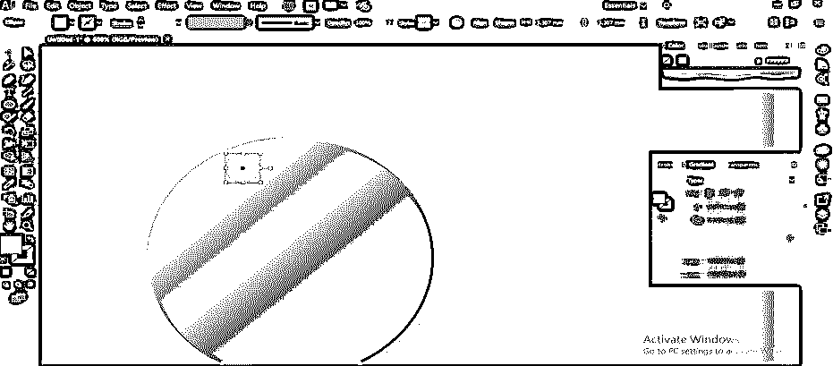

**步骤 22:** 现在进入该软件菜单栏的效果菜单。将会打开一个下拉列表。转到模糊选项，并从新建下拉列表中选择高斯模糊。

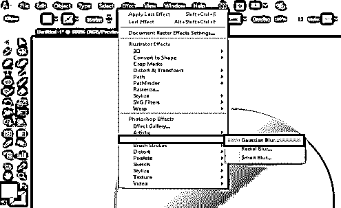

**步骤 23:** 高斯模糊框会打开。将高斯模糊的值设置为 1.6，然后按下此框的“确定”按钮。

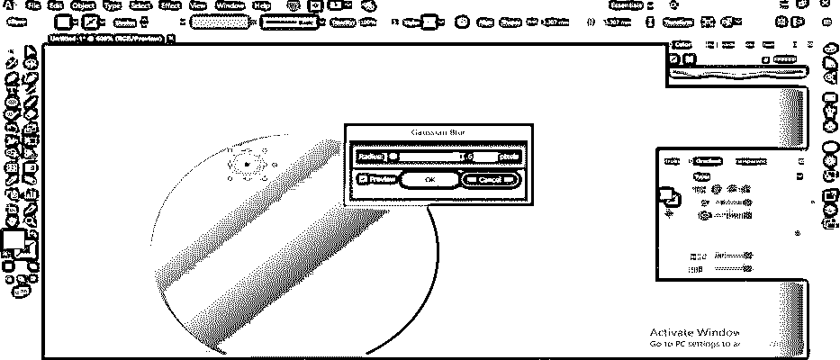

**步骤 24:** 一旦你在这个圆上应用高斯模糊。球在顶角会像金属一样闪闪发光。

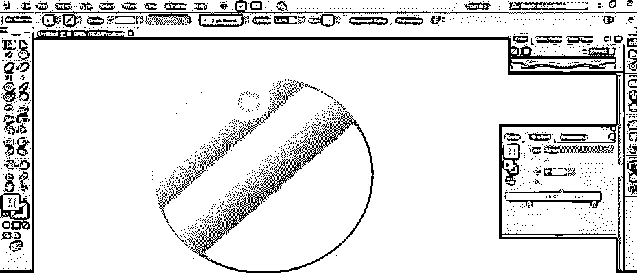

步骤 25: 现在，把球放在窗户后面。要将球放在窗口杆的后面，请选择球并在键盘上单击右键。将会打开一个下拉列表。转到“排列”选项，然后选择“置于底层”选项。

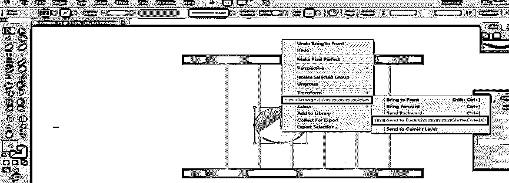

**步骤 26:** 现在，复制这个球，用于制作键盘的 copyhold Alt 按钮，并将其拖动到另一个位置。现在按 Ctrl + D 来制作更多的副本。

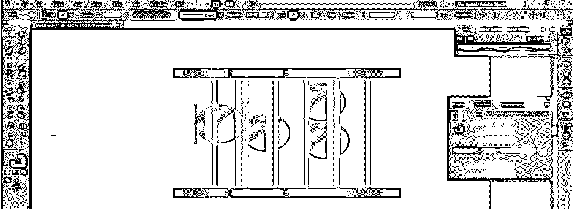

**步骤 27:** 把所有的球都这样排好。

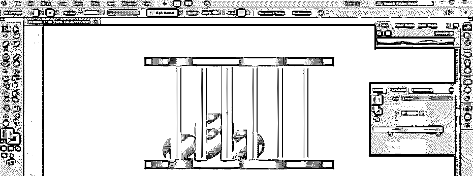

这样，你就可以使用这个软件的金属效果选项来制作任何物体或原木或图形设计。

### 结论

通过这篇文章，你可以很容易地理解金属效果，并可以在你的项目中应用这种效果。一旦你掌握了这种效果，你就可以为你的图形设计技能加分了。现在你可以在金属效果上做不同类型的变化。

### 推荐文章

这是 Illustrator 中的金属效果指南。在这里，我们讨论如何在 Illustrator 中一步一步地简单应用金属效果。您也可以浏览我们的其他相关文章，了解更多信息——

1.  [Illustrator 中的霓虹灯效果](https://www.educba.com/neon-effect-in-illustrator/)
2.  [在 Illustrator 中创建表格](https://www.educba.com/create-table-in-illustrator/)
3.  [Illustrator 中的倒影](https://www.educba.com/reflection-in-illustrator/)
4.  [如何在 Illustrator 中添加纹理？](https://www.educba.com/how-to-add-texture-in-illustrator/)

