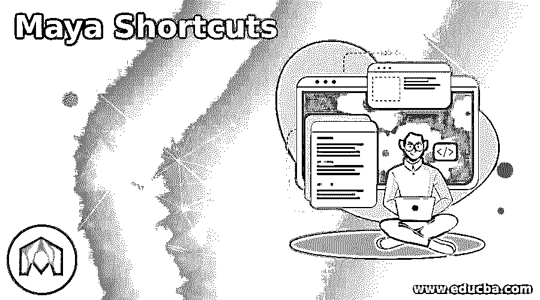

# Maya 快捷键

> 原文：<https://www.educba.com/maya-shortcuts/>

## Maya 快捷方式简介

以下 Maya 快捷键提供了 Maya 中最常用功能的概述。Autodesk Maya 是一个 3D 计算机图形应用程序，通常缩写为 Maya，最初由 Alias Systems Corporation(以前的 Alias)制作，目前由 Autodesk Inc .发布和创建，可在 Windows、MacOS 和 Linux 上运行。它用于制作交互式 3D 应用，如视频比赛、动画电影、电视节目和图形效果。

Autodesk Maya 是一款 [3D 建模程序](https://www.educba.com/careers-in-3d-modeling/)，可以用于 3D 打印和动画图形。Maya 提供了产生合格和定性结果的所有必要工具，即使对于初学者也是如此，无论您打算建模还是更改项目。

<small>3D 动画、建模、仿真、游戏开发&其他</small>

### Maya 键盘快捷键

几乎在 Maya 中的所有操作中，导航顺序都是必不可少的。不要因为任何东西在正面或背面看起来都很好，就认为从各个角度看都很好。你应该总是环绕你的模型，从各个角度观察它。

*   Alt + RMB +拖动-相机旋转(包)。
*   Alt +滚轮+ LMB 拖动+放大/缩小。事实上，这不会“挤压”相机镜头，而是将房间中的相机(如堆栈)向前或向后推。
*   Alt + MMB +拖动–跟踪(向下，左/右屏幕)。
*   空格键–点击空格键将布局从四个面板更改为单个面板。

#### 搬运机器

| **2D 平移/缩放** |
| \ +鼠标中键 | 平移工具 |
| \ +鼠标右键 | 缩放工具 |
| \ | 打开/关闭/打开 2D 全景 |
| **动画活动操作** |
| 英语字母表中第九个字母 | 添加关键帧工具(用于曲线图编辑器)(按下并释放) |
| 英语字母表的第 19 个字母 | 指定密钥 |
| Shift + E | 指定旋转的关键点 |
| Shift + R | 指定用于缩放的键 |
| Shift + W | 指定用于翻译的关键字 |
| Alt + J | 来自切换多色的反馈 |
| Shift + S | 使用左击关键帧标记菜单 |
| **显示设置** |
| Zero | 显示默认值的配置 |
| One | 粗略性能的显示配置 |
| Two | 中等屏幕性能的设置 |
| Three | 表现出流畅的性能 |
| Four | 三维线框模型 |
| Five | 屏幕阴影 |
| Six | 阴影和纹理的显示 |
| Seven | 利用每一盏灯 |
| **对象显示(显示，隐藏)** |
| Ctrl + H | 隐藏>隐藏的选择 |
| Alt + H | 隐藏>未选定的隐藏对象 |
| Shift + l | 隔离选择>选定视图(在面板菜单中) |
| Ctrl + Shift + H | 显示>显示上次隐藏的内容 |
| Shift + H | 显示>显示选项 |
| **编辑操作** |
| Ctrl(或 Cmd) + C | 复制 |
| Ctrl(或 Cmd) + X | 切口 |
| Ctrl + D | 复制 |
| Ctrl + Shift + D | 重复特殊 |
| Shift + D | 转换副本 |
| Ctrl + G | 组 |
| 英语字母表中第十六个字母 | 父母 |
| Ctrl(或 Cmd) + V | 粘贴 |
| Shift + Z | 重做 |
| 英语字母表第七个字母 | 重复 |
| Shift + G | 鼠标放置重复订单 |
| 英语字母表中第二十六个字母 | 撤消(也是 Ctrl+z/+z) |
| Shift + P | 不相称 |
| Ctrl + R | 创建文件引用 |
| Ctrl + Q | 出口 |
| Ctrl + N | 新场景 |
| Ctrl + O | 开放场景 |
| Ctrl + S | 保存场景 |
| Ctrl + Shift + S | 将场景另存为 |
| **热轴屏幕** |
| 空间 | (按下时)显示热盒 |
| **建模操作** |
| Two | 笼子+多边形网格的软显示 |
| Ctrl + F10 | 将多边形转换为边 |
| Ctrl + F9 | 将多边形转换为顶点 |
| Ctrl + F11 | 将多边形转换为面 |
| Ctrl + F12 | 将多边形转化为 uv |
| 下一页 | 降低平滑网格预览或细分曲面代理划分级别 |
| One | 多边形纹理(非笔刷)默认屏幕 |
| ~ | 将显示初始(模板)和平滑界面 |
| 页上移 | 增加平滑网格或细分曲面代理划分级别 |
| 英语字母表中第十二个字母 | 曲线锁定/解锁(按住) |
| Three | 多边形网格的平滑显示 |
| **选定对象的移动** |
| Alt +向下 | 向下移动一个像素 |
| Alt +向左 | 向左移动一个像素 |
| Alt +右 | 向右移动一个像素 |
| Alt + Up | 向上移动一个像素 |
| **喷漆操作** |
| Ctrl + B | 编辑 Paint Effects 模型的绘制配置 |
| Alt + F | 现值洪水 |
| Shift + B | 更改下部笔刷的半径(按下并释放) |
| 英语字母表中第十三个字母 | 更改连续移动(雕刻的曲面和多边形雕刻工具) |
| 英语字母表中第十四个字母 | 更改绘制值 |
| 英语字母表的第 2 个字母 | 改变上部笔刷的半径(按下并释放) |
| O +鼠标左键 | 菜单标记多边形画笔工具 |
| O +鼠标中键 | 标记条多边形 UV 工具 |
| / | 更改以选择颜色样式(按下并释放) |
| Alt + R | 反射开关打开或关闭 |
| Alt + C | 打开或关闭颜色反馈 |
| Alt + A | 打开或关闭线框 |
| 英语字母表中第二十一个字母 | 左键单击 Artisan 绘制操作菜单 |
| *步行去采摘* |
| *在选择的基础上，箭头键允许你在层次中向上移动或在项目的各个部分徘徊(选择的元素，包括顶点、循环边、边界框)。* |
| 向下 | 去现在 |
| 左边的 | 去底部 |
| 对吧 | 现在直走 |
| 英语字母表中第二十一个字母 | 跟上时代 |
| **播放控制** |
| Alt+Shift + V | 拍摄最小帧 |
| . | 跳到下一个键。 |
| , | 转到上一个键。 |
| Alt +， | 向后移动一次 |
| Alt +。 | 在时间上前进一个设置 |
| Alt + V | 打开或关闭回放 |
| 鼠标中键 | 虚拟时间的滑块设置(按住并拖动时间轴) |
| **渲染** |
| Ctrl +向左 | 渲染下一张图片透视图 |
| Ctrl +向右 | 前面的图片渲染了视觉 |
| **选择菜单** |
| 第二子代 | 动画显示菜单 |
| F5 | 动态显示菜单 |
| 1.法乐四联症 | 建模显示菜单 |
| 第三子代 | 多边形的显示菜单 |
| F6 | 渲染显示菜单 |
| Ctrl + M | 显示/隐藏主菜单 |
| Shift + M | 面板菜单栏显示/隐藏 |
| Ctrl + Shift + M | 面板工具栏显示/隐藏 |
| **对象和组件选择** |
| F10 | 边缘 |
| F11 | 脸 |
| > | 多边形选择的增长区域 |
| F8 | 组件/对象(组件编辑和对象切换)。 |
| Ctrl + I | 选择下一个媒体项目 |
| < | 多边形缩小选择区域 |
| F12 | 紫外线 |
| F9 | 顶点 |
| Alt + F9 | 顶点面 |
| **追赶行动** |
| Shift + J | 相对捕捉移动、旋转工具(按下并释放) |
| 英语字母表中第十个字母 | 移动、旋转、缩放、捕捉工具(按下并释放) |
| 英语字母表中第三个字母 | 快速弯曲(按下并释放) |
| 英语字母表中第二十四个字母 | 网格快速移动(按下并释放) |
| 英语字母表中第二十二个字母 | 捕捉中的点(按下并释放) |

### 结论

用户描述了一个数字工作空间，它使任务能够执行和编辑内容。在许多格式中，场景可以默认保存。Maya 显示了节点图的架构。每个节点都有自己的特点和定制，场景元素是基于节点的。因此，图片的图形描绘完全集中在互连节点的网络上，取决于彼此的数据。为了便于观察这些网络，可以使用依赖关系和有向无环图。

### 推荐文章

这是玛雅快捷方式的指南。这里我们讨论一些不同类型的 Maya 快捷键。您也可以浏览我们推荐的其他文章，了解更多信息——

1.  [玛雅工具](https://www.educba.com/maya-tools/)
2.  [Maya 奖励工具](https://www.educba.com/maya-bonus-tools/)
3.  [安装 Maya](https://www.educba.com/install-maya/)
4.  [Maya 渲染设置](https://www.educba.com/maya-render-settings/)

