# 玛雅的索具

> 原文：<https://www.educba.com/rigging-in-maya/>

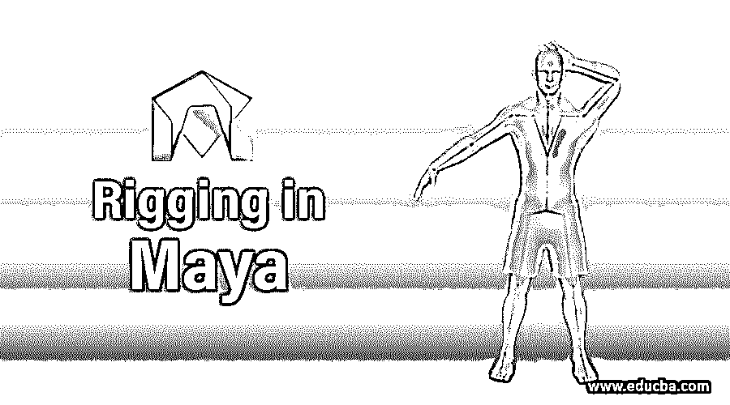

## Maya 中的索具介绍

Maya 中的装配用于为动画师提供控制点，从这些控制点可以完成动画。由于实际的多边形没有被触摸，但是控件被用于动画，为了创建这些控件，我们装配了模型。为我们制作动画的基础做准备，所以让我们把基础打牢。

### 在 Maya 中使用装配的方法

下面是在 Maya 中使用装配的步骤:

<small>3D 动画、建模、仿真、游戏开发&其他</small>

#### 方法 1–快速装配(一键式)

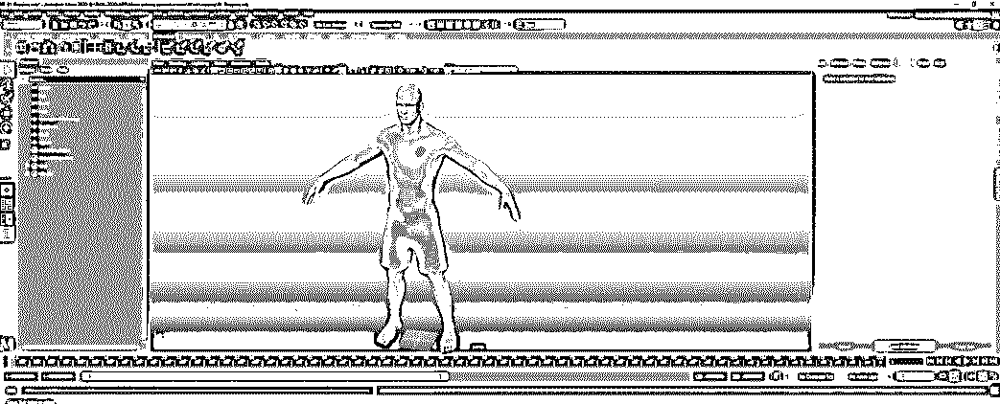

**步骤 1:** 在这一节，我们将使用快速装配工具装配角色，但在此之前，我们将看到如果我们直接与几何体交互会发生什么。

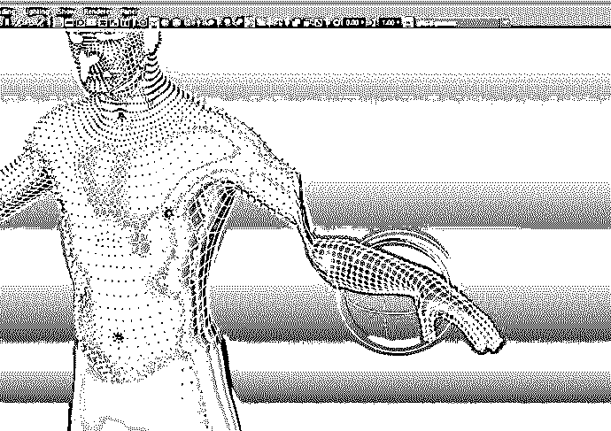

**第二步:**正如你在上面看到的，这会使几何体以不理想的方式变形。为了避免这个问题，我们必须给模型添加一个骨架。要做到这一点，首先，撤销上述更改，然后我们将进入装配菜单，并从那里的骨骼>快速装配得到一个大致的想法。

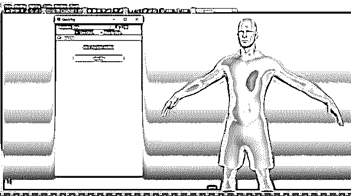

**第三步:**现在选择模型，点击自动装配。

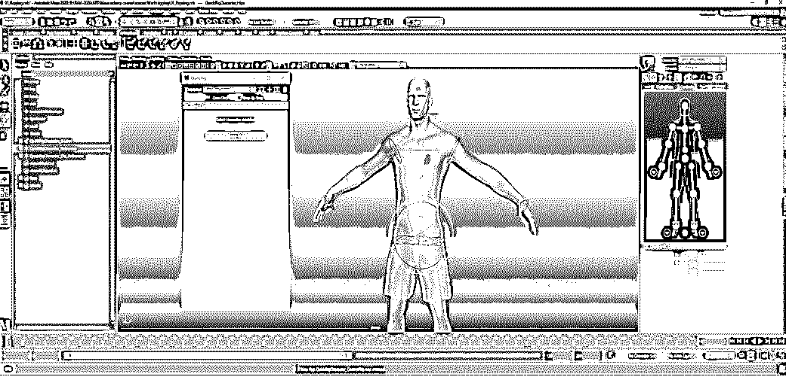

**第 4 步:**我们可以在大纲视图中看到骨骼骨骼的引用和控件一起被添加；如果你看不到它，从窗口打开>大纲视图。

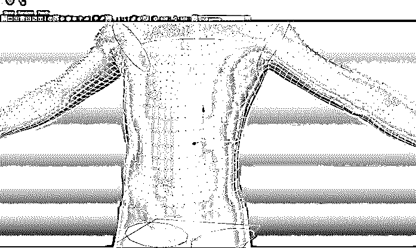

**步骤 5:** 实际发生的情况是，正如你在上面看到的，每个顶点由一个骨骼控制，每个顶点都被赋予了权重，以确定哪些顶点将受到骨骼的影响，并分配了一个从 0 到 1 的值，这将决定哪个顶点将跟随哪个关节。

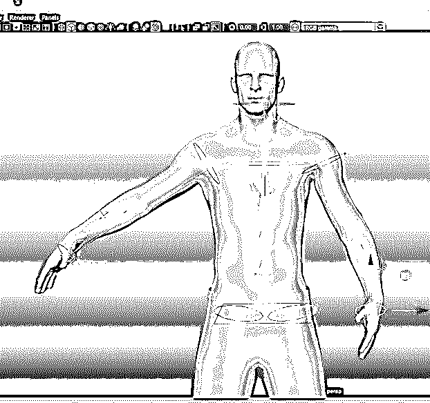

**第六步:**抓住左边的手柄，拖动控制。

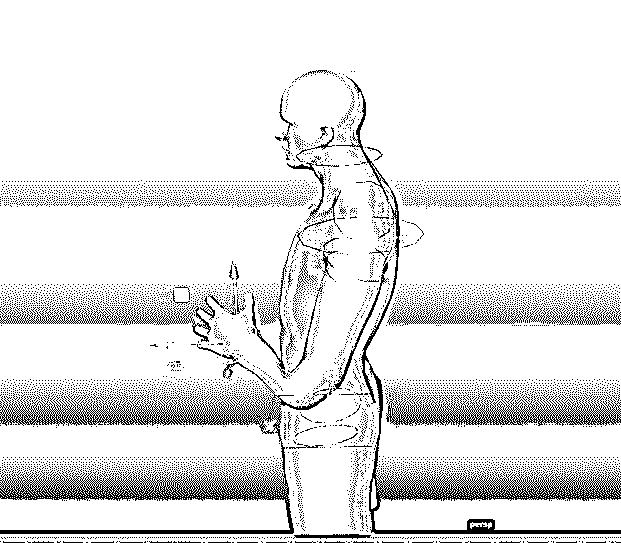

**第七步:**正如你所看到的，当我们开始拖动时，由于快速钻机放置的关节不准确，所以不准确，我们将在后面改进。但当我们实际制作角色动画时，我们必须隐藏骨骼，因为关键帧动画将在控件上完成，而不是在几何体或关节上。

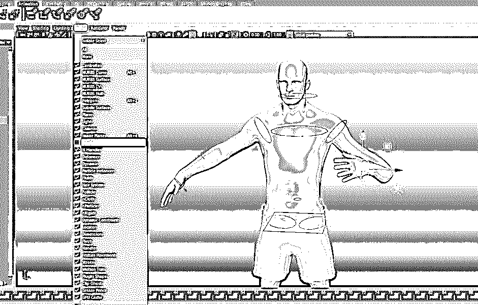

*   我们通过在视窗菜单中显示来隐藏关节，并取消选中关节，这将是动画师的视图。我们通过记住动画师来完成整个装配过程。
*   由于我们正在装配角色，我们可以使用快速装配工具，但对于另一个东西，如四足动物，外星人和道具，我们必须创建一个自定义装配，包括创建关节，创建控制，然后蒙皮，这是将装配附加到几何体。在本文中，我们将不会创建自定义装配，但我们将在快速装配分步方法中看到相应的详细步骤，因为我们到目前为止已经使用一次单击方法完成了装配。

#### 方法 2–快速装配(逐步)

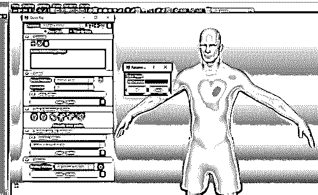

**第一步:**在分步方法中，首先，我们会通过选择第三个图标来重命名我们的角色。然后，我们将通过点击加号按钮添加几何体，同时选择要装配的角色。

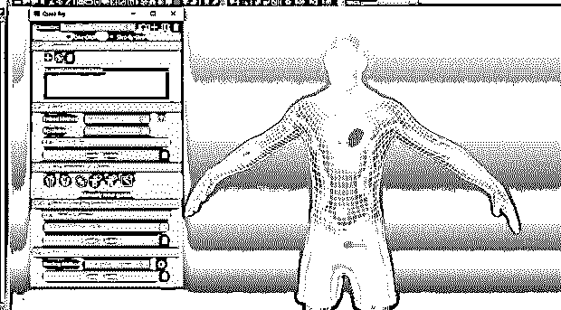

**步骤 2:** 接下来，保持嵌入方法和其他设置不变，并在指南部分单击创建/更新。

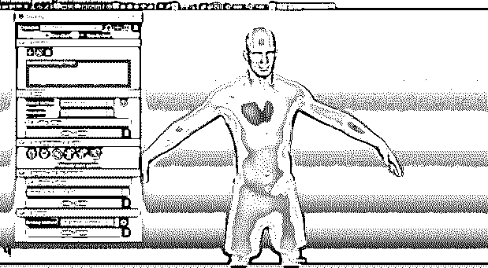

**步骤 3:** 如果你看不到关节，那么在视口中的显示菜单中打开它。同样，关节不在它们应该在的确切位置，所以如下所示，我已经使用变换工具调整了左手关节，并使用“用户调整引导线”,它被镜像到右侧，这将它带到左手的确切位置。

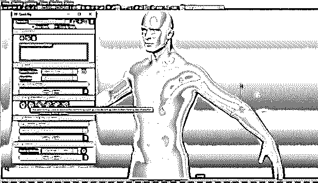

**步骤 4:** 同样，我们可以使用调整导轨或手动调整其他关节，如图所示。

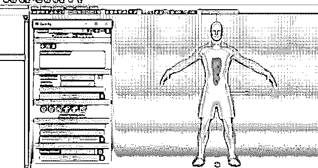

**步骤 5:** 下一步是骨骼和装备生成，我们选择骨骼和控制装备选项，并使用创建/更新按钮进行生成。如下所示，骨架已生成，HumanIK 面板还显示了控制装备和角色的预览。

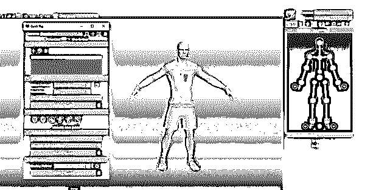

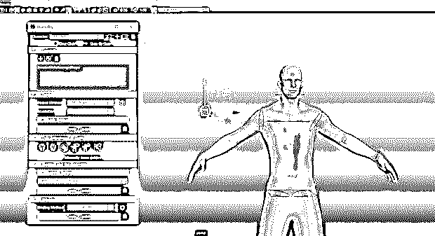

**第六步:**最后一步是蒙皮，将骨架绑定到网格几何体上；正如我们在上面看到的，关节仍然独立于几何图形。您可以在设置中更改绑定方法，然后单击创建/更新。

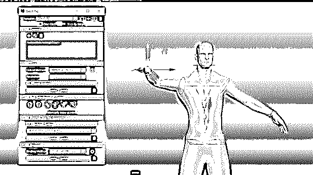

因此，我们已经成功地完成了几何体关节的蒙皮。

#### 反向运动学(IK)和正向运动学(FK)

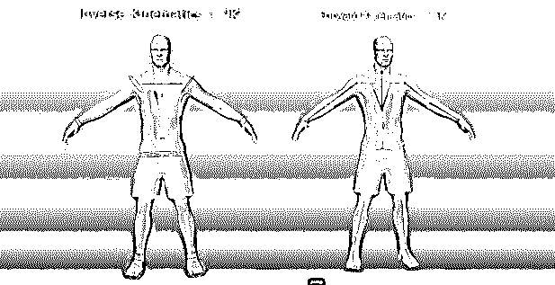

IK 和 FK 在玛雅的索具中扮演着重要的角色。在这一节，我们将深入 IK 和 FK 的概念，看看它们的区别，以及为什么在某些情况下一种方法比其他方法有用。

以下是实际定义:

*   "正向运动学将关节角度作为输入，并计算末端效应器的笛卡尔位置和方向."
*   “反向运动学以笛卡尔末端执行器的位置和方向作为输入，并计算关节角度。”

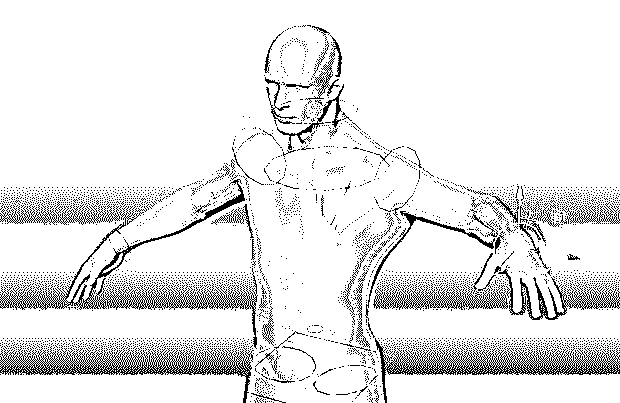

**第一步:**在 IK 中，如果我们选择控制并移动它，那么所有其他骨骼都会跟随，这意味着运动是根据控制点结束的位置计算的。与 FK 相比，这是一个新概念。

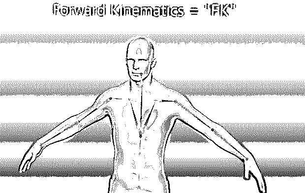

第二步:“FK”是一个古老的概念，曾被用于制作电影《侏罗纪公园》的动画。在这种方法中，我们没有控制，所以我们必须单独旋转每个骨骼。

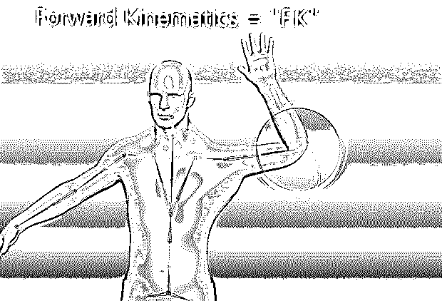

第三步:然而在 IK 中，我们只需移动控制手柄就可以实现如下所示的相同姿势。

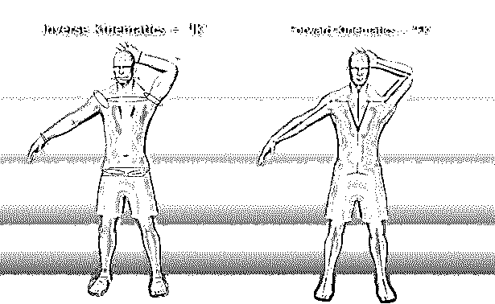

**步骤 4:** 此外，当我们移动臀部的控制手柄时，我们可以看到，在 IK 中，腿停留在与它们在世界空间中相同的位置，而在 FK 中，整个角色移动，因为它们意味着从关节进行调整。

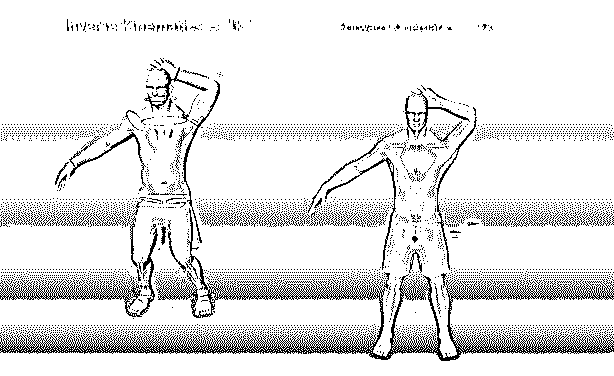

**第五步:**在 FK，我们调整单个关节，如下图所示

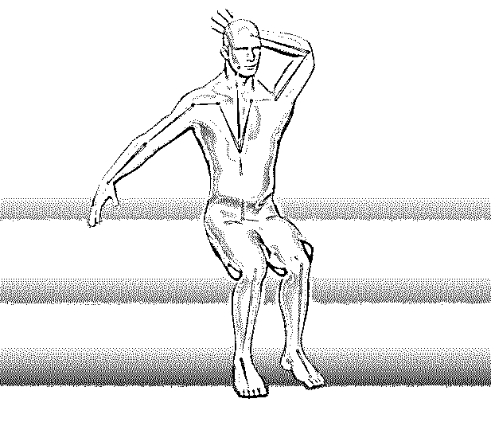

**步骤 6:** 假设我们要为 FK 的一只投球手制作动画，我们调整这只手并旋转肩部枢轴以获得效果。

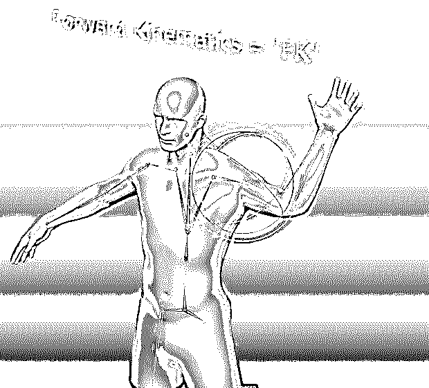

在 IK 中，我们调整控制手柄来获得效果。

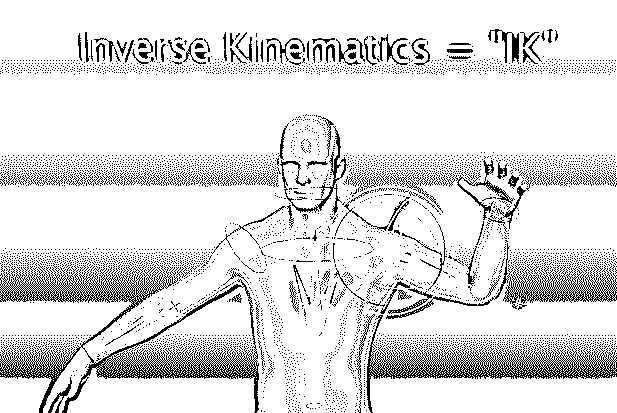

#### 支撑索具和约束

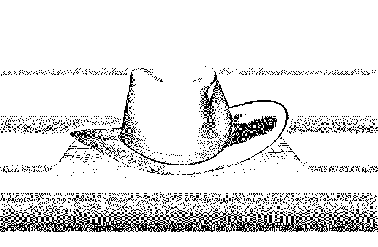

道具装备被用在上面的场景中，比如角色可以拿起的帽子，所以我们必须通过添加控制曲线来装备道具。此外，我们还必须考虑支点。

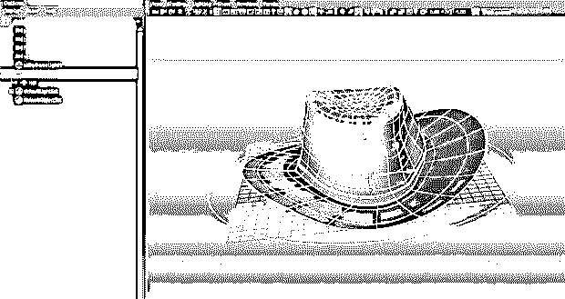

*   我们已经创建了一个 NURBS 圆，并以帽子为父对象，但这可能会引起混淆，因为我们选择了控件，然后帽子也被选中。因此，为了解决它，我们使用约束。
*   要进行约束，首先选择 NURBS 曲线，它是父对象和子对象，然后在装配菜单集时，转到“约束菜单”并将父对象设置为约束。这些控件用于制作动画。

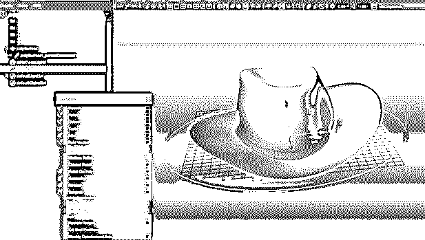

### 结论

因此，在这篇文章中，我们已经看到了快速装配工具如何让你开始与人类角色，也看到了一步一步的方法来装配。此外，我们已经触及 IK 和 FK 的概念，以及如何约束是用在索具。请记住，装配是动画的基础，所以我们必须保持它的强大，以便将来制作更好的动画。

### 推荐文章

这是一个指南索具在玛雅。在这里，我们讨论一个介绍，使用不同的方法在 Maya 中使用索具的方法。您也可以浏览我们的其他相关文章，了解更多信息——

1.  [Maya 渲染设置](https://www.educba.com/maya-render-settings/)
2.  [玛雅中的标志](https://www.educba.com/logo-in-maya/)
3.  [安装 Maya](https://www.educba.com/install-maya/)
4.  [Maya 快捷键](https://www.educba.com/maya-shortcuts/)

