# 安装 Adobe Photoshop

> 原文：<https://www.educba.com/install-adobe-photoshop/>

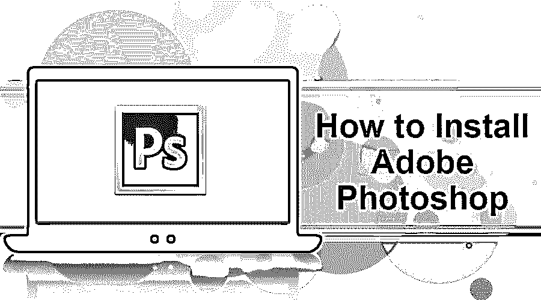

## Adobe Photoshop 简介

您可以轻松地在您的系统中安装 Adobe Photoshop，这是行业标准的照片编辑和处理软件，前提是您具备 Adobe 规定的最低系统要求，以便高效流畅地运行该软件；首先是操作系统(OS)-Windows、MAC、Linux 和硬件配置，如硬盘空间、RAM 内存、处理器、显卡、互联网连接等，因此一旦您准备好所有这些，您需要按照步骤从 Adobe 网站下载并安装您喜欢的 Photoshop 版本(最新版本是 Photoshop CC)。

在安装之前，您需要检查一些系统属性，如下所列

<small>3D 动画、建模、仿真、游戏开发&其他</small>

*   **硬盘空间**C:\ drive 中的 5GB 或更多可用空间，用于安装应用程序和工作。
*   **Ram** 4GB 或更高(建议 8GB)。
*   **处理器**支持 4GHz 或更快速度的 64 位英特尔或 AMD。
*   **操作系统**64 位配置的 Windows 或 iOS。
*   **互联网**连接必须足够好，以便注册并获得软件激活、订阅通知和访问所有在线服务等必要要求。

### 安装 Photoshop

以下是安装最新版本 Photoshop CC 2018 的分步详细信息。

**第一步:**要下载安装最新版本的 Photoshop，请访问 Adobe Photoshop 的官方网页。此网页包含 Photoshop 中所有最新的功能。

[点击](https://www.adobe.com/in/products/photoshop.html)，选择免费版(30 天)试用包。单击“立即购买”从 Adobe 购买套餐。

*   一旦我们点击“立即购买”,我们将被引导到下面的网页，选择您的计划，并在购买后通过 Adobe 官方电子邮件获得一个用于 Photoshop 访问的序列号。Adobe 官方订阅电子邮件服务将共享此序列号；不要和别人分享；保持安全。[点击这里](https://www.adobe.com/in/creativecloud/plans.html)
*   该页面提供多种前置软件访问，如个人使用、商业或专业需求、学生和教师也使用以及学校和大学。此外，它还有一个云计划，可以使用互联网随时随地保存和访问数据。如果我们一次购买更多的服务包，我们可以享受企业和教育折扣。为此，我们需要联系 adobe 营销或服务团队了解更多详细信息。以下是联系 Adobe 服务和营销相关问题的链接。这里是[链接](https://helpx.adobe.com/in/contact.html)

**步骤 2:** 我们需要在 Adobe 官方页面上注册(如果是新的)或登录(帐户已存在)。这里是[链接](https://www.adobe.com/in/)我们可以使用脸书和谷歌证书来创建新的注册。检查您合适的计划或安装模式，并选择它。

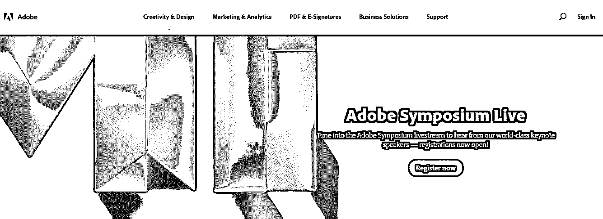

**步骤 3:** 注册或登录 Adobe 页面，使用 CC 版本访问应用程序。我们可以使用脸书和谷歌帐户快速登录。项目数据可以保存在云中，并且可以在任何时间点轻松访问。更新和通知相关的消息将被发送到注册的电子邮件 Id。

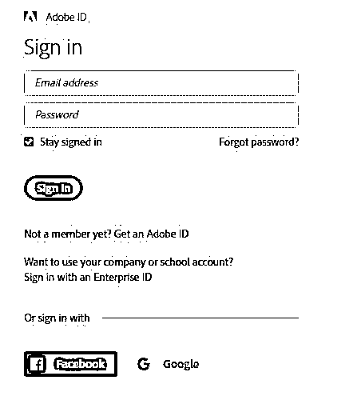

**第四步:**登录后，我们可以在首页看到我们的详细信息，然后在你的浏览器上打开一个新的标签页，在这里打开这个[链接](https://helpx.adobe.com/download-install/kb/download-availability.html)；我们有一个 Adobe 云服务应用列表，从列表中选择 Photoshop 64 bit，基于“OS”下载。

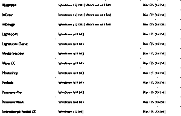

*   这些是 Adobe 提供的应用程序和服务列表；下载具有正确操作系统位配置(32 位或 64 位)的所需软件。

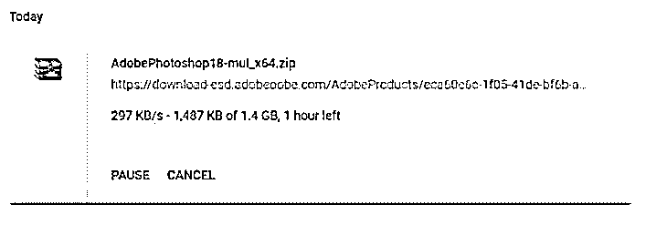

**第五步:**有了 Photoshop setup 所有支持文件的文件夹后，将其解压为文件夹，识别 setup 文件夹，然后运行(双击。exe)来执行下载的安装文件向导。

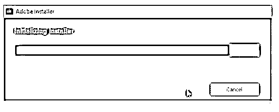

**步骤 6:** 一旦安装程序启动，它会寻找一些配置细节，例如 Adobe 要求试用包；如果您需要试用包，请选择“试用”选项；如果您购买了 Photoshop plan 软件包，请选择“安装”。此选项有助于将您的 Photoshop 与基于所选计划的持续时间、添加的功能和属性联系起来。

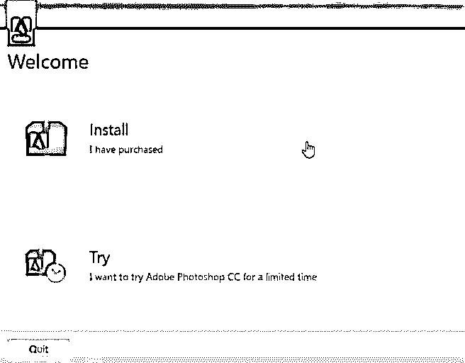

**第 7 步:**然后我们可以看到 Adobe 软件许可协议已打开，因此请仔细阅读条款和条件，并在接受 Adobe 软件许可协议的条款和条件之前选择首选语言。

之后，点击接受。

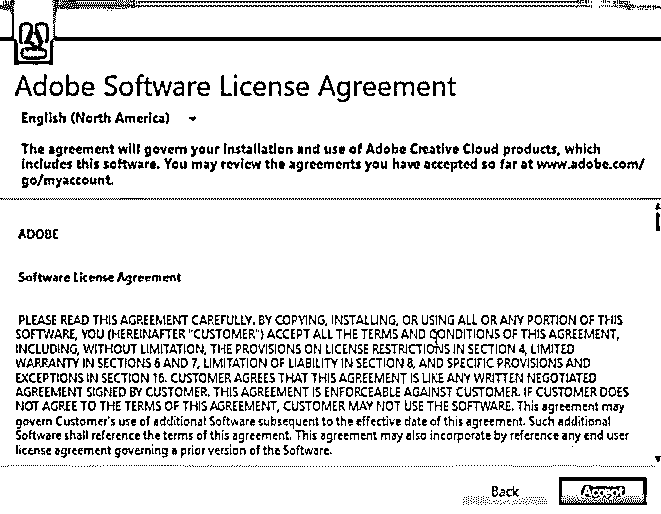

**第 8 步:**Adobe 将向您的注册邮箱发送一个数字序列号。如果您订购了任何包，该序列号有助于激活您的包；在让它在列中键入序列号后，一旦键入完整的数字，单击下一步，对于免费试用版，它不会询问任何序列号，这些用户将被向导直接发送到安装的下一步。

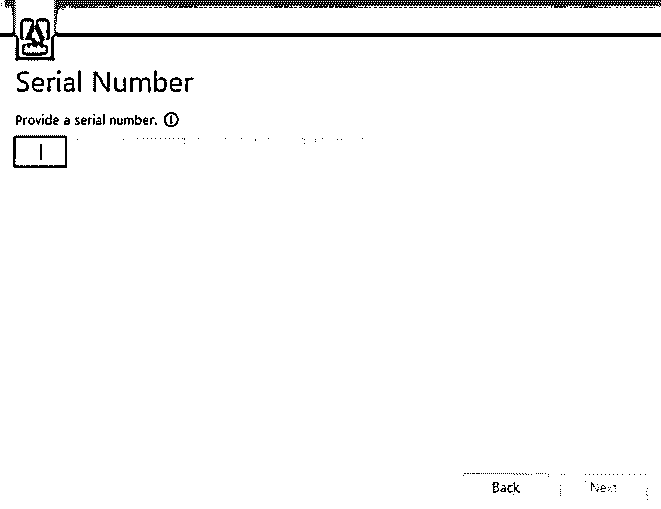

**步骤 9:** 根据计划，我们可以从表单包中选择所需的应用程序列表，并选择保存安装文件的首选语言和位置，一旦给定，然后单击安装。

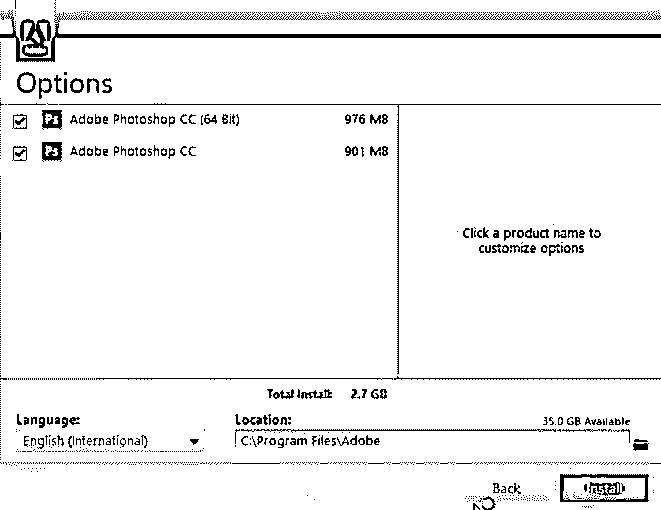

*   安装可能需要一些时间，因为应用程序将安装在设备上。该设备必须是 64 位操作系统、4Ghz 或更高的处理器以及至少 5 GB 的硬盘空间；检查此参数，以便顺利完成安装。

**步骤 10:** 一旦安装程序完成，我们有一个完整的应用程序列表，根据计划或免费版本被选中，将被安装并准备使用；下面，我们可以看到 Photoshop 安装成功。接下来是观看一些基本视频的选项，这些视频讲述了如何在工作的开始阶段处理 Photoshop。

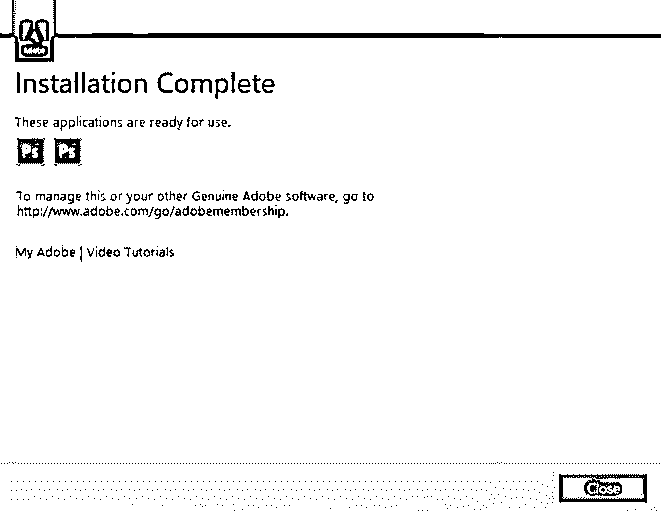

**第十一步:**我们可以找到桌面上可用的 Photoshop 应用程序快捷方式，在应用程序列表中，我们可以看到 Photoshop 已安装双击或右键单击应用程序，选择以管理员身份运行。该应用程序将在我们的设备上启动。

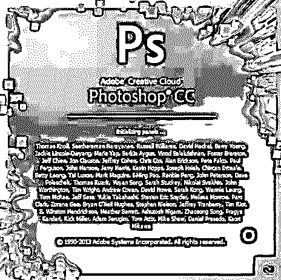

**第 12 步:**打开 Photoshop 应用程序，准备使用所有工具。具有菜单栏上的多个工具、图层窗格、工具窗格以及所有最新的 Photoshop 功能和特性。

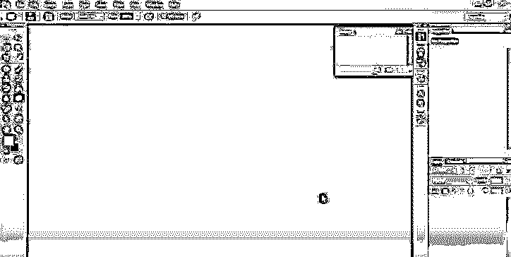

**步骤 13:** 创建所需不同尺寸的新文件，并访问 Photoshop 的所有工具，如画笔、钢笔、克隆图章和所有其他工具，以及基于项目的各个文件方面的所有创建、编辑和保存权限。艺术家可以通过将他们的想法转换成图像、gif 或 Photoshop 的任何其他文件格式来探索，并将它们带到现实或数字图形的视觉世界。

### 推荐文章

这是一个如何安装 Adobe Photoshop 的指南。这里我们讨论了在我们的系统中安装 Adobe Photoshop 的概念和步骤。您也可以阅读以下文章，了解更多信息——

1.  [Adobe Photoshop 替代品](https://www.educba.com/adobe-photoshop-alternatives/)
2.  [Adobe Photoshop 工具](https://www.educba.com/adobe-photoshop-tools/)
3.  [MP4 转 GIF Photoshop](https://www.educba.com/mp4-to-gif-photoshop/)
4.  [Photoshop Elements vs Lightroom](https://www.educba.com/photoshop-elements-vs-lightroom/)

