# Photoshop 颜色匹配

> 原文：<https://www.educba.com/photoshop-color-match/>

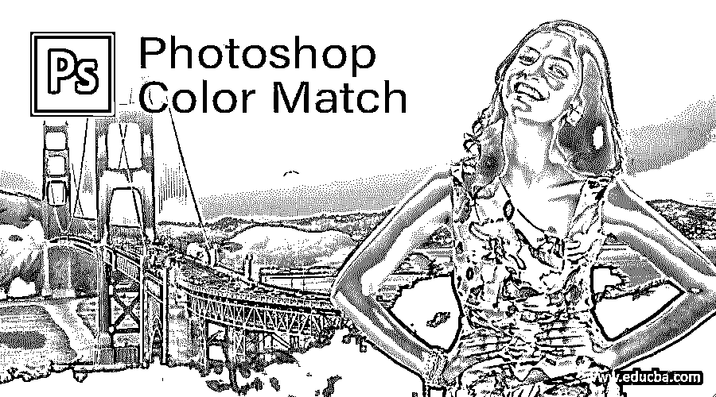

## Photoshop 配色简介

颜色匹配是 Photoshop 中的一项技术，它允许您更改任何粘贴对象(从其他图像中剪切下来并希望与新背景混合的对象)的色调，使其与背景图像的色调相匹配。在这里，这篇文章将会给你层面板的调整层的知识，颜色曲线的图形及其参数，以及一些重要的工具，其中将包括在该软件的执行颜色匹配功能的步骤。因此，让我们分析这些步骤，并找出将这种技术应用到我们的项目工作中的关键特征。在这个主题中，我们将学习 Photoshop 颜色匹配。

### Photoshop 里怎么做配色？

颜色匹配就是将背景图像的色调与取自不同色调背景图像的其他对象进行匹配的过程。色彩匹配有助于照片在将不同环境的照片组合成一张照片时，保持相同的色调和效果。

<small>3D 动画、建模、仿真、游戏开发&其他</small>

我认为我们应该快速浏览一下这个软件的用户界面，以便容易地与我们在本文中使用的这个软件的术语联系起来。从顶部开始，有一个菜单栏，包括文件菜单、编辑菜单、图像菜单和其他一些菜单。在此栏下面，您会发现一个属性栏，它在使用活动工具或活动图像时会有所帮助。在属性栏下方，用户界面分为三个主要部分，在左侧，您会发现该软件的工具栏，在中间的文档显示窗口，最后一个在右侧，有一些选项卡，如图层面板，颜色，以及其他一些由您从窗口菜单启用的选项卡。不用担心工作屏幕上这些部分的调整。您可以通过从窗口菜单中启用所需的部分来创建自己的工作屏幕，并将它们放置在用户屏幕的所需区域。

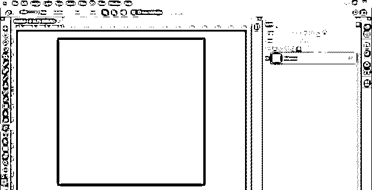

现在我们将有一个开始学习这个主题的图像。所以转到菜单栏的文件菜单，然后点击它。点击后，弹出列表将向下滚动。单击打开选项或按键盘的 Ctrl + O 键作为快捷键。

现在从打开的对话框中选择您想要的图像或照片。我将选择这个名为“背景”的图像，然后单击这个对话框的“打开”按钮。

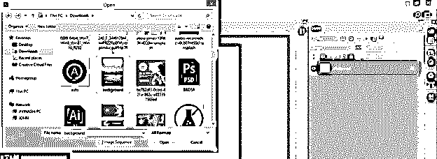

现在我想再看一张照片。所以，再次使用这个软件的打开命令，选择你想要的图像。我将选择这个名为“人物”的图像，然后点击这个对话框的“打开”按钮。

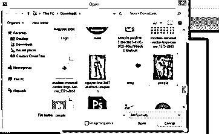

现在我把这个人从这张图片上切下来。为此，你可以采用任何“从背景中分离物体”的方法。在这里，我将使用一个快速截面工具，并围绕这个对象这样选择。

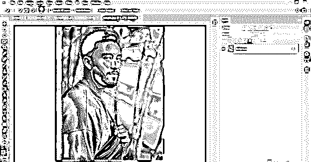

现在，选择后右键单击，然后单击下拉列表的选择和屏蔽选项。

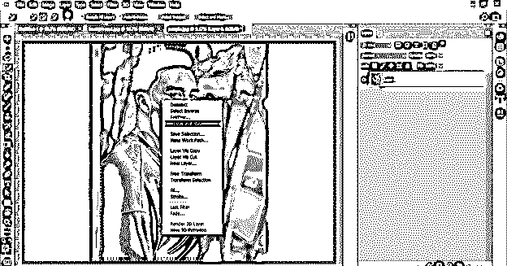

添加一些羽毛的选择和调整其他选择参数，然后点击确定按钮。

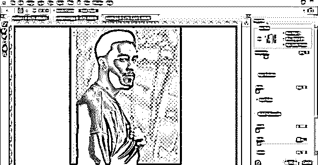

现在按下键盘上的 Ctrl+ J 键，将这个对象从背景中分离出来。

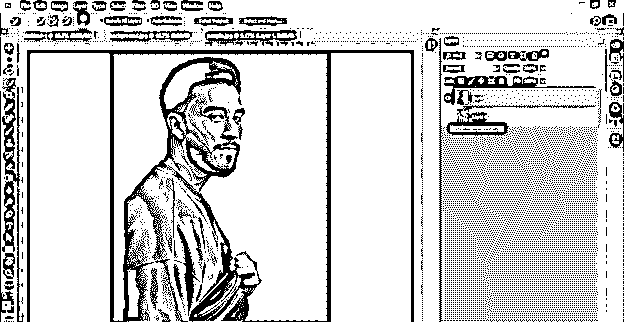

现在，在鼠标左键的帮助下将该对象拖动到背景窗口选项卡，并在背景窗口的文档区域释放鼠标按钮。如果图像非常大，请按 Ctrl + T 按钮来变换结合框，并根据您的选择调整对象的大小。

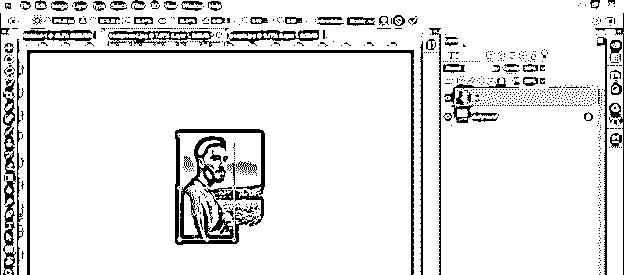

现在让我们转到这篇文章真正的难点。那是什么？这就是配色。所以对于颜色匹配，去调整图层按钮。你会在这个软件的图层面板的底部找到这个按钮，还有图层面板的其他一些重要的按钮。点击这个调整层按钮，一个向上滚动的列表将会打开。点击列表中的曲线选项。

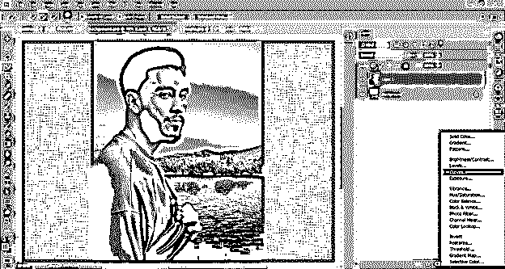

一旦你点击，你会有两件事:一个曲线调整层将添加到层面板，一个对话框的曲线将打开这样。

现在我们想匹配这个对象的色调与背景图像，这意味着我们正在使用这个对象的曲线调整层。所以点击这个剪贴层按钮，它会用对象层剪贴这个调整层。

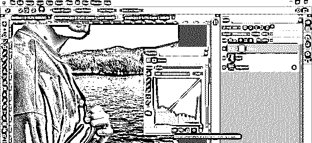

确保在颜色曲线中进行更改，并选择该层的第一个图标(图形图标)，而不是白色图标。

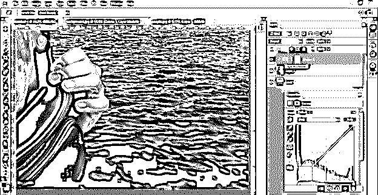

现在按住键盘上的 Alt 键并点击这个框的 Auto 按钮。

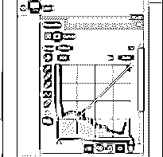

单击后，将会打开一个自动颜色校正对话框。点击“查找深色和浅色”单选按钮。

现在点击阴影按钮的阴影颜色框。

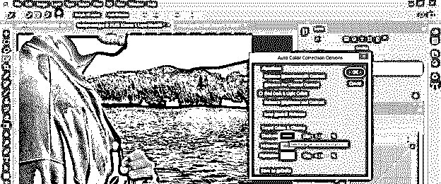

现在用颜色选择器工具从背景图像中选择最暗的颜色。一旦你选择了最深的颜色，它会在色标框上显示你选择的颜色。现在点击确定。

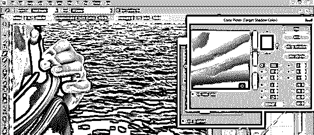

现在点击高亮颜色框按钮，从背景图像中选择最亮的颜色。

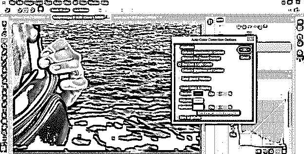

现在，我将使用颜色选择器工具从天空区域选择最亮的颜色，我选择的颜色将出现在色标框中。

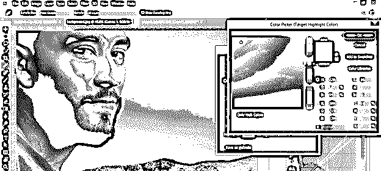

现在点击中间色调颜色框按钮。

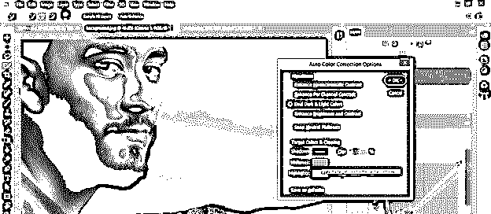

从背景中选择最接近灰色的颜色，然后单击此对话框中的确定按钮。

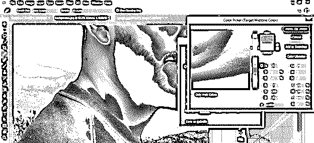

单击后，会打开一个对话框，询问您是否要将这些颜色保存为曲线调整层的默认颜色。根据您的选择点击是或否。

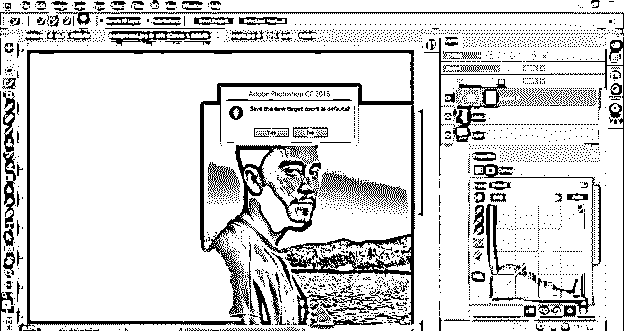

现在，您可以看到“颜色匹配后”属性和“颜色匹配前”属性之间的图像差异。

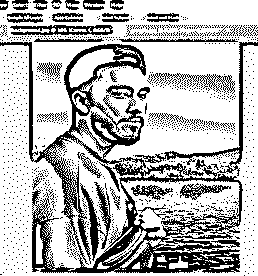

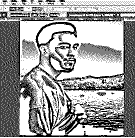

这是一个非常有效的方法，通过它你可以在 Photoshop 中进行颜色匹配。

### 结论

现在你可以肯定地说，这篇文章帮助你了解了 Photoshop 软件的配色技巧。你可以很容易地使用这种技术和它的参数来获得你想要的专业作品照片的色调效果。

### 推荐文章

这是 Photoshop 配色指南。在这里，我们讨论如何在 Photoshop 中进行配色，以了解 Photoshop 软件的配色技巧。您也可以看看以下文章，了解更多信息–

1.  [Photoshop 阳光效果](https://www.educba.com/photoshop-sun-effect/)
2.  [Photoshop 金色渐变](https://www.educba.com/photoshop-gold-gradient/)
3.  [Photoshop 中的鱼眼效果](https://www.educba.com/fisheye-effect-in-photoshop/)
4.  [扭曲图像 Photoshop](https://www.educba.com/warp-image-photoshop/)

