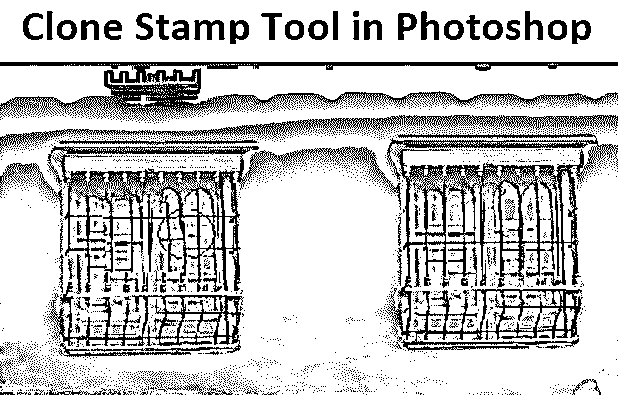
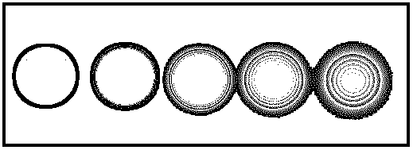
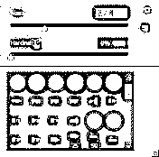
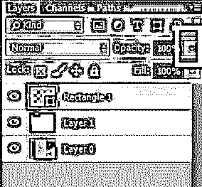
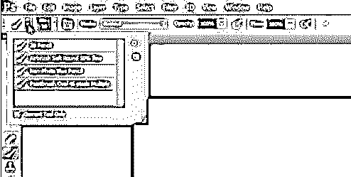
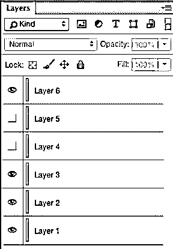
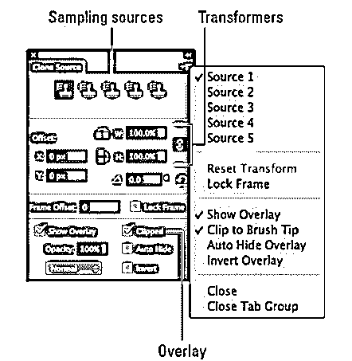
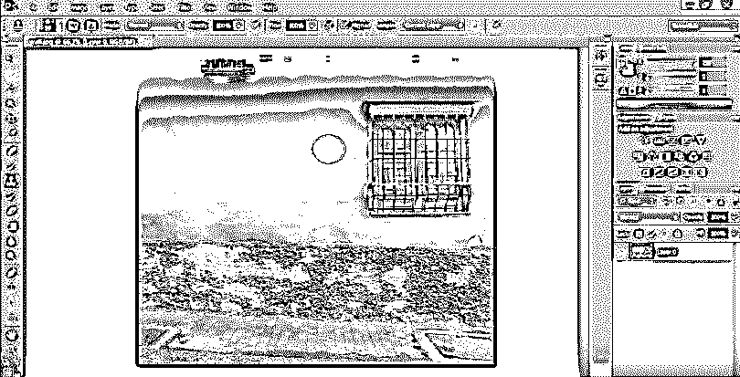
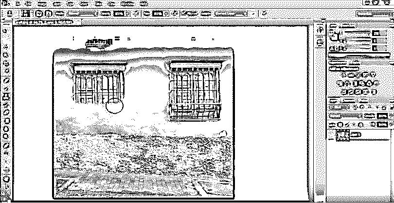
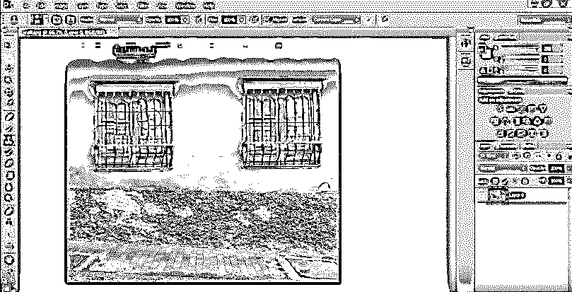

# Photoshop 中的克隆图章工具

> 原文：<https://www.educba.com/clone-stamp-tool-in-photoshop/>

## 克隆图章工具简介

克隆图章，顾名思义，是 Photoshop 中可用的图像校正工具，用于将图像恢复到原始状态，删除图像中不必要的对象，以及创建艺术元素；克隆工具在用户定义图像中的目标点之后工作；然而，要完全掌握克隆工具的用法，最初需要大量的练习和努力。

### 克隆方法的类型

下面讨论三种类型的方法:

<small>3D 动画、建模、仿真、游戏开发&其他</small>

#### 1.在背景层上克隆

初学者最常使用第一种方法，因为它是最明显的。这也是最危险的，因为变化是不断的，一旦保存就无法撤消。

#### 2.制作一个复制层，然后在该层上克隆

因此，这种方法不应该使用。第二种方式更好，因为背景层没有改变。但是不适当的错误更难犯。该图像还会占用更多的存储空间，因为现在有该图像的两个副本。因此，这也不是最好的方法。

#### 3.在单独的空层上克隆

第三种方法在实践中有很多优点，是大多数情况下唯一使用的方法。当出现错误时，删除工具可以简单地将其从图片中删除。它在驱动器上占用更少的空间，并且很容易单击可见性图标来切换更改。

### 使用画笔的快捷键

*   左侧画笔大小减小。
*   右括号大小 **)** 增加画笔的大小。
*   左刷移位[]减小送纸器尺寸。
*   右刷移位大小减少移位。
*   对，画笔大小增加。
*   链接支架尺寸减小，笔刷尺寸增加。
*   右括号(shift)。

用你的大头针使它更光滑，或者用旋转左支架移动右支架来增加硬度。增加的大小取决于画笔的大小。笔刷大小增加/减少大小 1-9 1 10-100 10 * > 100 25 出现五种硬度，每次点击都会改变 20%的硬度，分别为 100%、80%、60%、40%和 20%，如图所示。

在使用层进行调整时，需要考虑两个重要因素。第一件事是在你的克隆层上总是有调整层。如果将克隆图层放在调整图层之上，并且稍后修改了调整图层，则克隆图层中的更改将不会更新。

注意:调色板层而不是选项菜单必须这样做。菜单选项是相同的，但仅当克隆到相同级别时才起作用。如果使用单独的克隆层，此选项将不起作用。

### 在 Photoshop 中使用克隆图章工具的步骤

**第一步:**打开一个图像文件(。分机，。jpg，。png，。bmp，…)并应用工具箱中的克隆图章工具。

**第二步:**点击键盘的 S 键。

**第三步:**在笔刷预设选取器中选择一个笔刷，改变其大小或硬度，以更好地控制克隆区域。

**第四步:**在选项栏上选择[混合模式](https://www.educba.com/blend-tool-in-illustrator/)。

**第五步:**使用选项栏中的不透明度滑块或文本框，使克隆变得或多或少不透明。

**第六步:**现在，看看通过改变克隆图章工具的流速来实现克隆有多快。如果需要，选择喷枪功能进行喷枪。

根据您的偏好，选择或取消选择对齐选项。当光标移动到不同的位置时，如果选择了对齐，克隆源也会移动。如果要从同一位置克隆多次，请取消选中对齐。

**步骤 7:** 选择样本的下拉选项，并选择所有层选项，以克隆多层图像的切片。

**第 8 步:**该选项允许你在所有可见图层中为克隆指定像素。如果选择了 stage 8 中的所有层，您可以选择在克隆过程中忽略任何设置层。

**步骤 9:** 选择窗口替代临床源，打开克隆源面板。在选项栏中(混合模式选项的左侧)，单击克隆源的面板图标。锻炼以下选项:

*   **样本源**:在第 8 步中，Alt-click(在 Mac 上可选单击)定义您想要克隆的图像区域。但是，在“克隆源”面板中，您可以在图像的另一个区域选择并重复另一个“克隆源”按钮(单击 Mac 选项)。

*   **变换**:改变你的克隆体的位置、比例或旋转。单击图标链接获得长宽比宽度和高度。要重置转换，请选择链接图标下的小弯箭头。

**步骤 10:** 按住 Alt 键单击您想要克隆的图像区域(在 Mac 上可选单击)。

**步骤 11:** 点击或拖动您想要查看克隆的区域。

**第十二步:**Photoshop 中克隆图章工具的最终输出。

### 结论

克隆图章工具是 Photoshop 中对图片编辑和图形艺术家最有用的功能之一。这个强大工具的应用没有限制。

### 推荐文章

这是一个在 Photoshop 中克隆图章工具的指南。在这里，我们讨论的概念和如何使用 Photoshop 中的克隆图章工具和例子。您也可以浏览我们推荐的其他文章，了解更多信息——

1.  [Adobe Photoshop 工具](https://www.educba.com/adobe-photoshop-tools/)
2.  [Photoshop 中的红眼工具](https://www.educba.com/red-eye-tool-in-photoshop/)
3.  [变换工具 Photoshop](https://www.educba.com/transform-tool-photoshop/)
4.  [扭曲图像 Photoshop](https://www.educba.com/warp-image-photoshop/)

