# Photoshop 中的毛刺效应

> 原文：<https://www.educba.com/glitch-effect-in-photoshop/>

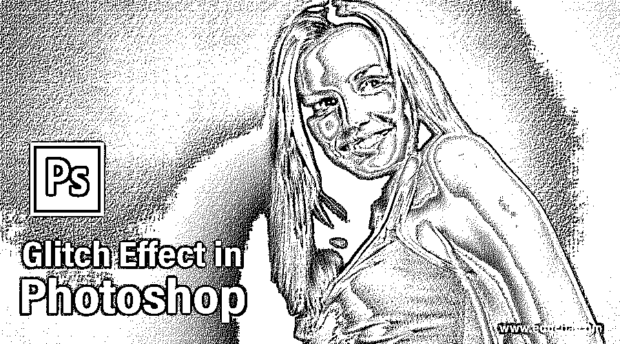

## Photoshop 中的毛刺效果介绍

Photoshop 是一款光栅图像编辑软件，由 adobe systems 开发，作为其面向编辑专业人员的图像编辑软件。在这个软件中，我们有不同类型的技术来制作不同类型的效果。毛刺是使用该软件的一些技术和参数在我们的图像上制作旧电视类型效果的效果之一。因此，在本文中，我们将了解所有这些技术和参数，通过这些技术和参数，我们可以用一个非常有效的例子来逐一制作毛刺效果。

### Photoshop 里的毛刺效果怎么做？

我们可以按照这个软件的不同技术的一些简单步骤在我们的图像上制作一个毛刺效果，但是在开始之前，让我们看看这个软件的工作屏幕，以便更好地理解这篇文章中的这个主题。

<small>3D 动画、建模、仿真、游戏开发&其他</small>

**步骤 1:** 在工作屏幕的顶部有一个菜单栏，其中有许多用于处理本软件中不同类型工作的菜单，如文件菜单、编辑菜单、图像菜单和其他菜单，下面是我们的活动工具的属性栏，用于更改该活动工具的参数。 在这个属性栏下面，我们在这个软件的工作屏幕的左侧有一个工具栏，它有一些工具，使我们在这个软件中的工作变得容易，在工作屏幕的中心，我们有一个显示窗口，我们可以在其中看到我们当前的工作，在显示窗口的右侧，我们有一些部分，如颜色面板，层面板，和其他一些。

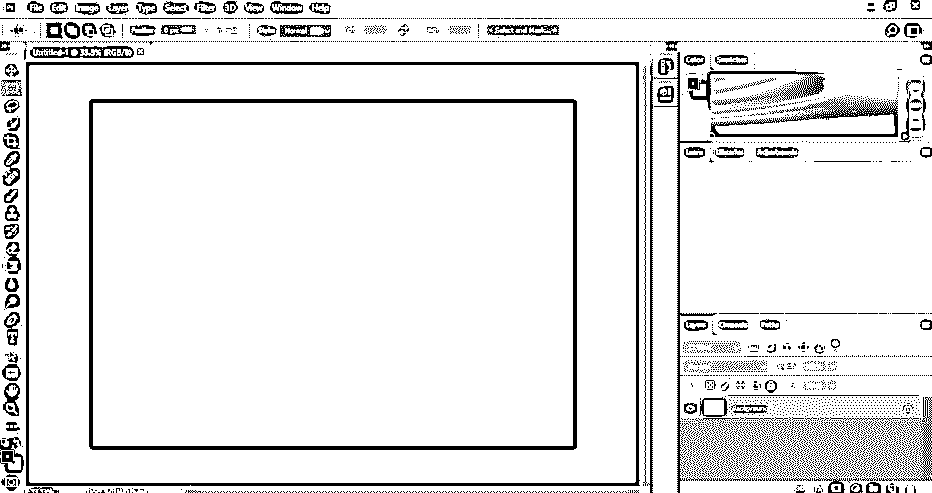

**第二步:**现在，让我们有一个形象的学习。要在这个软件中放置图像，只需转到保存它的文件夹，然后从那里选择它，并将其放在这个软件的显示窗口中。你可以从网上下载，或者为这个作品拍摄自己的图像。

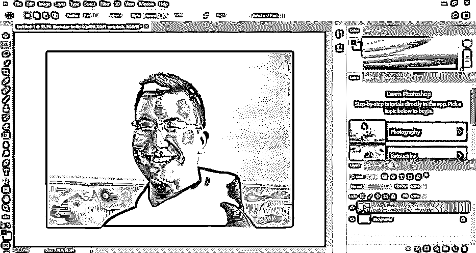

第三步:现在，让我们复制这张图片。为了制作一个副本，选择这一层，并按下键盘上的 Ctrl + J 键。

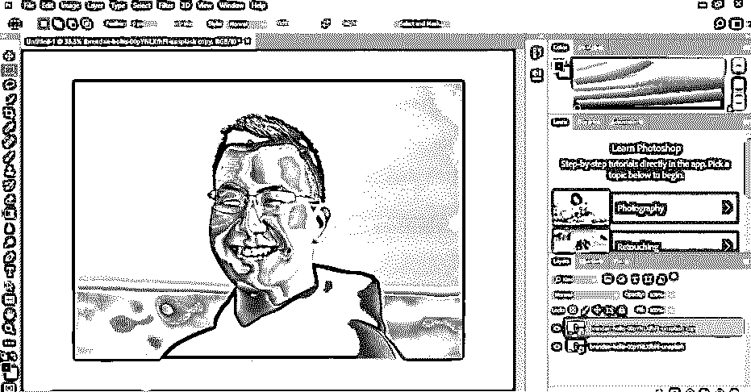

**第四步:**点击选择复制图层，按下键盘上的 Ctrl + U 按钮，打开色调/饱和度对话框。

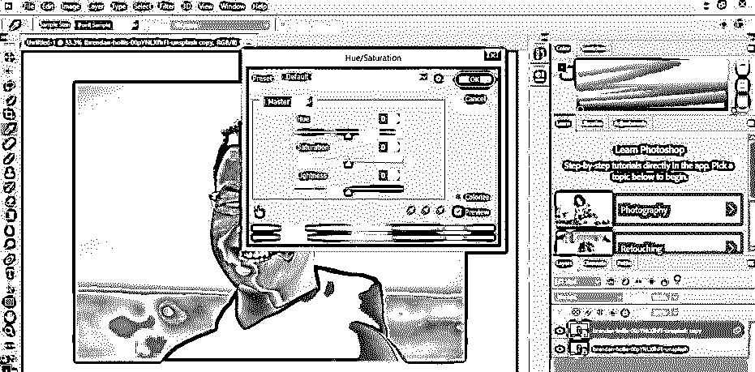

**第五步:**现在，通过拖动饱和度刻度的滑块，使饱和度刻度的值为负值，然后用鼠标键按下这个对话框的确定键，你的图像就变成黑白的了。

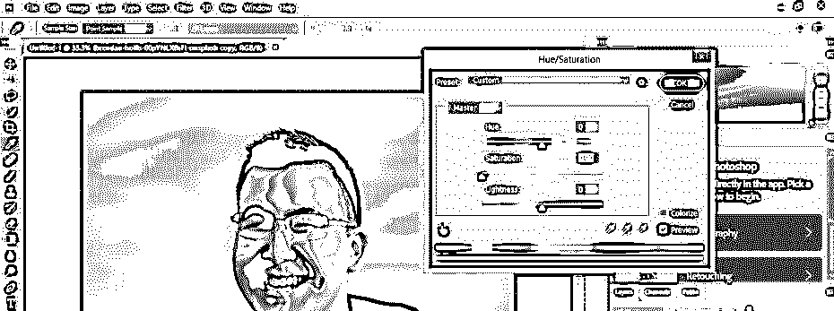

**步骤 6:** 现在进入图层面板，用鼠标右键点击这张图片的复制图层。将打开一个下拉列表，通过单击它从列表中选择“转换为智能对象”选项。

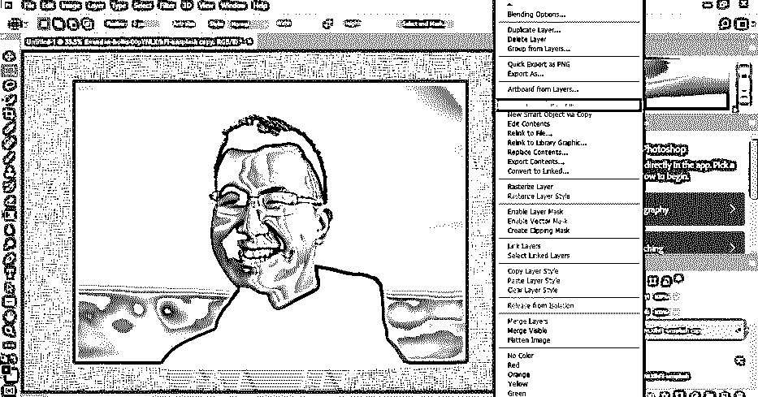

第七步:现在，再一次，通过按键盘上的 Ctrl + J 键复制这个黑白图层。

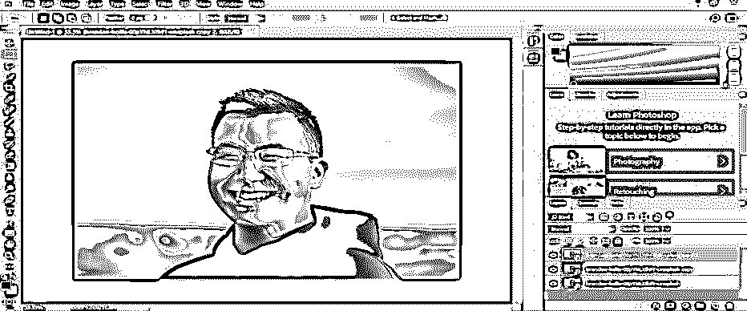

第八步:现在到这个分层面板的底部，点击效果按钮。将打开一个下拉列表；从列表中点击选择混合模式选项。

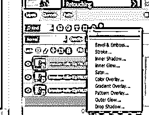

**第九步:**现在会打开一个图层样式的对话框。通过用鼠标键点击高级混合选项通道的 R 值，并按下此对话框的确定按钮，使其取消选中。

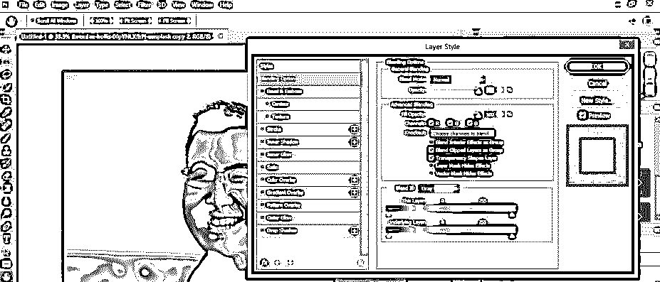

**步骤 10:** 现在从该软件的工具面板中选择移动工具，并多次按下键盘的右箭头键或左箭头键，每按一次箭头键，您就会看到毛刺对图像的影响。确保您的智能图层副本已被选择用于此工作。

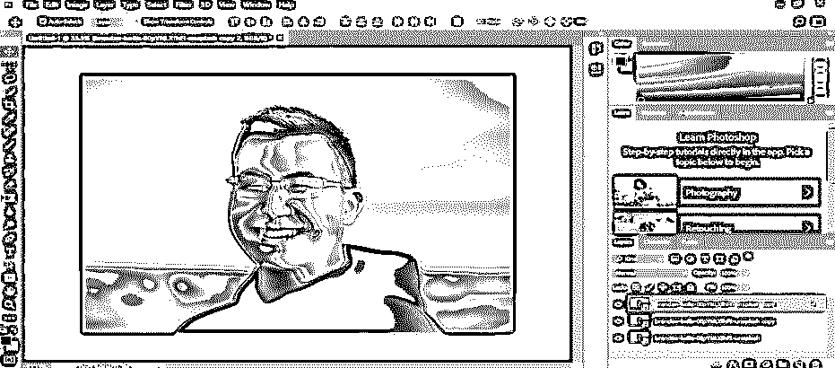

步骤 11: 现在再次，到图层面板的底部，点击效果按钮。将会打开一个下拉列表。从这里单击选择一个实体选项。

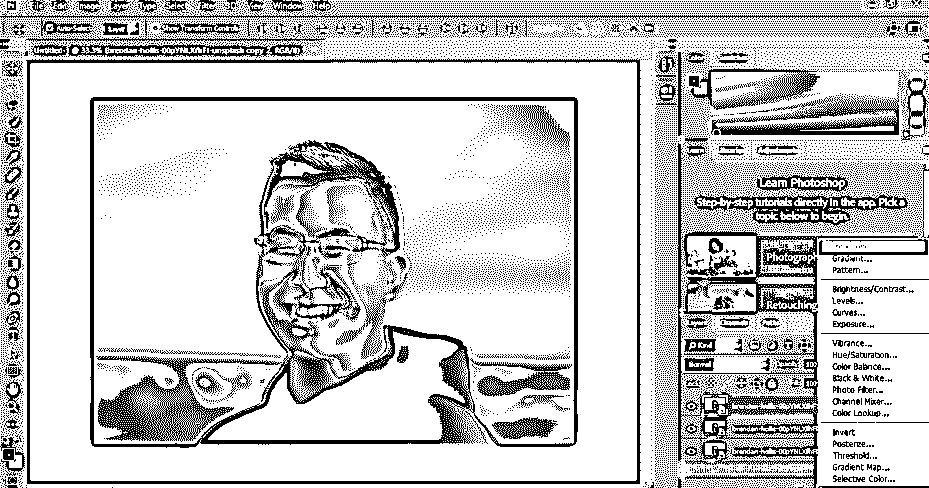

**步骤 12:** 现在，从这个颜色选择器框中选择这个纯色层的颜色为白色。

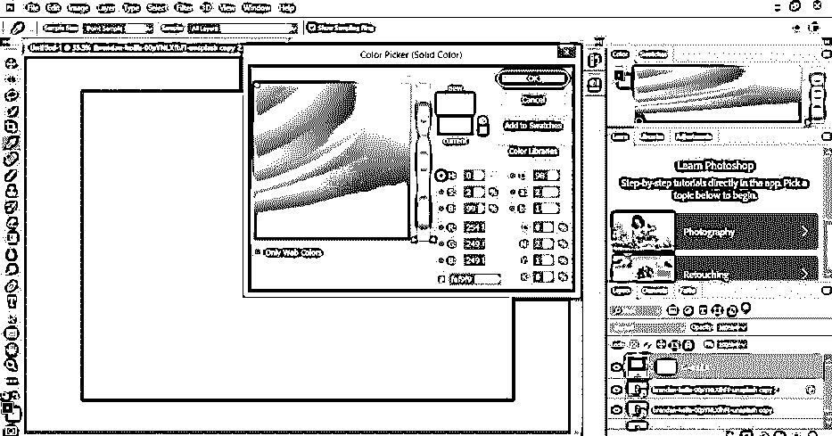

**步骤 13:** 现在用鼠标左键双击这一层。一旦你点击，一个图层样式框就会像这样打开。

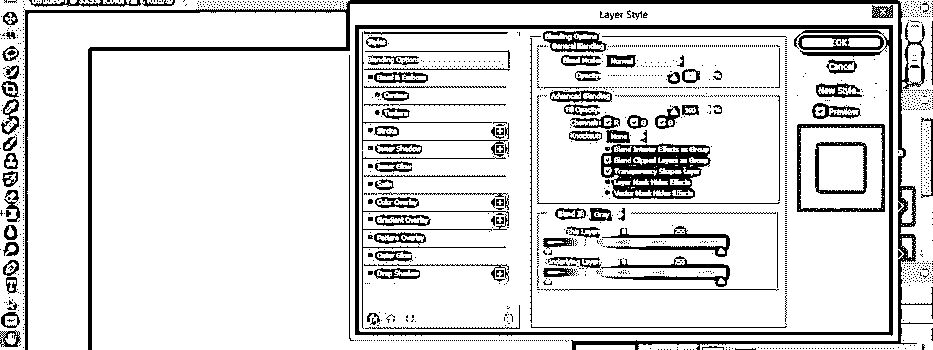

**步骤 14:** 现在点击该样式列表的图案叠加选项，并通过点击复选框在该样式选项上打勾。

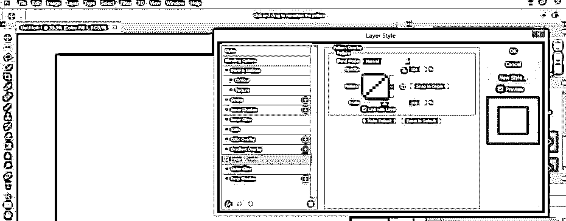

**步骤 15:** 现在转到该框的模式选项，点击模式选项的下拉箭头按钮。将打开不同模式的列表。点击图案，会给你一个毛刺效果；真实的寻找旧的电视印刷品，然后用鼠标左键按下这个对话框的 ok 按钮，将这个图案应用到实体层上。

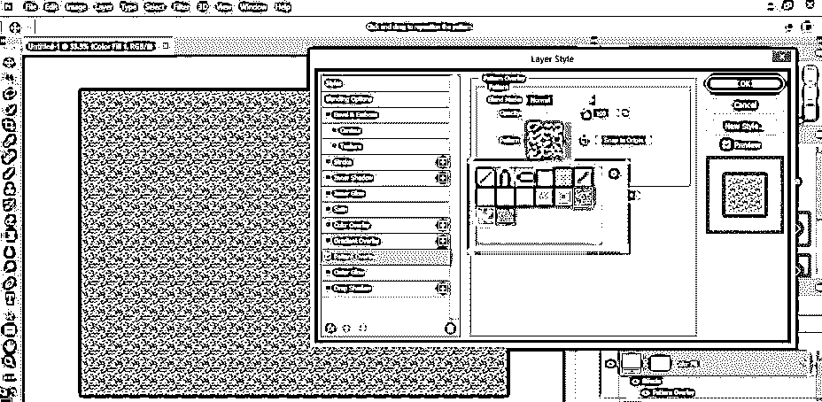

步骤 16: 现在，去这一层的不透明度选项，然后设置不透明度的值为 10%。你现在会发现这种类型的效果。

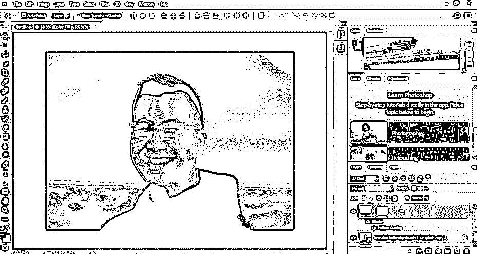

**步骤 17:** 现在按下键盘上的 Ctrl + shift + alt + e 键，在图层面板中给这张图片拍一张快照。

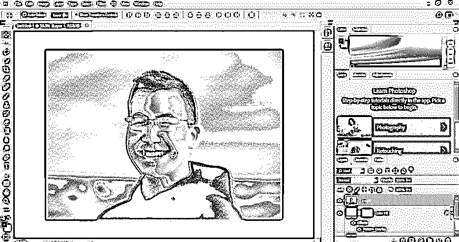

**第 18 步:**现在到了工作屏幕左侧该软件的工具面板；然后，从工具列表中点击一个矩形工具。现在用这个矩形工具在图像上做这样的选择，然后再次进入这个软件的工具面板，点击移动工具。

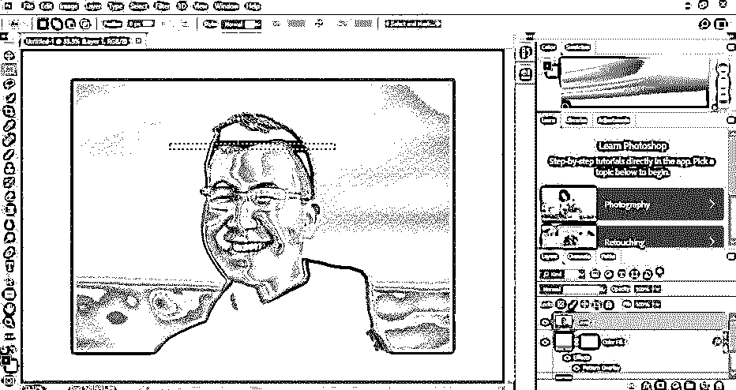

**步骤 19:** 现在重复按键盘的右箭头按钮，将图像的选定区域向右侧移动一点；您可以通过按键盘的左箭头按钮将其移动到左侧。

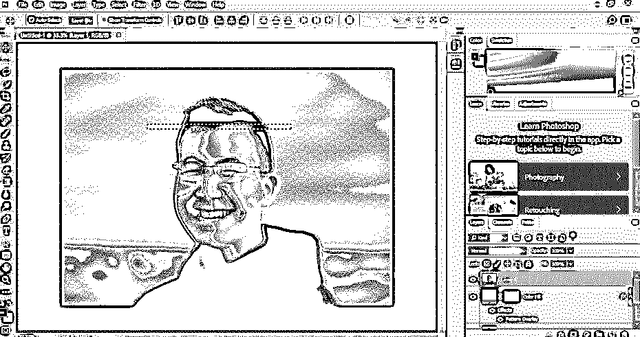

步骤 20: 在你的图像中不同的地方制作更多的位移区域，方法和我们之前做的一样，在你的图像上得到一个真实的毛刺效果。

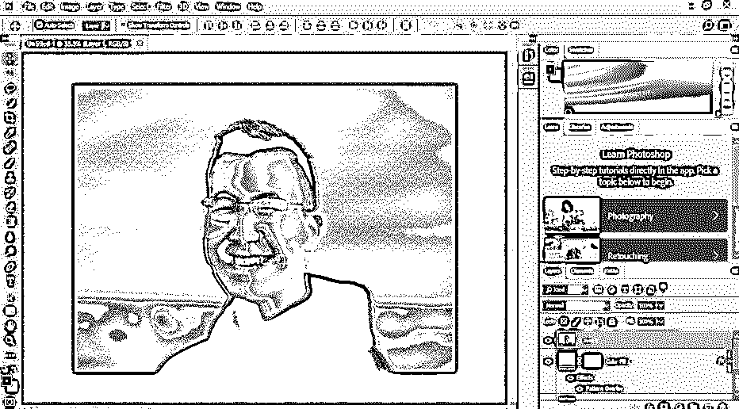

通过这种方式，你可以在 Photoshop 中使用不同的工具和软件功能在你的图像上制作一个毛刺效果，来制作这种类型的旧电视效果。

### 结论

现在，看完这篇文章后，你可以理解 Photoshop 软件中的毛刺效应是什么，以及如何利用这种效应制作出好的电视效果。通过反复练习，你可以很好地掌握这个软件的不同类型的效果。

### 推荐文章

这是 Photoshop 中毛刺效果的指南。这里我们讨论一个介绍，如何在 photoshop 中一步一步地使用毛刺效果。您也可以浏览我们的其他相关文章，了解更多信息——

1.  [Photoshop 中的发光效果](https://www.educba.com/glow-effects-in-photoshop/)
2.  [Photoshop 中的图章效果](https://www.educba.com/stamp-effect-in-photoshop/)
3.  [Photoshop 中的变形](https://www.educba.com/morphing-in-photoshop/)
4.  [Photoshop 中的排版](https://www.educba.com/typography-in-photoshop/)

