# Photoshop 中的雨效果

> 原文：<https://www.educba.com/rain-effect-in-photoshop/>

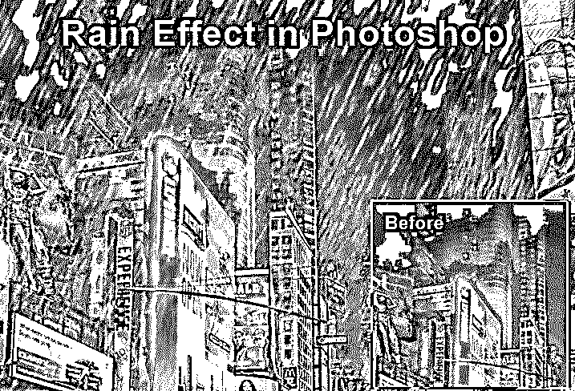

## Photoshop 中的雨效果是什么？

Photoshop 可以用来创建令人惊叹的视觉效果，并根据创作者的概念转换图像，许多 2D 和 3D 艺术家以及游戏工作室的视频编辑都使用 Photoshop 来提高视觉质量，您可以使用 Photoshop 轻松创建诸如雨的效果，但为此，用户必须熟悉该过程中涉及的各种概念和步骤，并学习创建其他效果，如雪、烟、破坏、颜色收缩和调整。

### 如何在 Photoshop 中创建雨的效果？

为了在图像上创建雨的效果，图像的选择对于应用效果和看起来自然也很重要。所以选择一个适合效果的图像。因此，我们将应用一个效果到下面的图片。

<small>3D 动画、建模、仿真、游戏开发&其他</small>

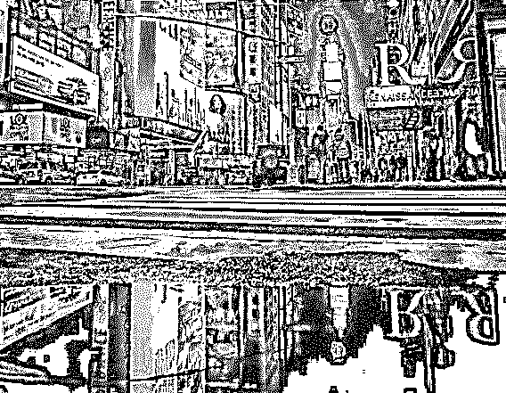

#### 步骤 1:添加一个新层

打开 Photoshop 并加载图像，通过右下角的选项添加一个新层，或者同时使用快捷键 Ctrl + Shift 和 N 来加载图层窗格中的新层，并通过双击新层的名称将其重命名为 Rain 来应用所有效果。

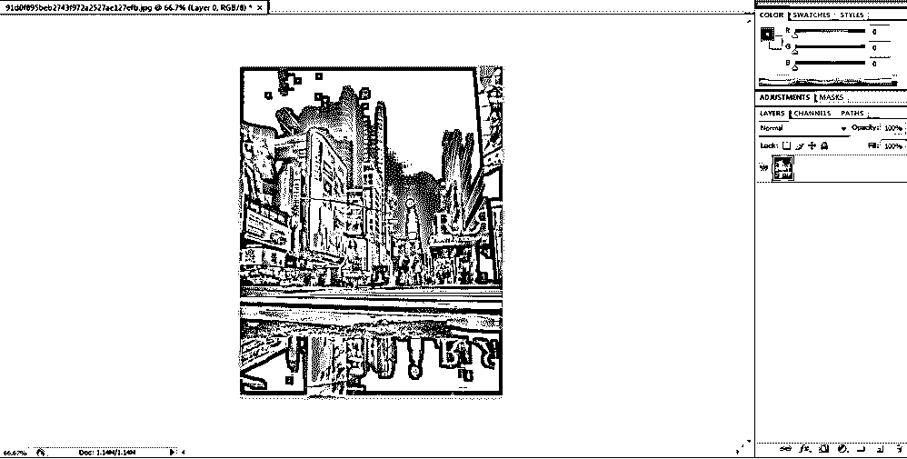

重命名完成后，单击确定或回车。

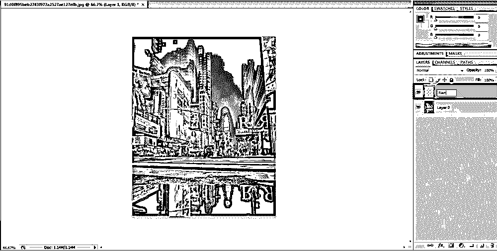

#### 第二步:用黑色填充新图层

现在，我们将把我们所有的属性应用到新的图层上，这样我们的原始图层仍然是安全的。现在我们要用黑色填充图层。向上编辑并选择填充选项；将打开一个新对话框，其中包含可供选择的填充属性详细信息。

Edit -> Fill

快捷键:Shift+ F5

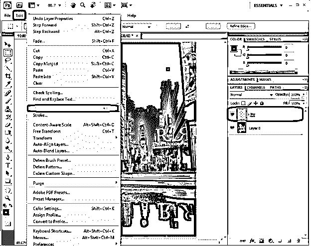

我们使用填充对话框中的下拉菜单选择了多个选项，并从下拉窗口中选择了黑色。通过保持 100%的不透明度和默认的多倍模式。

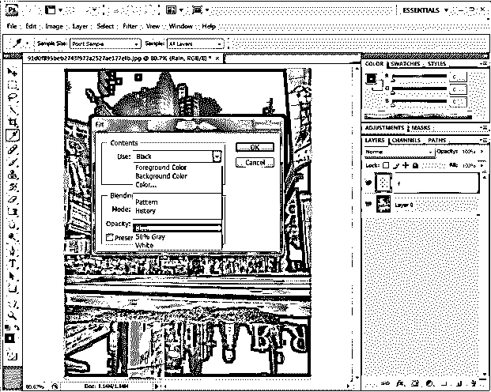

这样做之后，我们可以看到完整的图层填充了黑色，如下图所示。

#### 步骤 3:应用噪声过滤器

为了创建一个雨的效果，我们使用 Photoshop 中的添加噪波选项，让白色水滴看起来像雨滴一样。要做到这一点，我们需要点击菜单栏上的过滤器，并将鼠标箭头放在噪音；这样做，噪声子选项将被打开选择添加噪声层。

滤镜->噪波->添加噪波

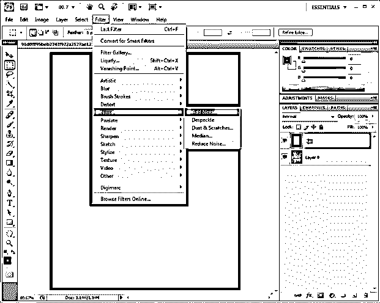

通过添加噪波，打开一个噪波对话框，我们必须在其中更改一些属性，如百分比必须为 25%，分布模式为高斯，并启用单色。

数量 25%，分布-高斯和单色启用。

这样做，该层将充满点，以继续下一个过程。

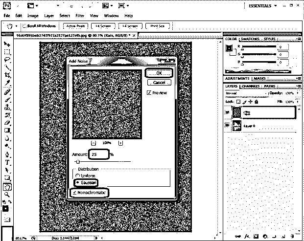

#### 步骤#4:缩放和链接层的宽度和高度。

接下来，去编辑，点击变换，并选择缩放。我们可以看到菜单栏下面出现的几个选项。

编辑->变换->缩放。

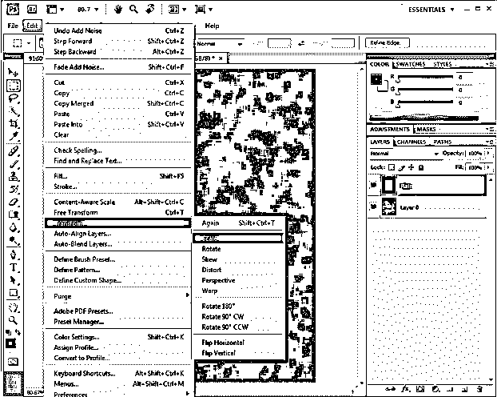

在选项栏中，单击宽度和高度值之间的链接(–)。根据图像的大小，rain 层对点进行加权，可以通过更改宽度和高度的值来缩放这些点。常用的身高和体重值有 400/400 200/200 等。根据需要。对于这个图像，我们将得到的高度和宽度分别为 400。

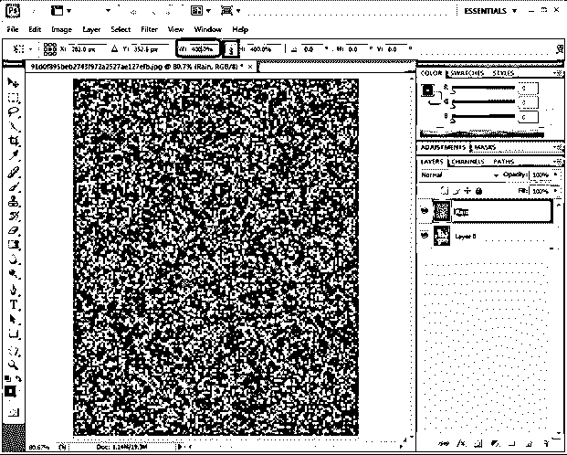

单击右上角的勾号，应用更改。

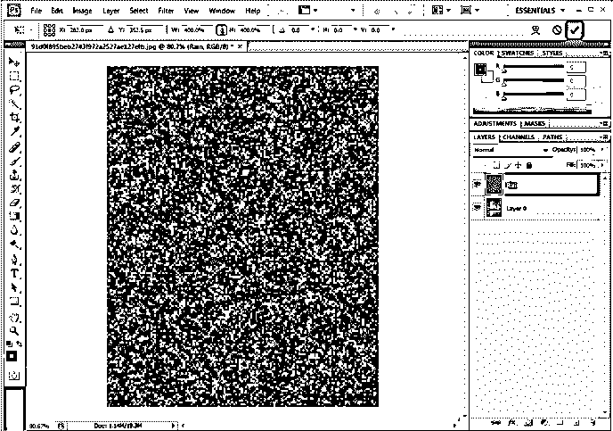

#### 步骤 5:改变混合模式为屏幕

到目前为止，雨层，我们正在编辑它在混合模式，所以改变模式为屏幕，以便下面的层将在层下可见。所有的纯黑颜色消失，下面的层，这是我们的源图像上的白色水滴，将是可见的。

图层->下拉菜单->屏幕

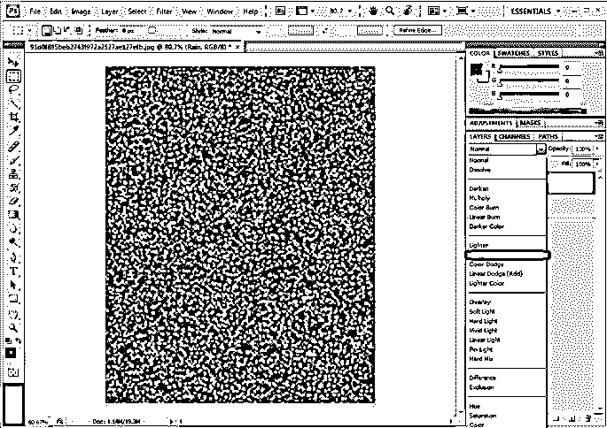

#### 步骤 6:改变雨层为智能对象

我们需要给白色水滴添加动态效果，这样它们看起来就像真正的雨一样。为此，选择 3 线，这是目前在层窗口的右上角，并点击该选项作为一个智能对象。

= ->转换为智能对象

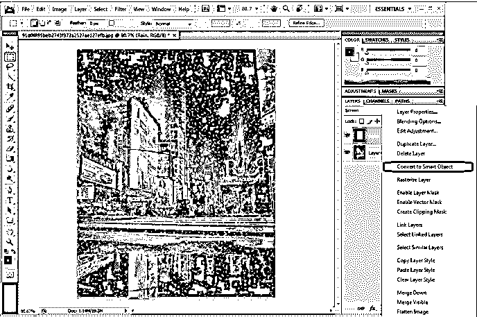

#### 第 7 步:应用运动模糊作为过滤器。

将智能对象应用到 rain 层后，我们可以看到预览缩略图出现在层中。

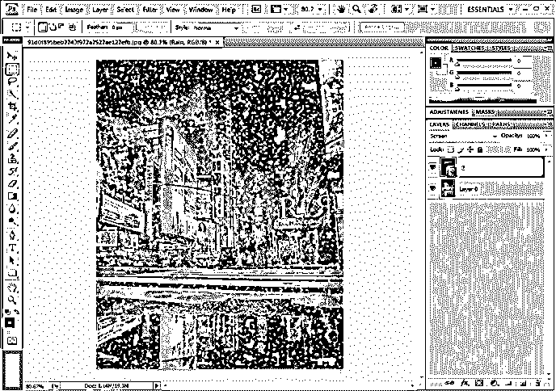

转到过滤器，移动光标模糊，并选择运动模糊选项，以增加运动的白点。获得雨滴下落的感觉。

滤镜->模糊->运动模糊。

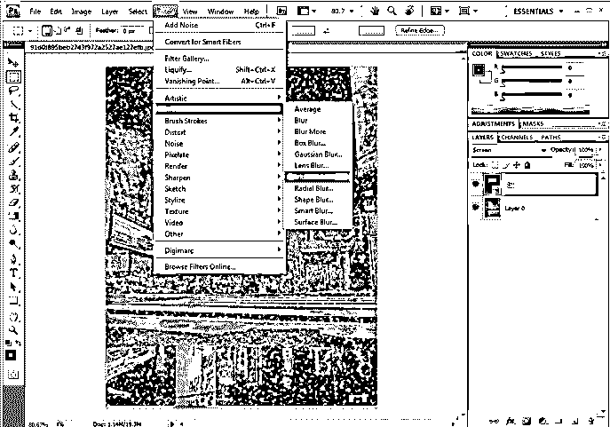

将打开“运动模糊”对话框，必须将其配置为图像上所需的水滴时刻。很少有属性

角度:–65 度

距离(黑白像素到像素):- 75 像素

这些可以根据图像的外观而变化；手动检查并预览两次，然后单击确定。

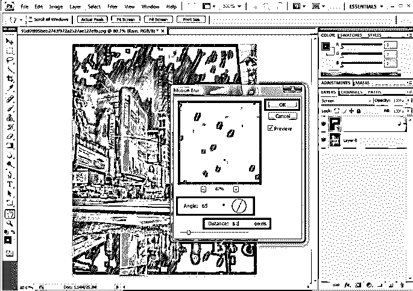

运动配置将被添加到如下图所示的层中，它们可以通过双击打开的运动对话框来改变，然后我们可以根据需要重新排列这些值。

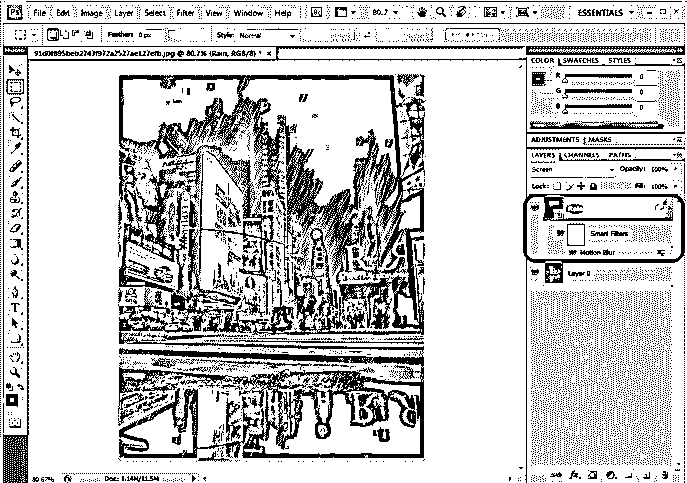

#### 第 8 步:添加和调整层的水平。

要调整和减少降雨量和颜色，可以使用此选项更改图像的亮度和对比度效果等属性。

选择 Rain 图层，在 Mac 上从键盘按下 win / Option 中的 Alt 键，创建新的调整图层。在层的底部，我们也可以点击并直接获得它。

新调整图层->级别。

启用“使用上一层创建剪辑蒙版”选项。

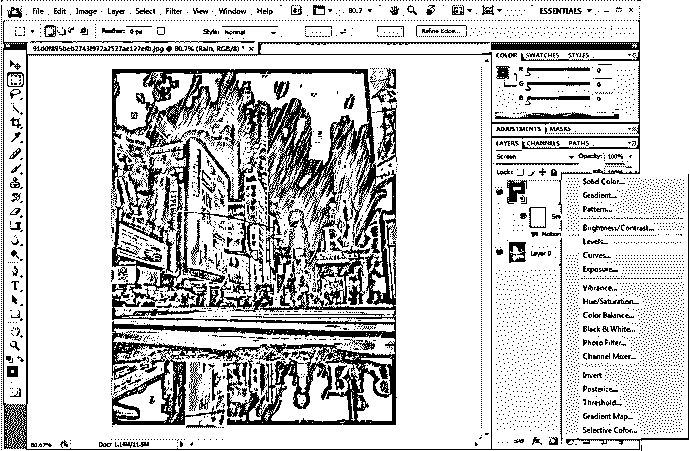

用于高程调整雨水图层的新调整图层会创建。

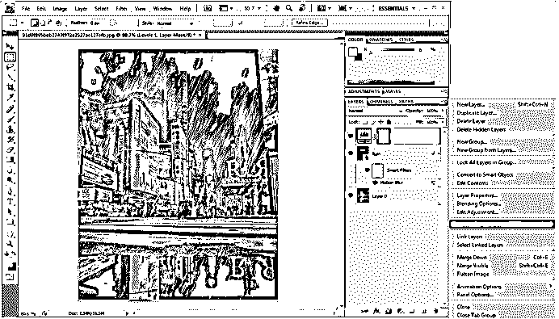

#### 第 9 步:调整水平滑块点

一个新的水平层创建，并将与它下面的雨层链接；双击新层打开一个级别的对话框。

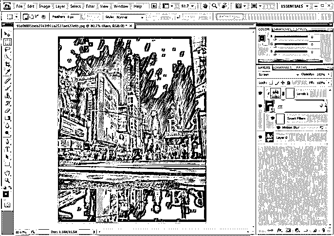

我们有三个级别调整点，通过检查移动时发生的变化，将第一个和最后一个点(黑色和白色滑块)稍微相互靠近。并且将级别固定在准确的所需范围内，这样我们就可以从一个角度以一定的速度获得雨的外观和感觉。

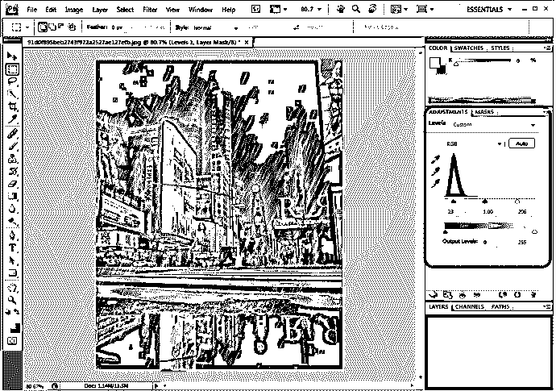

可以随时调整色阶遮罩和运动模糊，以获得精确的输出。一旦图像是最终的，我们可以导出或保存它。jpg 或者。png 按要求。初学者需要反复练习才能习惯。

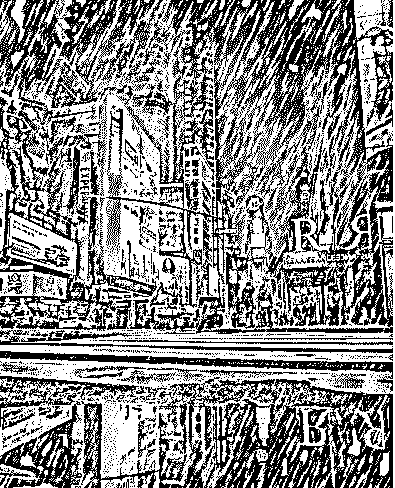

### 结论

通过这些，我们给照片添加了雨的效果。对于 Photoshop 上的多种效果，可以遵循相同的步骤。用户必须了解一步一步的属性及其对图像的影响，才能在获得输出之前获得效果。对多个图像尝试这种方法，以获得实践经验。

### 推荐文章

这是 Photoshop 中的雨效果指南。这里我们讨论如何在 photoshop 的帮助下在图像中创建雨的效果。您也可以浏览我们推荐的其他文章，了解更多信息——

1.  [Photoshop 中的锐化工具](https://www.educba.com/sharpen-tool-in-photoshop/)
2.  [Photoshop 中的自定义形状工具](https://www.educba.com/custom-shape-tool-in-photoshop/)
3.  [Adobe Photoshop 工具](https://www.educba.com/adobe-photoshop-tools/)
4.  [Photoshop 中的消失点](https://www.educba.com/vanishing-point-in-photoshop/)

