# Photoshop 中的剪辑蒙版

> 原文：<https://www.educba.com/clipping-mask-in-photoshop/>

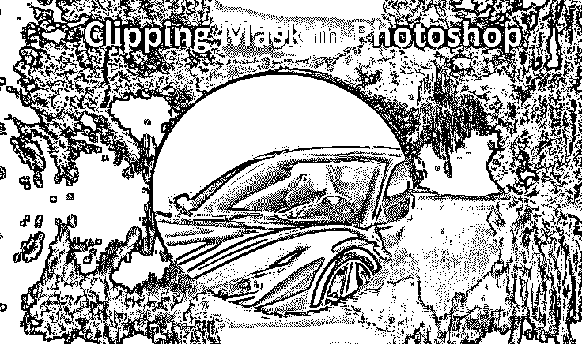

## Photoshop 中的剪贴蒙版介绍

在 Photoshop 中剪切蒙版是控制图层可见性的一个不可思议的选项；剪贴屏幕由蒙版保护，例如，假设您有一个图层形状、上面的分层图片和顶层内容，当照片和信息通过结构草图出现在基础层时，基础层的不透明度同样适用-设计作品被切割到蒙版的结构中；但是，在一个层中选择至少两个对象可以组成一个剪辑集。

### 如何在 Photoshop 中创建剪贴蒙版？

为了调节上面涂层的可访问性，剪辑帧使用下面图层的内容和透明度。让我们用我们的两个部分建立一个剪辑屏幕，看看。

<small>3D 动画、建模、仿真、游戏开发&其他</small>

**步骤 1:** 制作裁剪掩模时，必须首先选择要贴在下面涂层上的工件。然后，顶部(“层 0”)将被切割成较低的部分(“层 1”)，并确保选择顶部阶段。

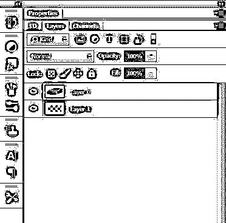

**第二步:**选择“创建剪贴蒙版”，进入菜单栏图层文件夹，选择创建剪贴蒙版，生成剪贴标签。

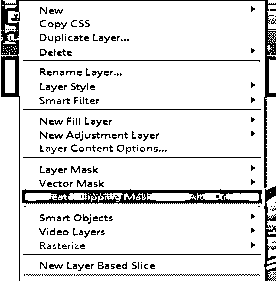

而且什么都有！创建图层蒙版是为了在右边显示最上面的图层(“图层 0”)，图层下面有一个指向“图层 1”的小箭头。因此，Photoshop 通知我们，底部涂层现在被切割成下面的涂层。

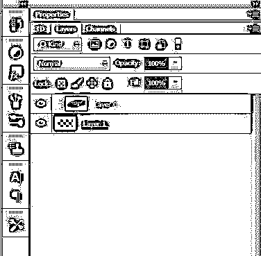

但这是因为我们从透视角度隐藏了图片，这是因为我们的屏幕表(“层 1”)不包含任何信息。那么，问题是我们到目前为止已经建立了一个修剪遮罩。这完全透明。顶面上直接位于底层织物中透明区域上方的任何区域都被剪切蒙版覆盖。因为在上层涂层中除了透明什么都没有，所以上面的图像没有任何成分。

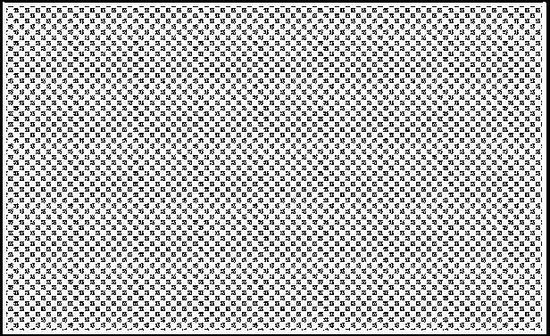

第三步:这不是很有趣，所以打开图层菜单，选择释放剪贴蒙版，释放剪贴蒙版。

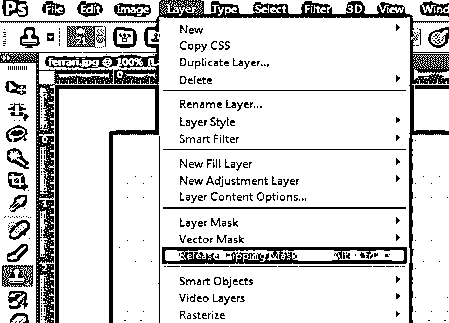

**第四步:**先附上一些上层素材，看看我们在做什么；点击上层的隐私图标隐藏图像。

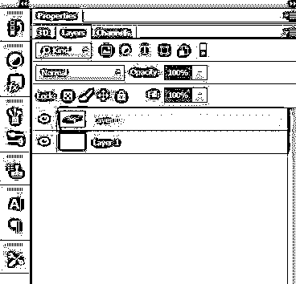

我们将创建一个简单的表单来提供信息。要附加信息，请从 Win/Mac control-click 工具栏中选择椭圆选框工具，并从矩形选框工具栏的 Win/Mac Control-click 工具中选择椭圆选框工具。

**第五步:**在纸的中间，点击并旋转一个椭圆选择轮廓。

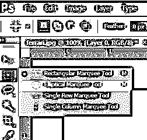

**第六步:**在文档内部应用椭圆选区。

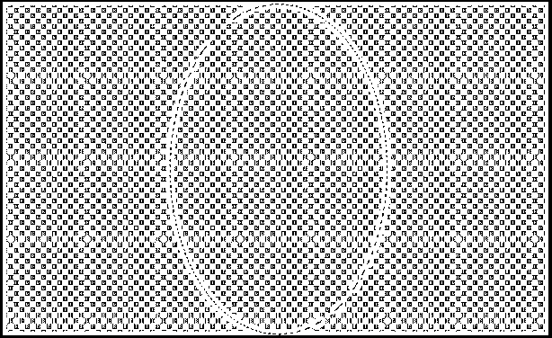

第七步:进入菜单栏的编辑菜单，选择填充**。**

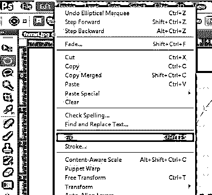

**步骤 8:** 将填充对话框中的内容选项设置为黑色，然后按确定。

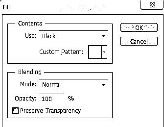

**第九步:** Photoshop 完成黑色选择。要删除表单选择轮廓，转到面板选择并点击取消选择。

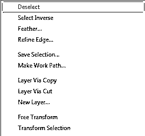

**第十步:**现在，我们有了一个中间有某种材料的环境，而不是完全透明的涂层。但是，请注意，信息区域保持开放。

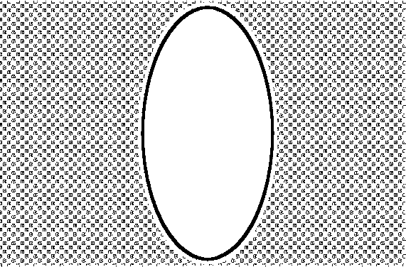

**步骤 11:** 图层面板中下涂层的缩略图现在显示蓝色表单。这里应该注意的是，当您比较每个层的缩略图时，顶层的图像(形状)位于底部内容的正上方。一些照片是在清澈区域的下垫面上。

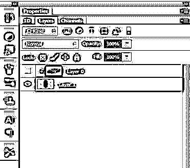

步骤 12: 现在，我们给上层涂层添加一些材料，创建另一个剪切蒙版。同样，必须首先选择切割到下面涂层的部分，因此，要选择它，请按下底部涂层。单击上层涂层的可访问性图标，在表面上显示图像。

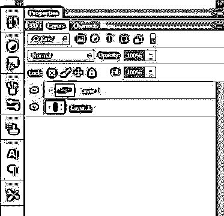

第 13 步:但是我们现在在报纸上看到一个非常明显的结果。此时，图片的一部分，就在表单的上方，仍然可以在下方看到。包含表单的区域是图像中唯一隐藏的部分，因为这些部分仍然在开放度之上。

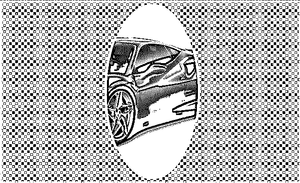

显然，如果我们的主题集中在表单上，结果可能会更容易。使用切割眼镜传输内容和重新放置内容非常简单。只需选择要移动的工具栏。

**步骤 15:** 现在，尝试给图层 1 添加背景，如下图。

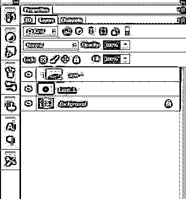

虽然色彩设计最适合混合无缝移动的图像，但如果您的图像想要以清晰定义的形式匹配，Photoshop 切割镜头是理想的选择。如我们所见，你可以用一种选择的工具来画出形状。但是您也可以使用剪辑蒙版来完成带有图像的矢量形式，或者将图像写入文字。

**第十六步:**然后在图像上按一下，拉起来。当您转移图像时，只有底层涂层上的表单区域保持可见。这是剪辑蒙版工作的基本要素。

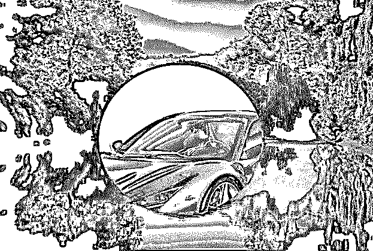

### 结论

剪贴蒙版是一个强大的工具，使你在 Photoshop 中的生活更加容易。这是很好的选择，斜坡，或当微小的项目需要隐藏。您可以使用剪辑蒙版工具来调节透明度和各种级别。剪贴蒙版是为你的图像，尤其是社交媒体信息创造一些真正创新的效果的简单方法。您可以将此方法用于位图、矢量、文本、群组和智能对象的图层。

### 推荐文章

这是一个在 Photoshop 中剪切蒙版的指南。在这里，我们讨论的概念和如何使用 Photoshop 中的剪辑蒙版。您也可以浏览我们推荐的其他文章，了解更多信息——

1.  [Photoshop 中的海绵工具](https://www.educba.com/sponge-tool-in-photoshop/)
2.  [Adobe Photoshop 工具](https://www.educba.com/adobe-photoshop-tools/)
3.  [Photoshop 中的魔棒工具](https://www.educba.com/magic-wand-tool-in-photoshop/)
4.  [自动化测试工具](https://www.educba.com/automation-testing-tools/)

