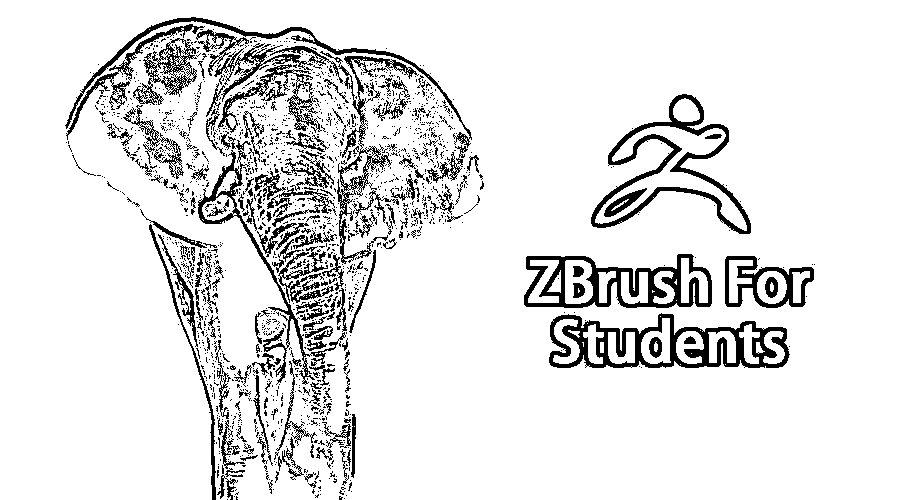

# 学生用 ZBrush

> 原文：<https://www.educba.com/zbrush-for-students/>

## 面向学生的 ZBrush 介绍

一个数字雕刻程序，融合了 ZBrush 中的 3D 和 2.5D 建模、绘画和纹理。它最初是由 Ofer Alon 和 Jack Rimokh 于 1999 年创建的 PIXOLOGIC 公司创建的。它提供了与 Autodesk，Maya，Max，Blender，Poser Pro，DAZ Studio 的组合。 [ZBrush 是一个强大的程序](https://www.educba.com/what-is-zbrush/),它以其动态、本能的界面和工作流程改变了 3D 行业。它有一个惊人的界面，为用户提供最先进的工具。如今的数字艺术家普遍使用它，它有着令人难以置信的用户体验，甚至可以从内部激发艺术家的灵感。

### 技能学生的 ZBrush

ZBrush 是一款高度商业化但基于技能的软件，可用于创建逼真的渲染和 3D 打印建模。ZBrush 最好的一点是，用户不需要担心购买[昂贵的显卡](https://www.educba.com/graphic-design-interview-questions/)，并且不用它就可以雕刻和绘制大量的多边形。

<small>3D 动画、建模、仿真、游戏开发&其他</small>

最基本的特征是:–

#### 1.基础网格创建

*   **ZModeler:** 基本上是为了方便用户的创建过程而设计的。它用于创建强大而快速的新形状。只需单击一下鼠标，即可融合多边形、移除将零件与新路径连接起来的完整几何块，这是该功能的一些用途。
*   **Gizmo 3D:** 此功能用于精确控制的雕塑操作和变换。Gizmo 3D 用于精确变换，可以轻松地放置在界面中的任何位置或方向。用户还可以快速调整缩放、旋转或移动的枢轴点。
*   **DynaMesh:** 该功能允许用户创建模型，没有实际限制。这个强大的功能可以通过删除所有拉伸的多边形在几秒钟内重建几何图形。
*   ShadowBox: 它允许用户仅仅通过绘制一个形状来创建 3D 网格。
*   **实时布尔–**通过该属性，用户可以看到实时布尔。也就是说，他们可以看到实时生成的网格。
*   **图元:** ZBrush 可以创建混合了几个较小对象的复杂场景。它有助于创建一个无止境的复杂形状阵列，所有这些都来自一个单一的图元。

#### 2.织构化

当用户在 3D 模型上创建或使用纹理贴图时，它需要 uv。ZBrush 有一个主 UV 插件，只需单击一下就可以为模型创建有效的 UV，否则这将是一项耗时的任务。ZBrush 配备了一个令人惊叹的聚光灯绘画系统，该系统提供图像编辑，并在画笔的帮助下将图像投影到模型表面。

#### 3.雕刻

ZBrush 最重要和最常用的功能是雕刻。ZBrush 特性包含几个子工具，学生可以使用它们来完成各种项目。这些工具是 3D 笔刷，3D 图层，表面噪波，转置，向量置换贴图，Alpha 3D，懒惰鼠标 2.0，变形，投影主，实例，微网格，纤维网格，高清几何。

#### 4.进口和出口

ZBrush 有一个名为 GoZ 的强大工具，这是一个与其他程序协同工作的简单解决方案。它有一个抽取母版，通常可以在保持分辨率的同时减少模型的多边形数。

### 学生如何使用 ZBrush？

ZBrush 有许多有助于模型和网格雕刻的属性。学生可以通过使用该软件的最基本的工具和学习来使用 ZBrush。这是一个复杂的软件，但仍然是最先进和最常用的数字雕刻软件。它提供了许多不同的最新工具和特性，使其与众不同。3D 画笔，GoZ，插图，Polypaint，ZSpheres，Shadowbox，ZRemesher，是该计划的一些最先进和最新的工具。使用这些工具，学生可以轻松地创建他们需要的任何模型、网格或雕塑。

### 给学生的概述提示

*   要滑动 UI 元素，请按住 Ctrl 键并单击和拖动。ZBrush 用户界面可以个性化，并有大量的空白空间来填充用户的元素。
*   用户可以按键盘上的数字“0”来设置全尺寸视图，按“Ctrl+0”来查看消除锯齿的半个文档。
*   一个非常有用的提示是，在 ZBrush 中，用户可以更改多边形帧和游戏组的属性。这可以通过从首选项面板转到“绘制”菜单来完成。
*   ZBrush 在 transformer 调色板下有一个选项，允许用户激活多边形像素密度可视化表示。其中，红色代表低密度，而蓝色代表高像素密度。

### 功能强大的 3D 产业

今天，技术已经使我们的想象与现实更加接近，这可以通过 3D 建模、打印、渲染等方式来实现。随着每一次更新和不断的新发现，人们越来越被提供给他们创造惊人和先进设计的技术所吸引。3D 产业在过去几年里飞速发展，已经成为需求最大的产业。3D 打印是 3D 行业最强大的功能之一。3D 打印使用了许多不同的技术。最常见的是熔融沉积模型。3D 打印既用于快速原型制造，也用于添加制造。3D 行业是一个巨大的行业，它包含了强大的基本功能，使其成为一个进步的行业。

### 结论

即使 ZBrush 改变了 3D 行业，它也是一个强大的插图包。它基于 Pixol 的强大功能，将数字印刷提升到了另一个层次。与其他 2D 应用程序中的普通像素(仅包含颜色和位置信息)相反，ZBrush 的 Pixol 包含颜色、位置、深度、光照和材质信息。总的来说，它有一个非凡的界面和非凡的工作流程，吸引了学生和数字设计师。

### 推荐文章:

这是学生学习 ZBrush 的指南。在这里，我们讨论了面向学生的 ZBrush 的基本特性，如何面向学生使用 ZBrush 等。您也可以阅读以下文章，了解更多信息——

1.  [Zbrush 数码雕刻](https://www.educba.com/zbrush-digital-sculpting/)
2.  [ZBrush 工具](https://www.educba.com/zbrush-tools/)
3.  [ZBrush 插件](https://www.educba.com/zbrush-plugins/)
4.  [ZBrush 的 15 个技巧](https://www.educba.com/15-professional-tips-for-zbrush/)

