# ZBrush 热键

> 原文：<https://www.educba.com/zbrush-hotkeys/>

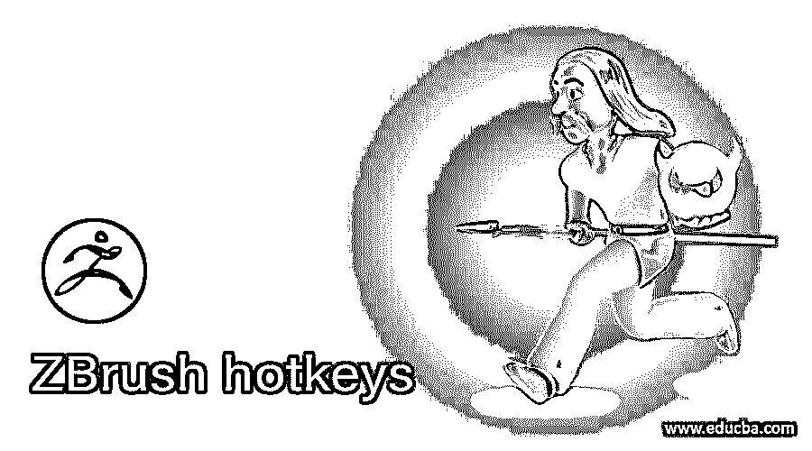

## ZBrush 热键介绍

在这篇文章中，我们将了解 ZBrush 热键。热键不仅可以节省你的时间，还可以省去浏览多个嵌套菜单的麻烦。现在想象一下，如果你一遍又一遍地使用同一个命令，那么使用快捷方式是正确的，因为它肯定会节省你的时间。Zbrush 不仅提供了默认的热键，而且你可以用适当的修饰符自定义每个热键。还有画笔的热键，这是选择画笔的字母序列，如果你反复使用特定的画笔，这也很方便。热键还可以提高生活质量，比如弹出窗口，让工作流程变得更快。

**第一步:**我们先从第一个热键或快捷方式开始，就是打开一个项目。按 Ctrl + O 并导航到一个. zpr 文件，该文件将打开项目。

<small>3D 动画、建模、仿真、游戏开发&其他</small>

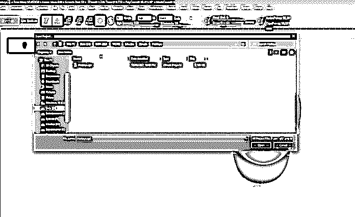

**第二步:**接下来是保存热键为 Ctrl + S 的项目，系统会询问您要保存的位置。

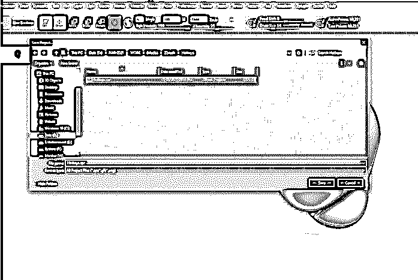

**第三步:**现在假设你画了一个笔画，你想撤销它，只需按 Ctrl + Z 来删除我们已经创建的笔画。如果你想重做你已经撤消的操作，那么按 Ctrl + Shift + Z。

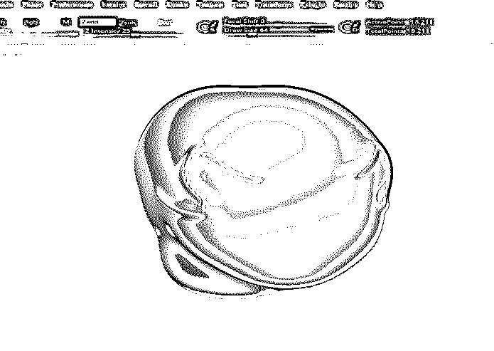

**步骤 4:** 现在让我们看看弹出的选择热键。要打开工具弹出窗口，请按 F1。

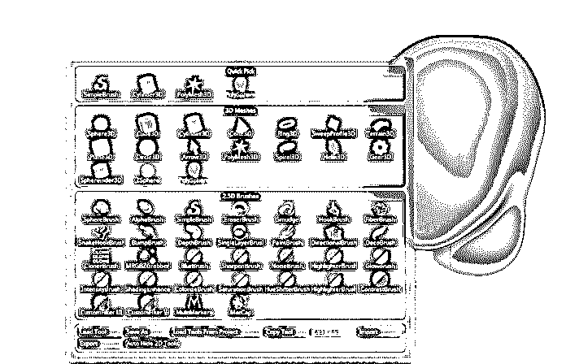

第五步:然后按 F2 打开画笔面板，或者你也可以按 b。

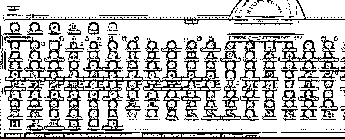

**第六步:**然后 F3 会打开你需要的笔画类型的弹出框。

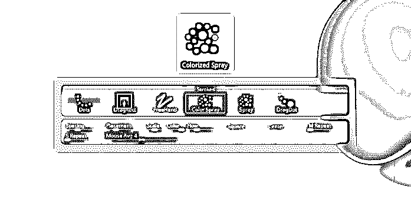

第七步:然后 F4 是阿尔法弹出窗口的热键。

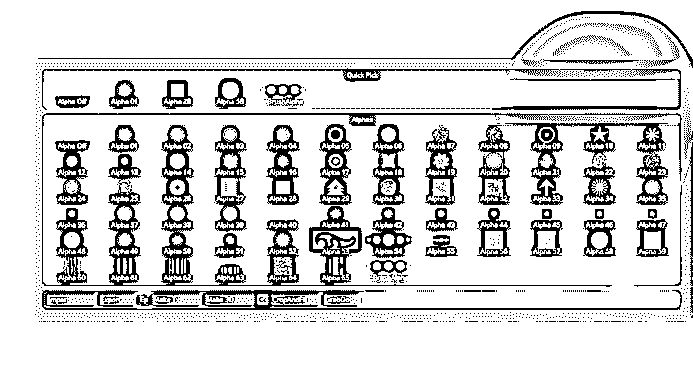

第八步:F5 弹出纹理。

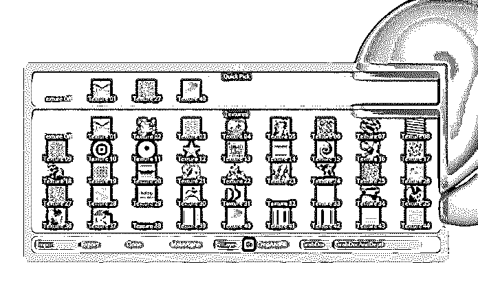

第 9 步:顶部打开材料弹出按 F6，但要确保你离开画布。

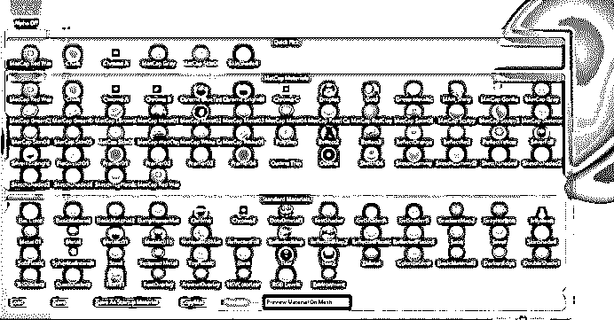

**第十步:**然后按空格键或右键将显示快捷菜单。

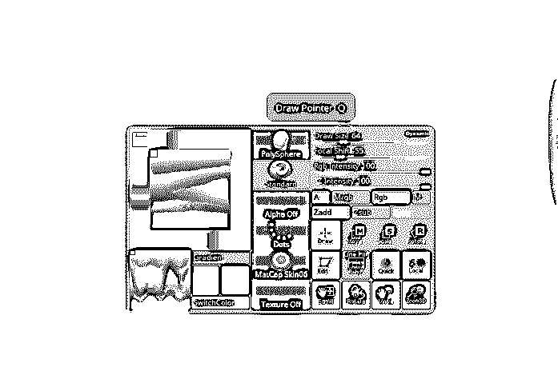

步骤 11: 然后使用 Tab 热键将显示或隐藏浮动调色板。

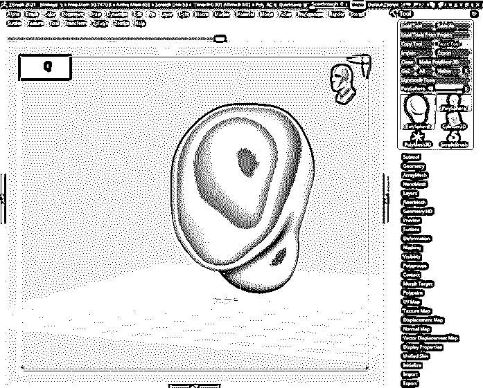

**步骤 12:** 现在对于导航，有一些热键在编辑模式下适用于 3D 网格。要自由旋转，请单击并拖动背景，要移动，请按住 alt 键并单击并拖动背景。如果要将旋转限制为 90 度，请在单击并拖动的同时按住 Shift 键。现在要缩放，首先你必须按住 alt 键并点击鼠标，然后松开 alt 键并拖动背景。您也可以通过按住 shift 键并单击鼠标，然后松开 Shift 键并拖动鼠标来沿 Z 轴旋转。

**步骤 13:** 使用【逗号键】来显示或隐藏 Lightbox，然后通过双击任何一个缩略图就可以加载它。

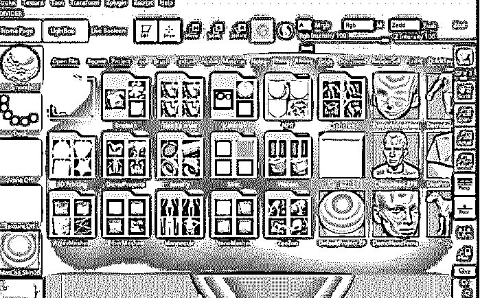

**步骤 14:** 现在使用热键 B–S–t 加载标准笔刷。同样，我们可以选择其他笔刷，如使用 B–M–E 移动弹性笔刷和使用 B–C–l 绘制粘土笔刷。

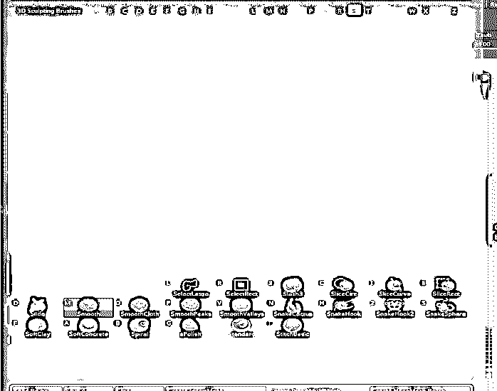

**第 15 步:**画图时按住 Ctrl 会使用蒙版笔。

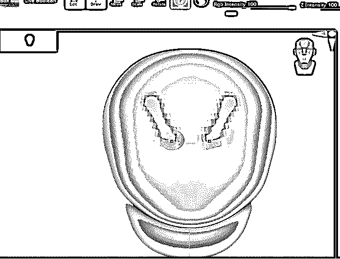

**步骤 16:** 按 Ctrl + Shift 将使用如图所示的剪贴画笔刷。

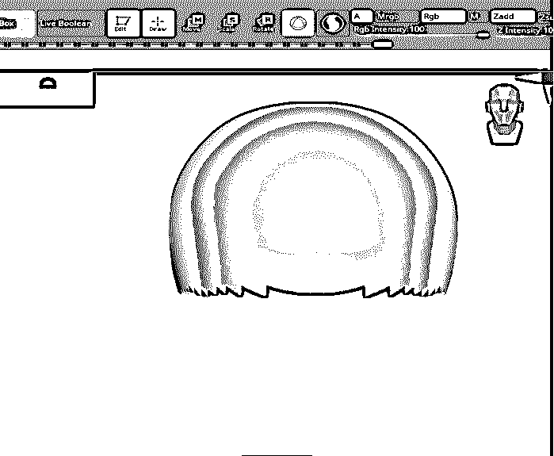

**步骤 17:** 现在，假设我们要为这个弹性笔刷指定一个自定义热键，按 Ctrl + Alt 并单击，状态提示将是按任意组合键来指定自定义热键，或者按 Esc 或鼠标键来取消，或者如果您之前已经指定了热键，那么您可以按 DELETE 键来删除自定义指定。

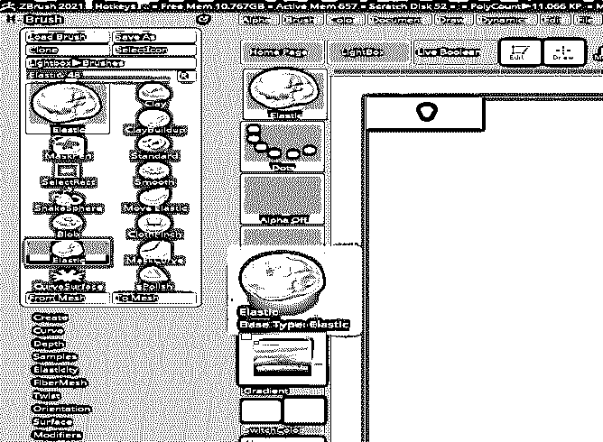

**步骤 18:** 所以现在我们给弹性画笔分配了一个自定义热键 Alt + S。

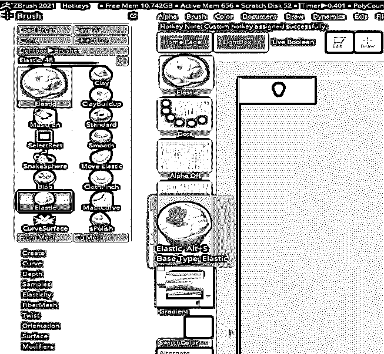

**第 19 步:**进入首选项菜单，在热键子菜单中，有 4 个选项。首先是恢复，将热键恢复到 Zbrush 初始热键设置。要存储热键，请按 store，以便它们总是可用。Load 将加载您自己的自定义配置。然后有一个保存选项，它会保存到文件中，但不会使其可用。

注意:与其他 ZBrush 配置文件一样，StartupHotkeys.txt 文件存储在计算机上的一个公共文件夹中。

在 Windows 上，这是:Users \ Public \ Documents \ ZBrushData \ ZStartup \ Hotkeys

在 Mac OSX 上是:用户/共享/ZBrushData/ZStartup/热键

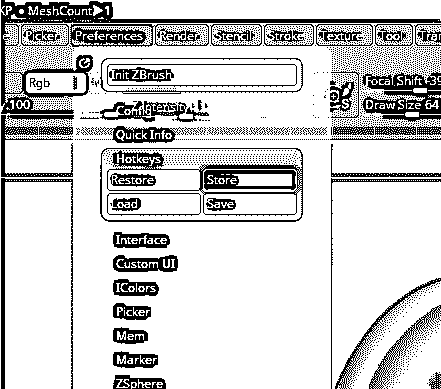

**第 20 步:**在文档调色板中，按 0 查看实际尺寸，按 Ctrl + 0 查看一半尺寸，如图所示抗锯齿。然后使用+[加号]放大，使用-[减号]缩小。

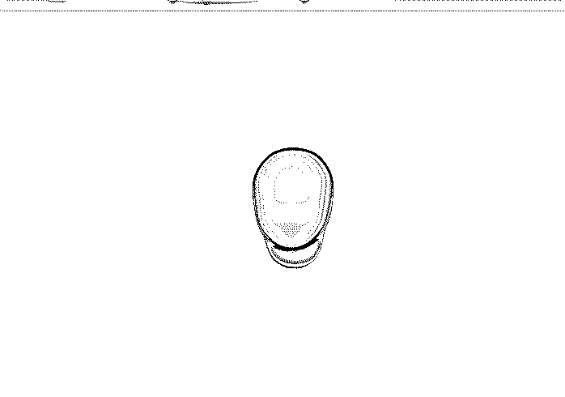

**步骤 21:** 那么 W、E、R 分别是移动、缩放、旋转的快捷键。您可以按 Q 键再次返回绘图模式。

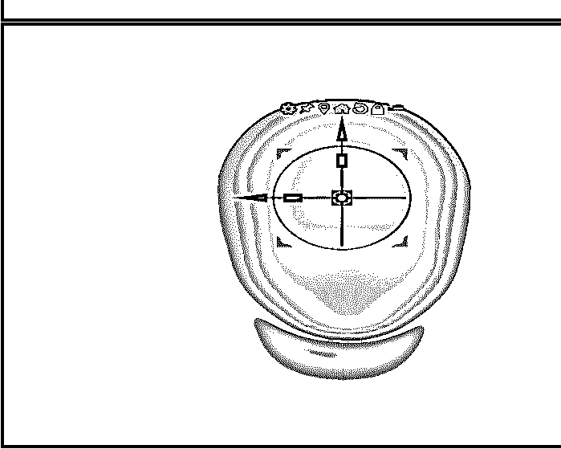

**步骤 22:** 然后复制 Ctrl 并点击拖动手柄。

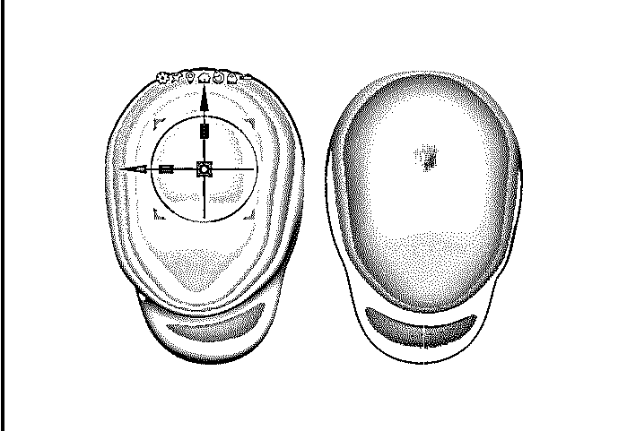

**步骤 23:** 现在，对于雕刻和绘画选项，您可以通过按 s 来设置绘画尺寸。

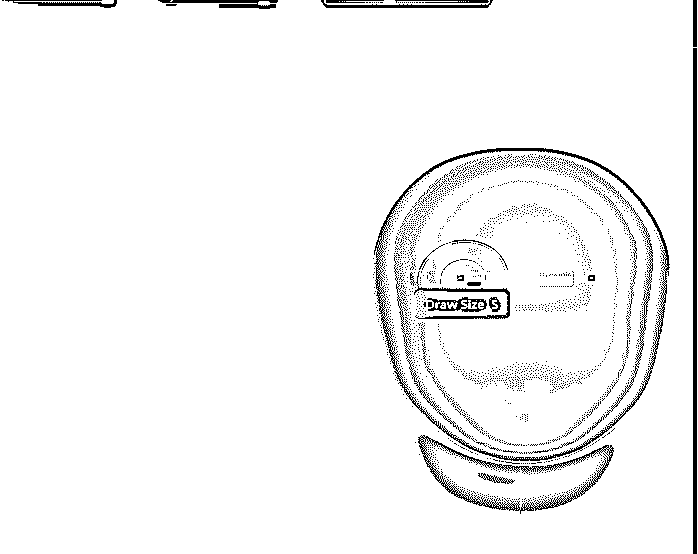

**步骤 24:** 然后按 o 就可以进行焦点转移了。

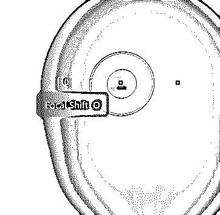

**第 25 步:**然后您可以通过按 u 来设置 Z 强度。

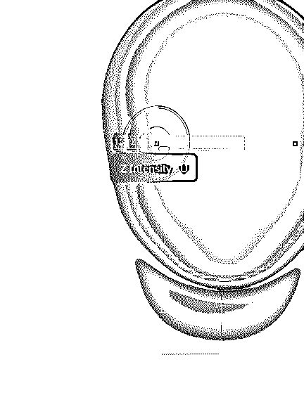

**步骤 26:** 你可以通过使用【设置单位】来增加绘制大小，通过使用【设置单位】来减少绘制大小(你可以在 Zplugin - >杂项实用程序>笔刷增量滑块中设置增量)。

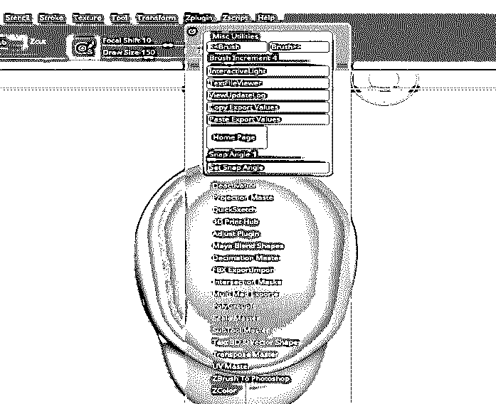

**步骤 27:** 按 Ctrl + D 分割几何体，按 Shift + D 降低分辨率。如果想要更高的分辨率，则按 D，对于循环边，按 Ctrl + E，这适用于部分隐藏的网格。

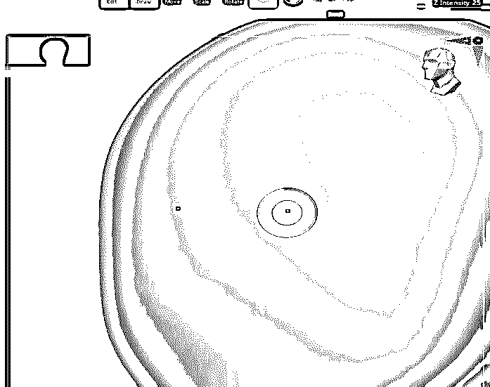

**步骤 28:** 加载一个 ZScript 按 Shift + Ctrl + L，重新加载一个 ZScript 按 Ctrl + L，显示/隐藏 ZScript 窗口按 h。

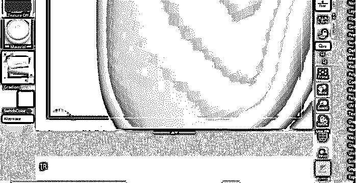

**步骤 29:** 你可以使用 Shift + R 使用最佳预览渲染(BPR)，使用 Shift + Ctrl + R 渲染场景中的一切，或者使用 Ctrl + R 进行光标选择性渲染。

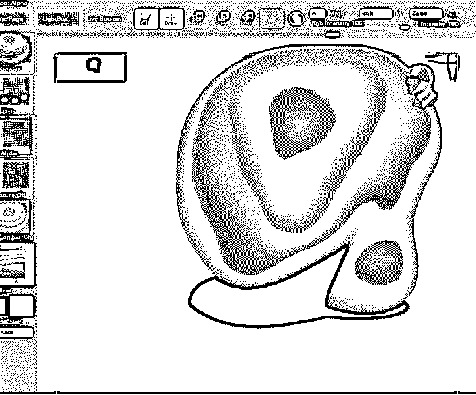

### 结论

在这篇文章中，我们学习了如何在 Zbrush 中使用热键。首先，我们从一些基本的快捷方式开始，比如打开和关闭文档，然后我们看到了各种弹出选择是如何工作的。然后我们看到了导航热键和画笔热键的工作原理。然后我们看到了如何为任何工具设置自定义热键。然后我们看到了 Zbrush 中一些渲染和脚本的热键。

### 推荐文章

这是一个 ZBrush 热键指南。在这里，我们讨论介绍，一些基本的快捷方式，如打开和关闭文件，各种弹出选择如何工作。您也可以看看以下文章，了解更多信息–

1.  [ZBrush 是什么？](https://www.educba.com/what-is-zbrush/)
2.  [ZBrush 插件](https://www.educba.com/zbrush-plugins/)
3.  [ZBrush 工具](https://www.educba.com/zbrush-tools/)
4.  [玛雅 vs ZBrush](https://www.educba.com/maya-vs-zbrush/)

