# ZBrush Pixologic

> 原文：<https://www.educba.com/zbrush-pixologic/>

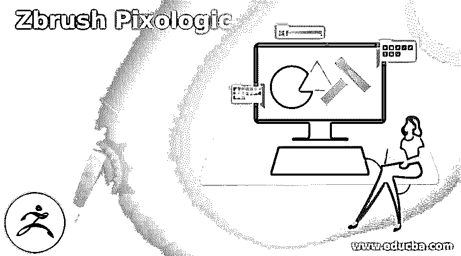

## ZBrush Pixologic 简介

Zbrush Pixologic 是一个在数字平台上工作的雕刻工具，它将 3D 和 2.5D 建模与不同的纹理和绘画相结合。它基于专有的 pixol 技术，存储用于在该软件的地板区域上制作对象的特定点的颜色、材质、照明、方向和深度信息。此外，它提供了几种类型的刷子，以不同的方式制作模型的结构。在本文中，我将告诉你如何使用不同的软件功能来了解 Zbrush Pixologic。

### 如何使用 ZBrush Pixologic？

要使用 Zbrush Pixologic，我们首先要了解这个软件的用户界面，它非常友好。让我们开始讨论吧。

<small>3D 动画、建模、仿真、游戏开发&其他</small>

这是这个软件的用户界面，在这个用户界面的顶部，我们有一个不同菜单的菜单栏，比如 Alpha，Brush，Color 等等。

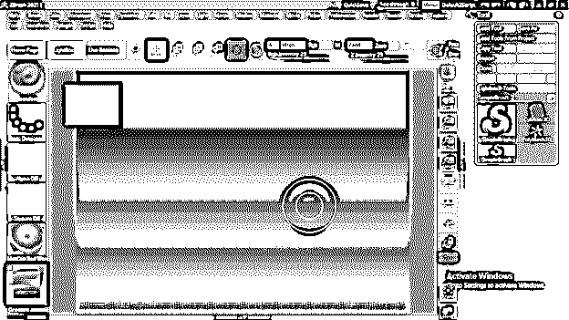

在此之下，我们有不同的标签，如灯箱，活布尔，编辑，绘图，等等，我们经常使用在这个软件的工作。

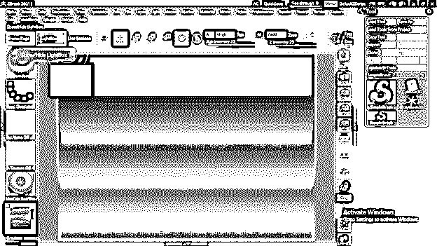

在工作屏幕的右侧，我们有一个工具栏部分，其中有用于不同目的的不同选项卡。

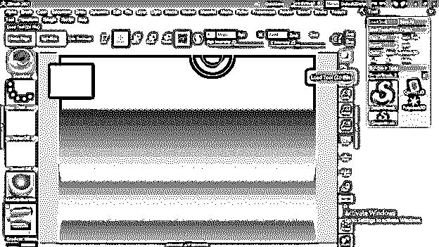

在左侧，我们可以找到常用的工具和功能，如画笔面板。

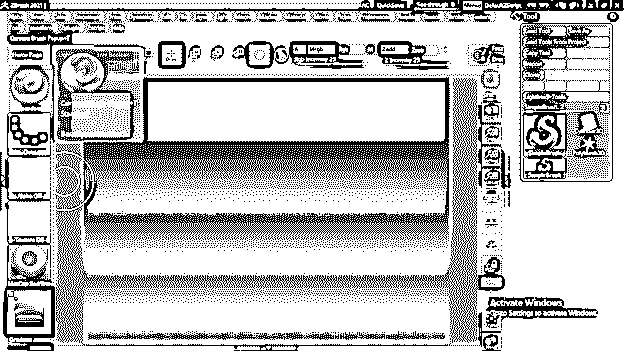

让我给你一个如何使用这个软件的概述，虽然它需要实践来了解这个软件。

在 LightBox 面板中，您会发现该软件不同功能的许多预设。在项目选项卡中，我们可以找到虚拟对象，我们可以根据自己的要求操纵它们。

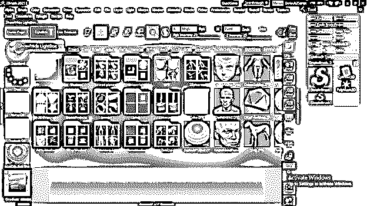

您可以滑动此项目面板对话框来查看其他预设或您下载的预设。

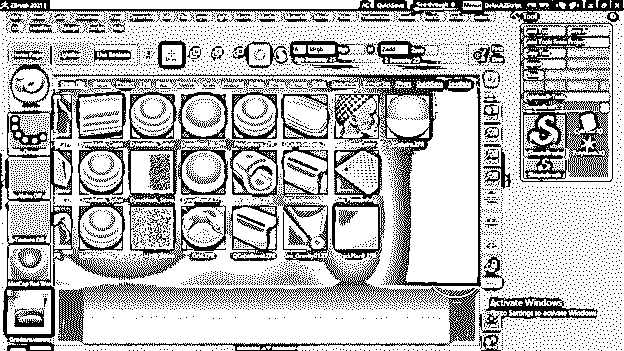

您可以从列表中选择任何模型来开始处理任何项目，要选择任何人，请双击它。

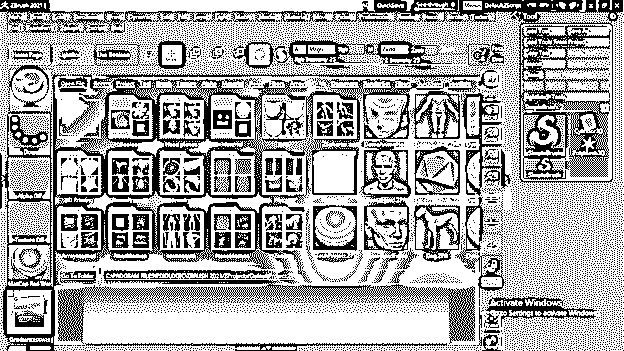

它会像这样出现在这个软件的工作窗口上。

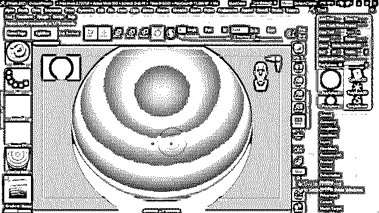

您可以单击“调整网格以适应视图”按钮，将此建模调整到框架区域。

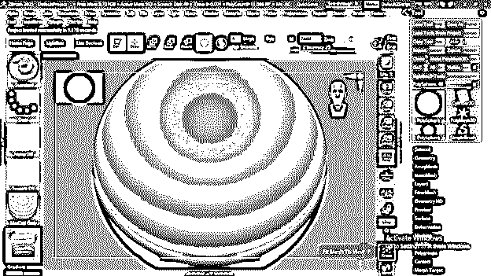

这里我们有一些调整工具，可以用来移动、旋转、放大或缩小模型所在的楼层。因此，如果您想要旋转楼层或平面，只需在平面区域的任意位置单击鼠标，然后移动鼠标光标来旋转对象。

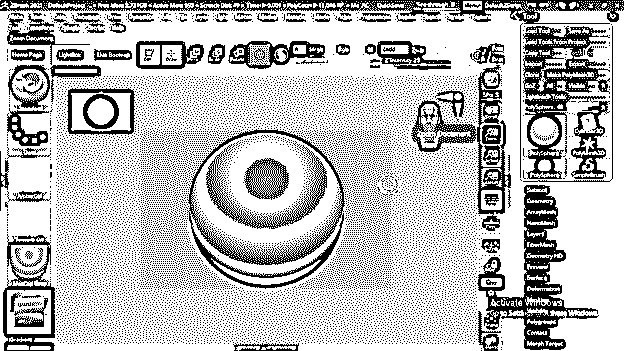

在左侧，我们有一个画笔面板按钮；一旦我们点击它，它会显示给我们所有可用的笔刷预设列表。

如果您想使用任何画笔预设，只需键入该画笔名称的第一个字母，您将拥有以您键入的字母开头的所有画笔。

现在，我将告诉你一些使用笔刷的基本知识，以及在任何项目中涉及到的其他基本参数。

用一个标准的笔刷，当我们按住鼠标，在默认模型的表面上点击拖动，然后它会画出一个浮雕区域，就像这样。你可以注意到它在两边做着同样的事情，因为我们处于对称模式，这意味着无论你画什么，它在物体表面的两边都是一样的。

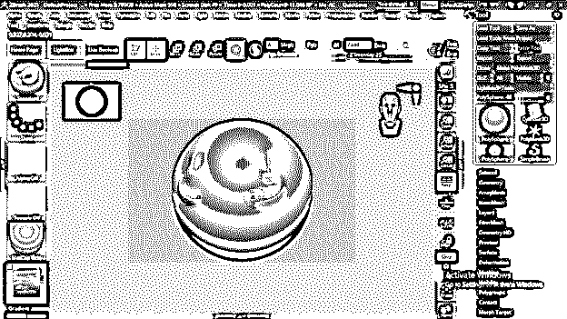

如果你想退出对称模式，只需按键盘上的 X 键。

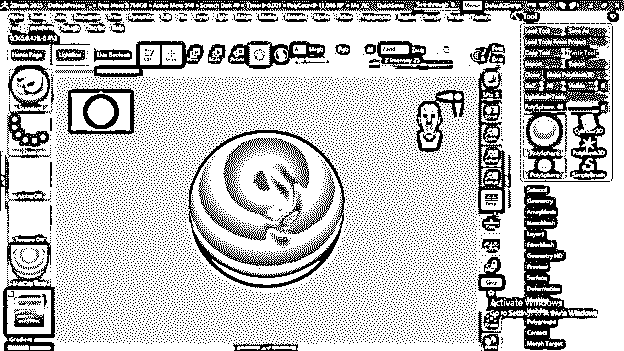

你可以看到鼠标光标的颜色是红色的，用这个鼠标光标，它会在我们想要的表面上绘制一个浮雕区域。

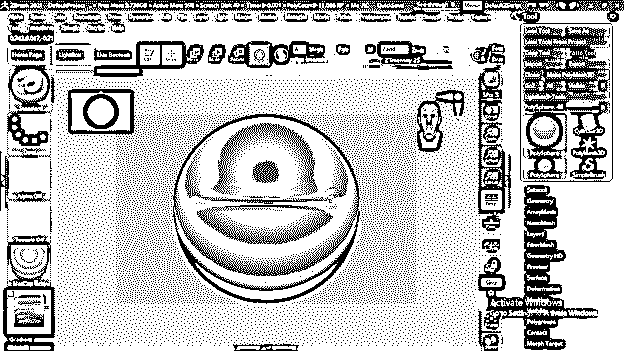

但是同样是红色光标，如果我们按住键盘的 Alt 键，光标会有一个小减号，现在我们在曲面上拖动，它会画出一个这样的雕刻区域。因此，您可以通过按住或释放键盘上的 Alt 键在这两者之间切换。

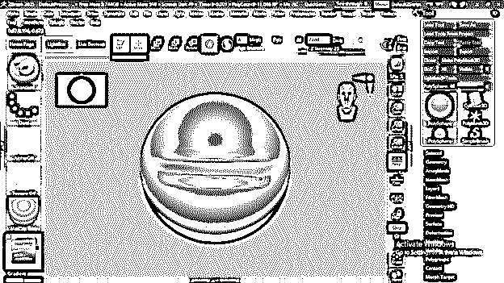

在顶部，我们有笔刷的强度参数。让我们看看如果我们增加或减少它的价值会发生什么。

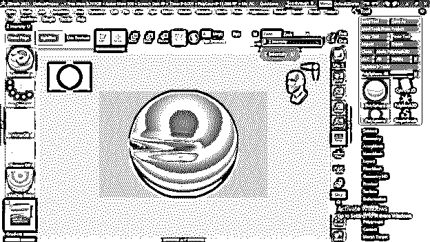

如果我增加它的值，你可以看到它会像这样浮雕出一个非常强烈的表面区域，这样你就可以根据你的需要改变笔刷的强度。

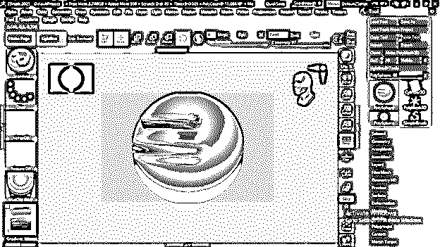

现在，如果你按住键盘上的 Ctrl 键，鼠标光标就会变成一个蒙版画笔，你就可以画一个有蒙版的区域了。这个遮罩区域可以理解为表面上的变暗区域。

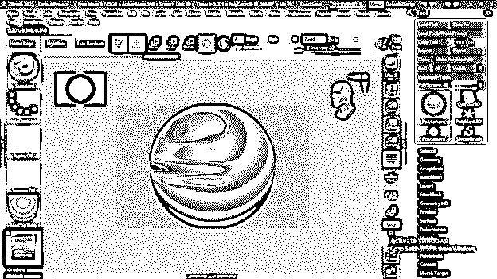

屏蔽的目的是锁定该区域用于不同的用途。让我用一个例子来说明这一点。在用户屏幕的顶部，我们有一个移动工具，我可以点击它，或者你可以按 W 作为快捷键**。**

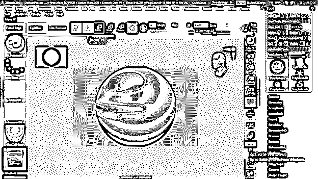

现在有了这个工具，你可以在 X，Y 或 Z 平面上移动这个物体。然而，当我移动这个对象时，被遮罩的区域没有移动，这意味着它被锁定了。

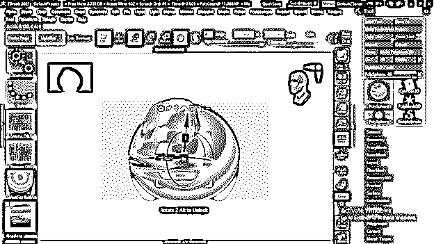

您可以在工具面板部分的右侧设置对象的其他可调参数。

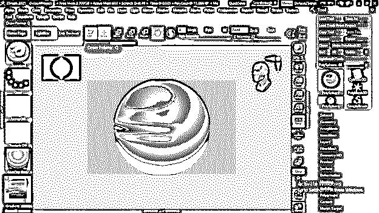

这里我们有变形选项卡，一旦我们点击它，所有与当前对象相关的可调参数将被打开。

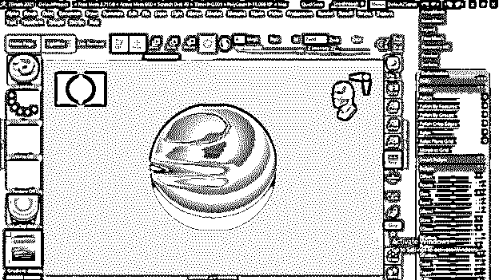

当我们更改任何参数时，您可以在您的对象上看到实时结果。

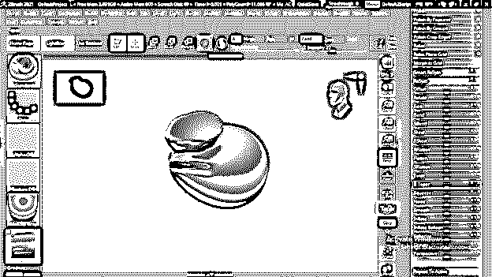

我在这个物体上做了这个雕刻区域，但是你可以看到它非常粗糙。

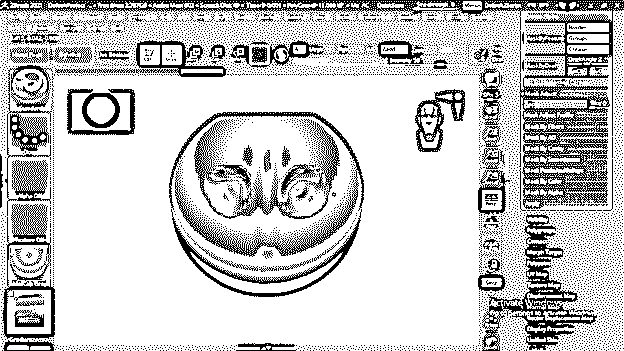

要使任何区域保持平滑，键盘的 shift 键和鼠标光标将变成蓝色，这意味着它处于平滑笔刷模式。

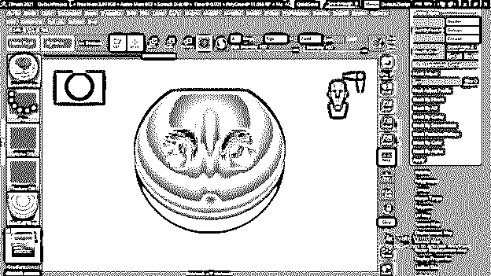

所以当你在你想要的表面使用它时，它会使表面变得平滑。

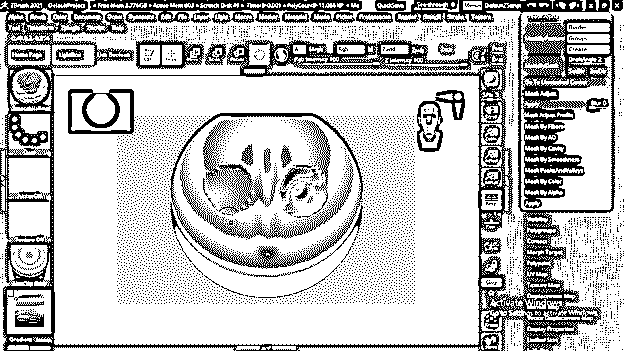

你可以像这样使用移动笔刷来改变模型的形状。

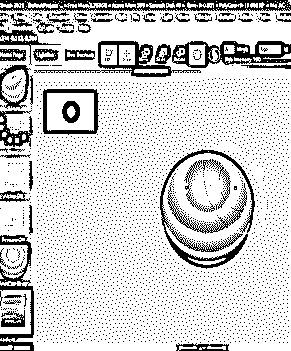

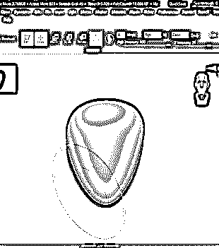

### 结论

在这篇文章中，我给了你一个如何开始使用 Zbrush Pixologic 学习雕塑的概述。在这个软件中有更多的特性和参数，你必须有正确使用 Zbrush Pixologic 的知识。你可以很容易地在这个软件上开始你的实践，并且越来越多地了解它。

### 推荐文章

这是一本关于 Zbrush Pixologic 的指南。在这里，我们讨论如何开始使用 Zbrush Pixologic 来学习雕塑的创作。您也可以看看以下文章，了解更多信息–

1.  [ZBrush 热键](https://www.educba.com/zbrush-hotkeys/)
2.  [ZBrush 插件](https://www.educba.com/zbrush-plugins/)
3.  [ZBrush 替代品](https://www.educba.com/zbrush-alternatives/)
4.  [ZBrush 是什么？](https://www.educba.com/what-is-zbrush/)

