# ZBrush 按键

> 原文：<https://www.educba.com/zbrush-keyshot/>

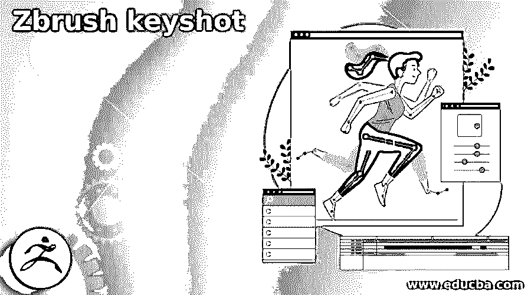

## ZBrush 关键镜头介绍

ZBrush Keyshot 是一个插件，允许我们实时绘制、照明和查看我们的模型，并进行更改以获得更好的输出。为了得到我们想要的结果，我们可以在我们的模型中操纵更多的东西，例如在渲染过程中起主要作用的光线，并且我们可以在 Keyshot 中拥有良好的光线管理命令功能。有了这些功能，我们可以为我们的模型创建良好的照明效果。你可以将你的模型从 Zbrush 直接导入到 keyshot 插件中，或者通过文件菜单将保存的 Zbrush 文件导入到 Keyshot 中。

### 键击 ZBrush

现在让我告诉你如何使用这两个软件，使它们之间有良好的协作。keyshot 有几个特性，但是我会告诉你关于灯光的特性，给你一个这个插件的基本概述。所以让我们开始吧。

<small>3D 动画、建模、仿真、游戏开发&其他</small>

我从名为 3dexport.com 的网站上下载了这个巨大的鲨鱼鲸鱼模型来解释这个话题。为此，您可以使用您的模型。

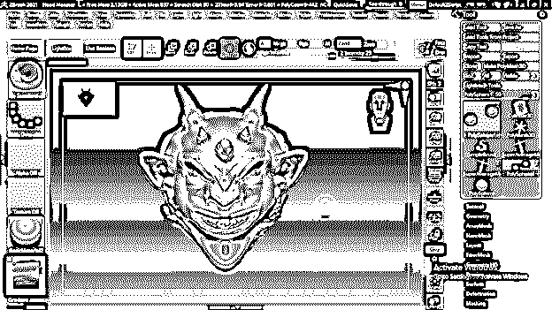

在你的模型中完成你想要的设置后，进入菜单栏的渲染菜单并点击它。我已经把这个模型的一些区域的材质改成了 BumpViewer 材质，这是我从这个软件的材质列表中选择的。然后，在渲染面板中，点击外部渲染器选项。

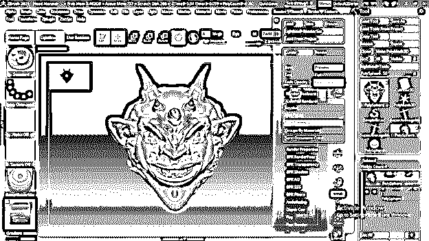

并选择 Keyshot 作为该模型的外部渲染插件。

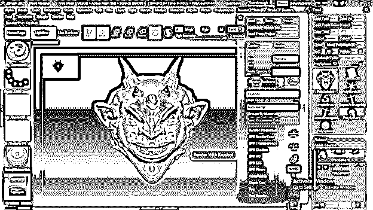

现在点击 Zbrush 的 BPR 渲染按钮，你可以在这个软件的用户界面右侧找到。它会自动将您当前的模型打开到 Keyshot 中。

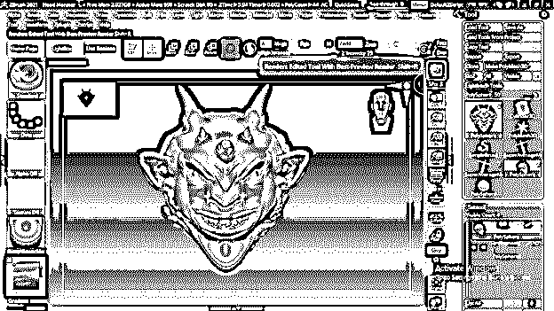

这是 Keyshot 插件的用户界面。你可以看到这个模型的正面不在前面。

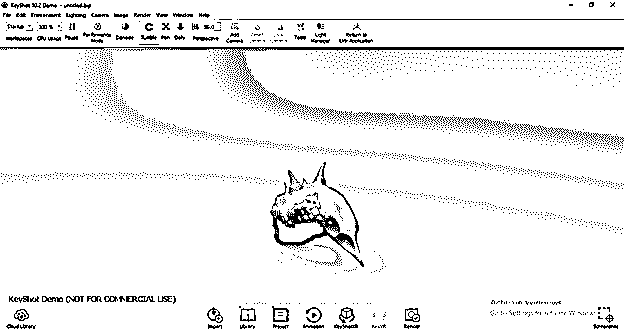

因此，你可以简单地点击这个软件的工作空间，按住点击，然后移动鼠标光标向前旋转。

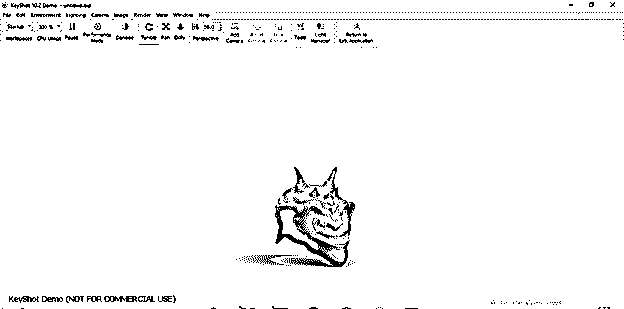

在 Keyshot 用户界面的顶部有一个菜单栏，我们在其中有几个菜单，如文件、编辑、环境等等。相机是该菜单栏的菜单之一。如果你点击它，你会在它的下拉列表中看到一些选项。例如，有一个选项，列表中的标准视图，通过它的子选项，我们可以改变模型的视图。

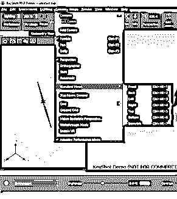

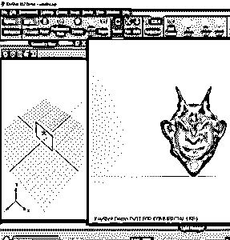

让我告诉你一些基本的工具，这样你就可以很容易地在这个软件的工作空间中导航你的模型。这是翻转相机按钮，通过启用它，您可以在工作空间中旋转您的模型。

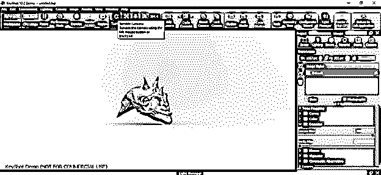

这个软件的下一个重要的导航工具是 Pan 通过启用它，您可以通过上下方向或左右方向移动鼠标光标来在工作空间上移动您的模型。

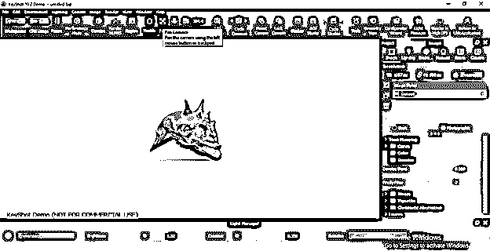

接下来是移动相机工具，通过启用它，我们可以放大或缩小我们的模型，以查看更近或更广的视图。

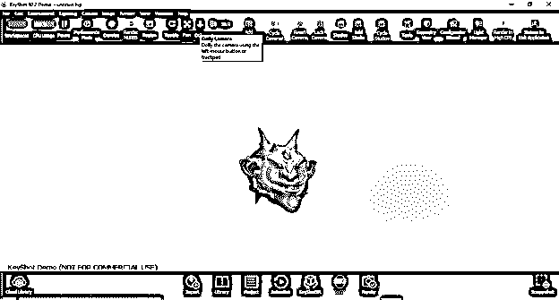

从环境菜单的下拉列表中，我们可以根据自己的选择更改背景的颜色或配置。

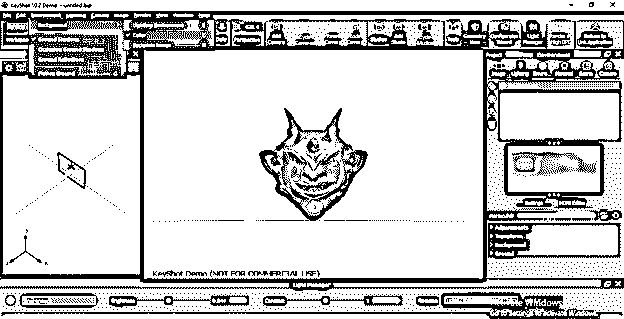

如果你想从这个插件软件本身导入任何模型文件，那么进入菜单栏的文件菜单并点击它。从它的下拉列表中，你可以在这里导入你想要的模型；单击导入选项或按 Ctrl + I 作为快捷键。

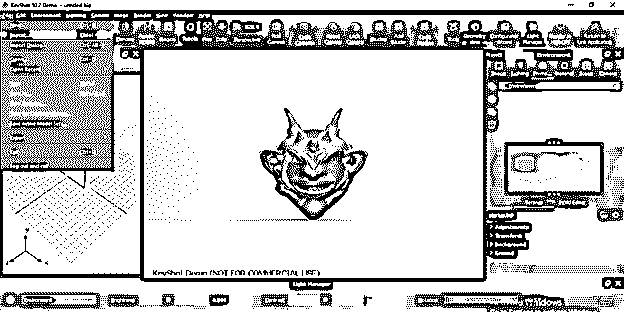

如果你在找 keyshot 的工具，可以去同一个菜单栏的工具菜单，点击。在这个面板的下拉列表中，你可以找到用于不同目的的工具的数量，但工作方法与 Zbrush 工具几乎相同。

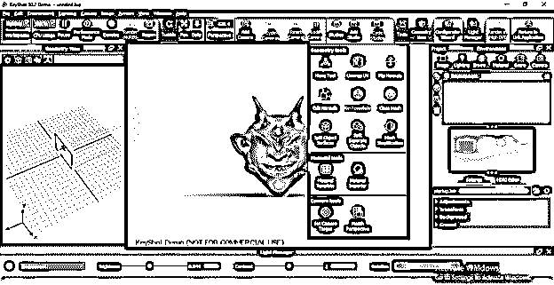

该软件中有两种类型的主题，您可以根据自己的需要从编辑菜单的首选项选项中进行更改。

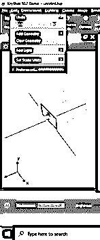

要改，可以去界面的主题选项。

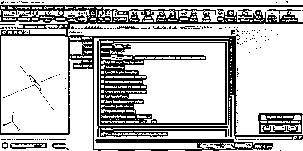

有很多事情你会知道的，开始练习吧。但是，首先，让我通过光线的参数来展示这个软件的基本工作方式。

转到用户屏幕左侧的工作区部分，单击上面选项卡的下拉箭头按钮。

我将从列表中选择照明工作区，向您解释照明。

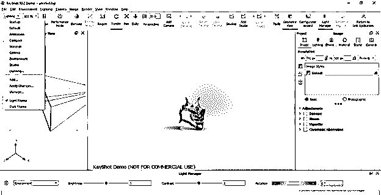

您可以看到，在用户屏幕左侧的几何视图部分有一个摄像机角度，在中心，我们有一个模型，光源来自该模型。在右侧，我们有参数设置。您可以移动或旋转您的模型，将其设置在您想要的位置。

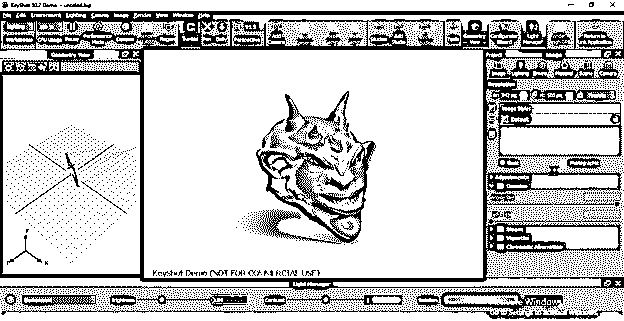

之后，您可以改变光线的旋转方向，以进行适当的光线管理。例如，如果我缩小，你可以看到两个光源在你的模型上投射光线。

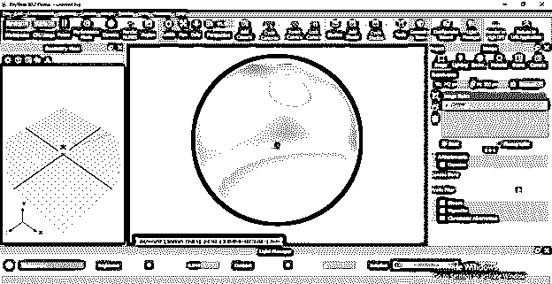

我们可以从环境面板的旋转选项中更改它们的旋转角度。您可以在 keyshot 用户屏幕的底部找到此面板。

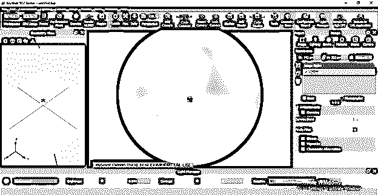

如果需要，可以通过更改“环境”面板中“亮度”选项的值来更改投射光的亮度。

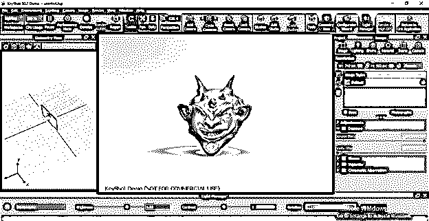

和亮度一样，我们也可以通过改变同一个环境面板的对比度选项的值来改变对比度的值。

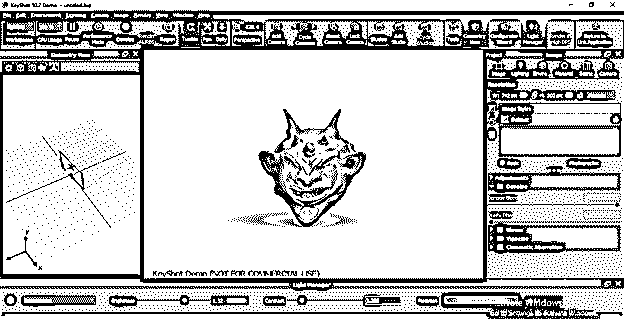

关于 keyshot 还有很多东西，您需要通过实践来探索它。我只是告诉你一个基本的特征，这样你就可以对这个软件的工作方法有一个基本的概念。

### 结论 ZBrush 按键截图

在阅读完这篇文章后，ZBrush Keyshot 将不再是一个未知的插件，我相信你会开始用它对你绘制的 ZBrush 模型进行不同的颜色、光线和视觉处理。因此，您可以在 keyshot 中开始处理保存的 ZBrush 模型，而不用直接从 ZBrush 中导出它。

### 推荐文章

这是一个 ZBrush keyshot 的指南。在这里，我们讨论如何使用这两个软件，以便在它们和几个特性之间有良好的协作。您也可以看看以下文章，了解更多信息–

1.  [ZBrush 热键](https://www.educba.com/zbrush-hotkeys/)
2.  [ZBrush 工具](https://www.educba.com/zbrush-tools/)
3.  [ZBrush 替代品](https://www.educba.com/zbrush-alternatives/)
4.  [ZBrush 是什么？](https://www.educba.com/what-is-zbrush/)

