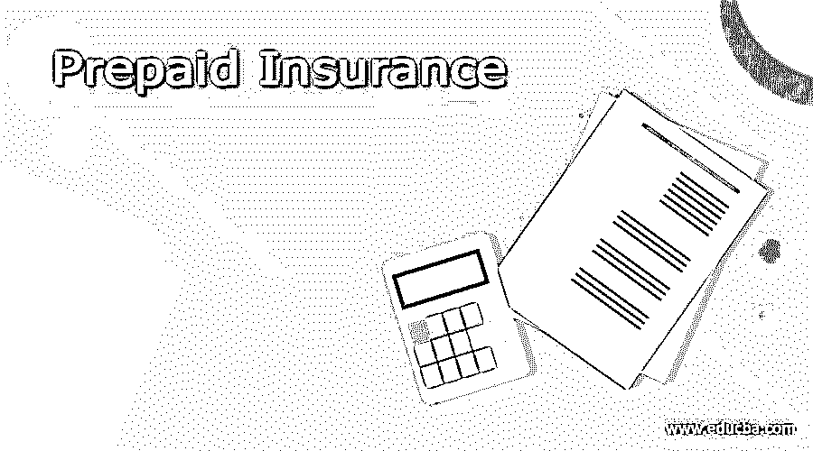

# 预付保险费

> 原文：<https://www.educba.com/prepaid-insurance/>

## 预付保险的定义

预付保险是指公司预先支付的保险。例如，每家公司都必须支付保险费来保护其资产、员工等。当保险费提前支付时，那就叫预付保险。

### 说明

预付保险被视为流动资产。这是因为公司预先支付了一笔费用，这将有助于缓解以后的费用。因为费用是预先支付的，所以它被作为待摊费用处理并相应地记录。公司的年度会计是按财政年度进行的，因此，如果下一个财政年度的保险费已经在本年度支付，它就被视为一项资产。

<small>下载企业估值、投行、会计、CFA 计算器&其他</small>

### 它是如何工作的？

每个公司每月、每季度或每年支付保险费。因此，当一家公司预付了下一期的保险费时，额外支付的费用在资产负债表的资产端被记为预付保险费。所以每个公司都把它当作一项资产，到了时期，适当的金额在保险费用下面显示为一项费用。

### 预付保险的例子

XYZ 公司是一家物流公司。公司资产下有 500 多辆卡车，所有卡车都是可运营的。该公司是一家中型公司，有近 500 名员工在该公司工作。每个季度，公司为资产和员工支付保险。这是今年连续第四个季度。公司决定支付下一年第一季度的利息费用。由于该保险在明年第一季度到来之前不会使用，因此将作为预付保险反映在公司的资产端。当明年第一第季度到来时，它将被显示为一项费用。

### 资产负债表中的预付保险

预付保险费在资产负债表上被列为资产。如果费用提前支付，公司就不必在费用发生时支付。所以这是公司的资产。只要正确的时期没有到来，公司的资产负债表就会将费用反映为资产。随着正确期间的临近，它将从资产端移出，并反映在费用项下。

### 预付保险日记帐分录

XYZ 公司已经为下一季度支付了 500 美元的保险费。显示事件的日志条目。

**解决方案:**

下个季度的保险什么时候交？

预付保险帐户…借记 500 美元

记入现金账户……贷方 500 美元

(预付保险已付)

预付的保险费将在下一季度时费用化

保险费用账户……借记 500 美元

预付保险账户……贷记 500 美元

(发生的保险费用)

### 预付保险与应计保险

这是一项资产，公司将其记录在资产负债表上，因为费用是预先支付的。另一方面，应计保险是公司应该支付但仍未支付的负债。因此，应计保险是一项负债，公司将不得不支付它来结清欠款。因此，应计保险被视为短期负债，并显示在资产负债表上。

### 优势

下面给出了一些优点:

*   这是一种资产。由于该公司已经支付了其应支付的费用，预付款有助于该公司处理随后期间的其他费用。
*   由于保险费是提前支付的，所以公司可以从保险公司获得提前支付的折扣。这种折扣将减少公司的开支，从而增加公司的盈利能力。
*   公司的资产和员工会更有安全感，因为公司已经提前支付了保险。另外，体现了公司对员工的关怀。
*   多余的现金可能有作为股息被清偿的压力；随着该公司向保险公司支付预付款，支付股息的压力可以得到解决。

### 结论

这对该公司来说是一个好兆头，因为它喜欢在到期日之前付清费用。体现了公司强大的盈利能力，在市场上创造了商誉。通过支付合理的预付保险费来照顾资产和员工的公司被认为是强大的金融公司。关于预付保险费的期限，应该有一个检查。一家公司不应该进步太多，因为这可能会严重影响盈利能力。

### 推荐文章

这是预付保险指南。在这里，我们还讨论了预付保险的定义和工作原理。伴随着优势。您也可以看看以下文章，了解更多信息–

1.  [保险](https://www.educba.com/what-is-insurance/)
2.  [保险风险](https://www.educba.com/risk-in-insurance/)
3.  [现金价值人寿保险](https://www.educba.com/cash-value-life-insurance/)
4.  [再保险](https://www.educba.com/reinsurance/)

